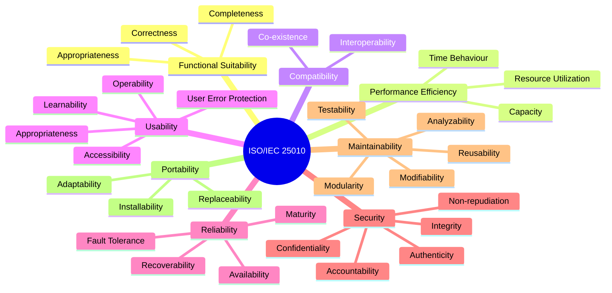

<Hero title="ISO/IEC 25010 Conceptual Mapping" subtitle="Understand the international standard and map it to practical architectural decisions." size="large" />

## TL;DR

ISO/IEC 25010:2023 defines eight quality attributes: **Functional Suitability, Performance Efficiency, Compatibility, Usability, Reliability, Security, Maintainability, and Portability**. This standard unifies terminology across teams and domains. In architecture, these map to concrete decisions: performance → latency budgets and caching; reliability → redundancy and failover; maintainability → modularity and code health; security → threat modeling and encryption. Use the standard as a checklist: for each attribute, define measurable targets, architectural patterns, and validation strategies.

## Learning Objectives

- Understand the eight quality attributes in ISO/IEC 25010:2023 and their relationships
- Map quality attributes to specific architectural decisions and patterns
- Define measurable quality targets using SMART criteria
- Align cross-functional teams on quality vocabulary
- Identify trade-offs between competing quality attributes

## Motivating Scenario

A team is designing a new microservice. The Product Manager says "it must be scalable," the CTO wants "high reliability," Security wants "zero trust," and Finance wants "cost-optimized." Without a shared quality model, these concerns clash: high reliability (replication) conflicts with cost; zero trust (encryption everywhere) adds latency. ISO/IEC 25010 provides the framework to name, prioritize, and trade off these attributes systematically.

## Core Concepts: The Eight Quality Attributes

<Figure caption="ISO/IEC 25010:2023 quality model with eight attributes and their sub-characteristics.">

</Figure>

### 1. Functional Suitability

Does the system do what it's supposed to do?

- **Completeness**: All required features are present.
- **Correctness**: Features work as specified.
- **Appropriateness**: Features meet actual user needs (not just spec).

**Architectural Relevance**: Functional suitability is primarily a requirements and design concern, but architecture enables it through clear interfaces, contracts, and test strategies.

### 2. Performance Efficiency

How fast and resource-efficient is the system?

- **Time Behaviour**: Response latency, throughput, reaction time.
- **Resource Utilization**: CPU, memory, disk, network consumption.
- **Capacity**: Handling of load spikes and scaling.

**Architectural Relevance**: Latency budgets, caching, batching, load testing, profiling, database indexing, distributed processing.

### 3. Compatibility

Can the system coexist and interoperate with other systems?

- **Co-existence**: Systems can run on the same platform without harming each other.
- **Interoperability**: Systems can exchange data and services.

**Architectural Relevance**: API contracts, versioning, message formats, middleware, integration patterns.

### 4. Usability

How easy is the system to use and understand?

- **Appropriateness Recognizability**: Users understand if the system is suitable.
- **Learnability**: Users can learn to use it quickly.
- **Operability**: System is easy to operate and control.
- **User Error Protection**: System prevents or recovers from user errors.
- **Accessibility**: System is usable by people with disabilities (WCAG, A11y).

**Architectural Relevance**: UI/UX design, API clarity, error handling, observability, internationalization.

### 5. Reliability

Does the system work correctly under normal and adverse conditions?

- **Maturity**: System rarely fails under normal use.
- **Availability**: System is operational and accessible when needed.
- **Fault Tolerance**: System continues to operate despite failures.
- **Recoverability**: System recovers from failures and restores data.

**Architectural Relevance**: Redundancy, failover, replication, backup/restore, disaster recovery, chaos engineering.

### 6. Security

Is the system protected against unauthorized access and attacks?

- **Confidentiality**: Data is not disclosed to unauthorized parties.
- **Integrity**: Data is not altered by unauthorized parties.
- **Non-repudiation**: Actions cannot be denied later.
- **Authenticity**: Identity of parties is verified.
- **Accountability**: Actions can be traced to responsible parties.

**Architectural Relevance**: Encryption, authentication, authorization, audit logging, threat modeling, zero trust.

### 7. Maintainability

Can the system be easily modified, understood, and tested?

- **Modularity**: System is composed of independent modules.
- **Reusability**: Components can be used in other contexts.
- **Analyzability**: Defects or failure causes can be diagnosed.
- **Modifiability**: System can be changed to fix defects or add features.
- **Testability**: Test criteria can be established and tests executed.

**Architectural Relevance**: Modularity, encapsulation, contracts, code health, refactoring, test isolation.

### 8. Portability

Can the system be moved to different environments or platforms?

- **Adaptability**: System can be adapted to different platforms.
- **Installability**: System can be installed/deployed in target environments.
- **Replaceability**: System can replace other systems in its context.

**Architectural Relevance**: Cloud-agnostic design, containerization, configuration management, data portability.

## Practical Mapping: From Standard to Architecture

<Tabs>
<TabItem value="perf" label="Performance Example">

**Quality Target (ISO/IEC 25010)**: Performance Efficiency → Time Behaviour

**Business Requirement**: "P99 API latency &lt; 200ms"

**Architectural Decisions**:
- Implement caching (Redis) for frequently accessed data
- Use async I/O and connection pooling
- Profile and optimize database queries
- Add CDN for static assets
- Load test to validate targets

**Measurement**:
- Real User Monitoring (RUM): Monitor P50, P95, P99 latencies
- Synthetic monitoring: Automated latency checks
- Profiling: Identify bottlenecks in hot paths

</TabItem>
<TabItem value="rel" label="Reliability Example">

**Quality Target (ISO/IEC 25010)**: Reliability → Availability

**Business Requirement**: "99.95% availability (52 minutes downtime/year)"

**Architectural Decisions**:
- Multi-region deployment with load balancing
- Automated failover between availability zones
- Regular disaster recovery drills
- Implement health checks and circuit breakers
- Database replication with RTO &lt; 5 min

**Measurement**:
- Uptime monitoring: Track availability percentage
- MTTR (Mean Time To Recovery): &lt; 15 minutes
- RTO/RPO testing: Validate recovery procedures

</TabItem>
<TabItem value="maint" label="Maintainability Example">

**Quality Target (ISO/IEC 25010)**: Maintainability → Modifiability

**Business Requirement**: "Add a new feature in &lt; 1 sprint"

**Architectural Decisions**:
- Modular service architecture (one service = one team)
- Clear internal contracts and versioning
- Code health metrics: &lt;15% cyclomatic complexity, &gt;80% test coverage
- Regular refactoring sprints
- Automated code review (linting, static analysis)

**Measurement**:
- Feature velocity: Time from design to production
- Code metrics: Complexity, duplication, coverage
- Change lead time: Design approval to deployment

</TabItem>
</Tabs>

## Quality Attribute Trade-Offs

Quality attributes rarely align perfectly—improving one often costs another.

<Vs title="Common Quality Trade-Offs"
  items={[
{
      label: 'Performance vs. Security',
      points: [
        'Encryption adds latency; zero trust requires repeated auth/authz checks',
        'Solution: Cache security decisions, use hardware acceleration, tune crypto algorithms',
      ],
    },
{
      label: 'Performance vs. Reliability',
      points: [
        'Replication for reliability reduces throughput and increases cost',
        'Solution: Use async replication, tune consistency models (eventual vs. strong)',
      ],
    },
{
      label: 'Maintainability vs. Performance',
      points: [
        'Modular architecture adds network hops and latency vs. monolith',
        'Solution: Service mesh, caching, local caching, batching',
      ],
    },
{
      label: 'Reliability vs. Cost',
      points: [
        'High availability (multi-region, replication) is expensive',
        'Solution: Define SLAs carefully; not all services need 99.99% uptime',
      ],
    }
]} />

## Defining Quality Targets: SMART Framework

For each quality attribute, define **SMART** targets:

- **Specific**: "P99 latency &lt; 200ms" not "fast"
- **Measurable**: Use concrete metrics (latency, throughput, uptime %)
- **Achievable**: Validate feasibility with prototypes and load tests
- **Relevant**: Align with business and user needs
- **Time-bound**: "by end of Q2" or "for GA launch"

**Example Quality Target Document**:

```
Attribute: Performance Efficiency (Time Behaviour)
Target: P99 API response latency < 200ms (measured from client)
Measurement: APM (Application Performance Monitoring) and RUM (Real User Monitoring)
Acceptance Criteria:
  - 99% of requests complete in < 200ms
  - Sustained under 2x expected load
  - Validated via load testing and canary deployment
Responsibility: Platform Engineering + Performance Testing
Review Cadence: Weekly (production metrics), post-deployment
```

## ISO/IEC 25010 Checklist for Architecture Reviews

Use this checklist when reviewing architectural designs:

<Showcase
  title="Architecture Review Checklist"
  points={[
    { category: "Functional Suitability", item: "Are all required features addressed? Are API contracts clear?" },
    { category: "Performance", item: "Are latency budgets defined? Is caching appropriate? Load tests planned?" },
    { category: "Reliability", item: "What happens on failure? RTO/RPO targets clear? DR plan exists?" },
    { category: "Security", item: "Threat model complete? Encryption in transit/at rest? Auth strategy defined?" },
    { category: "Maintainability", item: "Is modularity clear? Can teams work independently? Code review process?" },
    { category: "Usability", item: "Is the API intuitive? Error messages helpful? A11y considered?" },
    { category: "Compatibility", item: "Can this coexist with existing systems? Integration points clear?" },
    { category: "Portability", item: "Can this run on multiple cloud providers? Data portability?" },
  ]}
/>

## Next Steps

1. **Define quality targets** for your system using the SMART framework
2. **Map each target** to architectural decisions (caching, replication, modularity, etc.)
3. **Identify trade-offs** — which attributes compete? How will you prioritize?
4. **Establish measurement** — what metrics will you track? How often will you review?
5. **Review regularly** — as scale, requirements, and constraints change, revisit quality targets

## References

1. [ISO/IEC 25010:2023 — Systems and software quality models](https://www.iso.org/standard/35733.html)
2. [IEEE 1016 — Recommended Practice for Software Design Documentation](https://standards.ieee.org/standard/1016-2009.html)
3. [Bass, Clements, Kazman — Software Architecture in Practice (4th Ed.)](https://www.oreilly.com/library/view/software-architecture-in/9780136885888/)
4. [NIST SP 800-53 — Security and Privacy Controls](https://csrc.nist.gov/publications/detail/sp/800-53/rev-5/final)
