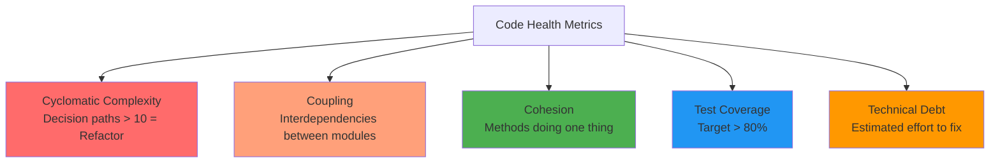

<Hero
  title="Code Health Metrics and Refactoring Strategy"
  subtitle="Track cyclomatic complexity, coupling, and technical debt with automated static analysis; prioritize refactoring by impact and effort."
  difficulty="intermediate"
  time="15 min read"
/>

## TL;DR

Code health metrics quantify maintainability: cyclomatic complexity (>10 is refactor-candidate), coupling (dependencies between modules), cohesion (methods working together), test coverage (>80% target). CRAP score (Change Risk Analysis and Predictions) combines complexity + coverage. Automate with SonarQube, Pylint, ESLint in CI; fail builds on metric regressions. Refactor based on impact-effort matrix: high-impact, low-effort changes first. Technical debt compounds; track with tools and pay down systematically rather than allowing unbounded accumulation.

## Learning Objectives

By the end of this article, you'll understand:
- Key code metrics: complexity, coupling, cohesion, coverage
- Identifying code smells and refactoring opportunities
- Technical debt tracking and prioritization
- Static analysis tools and integration
- Refactoring strategies and risk management
- Metrics as leading indicators of quality issues

## Motivating Scenario

Your 200-line payment processing function has 47 different code paths, no tests, and hasn't been touched in 18 months. When you need to add new payment methods, you spend 4 days understanding it. A junior dev's mistake causes a month of debugging. You track that 80% of production bugs come from 10% of your codebase. You need visibility into which modules are high-risk, automated metrics to catch degradation, and a systematic refactoring strategy.

## Core Concepts

<Figure title="Code Health Metrics Matrix">

</Figure>

### Cyclomatic Complexity

Count of decision paths in code. Each if/else, loop, switch case adds 1.

- 1-5: Simple, low risk
- 6-10: Moderate, consider refactoring
- 11-20: High risk, refactor
- >20: Very high risk, must refactor

Example:
```python
def process_order(order):  # Complexity 1
    if order.status == "pending":  # +1 = 2
        if order.amount > 1000:  # +1 = 3
            # ... apply discount
        else:  # +1 = 4
            # ... normal price
    elif order.status == "cancelled":  # +1 = 5
        # ... handle cancellation
    else:  # +1 = 6
        # ... error
```

### Coupling and Cohesion

**Coupling**: Number of dependencies on other modules. High coupling makes changes risky.

**Cohesion**: Do methods in a class work together? High cohesion means focused responsibility.

Target: Low coupling, high cohesion.

### CRAP Score

Change Risk Analysis and Predictions = Complexity * (1 - Coverage%) + Complexity²

Combines complexity and test coverage. High CRAP = refactor + add tests.

### Technical Debt

Metaphor for accumulating shortcuts. Paying interest (extra effort each change). Principal (time to fix). Track items and prioritize by risk/effort.

## Practical Example

<Tabs>
<TabItem value="sonarqube" label="SonarQube Configuration">
```properties
# sonar-project.properties

sonar.projectKey=order-service
sonar.projectName=Order Service
sonar.projectVersion=1.0
sonar.sources=src
sonar.tests=test
sonar.sourceEncoding=UTF-8

# Coverage
sonar.coverage.exclusions=**/config/**,**/entity/**
sonar.coverageReportPaths=target/coverage-report.xml
sonar.test.inclusions=**/*Test.java,**/*Tests.java

# Quality Gate: Fail build if metrics degrade
sonar.qualitygate.wait=true

# Complexity threshold
sonar.java.complexityThreshold=10

# Coverage minimum
sonar.coverage.threshold=80

# Rules
sonar.inclusions=**/*.java

# Exclusions
sonar.exclusions=**/vendor/**,**/node_modules/**

# Specific rules to enable/disable
sonar.issue.ignore.multicriteria=e1
sonar.issue.ignore.multicriteria.e1.ruleKey=java:S2095
sonar.issue.ignore.multicriteria.e1.resourceKey=**/test/**
```

```yaml
# GitHub Actions: SonarQube scan
name: Code Quality

on: [push, pull_request]

jobs:
  sonarqube:
    runs-on: ubuntu-latest
    steps:
      - uses: actions/checkout@v3

      - name: Build and test
        run: mvn clean verify

      - name: SonarQube Scan
        uses: SonarSource/sonarqube-scan-action@v2
        env:
          SONAR_HOST_URL: ${{ secrets.SONAR_HOST_URL }}
          SONAR_TOKEN: ${{ secrets.SONAR_TOKEN }}

      - name: Quality Gate Check
        uses: SonarSource/sonarqube-quality-gate-action@v1
        timeout-minutes: 5
        env:
          SONAR_TOKEN: ${{ secrets.SONAR_TOKEN }}
```
</TabItem>

<TabItem value="python" label="Python (Refactoring with Metrics)">
```python
# High complexity - needs refactoring
def calculate_shipping_cost(order, customer, destination):
    if destination == "domestic":
        if customer.is_premium:
            cost = order.weight * 0.5
        else:
            cost = order.weight * 1.0
        if order.total > 100:
            cost *= 0.9
    elif destination == "international":
        if customer.is_premium:
            cost = order.weight * 2.0
        else:
            cost = order.weight * 3.0
        if customer.country == "Canada":
            cost *= 0.85
        elif customer.country == "Mexico":
            cost *= 0.95
    else:
        cost = 999  # Error
    return cost  # Cyclomatic Complexity: 10

# Refactored - extract strategy pattern
class ShippingStrategy:
    def calculate(self, order, customer):
        raise NotImplementedError

class DomesticShippingStrategy(ShippingStrategy):
    def calculate(self, order, customer):
        base_rate = 0.5 if customer.is_premium else 1.0
        cost = order.weight * base_rate
        if order.total > 100:
            cost *= 0.9
        return cost

class InternationalShippingStrategy(ShippingStrategy):
    COUNTRY_MULTIPLIERS = {"Canada": 0.85, "Mexico": 0.95}

    def calculate(self, order, customer):
        base_rate = 2.0 if customer.is_premium else 3.0
        cost = order.weight * base_rate

        multiplier = self.COUNTRY_MULTIPLIERS.get(
            customer.country, 1.0
        )
        return cost * multiplier

class ShippingCalculator:
    STRATEGIES = {
        "domestic": DomesticShippingStrategy(),
        "international": InternationalShippingStrategy(),
    }

    def calculate(self, order, customer, destination):
        strategy = self.STRATEGIES.get(destination)
        if not strategy:
            raise ValueError(f"Unknown destination: {destination}")
        return strategy.calculate(order, customer)
        # Cyclomatic Complexity: 2 per method
        # Much more testable and maintainable
```
</TabItem>

<TabItem value="metrics" label="Metrics Dashboard (Pseudocode)">
```python
from dataclasses import dataclass
from typing import List

@dataclass
class CodeMetrics:
    file_path: str
    cyclomatic_complexity: int
    test_coverage: float  # 0.0 to 1.0
    coupling: int  # Number of dependencies
    lines_of_code: int

    @property
    def crap_score(self) -> float:
        """Change Risk Analysis and Predictions"""
        complexity = self.cyclomatic_complexity
        coverage = self.test_coverage
        return complexity * (1 - coverage) + complexity ** 2

    @property
    def is_refactor_candidate(self) -> bool:
        """High risk: high complexity + low coverage"""
        return (
            self.cyclomatic_complexity > 10 or
            self.crap_score > 20 or
            (self.cyclomatic_complexity > 7 and self.test_coverage < 0.5)
        )

    @property
    def risk_level(self) -> str:
        if self.crap_score > 40:
            return "CRITICAL"
        elif self.crap_score > 20:
            return "HIGH"
        elif self.crap_score > 10:
            return "MEDIUM"
        else:
            return "LOW"

class CodeQualityDashboard:
    def __init__(self, metrics: List[CodeMetrics]):
        self.metrics = metrics

    def refactoring_priority_matrix(self):
        """Impact-Effort matrix for refactoring"""
        candidates = [m for m in self.metrics if m.is_refactor_candidate]

        # Sort by CRAP score (higher = more impact)
        candidates.sort(key=lambda m: m.crap_score, reverse=True)

        print("Refactoring Priority (High Impact, Low Effort First)")
        print("=" * 60)

        for m in candidates[:10]:  # Top 10
            print(
                f"{m.file_path:40} "
                f"CC:{m.cyclomatic_complexity:2d} "
                f"Cov:{m.test_coverage*100:5.1f}% "
                f"CRAP:{m.crap_score:6.1f} "
                f"Risk:{m.risk_level}"
            )

    def technical_debt_summary(self):
        """Estimated effort to fix all issues"""
        total_crap = sum(m.crap_score for m in self.metrics)
        high_risk = [m for m in self.metrics if m.risk_level in ["HIGH", "CRITICAL"]]

        print(f"Total Technical Debt (CRAP Score): {total_crap:.0f}")
        print(f"Critical/High Risk Files: {len(high_risk)}")
        print(f"Estimated Refactoring Hours: {len(high_risk) * 8}")

    def coverage_analysis(self):
        """Coverage by file"""
        low_coverage = [m for m in self.metrics if m.test_coverage < 0.7]

        print("\nFiles with Low Test Coverage (&lt;70%)")
        print("=" * 60)

        for m in sorted(low_coverage, key=lambda x: x.test_coverage):
            print(f"{m.file_path:45} {m.test_coverage*100:5.1f}%")

# Example usage
metrics = [
    CodeMetrics("order_service.py", 15, 0.4, 8, 350),  # High risk
    CodeMetrics("payment_processor.py", 22, 0.3, 12, 450),  # Critical
    CodeMetrics("utils.py", 3, 0.95, 1, 50),  # Good
]

dashboard = CodeQualityDashboard(metrics)
dashboard.refactoring_priority_matrix()
dashboard.technical_debt_summary()
dashboard.coverage_analysis()
```
</TabItem>

<TabItem value="eslint" label="JavaScript (ESLint Configuration)">
```javascript
// .eslintrc.json
{
  "env": {
    "browser": true,
    "es2021": true,
    "jest": true
  },
  "extends": ["eslint:recommended", "plugin:react/recommended"],
  "parserOptions": {
    "ecmaVersion": 12,
    "sourceType": "module"
  },
  "rules": {
    // Complexity rules
    "complexity": ["error", 10],
    "max-lines": ["warn", { "max": 300 }],
    "max-nested-callbacks": ["error", 3],
    "max-params": ["warn", 4],

    // Coupling/Cohesion
    "no-undef": "error",
    "no-unused-vars": "warn",
    "id-length": ["warn", { "min": 2 }],

    // Code style
    "indent": ["error", 2],
    "quotes": ["error", "single"],
    "semi": ["error", "always"],
    "curly": ["error", "all"],

    // Best practices
    "eqeqeq": "error",
    "no-console": "warn",
    "no-debugger": "error"
  }
}
```

```yaml
# GitHub Actions: Lint and metrics
name: Code Metrics

on: [push, pull_request]

jobs:
  lint:
    runs-on: ubuntu-latest
    steps:
      - uses: actions/checkout@v3
      - uses: actions/setup-node@v3
        with:
          node-version: '18'

      - name: Install dependencies
        run: npm ci

      - name: Run ESLint
        run: npm run lint -- --max-warnings 0

      - name: Run tests
        run: npm test -- --coverage

      - name: Check coverage threshold
        run: |
          npm test -- --coverage --coverageThreshold='{
            "global": {
              "branches": 80,
              "functions": 80,
              "lines": 80,
              "statements": 80
            }
          }'
```
</TabItem>
</Tabs>

## When to Use / When Not to Use

<Vs items={[
{
    label: "Refactor First When:",
    points: ["High complexity + low coverage (CRAP score > 20)", "Frequent bug source (>30% of defects)", "Blocking new features (tight coupling)", "Team onboarding friction (hard to understand)", "Performance bottlenecks (complex algorithms)"]
  },
{
    label: "Defer Refactoring When:",
    points: ["Code is stable + not touched frequently", "Low complexity + high coverage already", "Critical deadline approaching", "Uncertain requirements (may change soon)", "Low-visibility, low-risk module"]
  }
]} />

## Patterns & Pitfalls

<Showcase  sections={[{
      title: "Automated Quality Gates",
      description: "Fail builds on metric regressions (complexity increase, coverage drop). Prevents debt accumulation in-flight.",
      icon: "✓",
      positive: true
    }, {
      title: "Purely Metrics-Driven Refactoring",
      description: "High complexity + zero tests might mean refactor is risky. Prioritize by impact (change frequency, bug history).",
      icon: "✗",
      positive: false
    }, {
      title: "Extract Methods Systematically",
      description: "Break complex functions into smaller ones. Each extracted method should have single responsibility.",
      icon: "✓",
      positive: true
    }, {
      title: "Dead Code Accumulation",
      description: "Unused code drains comprehension. Regular cleanup; fail builds on unused variables/functions.",
      icon: "✗",
      positive: false
    }, {
      title: "Gradual Refactoring",
      description: "Small, low-risk improvements over time. One cycle: refactor + tests + review. Better than big bang rewrites.",
      icon: "✓",
      positive: true
    }, {
      title: "Ignoring Test Coverage",
      description: "High complexity without tests is risky. Add tests before refactoring high-complexity code.",
      icon: "✓",
      positive: true
    }]}
/>

## Design Review Checklist

<Checklist
  items={[
    { label: "Cyclomatic complexity tracked (target &lt;10 per function)", checked: false },
    { label: "CRAP score < 20 for critical paths", checked: false },
    { label: "Test coverage > 80% (measure regularly)", checked: false },
    { label: "Quality gates automated in CI (fail on regression)", checked: false },
    { label: "Code smells detected (static analysis enabled)", checked: false },
    { label: "Coupling minimized (low interdependencies)", checked: false },
    { label: "Technical debt tracked and prioritized", checked: false },
    { label: "Refactoring estimated in story points (planned)", checked: false },
    { label: "Metrics dashboard visible to team", checked: false },
    { label: "Dead code cleaned up regularly", checked: false }
  ]}
/>

## Self-Check

Ask yourself:
- What's the highest complexity function in my codebase?
- Which 10% of code causes 80% of bugs?
- Is my test coverage increasing or decreasing?
- Do I measure CRAP scores?
- Is technical debt explicit or hidden?

## One Key Takeaway

:::info
**Code metrics quantify maintainability; static analysis catches issues early. Automate quality gates to prevent debt accumulation. Refactor based on impact-effort matrix: prioritize high-complexity, low-coverage, frequently-changed code. Small, regular refactoring beats crisis rewrites.**

:::

## Next Steps

1. **Enable static analysis** - SonarQube, ESLint, Pylint
2. **Measure baseline** - Complexity, coverage, coupling
3. **Set thresholds** - Max complexity, min coverage
4. **Automate gates** - Fail builds on regression
5. **Prioritize** - Refactor highest CRAP scores first
6. **Track debt** - Dashboard of metrics
7. **Review regularly** - Trends and patterns

## References

- <a href="https://www.sonarsource.com/products/sonarqube/" target="_blank" rel="nofollow noopener noreferrer">SonarQube ↗️</a>
- <a href="https://en.wikipedia.org/wiki/Cyclomatic_complexity" target="_blank" rel="nofollow noopener noreferrer">Cyclomatic Complexity ↗️</a>
- <a href="https://www.integrify.com/resources/crap-metric/" target="_blank" rel="nofollow noopener noreferrer">CRAP Score Metric ↗️</a>
- <a href="https://refactoring.guru/refactoring" target="_blank" rel="nofollow noopener noreferrer">Refactoring Patterns ↗️</a>
