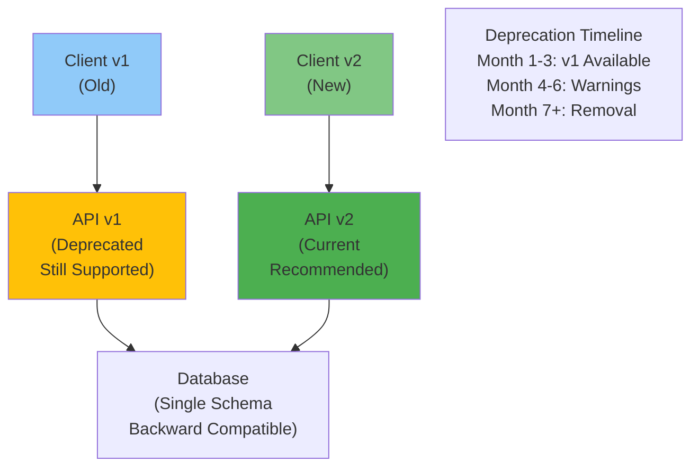

<Hero
  title="API Contracts and Backward Compatibility"
  subtitle="Design stable API contracts and manage schema evolution to support multiple client versions without breaking deployments or forcing synchronized updates."
  difficulty="intermediate"
  time="15 min read"
/>

## TL;DR

Backward compatibility ensures old clients work with new API versions without changes. Practice semantic versioning (MAJOR.MINOR.PATCH): bump MAJOR for breaking changes, MINOR for non-breaking additions, PATCH for fixes. Add optional fields and ignore unknown fields (robustness principle). Deprecate gradually with multi-version support before removal. Use schema registries to track changes; employ contract testing to detect breaking changes in CI. Support multiple API versions (v1, v2) in parallel for migration windows rather than hard-cutoff deployments.

## Learning Objectives

By the end of this article, you'll understand:
- Backward vs forward compatibility and safe change patterns
- Semantic versioning conventions and application
- Breaking change detection and prevention strategies
- Deprecation policies and migration windows
- Schema evolution techniques and compatibility layers
- Contract testing for API stability

## Motivating Scenario

You release API v2 with a cleaner schema, dropping deprecated fields and reorganizing response structure. Hundreds of mobile apps still use v1 endpoints; updating all of them requires coordinating with users and waiting for app store approvals. Deployment breaks during rollout, you can't roll back because the new database schema isn't compatible. You need a backward compatibility strategy allowing v1 clients to work indefinitely while supporting v2 for new clients, enabling gradual migration without forced updates.

## Core Concepts

<Figure title="Backward Compatibility and Versioning Strategy">

</Figure>

### Backward Compatibility Patterns

**Additive Changes (Safe):**
- Add optional fields (clients ignoring unknown fields)
- Add new endpoints (old endpoints still work)
- Add new error codes (clients ignore new ones)
- Change internal implementation

**Breaking Changes (Requires Version Bump):**
- Remove fields or endpoints
- Rename fields
- Change field types or formats
- Change status codes for same scenario
- Change HTTP method

### Semantic Versioning

MAJOR.MINOR.PATCH format:
- **MAJOR**: Breaking changes (v1 → v2)
- **MINOR**: Non-breaking additions (v1.2 → v1.3)
- **PATCH**: Bug fixes (v1.2.0 → v1.2.1)

Example: v2.3.5
- v2: Breaking changes since v1
- v3: New breaking changes since v2.x
- .5: Fifth patch level

### Schema Evolution Techniques

**Strict Mode (Fail on Unknown Fields):**
```json
// Old schema
{ "name": "string", "age": "number" }

// New response with backward compat
{ "name": "string", "age": "number", "email": "string" }

// Client expecting old schema
// If client fails on unknown "email", incompatible
```

**Lenient Mode (Ignore Unknown Fields):**
Most modern clients ignore unknown fields by design. Safe to add new fields without version bump.

**Schema Versioning:**
Include schema version in payload for independent schema vs API versioning.

## Practical Example

<Tabs>
<TabItem value="openapi" label="OpenAPI Schema Versioning">
```yaml
# Order Service API - Multiple versions in one spec

openapi: 3.1.0
info:
  title: Order Service API
  version: 2.0.0
  x-api-lifecycle:
    deprecated_versions:
      - "1.0.0"
        deprecation_date: "2024-01-01"
        sunset_date: "2024-07-01"
        migration_guide: "https://docs.example.com/migration"

servers:
  - url: https://api.example.com/v2
    description: Current API (recommended)
  - url: https://api.example.com/v1
    description: Deprecated API (sunset 2024-07-01)

paths:
  /orders:
    post:
      summary: Create order
      requestBody:
        content:
          application/json:
            schema:
              $ref: '#/components/schemas/CreateOrderRequest'
      responses:
        '201':
          description: Order created
          content:
            application/json:
              schema:
                $ref: '#/components/schemas/Order'

components:
  schemas:
    CreateOrderRequest:
      type: object
      required:
        - items
        - shipping_address
      properties:
        items:
          type: array
          items:
            $ref: '#/components/schemas/OrderItem'
          minItems: 1
        shipping_address:
          $ref: '#/components/schemas/Address'
        # NEW in v2 - optional for clients not yet upgraded
        billing_address:
          $ref: '#/components/schemas/Address'
          nullable: true
        # NEW in v2 - optional for backward compat
        metadata:
          type: object
          additionalProperties: true
          nullable: true

    Order:
      type: object
      required:
        - id
        - status
        - total
        - created_at
      properties:
        id:
          type: string
          format: uuid
        status:
          type: string
          enum: [PENDING, CONFIRMED, SHIPPED, DELIVERED, CANCELLED]
          # NEW in v2.1: added CANCELLED
        total:
          type: number
          format: decimal
        created_at:
          type: string
          format: date-time
        # NEW in v2: optional field for new clients
        # Old clients ignore, new clients use
        estimated_delivery:
          type: string
          format: date
          nullable: true
        # NEW in v2: nested address object
        # Replaces old "shipping_address_str"
        shipping_address:
          $ref: '#/components/schemas/Address'

    # Deprecated in v2 (moved to Address object)
    # Kept for v1 API backward compatibility
    x-deprecated-fields:
      shipping_address_str:
        deprecated: true
        removed_in: "3.0"
        use_instead: "shipping_address"

    Address:
      type: object
      required:
        - street
        - city
        - country
      properties:
        street: { type: string }
        city: { type: string }
        state: { type: string, nullable: true }
        postal_code: { type: string }
        country: { type: string }

    OrderItem:
      type: object
      required:
        - product_id
        - quantity
      properties:
        product_id: { type: string }
        quantity: { type: integer, minimum: 1 }
        unit_price: { type: number, format: decimal, nullable: true }

  headers:
    X-API-Version:
      description: API version (e.g., 2.0, 2.1)
      schema: { type: string }
    X-Deprecation:
      description: "Deprecation warning with sunset date"
      schema: { type: string }
      example: "API v1 is deprecated, sunset 2024-07-01"

  responses:
    DeprecatedVersion:
      description: API version is deprecated
      headers:
        X-Deprecation:
          description: Deprecation notice
          schema: { type: string }
      content:
        application/json:
          schema:
            type: object
            properties:
              warning: { type: string }
              sunset_date: { type: string, format: date }
              migration_guide: { type: string, format: uri }
```
</TabItem>

<TabItem value="groovy" label="Groovy (Backward Compat Testing)">
```groovy
import io.pact.consumer.dsl.PactBuilder
import io.pact.consumer.MockServer
import spock.lang.Specification

class OrderAPIBackwardCompatibilitySpec extends Specification {

    def "v2 API should accept both old and new client formats"() {
        given:
        def pact = new PactBuilder()
            .consumer("OrderClient")
            .provider("OrderService")

        // v1 client sends old request format
        def v1Request = [
            items: [[product_id: "1", quantity: 2]],
            shipping_address_str: "123 Main St, City, State 12345"
        ]

        when:
        pact.addInteraction { interaction ->
            interaction
                .uponReceiving("v1 client creates order")
                .path("/v2/orders")
                .method("POST")
                .body(v1Request)
                .willRespondWith(201, [
                    id: "order-123",
                    status: "PENDING",
                    total: 100.0,
                    created_at: "2024-01-15T10:00:00Z",
                    // v2 additions - v1 client ignores
                    estimated_delivery: "2024-01-20",
                    shipping_address: [
                        street: "123 Main St",
                        city: "City",
                        state: "State",
                        postal_code: "12345"
                    ]
                ])
        }

        then:
        pact.build()
    }

    def "v2 client sends new request with optional fields"() {
        given:
        def pact = new PactBuilder()
            .consumer("OrderClientV2")
            .provider("OrderService")

        // v2 client sends new request format
        def v2Request = [
            items: [[product_id: "1", quantity: 2]],
            shipping_address: [
                street: "123 Main St",
                city: "City",
                state: "State",
                postal_code: "12345"
            ],
            // New in v2 - optional
            billing_address: [
                street: "456 Oak Ave",
                city: "OtherCity",
                state: "State",
                postal_code: "54321"
            ],
            metadata: [
                gift_message: "Happy Birthday!",
                rush_delivery: false
            ]
        ]

        when:
        pact.addInteraction { interaction ->
            interaction
                .uponReceiving("v2 client creates order")
                .path("/v2/orders")
                .method("POST")
                .body(v2Request)
                .willRespondWith(201, [
                    id: "order-124",
                    status: "PENDING",
                    total: 100.0,
                    created_at: "2024-01-15T10:30:00Z",
                    estimated_delivery: "2024-01-20",
                    shipping_address: [
                        street: "123 Main St",
                        city: "City",
                        state: "State",
                        postal_code: "12345"
                    ]
                ])
        }

        then:
        pact.build()
    }

    def "unknown fields in response should be ignored by client"() {
        given:
        def apiResponse = [
            id: "order-125",
            status: "PENDING",
            total: 100.0,
            created_at: "2024-01-15T11:00:00Z",
            estimated_delivery: "2024-01-20",
            shipping_address: [
                street: "123 Main St",
                city: "City",
                state: "State",
                postal_code: "12345"
            ],
            // Future field (v3) - current clients ignore
            sustainability_score: 95,
            carbon_offset_kg: 2.5
        ]

        when:
        // Simulating v2 client deserializing future response
        def order = parseOrderResponse(apiResponse)

        then:
        order.id == "order-125"
        order.status == "PENDING"
        order.total == 100.0
        // v2 client doesn't break on unknown fields
        order.sustainability_score == null || true // Gracefully ignored
    }

    def "deprecated fields should still work in v1"() {
        given:
        // v1 client expects deprecated response format
        def v1Endpoint = "/v1/orders/order-123"
        def v1Response = [
            id: "order-123",
            status: "PENDING",
            total: 100.0,
            created_at: "2024-01-15T12:00:00Z",
            // v1 format - kept for compatibility
            shipping_address_str: "123 Main St, City, State 12345",
            // v2+ format - v1 client ignores
            shipping_address: [
                street: "123 Main St",
                city: "City",
                state: "State",
                postal_code: "12345"
            ]
        ]

        expect:
        // v1 client can still parse this
        v1Response.shipping_address_str == "123 Main St, City, State 12345"
    }

    private parseOrderResponse(Map response) {
        // Simulate lenient parsing (ignore unknown fields)
        return [
            id: response.id,
            status: response.status,
            total: response.total,
            created_at: response.created_at,
            estimated_delivery: response.estimated_delivery,
            shipping_address: response.shipping_address,
            sustainability_score: response.sustainability_score
        ]
    }
}
```
</TabItem>

<TabItem value="python" label="Python (Schema Evolution)">
```python
from typing import Optional, Dict, Any
from dataclasses import dataclass
from datetime import datetime
import json

# Schema versioning for backward compatibility

@dataclass
class AddressV1:
    """v1: Simple string address"""
    address_str: str

@dataclass
class AddressV2:
    """v2: Structured address"""
    street: str
    city: str
    state: Optional[str]
    postal_code: str
    country: str

@dataclass
class OrderV1:
    """v1 API Response Schema"""
    id: str
    status: str
    total: float
    created_at: str
    # v1 format for address
    shipping_address_str: str

@dataclass
class OrderV2:
    """v2 API Response Schema"""
    id: str
    status: str
    total: float
    created_at: str
    # v2 format - structured
    shipping_address: AddressV2
    # v2 additions - optional for backward compat
    estimated_delivery: Optional[str] = None
    # v2 additions - support flexible metadata
    metadata: Optional[Dict[str, Any]] = None

class OrderAPIClient:
    """Client that handles multiple API versions"""

    def __init__(self, api_version: str = "v2"):
        self.api_version = api_version

    def parse_response(self, response: Dict[str, Any]) -> Dict:
        """Parse response with version-aware logic"""
        if self.api_version == "v1":
            return self._parse_v1(response)
        elif self.api_version == "v2":
            return self._parse_v2(response)
        else:
            raise ValueError(f"Unknown API version: {self.api_version}")

    def _parse_v1(self, response: Dict[str, Any]) -> Dict:
        """v1 client - expects old format, ignores new fields"""
        return {
            'id': response['id'],
            'status': response['status'],
            'total': response['total'],
            'created_at': response['created_at'],
            # v1 format
            'shipping_address_str': response.get(
                'shipping_address_str',
                # Fallback: construct from v2 format if available
                self._construct_address_str(response.get('shipping_address'))
            )
            # v1 client ignores: estimated_delivery, metadata
        }

    def _parse_v2(self, response: Dict[str, Any]) -> Dict:
        """v2 client - expects new format, handles both"""
        return {
            'id': response['id'],
            'status': response['status'],
            'total': response['total'],
            'created_at': response['created_at'],
            'shipping_address': response.get('shipping_address'),
            'estimated_delivery': response.get('estimated_delivery'),
            'metadata': response.get('metadata', {})
            # Unknown future fields silently ignored
        }

    @staticmethod
    def _construct_address_str(address: Dict) -> str:
        """Convert v2 address to v1 string format for compatibility"""
        if not address:
            return ""
        parts = [
            address.get('street'),
            address.get('city'),
            address.get('state'),
            address.get('postal_code')
        ]
        return ', '.join(str(p) for p in parts if p)

def test_backward_compatibility():
    """Test that API changes don't break old clients"""

    # Response from v2 API (might be called by both v1 and v2 clients)
    v2_api_response = {
        'id': 'order-123',
        'status': 'PENDING',
        'total': 100.0,
        'created_at': '2024-01-15T10:00:00Z',
        # v2 format
        'shipping_address': {
            'street': '123 Main St',
            'city': 'Springfield',
            'state': 'IL',
            'postal_code': '62701',
            'country': 'USA'
        },
        # v2 additions
        'estimated_delivery': '2024-01-20',
        'metadata': {'gift_message': 'Happy Birthday!'},
        # Future v3 field - all clients ignore
        'sustainability_score': 95
    }

    # v1 client consumes v2 response
    v1_client = OrderAPIClient(api_version="v1")
    v1_parsed = v1_client.parse_response(v2_api_response)

    assert v1_parsed['id'] == 'order-123'
    assert v1_parsed['status'] == 'PENDING'
    # v1 client gets reconstructed string from v2 structure
    assert 'Main St' in v1_parsed['shipping_address_str']
    # v1 client ignores v2 additions
    assert 'estimated_delivery' not in v1_parsed

    print("v1 client successfully parsed v2 response")

    # v2 client consumes v2 response
    v2_client = OrderAPIClient(api_version="v2")
    v2_parsed = v2_client.parse_response(v2_api_response)

    assert v2_parsed['id'] == 'order-123'
    assert v2_parsed['shipping_address']['city'] == 'Springfield'
    assert v2_parsed['estimated_delivery'] == '2024-01-20'
    # v2 client ignores v3 field gracefully

    print("v2 client successfully parsed v2 response")

if __name__ == "__main__":
    test_backward_compatibility()
```
</TabItem>
</Tabs>

## When to Use / When Not to Use

<Vs items={[
{
    label: "Support Multiple Versions When:",
    points: ["Large mobile user base (can", ",", "t control deployment)", "Multiple deployment pipelines (rolling releases)", "Long support window required (>1 year)", "Schema changes complex (nested structures)"]
  },
{
    label: "Hard-Cut Migration When:",
    points: ["Single-server deployment (all clients update together)", "Internal APIs only (full control of consumers)", "API still in beta/experimental phase", "Complete redesign necessary (migration too complex)", "Can enforce synchronized updates"]
  }
]} />

## Patterns & Pitfalls

<Showcase  sections={[{
      title: "Robustness Principle",
      description: "Be liberal in what you accept, conservative in what you send. Ignore unknown fields; add only optional fields. Clients ignore unknown fields gracefully.",
      icon: "✓",
      positive: true
    }, {
      title: "Silent Incompatibilities",
      description: "Schema divergence between versions hides bugs. Use contract testing to verify both v1 and v2 clients work with current API.",
      icon: "✗",
      positive: false
    }, {
      title: "Deprecation Notices",
      description: "Signal upcoming breaking changes 2-3 versions or quarters in advance. Add headers/warnings; document migration guides.",
      icon: "✓",
      positive: true
    }, {
      title: "Version Proliferation",
      description: "Supporting 10+ API versions becomes unmaintainable. Set sunset dates; force migration after reasonable window (6-12 months).",
      icon: "✗",
      positive: false
    }, {
      title: "Field Renaming Safely",
      description: "Add new field, keep old field as alias, deprecate old field, remove after sunset window. Don't rename directly.",
      icon: "✓",
      positive: true
    }, {
      title: "Database Schema Lock-in",
      description: "API and database schemas evolve at different rates. Decouple them; API can support v1 and v2 responses from single schema.",
      icon: "✓",
      positive: true
    }]}
/>

## Design Review Checklist

<Checklist
  items={[
    { label: "Semantic versioning used (MAJOR.MINOR.PATCH)", checked: false },
    { label: "New fields marked optional; clients ignore unknown fields", checked: false },
    { label: "Breaking changes bump MAJOR version", checked: false },
    { label: "Non-breaking additions bump MINOR version", checked: false },
    { label: "Deprecation timeline documented (2-3 versions/quarters)", checked: false },
    { label: "Multiple API versions supported in parallel", checked: false },
    { label: "Contract tests verify backward compatibility", checked: false },
    { label: "Deprecated fields kept for N versions before removal", checked: false },
    { label: "X-Deprecation headers or warnings sent to old clients", checked: false },
    { label: "Database schema supports multiple API versions", checked: false }
  ]}
/>

## Self-Check

Ask yourself:
- Can I add a field to my API without breaking existing clients?
- Do I know which API versions are in production?
- Can old clients still work after my latest deployment?
- How many versions back must I support?
- Is my deprecation timeline documented and communicated?

## One Key Takeaway

:::info
**Backward compatibility requires discipline: add fields, never remove without deprecation windows; ignore unknown fields; test all versions; communicate sunsets. The cost of breaking a public API far exceeds the effort of supporting multiple versions temporarily.**

:::

## Next Steps

1. **Define versioning strategy** - Semantic versioning + support windows
2. **Implement version detection** - Track which clients use which versions
3. **Add contract tests** - Test v1, v2 clients against current API
4. **Document deprecation** - Create migration guides for removals
5. **Monitor adoption** - Track when v1 usage drops below threshold
6. **Plan migration** - Coordinate final version removal
7. **Communicate timeline** - Announce sunsets 3 months in advance

## References

- <a href="https://semver.org/" target="_blank" rel="nofollow noopener noreferrer">Semantic Versioning ↗️</a>
- <a href="https://www.rfc-editor.org/rfc/rfc6585" target="_blank" rel="nofollow noopener noreferrer">HTTP Status Codes for Deprecated APIs ↗️</a>
- <a href="https://swagger.io/tools/swagger-ui/" target="_blank" rel="nofollow noopener noreferrer">OpenAPI Documentation ↗️</a>
- <a href="https://cloud.google.com/apis/design/compatibility" target="_blank" rel="nofollow noopener noreferrer">Google API Design: Compatibility ↗️</a>
- <a href="https://www.infoq.com/articles/maturity-levels-http-apis/" target="_blank" rel="nofollow noopener noreferrer">REST API Maturity Levels ↗️</a>
