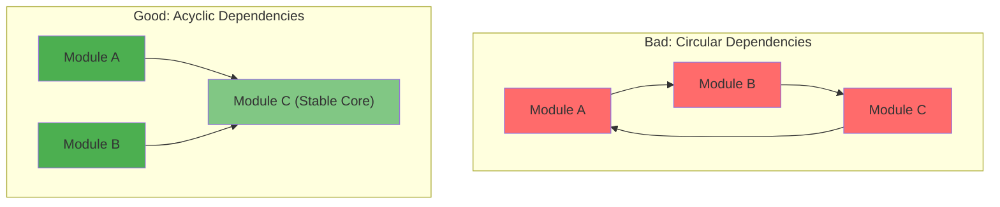

<Hero
  title="Modularity and Encapsulation Principles"
  subtitle="Design independent, focused modules with clear boundaries and hidden implementation details; manage dependencies to enable parallel development and changes."
  difficulty="intermediate"
  time="15 min read"
/>

## TL;DR

Modularity breaks systems into independent, cohesive units with minimal coupling. Encapsulation hides implementation details behind public APIs. Apply: single responsibility per module, public/private access control, stable dependencies (A -> B -> stable core, not A -> B -> A cycles), and facade patterns for complex subsystems. Measure: coupling ratios (instability = fan-out / (fan-in + fan-out)), cohesion (single purpose), and acyclic dependency graph. Enable: parallel development, isolated testing, and safe refactoring within module boundaries.

## Learning Objectives

By the end of this article, you'll understand:
- Modularity principles and their architectural impact
- Encapsulation and information hiding benefits
- Module boundaries and API design
- Dependency management and acyclic architectures
- Cohesion metrics and measurement
- Modularity patterns for microservices and libraries

## Motivating Scenario

Your authentication module is tightly coupled to database, logging, and API layers. Changing database schema requires touching authentication. Testing requires mocking 5 different systems. Reusing auth in another project is impossible. Deployment requires coordinating 3 teams. You need to refactor module boundaries so each can evolve independently, be tested in isolation, and be reused across systems without forcing changes elsewhere.

## Core Concepts

<Figure title="Modularity and Dependency Management">

</Figure>

### Modularity Principles

**Single Responsibility:** Each module has one reason to change. Authentication module handles auth only; doesn't manage database connections or logging.

**Clear Boundaries:** Explicit public API (what other modules can call) and private implementation (hidden from outside).

**Minimal Coupling:** Depend on abstractions, not concrete implementations. Reduce number of dependencies between modules.

**High Cohesion:** Methods/classes in module work together toward single goal. Users, authentication, authorization live together; logging does not.

### Encapsulation Levels

**Public (exports):** Client-facing API. Methods/classes other modules explicitly use.

**Protected (package-private):** Shared within module, hidden from external consumers.

**Private (internal):** Internal implementation details. Never part of module contract.

Example:
```java
// User.java - public API
public class User { ... }

// UserRepository.java - public (other modules can inject)
public interface UserRepository { ... }

// JdbcUserRepository.java - private (implementation detail)
class JdbcUserRepository implements UserRepository { ... }

// UserCache.java - private (internal optimization)
class UserCache { ... }
```

### Dependency Management

**Dependency Inversion Principle:** Depend on interfaces, not concrete classes.

```
Bad: User -> PostgresDB (tightly coupled)
Good: User -> Database (interface) -> PostgresDB (injected)
```

**Acyclic Dependencies:** Form directed acyclic graph (DAG). A -> B -> C is fine. A -> B -> A is forbidden (refactor to separate concerns).

**Instability Index:** (Efferent Coupling) / (Afferent + Efferent)
- 0 = highly stable (many depend on it, it depends on few)
- 1 = highly unstable (it depends on many, few depend on it)
- Target: Core modules < 0.3, top-level < 0.7

## Practical Example

<Tabs>
<TabItem value="module-structure" label="Module Structure (Package Design)">
```
good-module-structure/
├── payment/                      # Module boundary
│   ├── __init__.py               # Public API exports
│   ├── api.py                    # Public: PaymentService interface
│   ├── service.py                # Private: implementation
│   ├── repository.py             # Private: data access
│   ├── models.py                 # Public: domain models (Payment, Transaction)
│   └── exceptions.py             # Public: module exceptions
│
├── order/
│   ├── __init__.py
│   ├── api.py
│   ├── service.py
│   └── models.py
│   └── exceptions.py
│
├── auth/
│   ├── __init__.py
│   ├── api.py
│   ├── service.py
│   └── models.py
│
└── shared/                       # Stable core
    ├── config.py
    ├── logging.py
    └── database.py

# payment/__init__.py - exports public API
from .api import PaymentService
from .models import Payment, Transaction
__all__ = ['PaymentService', 'Payment', 'Transaction']

# payment/api.py - public interface (abstraction)
from abc import ABC, abstractmethod
class PaymentService(ABC):
    @abstractmethod
    def charge(self, amount: float, card_token: str) -> str:
        """Charge card, return transaction ID"""
        pass

# payment/service.py - private implementation
from .api import PaymentService
from .repository import TransactionRepository
class PaymentServiceImpl(PaymentService):
    def __init__(self, repo: TransactionRepository):
        self.repo = repo

    def charge(self, amount: float, card_token: str) -> str:
        # Implementation (hidden)
        transaction = self.repo.create(...)
        return transaction.id

# order/__init__.py - only imports stable APIs
from .api import OrderService
from .models import Order
__all__ = ['OrderService', 'Order']

# order/api.py - depends on abstractions
from payment.api import PaymentService  # Interface only
from payment.models import Transaction  # Public data model

class OrderService:
    def __init__(self, payment_service: PaymentService):
        self.payment = payment_service  # Injected dependency
```
</TabItem>

<TabItem value="java" label="Java (Dependency Inversion)">
```java
// Payment module - public API
package payment.api;

public interface PaymentService {
    Transaction charge(BigDecimal amount, String cardToken)
        throws PaymentException;
}

public interface TransactionRepository {
    Transaction findById(String id);
    void save(Transaction tx);
}

public class Payment {
    public String id;
    public BigDecimal amount;
    public LocalDateTime createdAt;
}

// Payment module - private implementation
package payment.service;

class PaymentServiceImpl implements PaymentService {
    private final TransactionRepository repository;
    private final CardProcessor processor;  // Private!

    public PaymentServiceImpl(TransactionRepository repo) {
        this.repository = repo;
        this.processor = new StripeCardProcessor(); // Injected
    }

    @Override
    public Transaction charge(BigDecimal amount, String token)
        throws PaymentException {
        // Implementation details (hidden)
        Card card = processor.validateCard(token);
        Transaction tx = processor.processCharge(amount, card);
        repository.save(tx);
        return tx;
    }
}

// Order module - depends only on public APIs
package order.service;

import payment.api.PaymentService;  // Interface
import payment.api.Transaction;     // Public model
import payment.api.PaymentException; // Public exception

public class OrderService {
    private final PaymentService paymentService;  // Injected!

    public OrderService(PaymentService paymentService) {
        this.paymentService = paymentService;
    }

    public Order createOrder(OrderRequest req) {
        Order order = new Order(req);

        try {
            Transaction tx = paymentService.charge(
                order.total,
                req.cardToken
            );
            order.setTransactionId(tx.id);
            order.setStatus("PAID");
        } catch (PaymentException e) {
            order.setStatus("PAYMENT_FAILED");
            throw new OrderException(e);
        }

        return order;
    }
    // Order doesn't know about StripeCardProcessor,
    // TransactionRepositoryImpl, or other payment internals
}

// Configuration - wiring (explicit dependencies)
package app;

public class ApplicationConfig {
    public PaymentService paymentService() {
        TransactionRepository repo = new JdbcTransactionRepository();
        return new PaymentServiceImpl(repo);  // Create impl, expose interface
    }

    public OrderService orderService() {
        PaymentService payment = paymentService();
        return new OrderService(payment);  // Inject dependency
    }
}
```
</TabItem>

<TabItem value="metrics" label="Modularity Metrics (Analysis)">
```python
from dataclasses import dataclass
from typing import Dict, Set
import networkx as nx

@dataclass
class ModuleMetrics:
    name: str
    afferent_coupling: int   # How many modules depend on this
    efferent_coupling: int   # How many modules this depends on
    internal_cohesion: float # How related classes are (0-1)

    @property
    def instability(self) -> float:
        """(Efferent) / (Afferent + Efferent)"""
        total = self.afferent_coupling + self.efferent_coupling
        if total == 0:
            return 0
        return self.efferent_coupling / total

    @property
    def is_stable(self) -> bool:
        """Stable if < 0.3 (low instability)"""
        return self.instability < 0.3

    @property
    def stability_status(self) -> str:
        if self.instability < 0.3:
            return "STABLE (good for core)"
        elif self.instability < 0.7:
            return "ACCEPTABLE"
        else:
            return "UNSTABLE (refactor)"

class ModularityAnalyzer:
    def __init__(self):
        self.dependency_graph = nx.DiGraph()

    def add_dependency(self, from_module: str, to_module: str):
        """A depends on B"""
        self.dependency_graph.add_edge(from_module, to_module)

    def detect_cycles(self) -> list:
        """Find circular dependencies"""
        try:
            cycles = list(nx.simple_cycles(self.dependency_graph))
            return cycles
        except:
            return []

    def calculate_metrics(self) -> Dict[str, ModuleMetrics]:
        """Compute instability for all modules"""
        metrics = {}

        for module in self.dependency_graph.nodes():
            afferent = self.dependency_graph.in_degree(module)
            efferent = self.dependency_graph.out_degree(module)

            metrics[module] = ModuleMetrics(
                name=module,
                afferent_coupling=afferent,
                efferent_coupling=efferent,
                internal_cohesion=0.8  # Placeholder
            )

        return metrics

    def print_architecture_analysis(self):
        """Print modularity report"""
        metrics = self.calculate_metrics()
        cycles = self.detect_cycles()

        print("Module Instability Report")
        print("=" * 70)
        for name, m in sorted(
            metrics.items(), key=lambda x: x[1].instability
        ):
            print(
                f"{name:20} Aff:{m.afferent_coupling:2d} "
                f"Eff:{m.efferent_coupling:2d} "
                f"Inst:{m.instability:.2f} {m.stability_status}"
            )

        if cycles:
            print(f"\n⚠️  Circular Dependencies Found:")
            for cycle in cycles:
                print(f"  {' -> '.join(cycle)} -> {cycle[0]}")
        else:
            print("\n✓ No circular dependencies (acyclic!)")

# Example: Analyze your system
analyzer = ModularityAnalyzer()

# Define dependencies
analyzer.add_dependency("order", "payment")
analyzer.add_dependency("payment", "database")
analyzer.add_dependency("payment", "logging")
analyzer.add_dependency("order", "database")
analyzer.add_dependency("auth", "database")

# NO: analyzer.add_dependency("database", "order")  # This would create cycle

analyzer.print_architecture_analysis()
```
</TabItem>
</Tabs>

## When to Use / When Not to Use

<Vs items={[
{
    label: "Invest in Modularity When:",
    points: ["System > 50k LOC (changes become risky)", "Multiple teams developing (need clear boundaries)", "Code reused across projects", "Frequent changes to some modules, stable others", "Testing requires complex mocking"]
  },
{
    label: "Simple Monolithic OK When:",
    points: ["System < 10k LOC (small, cohesive)", "Single team, few developers", "Rare changes (internal tools)", "No code reuse needs", "Everything tightly coupled by design"]
  }
]} />

## Patterns & Pitfalls

<Showcase  sections={[{
      title: "Facade Pattern for Complexity",
      description: "Complex subsystems behind simple public interface. Clients see clean API; internal details hidden. Enables changing internals without breaking clients.",
      icon: "✓",
      positive: true
    }, {
      title: "God Objects",
      description: "One class doing everything (1000+ lines). Violates single responsibility. Refactor to multiple focused classes.",
      icon: "✗",
      positive: false
    }, {
      title: "Dependency Injection",
      description: "Inject dependencies rather than creating them. Enables testing, reuse, and swapping implementations.",
      icon: "✓",
      positive: true
    }, {
      title: "Tight Coupling to Concrete Classes",
      description: "Depend on interfaces, not implementations. Enables swapping implementations without changing callers.",
      icon: "✓",
      positive: true
    }, {
      title: "Circular Dependencies",
      description: "A -> B -> C -> A creates change ripples. Refactor to break cycle (usually extract shared interface).",
      icon: "✗",
      positive: false
    }, {
      title: "Public Implementation Details",
      description: "Exposing internal classes (database adapters, caches) forces clients to depend on them. Keep private.",
      icon: "✗",
      positive: false
    }]}
/>

## Design Review Checklist

<Checklist
  items={[
    { label: "Module has single, clear responsibility", checked: false },
    { label: "Public API stable (private implementation can change)", checked: false },
    { label: "No circular dependencies (acyclic graph)", checked: false },
    { label: "High cohesion (related code grouped together)", checked: false },
    { label: "Low coupling (minimal cross-module dependencies)", checked: false },
    { label: "Dependencies point toward stable core (instability < 0.3)", checked: false },
    { label: "Internal classes not exposed in public API", checked: false },
    { label: "Modules testable in isolation", checked: false },
    { label: "Reusable without forcing changes to dependents", checked: false },
    { label: "Documentation explains module boundaries", checked: false }
  ]}
/>

## Self-Check

Ask yourself:
- Can I test this module without mocking 5 other modules?
- Can I reuse this module in another system?
- Is my dependency graph acyclic?
- Do I know the instability of each module?
- Can I change this module's implementation without affecting clients?

## One Key Takeaway

:::info
**Modularity is the art of design isolation: clear boundaries, hidden implementation, minimal coupling. Acyclic dependency graphs enable parallel development, safe refactoring, and code reuse. Invest in module design early; fixing tight coupling later is exponentially harder.**

:::

## Next Steps

1. **Map dependencies** - Create dependency graph
2. **Detect cycles** - Find and refactor circular dependencies
3. **Calculate metrics** - Instability, cohesion scores
4. **Refactor boundaries** - Align with single responsibility
5. **Define public APIs** - Document what's exported
6. **Inject dependencies** - Replace tight coupling
7. **Monitor modularity** - Track metrics over time

## References

- <a href="https://en.wikipedia.org/wiki/Modular_design" target="_blank" rel="nofollow noopener noreferrer">Modular Design ↗️</a>
- <a href="https://www.objectmentor.com/resources/articles/Principles_and_Patterns.pdf" target="_blank" rel="nofollow noopener noreferrer">SOLID Principles ↗️</a>
- <a href="https://martinfowler.com/articles/injection.html" target="_blank" rel="nofollow noopener noreferrer">Dependency Injection ↗️</a>
- <a href="https://www.amazon.com/Clean-Architecture-Craftsmans-Software-Structure/dp/0134494164" target="_blank" rel="nofollow noopener noreferrer">Clean Architecture by Robert Martin ↗️</a>
