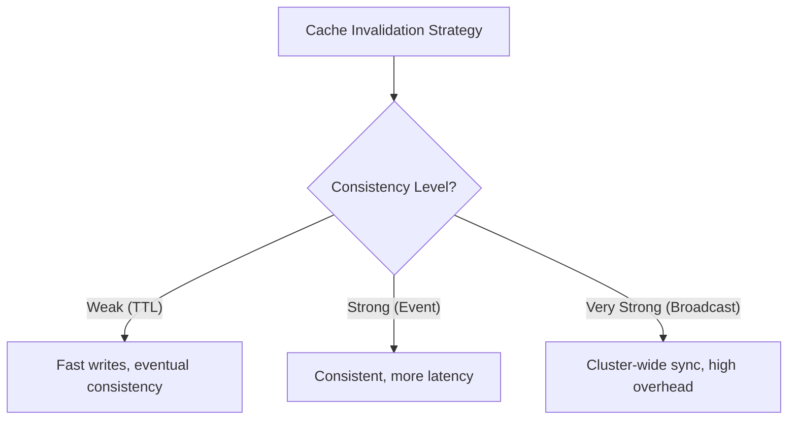

<Hero title="Caching, Batching, and Queueing" subtitle="Trade consistency for latency and throughput; decouple producers from consumers." size="large" />

## TL;DR

**Caching** stores expensive computations in fast storage, trading consistency for latency. Use TTLs and cache-aside patterns. **Batching** combines multiple requests into one for efficiency—useful for database writes, API calls. **Queueing** decouples producers from consumers, protecting against overload—use for async tasks, background jobs. All three trade simplicity for performance; apply carefully. Cache invalidation is hard; prefer TTL-based expiration. Batch size trades latency (small batches = low latency) for throughput (large batches = high throughput).

## Learning Objectives

- Design cache strategies (cache-aside, write-through, write-behind)
- Implement cache invalidation and TTL policies
- Identify opportunities for batching API calls, database writes, and event processing
- Use queues for decoupling and resilience
- Balance consistency, latency, and throughput trade-offs
- Monitor cache hit rates and queue depths

## Motivating Scenario

A recommendation engine calls a database for every product view—1000 requests/sec → 1000 database queries/sec. Adding Redis caching (80% hit rate) reduces to 200 queries/sec. Batching write operations cuts database load by 10x. Using a queue for async recommendations decouples the view from computation. Together, these patterns drop latency from 500ms to 50ms and allow horizontal scaling.

## Core Concepts

### Caching Patterns

<Vs title="Caching Patterns and Trade-Offs"
  items={[
{
      label: 'Cache-Aside (Lazy Loading)',
      points: [
        'Check cache first; if miss, fetch from source and populate cache',
        'Pros: Only caches accessed data; simple',
        'Cons: Cold cache on startup; cache misses add latency',
        'Best for: Read-heavy, evolving data (products, profiles)',
      ],
    },
{
      label: 'Write-Through',
      points: [
        'Write to cache AND source simultaneously',
        'Pros: Cache always consistent with source',
        'Cons: Write latency = max(cache, source); double write cost',
        'Best for: Critical data where stale cache is unacceptable',
      ],
    },
{
      label: 'Write-Behind',
      points: [
        'Write to cache immediately; async sync to source',
        'Pros: Fast writes; async durability',
        'Cons: Data loss risk if cache fails before sync',
        'Best for: Non-critical data, high write throughput (logs, metrics)',
      ],
    },
{
      label: 'Refresh-Ahead',
      points: [
        'Proactively refresh cache before TTL expires',
        'Pros: Always warm cache; no miss latency',
        'Cons: Refresh unnecessary data; complexity',
        'Best for: Popular, predictable data (top products)',
      ],
    }
]} />

### Cache Invalidation Strategies

**Cache invalidation is hard.** Choose one:

1. **TTL (Time-To-Live)**: Expire after N seconds. Simple; risks staleness.
2. **Versioning**: Include version in key (e.g., `product:v2:123`). Clean; requires upstream updates.
3. **Event-Driven**: Listen to change events; invalidate on updates. Consistent; adds complexity.
4. **Broadcast Invalidation**: Cluster-wide delete on write. Strong consistency; network overhead.

<Figure caption="Cache invalidation trade-off: consistency vs. latency.">

</Figure>

### Batching

Combine multiple requests to reduce overhead:

- **Database writes**: Instead of 100 individual INSERTs, one BATCH INSERT.
- **API calls**: Combine 10 product lookups into one `/products?ids=1,2,3...`.
- **Event processing**: Group 1000 events into one batch for Kafka producer.

**Trade-off**: Batch size vs. latency. Size 1 = low latency, low throughput. Size 1000 = high latency, high throughput.

### Queueing

Decouple producers (request handlers) from consumers (workers):

```
Request → API → Queue → Workers → Database
```

Benefits:
- **Resilience**: If workers are slow, queue absorbs load.
- **Scalability**: Add workers without changing API.
- **Decoupling**: API doesn't care how work is processed.

Challenges:
- **Ordering**: Some queues don't preserve order.
- **Durability**: Queue failure = lost messages (unless persistent).
- **Latency**: Queue adds round-trip time.

## Practical Example

<Tabs>
<TabItem value="cache" label="Cache-Aside Pattern (Python)">

```python
import redis
import json
from typing import Optional

class ProductCache:
    def __init__(self, redis_url="redis://localhost"):
        self.redis = redis.from_url(redis_url)
        self.ttl = 3600  # 1 hour

    def get(self, product_id: int) -> Optional[dict]:
        """Get product from cache or fetch from DB."""
        cache_key = f"product:{product_id}"

        # Try cache first
        cached = self.redis.get(cache_key)
        if cached:
            print(f"Cache hit for {product_id}")
            return json.loads(cached)

        # Cache miss: fetch from database
        print(f"Cache miss for {product_id}")
        product = self._fetch_from_db(product_id)
        if product:
            # Populate cache
            self.redis.setex(
                cache_key,
                self.ttl,
                json.dumps(product)
            )
        return product

    def invalidate(self, product_id: int):
        """Invalidate cache on update."""
        cache_key = f"product:{product_id}"
        self.redis.delete(cache_key)

    def _fetch_from_db(self, product_id: int) -> Optional[dict]:
        # Simulate database fetch
        return {"id": product_id, "name": "Widget"}

# Usage
cache = ProductCache()
product = cache.get(1)  # Cache miss, fetches from DB
product = cache.get(1)  # Cache hit
cache.invalidate(1)     # Invalidate on update
```

</TabItem>
<TabItem value="batch" label="Batching (Database)">

```python
import psycopg2
from typing import List

def insert_logs_unbatched(logs: List[dict]):
    """Slow: N database round-trips."""
    conn = psycopg2.connect("dbname=mydb")
    cur = conn.cursor()

    for log in logs:
        # N separate INSERT statements
        cur.execute(
            "INSERT INTO logs (user_id, action) VALUES (%s, %s)",
            (log["user_id"], log["action"])
        )

    conn.commit()
    conn.close()
    # 10,000 logs = 10,000 queries

def insert_logs_batched(logs: List[dict], batch_size=1000):
    """Fast: Batch INSERT statements."""
    conn = psycopg2.connect("dbname=mydb")
    cur = conn.cursor()

    for i in range(0, len(logs), batch_size):
        batch = logs[i:i+batch_size]

        # Multi-row INSERT
        args_str = ",".join(
            cur.mogrify("(%s, %s)", (log["user_id"], log["action"])).decode()
            for log in batch
        )
        cur.execute(f"INSERT INTO logs (user_id, action) VALUES {args_str}")

    conn.commit()
    conn.close()
    # 10,000 logs = 10 queries

# Benchmarks
# Unbatched: 2.5 seconds
# Batched (size=1000): 0.1 seconds → 25x speedup
```

</TabItem>
<TabItem value="queue" label="Queueing (RabbitMQ)">

```python
import pika
import json

# Producer: Fast response, async work
def process_order(order):
    """Respond quickly, queue work."""
    connection = pika.BlockingConnection(pika.ConnectionParameters('localhost'))
    channel = connection.channel()

    # Declare queue (idempotent)
    channel.queue_declare(queue='order_processing')

    # Publish order to queue
    channel.basic_publish(
        exchange='',
        routing_key='order_processing',
        body=json.dumps(order),
        properties=pika.BasicProperties(delivery_mode=2)  # Persistent
    )

    connection.close()
    return {"status": "queued"}  # Fast response

# Consumer: Process in background
def consume_orders():
    """Background worker processing orders."""
    connection = pika.BlockingConnection(pika.ConnectionParameters('localhost'))
    channel = connection.channel()

    channel.queue_declare(queue='order_processing')

    def callback(ch, method, properties, body):
        order = json.loads(body)
        print(f"Processing order: {order}")

        # Simulate long-running work
        process_payment(order)
        send_confirmation_email(order)

        # Acknowledge after success
        ch.basic_ack(delivery_tag=method.delivery_tag)

    channel.basic_consume(
        queue='order_processing',
        on_message_callback=callback,
        auto_ack=False  # Manual ack ensures no data loss
    )

    print("Waiting for orders...")
    channel.start_consuming()

# Run producer in API
# Run consumer in background worker
```

</TabItem>
</Tabs>

## Performance Checklist

<Showcase
  title="Caching, Batching, Queueing Checklist"
  points={[
    { category: "Caching", item: "Identify expensive operations (DB queries, API calls)" },
    { category: "Caching", item: "Choose caching pattern (cache-aside preferred for most cases)" },
    { category: "Caching", item: "Set appropriate TTLs (balance freshness vs. hit rate)" },
    { category: "Caching", item: "Monitor hit rate (aim for >80% for cache-heavy paths)" },
    { category: "Batching", item: "Find opportunities to batch (DB writes, API requests)" },
    { category: "Batching", item: "Tune batch size (small for low latency, large for throughput)" },
    { category: "Queueing", item: "Decouple async work (email, analytics, heavy computation)" },
    { category: "Queueing", item: "Ensure durability (persistent queue or backup)" },
    { category: "Monitoring", item: "Track cache hit rates, batch sizes, queue depths" },
  ]}
/>

## Common Pitfalls

**Pitfall 1: Cache too long; data becomes stale**
- **Risk**: Users see outdated information.
- **Fix**: Set reasonable TTLs; validate freshness requirements.

**Pitfall 2: Cache thundering herd**
- **Risk**: When cache expires, all requests hit database simultaneously.
- **Fix**: Use refresh-ahead or randomize TTL expiration.

**Pitfall 3: Batch size too large; latency balloons**
- **Risk**: User waits for batch to fill; feels slow.
- **Fix**: Use max-wait timeout (e.g., batch after 100 items OR 100ms).

**Pitfall 4: Queue doesn't persist; messages lost**
- **Risk**: Worker crashes; queued work is lost.
- **Fix**: Use durable queue (RabbitMQ with persistence, Kafka) and acks.

## Real-World Performance Analysis

### E-Commerce Product Search

**Without Optimization**: Query database for every search → 5000 queries/sec at peak → Database at 95% CPU

**With Caching (Redis)**:
- Cache product search results with 5-minute TTL
- 80% cache hit rate → 1000 queries/sec to database
- Database CPU drops to 20%
- Latency: 500ms (database) → 50ms (cache)

**With Batching**:
- Batch product reviews indexing (update once per hour instead of per-review)
- Eliminates 100k index updates per day → 42 per hour
- 99% throughput increase for real requests

**With Queueing**:
- User purchases trigger async email, recommendation, analytics tasks
- API response: 100ms (just confirms order to database)
- Email/analytics processed in background
- Users see instant confirmation instead of waiting 3-5 seconds

**Combined Impact**:
- Latency: 5 seconds → 100ms (50x improvement)
- Throughput: 100 requests/sec → 10,000 requests/sec (100x)
- Database CPU: 95% → 15%
- User experience: "slow and frustrating" → "fast and responsive"

### Cache Invalidation Strategies in Detail

**TTL-Based Expiration**:
```javascript
// Simplest: automatic expiration
cache.set('product:123', product, ttl: 300);  // 5 minutes

// Risk: if product price changes at 4:59, users see stale price for 1 minute
// Trade-off: simpler implementation vs temporary staleness
```

**Event-Driven Invalidation**:
```javascript
// When product updates, invalidate cache immediately
function updateProduct(id, newData) {
  db.update('products', id, newData);
  cache.delete(`product:${id}`);  // Instant invalidation
}

// Next request: cache miss, fetches fresh data
// Trade-off: more complex but always fresh
```

**Hybrid Approach (Recommended)**:
```javascript
// Combine both: event-driven + TTL fallback
function updateProduct(id, newData) {
  db.update('products', id, newData);
  cache.set(`product:${id}`, newData, ttl: 300);  // Immediate fresh value + fallback
  publishEvent('product:updated', id);  // Other services can react
}
```

### Batch Processing Timing

**Pure Time-Based Batching**:
```python
# Wait 100ms or batch fills, whichever comes first
batch_timeout = 100  # ms
batch_size = 1000

async def add_to_batch(item):
    batch.append(item)
    if len(batch) >= batch_size:
        await flush_batch()

# Timer flushes after timeout
```

**Issues**: If items arrive slowly, users wait up to 100ms for response

**Adaptive Batching** (Better):
```python
# For write-heavy: larger batch, longer wait is acceptable
# For latency-critical: smaller batch, flush sooner

if is_batch_write:
    timeout = 500ms  # Can afford to wait
    size = 5000
else:
    timeout = 50ms   # Need fast response
    size = 100
```

### Queue Depth Monitoring

**Healthy Queue Depth Pattern**:
```
[Peak] Sudden spike in requests → Queue depth rises to 50
       Workers catch up → Queue depth drops to 5
[Normal] Baseline queue depth 1-3 (small transient bursts)
[Danger] Queue depth 100+ and growing → Workers can't keep up
```

**Action**: When queue exceeds 1000, auto-scale workers (add 10% more) or alert on-call

### Cache Layer Trade-Offs by Technology

**In-Memory (Node/Python)**: Fastest (microseconds), lost on restart, single-instance only
**Redis**: Fast (milliseconds), persistent options, distributed, network latency
**Memcached**: Simple, very fast, no persistence, good for truly temporary data
**Database Query Cache**: Slowest (milliseconds to seconds), not separate infrastructure
**CDN Edge Cache**: Best for geographic distribution, can't customize per-user

## Advanced Patterns

### Stale-While-Revalidate

```javascript
// Serve cached (may be stale), update in background
async function getProduct(id) {
  const cached = cache.get(id);
  if (cached && Date.now() - cached.time < 24.hours) {
    // Serve immediately (even if 8 hours old)
    updateInBackground(id);  // Non-blocking, eventual consistency
    return cached.value;
  }
  // Cache miss: fetch fresh
  const fresh = await db.get(id);
  cache.set(id, fresh);
  return fresh;
}

// Benefits:
// - Fast response (served from cache)
// - Fresh data eventually (background update)
// - No "thundering herd" (update in background, not on cache miss)
```

### Distributed Caching with Consistency

```javascript
// Multi-DC setup: cache in each region
// DC1 Redis ← → Sync ← → DC2 Redis

class DistributedCache {
  async set(key, value) {
    await Promise.all([
      this.localCache.set(key, value),
      this.remoteCache.set(key, value)  // Replicate to other regions
    ]);
  }

  async get(key) {
    // Check local first (latency: 1ms)
    // Fall back to remote (latency: 50ms across network)
    return this.localCache.get(key) || this.remoteCache.get(key);
  }
}

// Trade-off: higher consistency (both regions have same data) vs latency (wait for remote)
```

## Next Steps

1. **Profile your application** — Use APM tools to find expensive operations.
2. **Apply caching strategically** — Cache-aside for read-heavy, avoid over-caching.
3. **Tune TTLs** — Monitor cache hit rates, adjust based on freshness requirements.
4. **Identify batching opportunities** — Database writes, API calls, bulk operations.
5. **Implement queueing** — Decouple producers from consumers for resilience.
6. **Monitor and measure** — Track cache hit rate, batch sizes, queue depths in production.
7. **Load test** — Verify that caching/batching/queueing actually improve throughput.

## References

1. [AWS Caching Best Practices](https://aws.amazon.com/caching/best-practices/)
2. [Google SRE Book — Data Center Caching](https://sre.google/sre-book/caching/)
3. [Martin Fowler — Cache-Aside Pattern](https://martinfowler.com/bliki/CacheAsidePattern.html)
4. [Redis Documentation](https://redis.io/documentation)
5. [RabbitMQ Performance Tuning](https://www.rabbitmq.com/memory-use.html)
