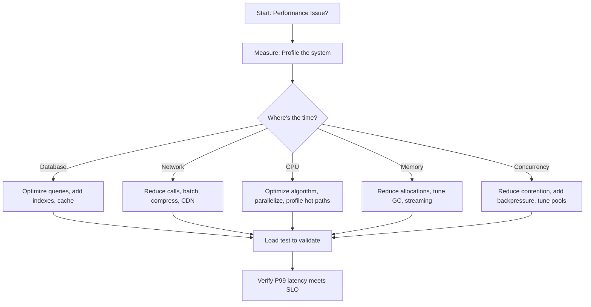

import { useCurrentSidebarCategory } from "@docusaurus/theme-common";

# Performance & Scalability

Performance and scalability are inseparable: a system must respond quickly under baseline load (performance) and maintain that responsiveness as load increases (scalability). This section covers latency budgets, load testing strategies, profiling bottlenecks, and optimization techniques like caching and batching.

## What you'll find here

- **[Latency Budgets, SLAs, and SLOs](./latency-budgets-slas-slos/)** — Define and track response time targets end-to-end.
- **[Load, Stress, Soak, and Spike Testing](./load-stress-soak-spike-testing/)** — Validate performance under various load conditions.
- **[Profiling and Bottleneck Analysis](./profiling-and-bottleneck-analysis/)** — Identify where time is spent and what to optimize.
- **[Caching, Batching, and Queueing](./caching-batching-queueing/)** — Common optimization patterns.

## Quick mental model

<Figure caption="Performance and scalability decision tree.">

</Figure>

## Key concepts

- **Latency**: Time for a single request to complete (P50, P95, P99).
- **Throughput**: Requests per second the system can handle.
- **Scalability**: Maintaining performance as load increases (horizontal or vertical).
- **SLA**: Service Level Agreement—contractual uptime guarantee (e.g., 99.9%).
- **SLO**: Service Level Objective—internal target (e.g., P99 < 200ms).
- **Bottleneck**: Resource that becomes saturated first, limiting throughput.

## Common patterns

1. **Caching**: Store frequently accessed data in fast, temporary storage.
2. **Batching**: Combine multiple requests into one for efficiency.
3. **Queueing**: Decouple producers from consumers to prevent overload.
4. **Sharding**: Partition data across servers for parallel access.
5. **Compression**: Reduce network payload size.
6. **Async I/O**: Avoid blocking on I/O, improve concurrency.

<DocCardList items={useCurrentSidebarCategory().items} />
