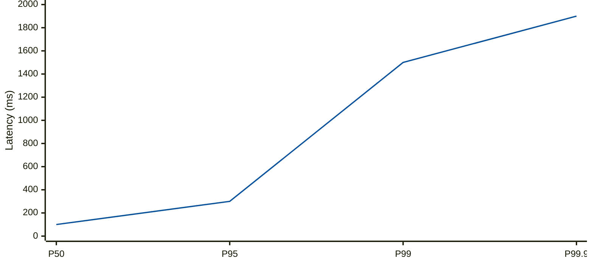

<Hero title="Latency Budgets, SLAs, and SLOs" subtitle="Define end-to-end latency targets, track SLOs, and communicate availability guarantees." size="large" />

## TL;DR

**SLA** (Service Level Agreement) is a contractual promise to customers about availability and latency. **SLO** (Service Level Objective) is an internal target. **Latency Budget** allocates a time budget across system components (e.g., "P99 latency 200ms total: client 10ms, network 20ms, API 100ms, database 70ms"). Track percentiles, not averages—P50, P95, P99 matter more than mean latency. Use error budgets to decide when to prioritize stability over feature velocity. Define SLOs as achievable; you'll fail them periodically, and that's expected.

## Learning Objectives

- Distinguish SLA from SLO and understand their relationship
- Define latency budgets that allocate time across system tiers
- Track and analyze latency percentiles (P50, P95, P99, P99.9)
- Use error budgets to balance feature velocity and reliability
- Design monitoring and alerting for SLO violations
- Communicate performance targets across teams

## Motivating Scenario

A checkout API promises "99.9% uptime, < 500ms latency" in the SLA. Marketing tells customers it'll be "instant." An engineer adds a new fraud check service that adds 200ms. Without a latency budget, nobody notices until customers complain. With a budget, the engineer sees the fraud check exceeds its 50ms allocation and optimizes it. The SLO dashboard alerts ops to the slowdown before SLA breach.

## Core Concepts

### SLA vs. SLO vs. SLI

<Vs title="SLA, SLO, and SLI Definitions"
  items={[
{
      label: 'SLA (Service Level Agreement)',
      points: [
        'Contract with customers',
        'Specifies uptime % and latency guarantees',
        'Breach triggers financial penalties or credits',
        'Example: "99.95% uptime, P99 latency < 500ms"',
        'Broader than internal targets; includes margins',
      ],
    },
{
      label: 'SLO (Service Level Objective)',
      points: [
        'Internal target, more stringent than SLA',
        'Provides headroom for errors, deploys, maintenance',
        'Example: "99.99% uptime, P99 latency < 200ms"',
        'Miss SLO occasionally; missing SLA is rare',
        'Guides engineering decisions',
      ],
    },
{
      label: 'SLI (Service Level Indicator)',
      points: [
        'Metric that measures SLO compliance',
        'Example: "Percentage of requests with latency < 200ms"',
        'Measured from production traffic',
        'Used to calculate error budget',
      ],
    }
]} />

### Latency Percentiles

Don't trust averages. A service with P50=100ms, P99=1000ms looks healthy if you only report mean=120ms. Use percentiles:

- **P50 (Median)**: Half of requests are faster.
- **P95**: 95% of requests are faster; 5% are slow.
- **P99**: 99% of requests are faster; 1% are slow (users notice!).
- **P99.9, P99.99**: Tail latency; critical for SLA compliance.

<Figure caption="Latency distribution showing why percentiles matter more than average.">

</Figure>

### Error Budget

If your SLO is 99.9% uptime, you have a budget of 43 minutes/month of downtime. Use this to decide when to deploy risky changes or prioritize features over stability.

**Error Budget Calculation**:

```
SLO: 99.9% (0.1% allowed errors)
Per month: 30 days × 24 hours × 60 min = 43,200 minutes
Error budget: 0.1% × 43,200 = 43.2 minutes/month
```

If you've used 30 minutes of error budget already, be conservative with deployments near the end of the month.

## Practical Example

<Tabs>
<TabItem value="budget" label="Latency Budget">

**System**: E-commerce checkout API

**End-to-end SLO**: P99 latency < 200ms

**Latency Budget Allocation**:

| Component | P99 Budget (ms) | Rationale |
|-----------|----------------|-----------|
| Client JS/network roundtrip | 20ms | Browser JS, network RTT |
| API Gateway | 10ms | Auth, rate limiting |
| Service (API handler) | 100ms | Business logic |
| Database query | 50ms | Indexed lookup |
| Cache miss path | +30ms | Serialization, fallback |
| Safety margin | 10ms | Unexpected latency |
| **Total** | **220ms** | 10% headroom for variance |

**Usage**: If database latency creeps from 50ms to 80ms, you've exceeded budget. Time to add indexes or cache.

</TabItem>
<TabItem value="monitoring" label="SLO Monitoring">

```json
{
  "service": "checkout-api",
  "sla": {
    "uptime": "99.95%",
    "latency_p99_ms": 500
  },
  "slo": {
    "uptime": "99.99%",
    "latency_p50_ms": 100,
    "latency_p95_ms": 200,
    "latency_p99_ms": 300
  },
  "measurement": {
    "period": "rolling 30 days",
    "sli_uptime": "99.994%",
    "sli_latency_p99": "298ms",
    "error_budget_remaining": "86.4 minutes"
  },
  "alerts": [
    { "threshold": "SLO miss", "action": "page on-call" },
    { "threshold": "error budget < 10%", "action": "freeze deployments" }
}
```

</TabItem>
</Tabs>

## Latency Budget Design Pattern

<Showcase
  title="Latency Budget Checklist"
  points={[
    { category: "Definition", item: "Define end-to-end SLO (e.g., P99 < 200ms)" },
    { category: "Decomposition", item: "Break into per-service budgets" },
    { category: "Measurement", item: "Instrument each tier with percentile metrics" },
    { category: "Alerting", item: "Alert when P99 approaches SLO limit" },
    { category: "Review", item: "Monthly review of latency trends" },
    { category: "Optimization", item: "Prioritize optimization for components over budget" },
    { category: "Communication", item: "Share SLO and current status with teams" },
  ]}
/>

## Common Pitfalls

**Pitfall 1: Only monitoring average latency**
- **Risk**: Hidden tail latency (P99) problems.
- **Fix**: Always monitor P95, P99, P99.9 percentiles.

**Pitfall 2: SLO = SLA**
- **Risk**: No headroom; every SLO miss becomes SLA breach.
- **Fix**: Make SLO more stringent than SLA by 10-20%.

**Pitfall 3: Ignoring error budget**
- **Risk**: Deployments cause SLA breaches; teams become risk-averse.
- **Fix**: Track error budget; use it to guide deployment velocity.

**Pitfall 4: No latency budget per service**
- **Risk**: Teams optimize independently; total latency creeps up.
- **Fix**: Decompose SLO into per-service budgets; treat exceeding budget as a bug.

## Advanced SLO Patterns

### Multi-Level SLOs

Different service tiers warrant different SLOs:

| Tier | SLA Uptime | SLO Uptime | P99 Latency | Use Case |
|------|-----------|-----------|------------|----------|
| Critical | 99.99% | 99.999% | under 100ms | Payment processing, login |
| Standard | 99.9% | 99.95% | under 500ms | Most user-facing APIs |
| Batch | 99% | 99.5% | under 5s | Background jobs, reports |
| Internal | None | 95% | under 10s | Internal tools, admin panels |

### Error Budget Policies

Define how to use error budget across deployment cycles:

```
Monthly error budget: 43.2 minutes (99.9% SLO)

Week 1: 10 minutes used (deployments, incidents)
Week 2: 8 minutes used (incident during scale testing)
Week 3: 5 minutes used (normal operation)
Week 4: 15 minutes used (risky feature rollout)
         ────────────
Total:  38 minutes (88% consumed)

Policy enforcement:
- < 10% remaining: Freeze risky deployments
- < 5% remaining: Only emergency patches
- > 20% remaining: Aggressive experimentation allowed
```

### Latency Tail Prediction

Use percentile trends to predict SLO violations:

```python
def predict_slo_violation(latency_history: List[int], current_slo: int) -> float:
    """Predict probability of SLO violation in next day."""
    import statistics

    # Fit trend to historical data
    trend = (latency_history[-1] - latency_history[0]) / len(latency_history)

    # Project tomorrow's p99 latency
    current_p99 = statistics.quantiles(latency_history, n=100)[-1]
    projected_p99 = current_p99 + trend

    # Probability of exceeding SLO
    violation_prob = (projected_p99 - current_slo) / current_slo if projected_p99 > current_slo else 0

    return max(0, violation_prob)

# Example
latency_samples = [150, 160, 165, 170, 175]  # Trending upward
slo = 200
prob = predict_slo_violation(latency_samples, slo)
print(f"Violation probability: {prob:.1%}")  # Might be 15-20%
```

## Complexity: Error Budget Trade-offs

### Feature Velocity vs. Stability

More aggressive deployments consume error budget faster:

```
Scenario A: Conservative deployments
- 1 deploy per week
- Error budget consumption: ~5-10 min/month
- Feature velocity: Slow (weeks to release features)
- Remaining budget for incidents: 30-38 min/month

Scenario B: Aggressive deployments
- 5 deploys per day (25/week)
- Error budget consumption: ~20-30 min/month
- Feature velocity: Fast (days to release features)
- Remaining budget for incidents: 13-23 min/month (risky)

Decision: How much incident capacity do you need?
```

### SLO Compliance Modes

Different strategies for managing SLO:

| Mode | Approach | When to Use |
|------|----------|-----------|
| **Conservative** | Strict SLO limits, few deployments | Critical services, regulated industries |
| **Balanced** | Follow error budget, planned deployments | Most production services |
| **Aggressive** | Maximize feature velocity | High-growth startups, non-critical services |
| **Protective** | Gradually tighten SLOs as service matures | New services during ramp-up |

## Measuring SLOs in Practice

### Synthetic Monitoring

Actively test SLO compliance:

```python
import random
import time
from datetime import datetime

class SyntheticMonitoring:
    def __init__(self, target_url: str, slo_latency_ms: int):
        self.target_url = target_url
        self.slo_latency_ms = slo_latency_ms
        self.results = []

    def check_slo(self):
        """Perform synthetic check of SLO compliance."""
        start = time.time()
        try:
            response = requests.get(self.target_url, timeout=10)
            latency_ms = (time.time() - start) * 1000

            compliant = latency_ms <= self.slo_latency_ms
            self.results.append({
                "timestamp": datetime.utcnow(),
                "latency_ms": latency_ms,
                "compliant": compliant,
                "status_code": response.status_code
            })

            return compliant
        except requests.Timeout:
            self.results.append({
                "timestamp": datetime.utcnow(),
                "latency_ms": 10000,
                "compliant": False,
                "error": "timeout"
            })
            return False

    def slo_compliance_percentage(self, window_hours: int = 1) -> float:
        """Calculate SLO compliance over time window."""
        cutoff = datetime.utcnow().timestamp() - (window_hours * 3600)
        recent = [r for r in self.results if r["timestamp"].timestamp() > cutoff]

        if not recent:
            return 100.0

        compliant = sum(1 for r in recent if r["compliant"])
        return (compliant / len(recent)) * 100

# Run synthetic checks every 5 minutes
monitor = SyntheticMonitoring("https://api.example.com/health", slo_latency_ms=200)
compliance = monitor.slo_compliance_percentage(window_hours=24)
print(f"SLO compliance last 24h: {compliance:.2f}%")
```

### User-Centric SLOs

Define SLOs based on user experience, not just infrastructure metrics:

```
Traditional SLO:
- Latency: P99 < 200ms (infrastructure metric)
- Uptime: 99.9% (infrastructure metric)

User-Centric SLOs:
- "Add item to cart" completes successfully and displays response: 99% of attempts under 500ms
- "Checkout" flow completes and confirms order: 99.5% of attempts under 2s
- "Search results appear" after user types: 95% of queries show first results under 200ms
```

## Next Steps

1. **Define your SLA** — With Product and Legal, specify uptime % and latency guarantees.
2. **Derive SLO** — Add 10-20% headroom for internal variability.
3. **Create latency budget** — Decompose SLO across tiers and services.
4. **Instrument monitoring** — Measure P50, P95, P99 for each component.
5. **Set up alerting** — Page on-call when SLO approaches; auto-stop risky changes if error budget is low.
6. **Review monthly** — Track trends; adjust budgets as scale or architecture changes.
7. **Use synthetic monitoring** — Active checks ensure SLO compliance from user perspective.
8. **Implement error budget policies** — Define clear rules for deployment velocity based on remaining budget.

## References

1. [Google SRE Book — Service Level Objectives](https://sre.google/sre-book/service-level-objectives/)
2. [Site Reliability Engineering — Practical Monitoring (O'Reilly)](https://www.oreilly.com/library/view/site-reliability-engineering/9781491927038/)
3. [Brendan Gregg — Systems Performance (2nd Ed.)](https://www.oreilly.com/library/view/systems-performance-2nd/9780136820239/)
