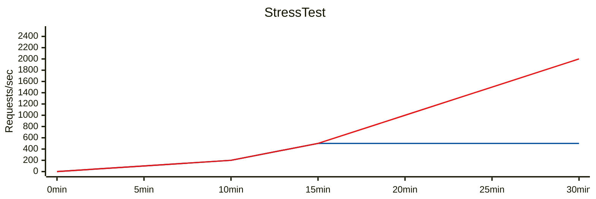

<Hero title="Load, Stress, Soak, and Spike Testing" subtitle="Validate system behavior under various load conditions and discover bottlenecks before production." size="large" />

## TL;DR

**Load testing** validates that the system meets latency/throughput targets under expected peak load. **Stress testing** finds the breaking point by pushing load beyond expected capacity. **Soak testing** runs at constant load for hours/days to detect memory leaks and resource exhaustion. **Spike testing** suddenly doubles/triples load to validate auto-scaling and failover. Use tools like JMeter, Locust, or k6. Start with load testing in staging; escalate to stress/soak only after passing load tests. Never run these in production without careful isolation and rollback plans.

## Learning Objectives

- Distinguish load, stress, soak, and spike testing and when to apply each
- Design realistic load profiles based on production traffic patterns
- Identify bottlenecks and determine system breaking points
- Detect memory leaks, resource leaks, and long-running issues
- Plan capacity based on testing results
- Automate performance testing in CI/CD

## Motivating Scenario

A service handles 100 requests/sec smoothly in staging during load tests. Black Friday comes, traffic spikes to 500 requests/sec, and the service becomes unresponsive. Post-incident investigation reveals: (1) load test didn't match realistic traffic patterns; (2) no stress testing to find breaking point; (3) auto-scaling triggers were misconfigured. Proper testing would have surfaced all three issues before launch.

## Core Concepts

### Four Types of Performance Tests

<Vs title="Load, Stress, Soak, and Spike Testing"
  items={[
{
      label: 'Load Testing',
      points: [
        'Purpose: Validate SLO compliance under expected peak load',
        'Load profile: Constant or gradual ramp to expected peak (e.g., 500 req/sec)',
        'Duration: 10-30 minutes (enough to warm caches, stabilize)',
        'Success criteria: P99 latency < SLO, zero errors',
        'Example: "System handles 500 req/sec with P99 < 200ms"',
      ],
    },
{
      label: 'Stress Testing',
      points: [
        'Purpose: Find the breaking point and failure modes',
        'Load profile: Gradual increase until system fails (e.g., 500→1000→2000 req/sec)',
        'Duration: Until saturation or errors exceed threshold',
        'Success criteria: Identify breaking point; ensure graceful degradation',
        'Example: "System saturates at 1200 req/sec; then circuit breaker activates"',
      ],
    },
{
      label: 'Soak Testing',
      points: [
        'Purpose: Detect memory leaks, resource exhaustion, staleness over time',
        'Load profile: Constant moderate load (70-80% capacity)',
        'Duration: Hours to days (4-48+ hours)',
        'Success criteria: Memory stable, no connection leaks, no degradation',
        'Example: "System stable for 24 hours at 400 req/sec"',
      ],
    },
{
      label: 'Spike Testing',
      points: [
        'Purpose: Validate auto-scaling and failover under sudden load increase',
        'Load profile: Sudden spike (e.g., 500→1500 req/sec instantly)',
        'Duration: 5-10 minutes at spike, then ramp down',
        'Success criteria: Auto-scaling triggers; P99 latency recovers in < 2 min',
        'Example: "Spike to 1500 req/sec triggers scale-out; P99 recovers to < 300ms"',
      ],
    }
]} />

### Load Profile Design

Design realistic load profiles based on production traffic patterns:

<Figure caption="Load test profiles for different testing scenarios.">

</Figure>

## Practical Example

<Tabs>
<TabItem value="setup" label="JMeter Load Test">

```xml
<!-- JMeter Test Plan for API Load Testing -->
<TestPlan guiclass="TestPlanGui">
  <elementProp name="TestPlan.user_defined_variables" elementType="Arguments"/>

  <!-- Variables -->
  <Arguments guiclass="ArgumentsPanel">
    <elementProp name="base_url" elementType="Argument">
      <stringProp name="Argument.value">http://api.example.com</stringProp>
    </elementProp>
    <elementProp name="target_rps" elementType="Argument">
      <stringProp name="Argument.value">500</stringProp>
    </elementProp>
  </Arguments>

  <!-- Thread Group: 500 concurrent users -->
  <ThreadGroup guiclass="ThreadGroupGui">
    <elementProp name="ThreadGroup.main_controller" elementType="LoopController">
      <stringProp name="LoopController.loops">-1</stringProp>
    </elementProp>
    <stringProp name="ThreadGroup.num_threads">500</stringProp>
    <stringProp name="ThreadGroup.ramp_time">60</stringProp>
    <stringProp name="ThreadGroup.duration">600</stringProp>
  </ThreadGroup>

  <!-- HTTP Request Sampler -->
  <HTTPSampler guiclass="HttpTestSampleGui">
    <stringProp name="HTTPSampler.domain">${base_url}</stringProp>
    <stringProp name="HTTPSampler.path">/api/products</stringProp>
    <stringProp name="HTTPSampler.method">GET</stringProp>
  </HTTPSampler>

  <!-- Listeners: Results aggregation -->
  <ResultCollector guiclass="SummaryReport">
    <objProp name="sample_variables"/>
  </ResultCollector>

  <!-- Assertions: Success criteria -->
  <ResponseAssertion guiclass="AssertionGui">
    <TestType>6</TestType>
    <stringProp name="Assertion.test_type">6</stringProp>
    <stringProp name="Assertion.test_strings">200</stringProp>
  </ResponseAssertion>
</TestPlan>
```

**Expected Results**:
- Throughput: 500 req/sec
- P50 latency: ~80ms
- P99 latency: < 200ms
- Error rate: 0%

</TabItem>
<TabItem value="locust" label="Locust (Python)">

```python
from locust import HttpUser, task, between
import random

class APIUser(HttpUser):
    wait_time = between(0.5, 2.0)  # Think time between requests

    @task(3)
    def get_products(self):
        """Load test /api/products endpoint"""
        self.client.get("/api/products")

    @task(1)
    def get_product_detail(self):
        """Load test /api/products/{id}"""
        product_id = random.randint(1, 10000)
        self.client.get(f"/api/products/{product_id}")

    @task(1)
    def create_order(self):
        """Load test POST /api/orders"""
        payload = {
            "user_id": random.randint(1, 1000),
            "items": [{"product_id": random.randint(1, 10000), "qty": 1}]
        }
        self.client.post("/api/orders", json=payload)

# Run with:
# locust -f locustfile.py --host=http://api.example.com -u 500 -r 50 -t 10m
```

**Locust Dashboard**: Real-time view of RPS, latency, and failures.

</TabItem>
<TabItem value="analysis" label="Load Test Analysis">

```
Load Test Results: API Gateway
================================
Duration: 10 minutes (600 seconds)
Target RPS: 500
Actual RPS: 498 avg

Latency Percentiles (ms):
  P50: 85
  P95: 165
  P99: 245
  P99.9: 315

Error Rate: 0.02% (1 timeout in 5000 requests)

Analysis:
✓ P99 (245ms) is below SLO (300ms) — PASS
✓ Error rate < 0.1% — PASS
⚠ P99.9 approaching SLO cap — monitor closely

Bottleneck Analysis:
- Database CPU: 72% (add read replicas)
- API memory: 1.2 GB (stable, no leak detected)
- Network: 450 Mbps (headroom available)
```

</TabItem>
</Tabs>

## Load Testing in CI/CD

Automate performance testing:

<Showcase
  title="CI/CD Load Testing Checklist"
  points={[
    { category: "Pre-deployment", item: "Run load test in staging; fail if P99 > SLO" },
    { category: "Regression Detection", item: "Compare latency vs. baseline; alert on >10% regression" },
    { category: "Capacity Planning", item: "Track max sustainable RPS; forecast scaling needs" },
    { category: "Breaking Point", item: "Quarterly stress tests to validate failure modes" },
    { category: "Long-running", item: "Monthly 4-hour soak tests to detect leaks" },
    { category: "Spike Simulation", item: "Test auto-scaling with synthetic spike every quarter" },
    { category: "Reporting", item: "Dashboard of performance trends over time" },
  ]}
/>

## Common Pitfalls

**Pitfall 1: Load profile doesn't match production**
- **Risk**: Staging passes tests; production fails.
- **Fix**: Analyze real production traffic (request distribution, think times, payload sizes); replicate in tests.

**Pitfall 2: Cache warming ignored**
- **Risk**: Cold cache makes latency look worse than production.
- **Fix**: Warm caches before measuring; run load tests long enough for steady state.

**Pitfall 3: Stress test too aggressive**
- **Risk**: Damages staging infrastructure.
- **Fix**: Start with low load; ramp gradually; have rollback plan.

**Pitfall 4: Tests on under-resourced staging**
- **Risk**: Staging bottleneck hides production problems.
- **Fix**: Ensure staging hardware matches production (or scale proportionally).

## Real-World Case Studies

### Case Study 1: E-Commerce Black Friday

**Scenario**: Normal traffic 200 req/sec. Black Friday peak: 2000 req/sec (10x).

```
Load Test Results:
  Normal peak (200 req/sec): P99 = 85ms ✓
  Expected peak (400 req/sec): P99 = 150ms ✓

Stress Test Results:
  Push to 1000 req/sec: P99 = 1200ms, errors begin
  Push to 2000 req/sec: P99 = 5000ms+, circuit breaker opens

Findings:
  System saturates at ~800 req/sec
  Breaking point: database CPU 100%, connection pool exhausted
  Auto-scaling kicks in at 750 req/sec (configured threshold)
  With 3 additional instances: handles 2000 req/sec with P99 = 200ms

Recommendations:
  1. Scale threshold should trigger at 750 req/sec (before saturation)
  2. Add read replicas to spread load
  3. Implement request queuing with clear API feedback
  4. Cache hot queries (product listings)
```

### Case Study 2: Memory Leak in Batch Service

```
Soak Test Setup:
  72 hours at 100 req/sec
  Service processes files, should release memory after completion

Results (by hour):
  Hour 0: 250 MB
  Hour 24: 320 MB (80 MB growth)
  Hour 48: 410 MB (160 MB growth)
  Hour 72: 510 MB (260 MB growth)

Trend: Linear growth; memory never released
Root cause: Event listeners not unregistered after processing
Leak rate: ~3.6 MB/hour

Fix: Remove event listener after file processing
  listener.on('complete', cleanup)
  // Must call listener.off() or listener.removeListener()

Verification: Re-run 72-hour soak
  Memory: ~250MB throughout (stable)
```

## Interpreting Load Test Results

### Latency Percentiles Explained

```
P50 (median):   50% of requests faster than this
P90:            90% of requests faster than this
P99:            99% of requests faster than this (99th percentile)
P99.9:          999 of 1000 requests faster than this

Example results from 10,000 request test:
  P50:  80ms   (request 5000 slower than this)
  P90:  150ms  (request 9000 slower than this)
  P99:  300ms  (request 9900 slower than this)
  P99.9: 1200ms (request 9990 slower than this)

SLO: P99 < 300ms means 99% must be fast, but 100 out of 10,000 can be slow
Outliers matter: If 1% can be slow, ensure that 1% is acceptable (e.g., page load)
```

### Error Budgets from Load Tests

```
SLO: 99.5% uptime, P99 < 200ms

From load test at capacity:
  - Error rate: 0.3% (3 errors per 1000 requests)
  - P99 latency: 180ms (within SLO)

Monthly error budget:
  99.5% uptime = 3.6 hours of downtime allowed per month

During Black Friday:
  - If peak load hits saturation
  - Error rate jumps to 5%
  - That's 5 failed requests per 100
  - At 2000 req/sec, that's 100 failed requests per second
  - Quickly exhausts monthly error budget

Lesson: Load test at actual peak traffic; don't underestimate
```

## Distributed Load Testing

For large-scale systems, single load generator can't simulate realistic load:

```bash
# Instead of 1 JMeter client generating 1000 req/sec
# Use 5 distributed agents each generating 200 req/sec
# Simulates 5 geographically separate users

# JMeter Distributed Setup:
#   Master (coordinates test)
#   Agents (generate load):
#     - agent-us-east: 200 req/sec
#     - agent-us-west: 200 req/sec
#     - agent-eu: 200 req/sec
#     - agent-asia: 200 req/sec
#     - agent-brazil: 200 req/sec
#   Total: 1000 req/sec from 5 regions

# Results are aggregated on master
# Identifies regional issues (e.g., Asia latency higher)
```

## Monitoring During Load Tests

Don't just measure latency; monitor system health:

```yaml
# Metrics to track during load test
latency:
  p50: 85ms
  p99: 245ms
  p99.9: 1200ms
  error_rate: 0.02%

cpu_usage:
  api_servers: 72%
  database: 85%
  cache: 45%

memory_usage:
  api_servers: 1.2GB / 2GB (60%)
  database: 8.5GB / 16GB (53%)
  cache: 4.2GB / 8GB (52%)

connections:
  database_connections: 450 / 500 (90% pool utilization)
  thread_pool: 350 / 500 (70% utilization)

network:
  bandwidth: 450 Mbps / 1 Gbps (45%)
  packet_loss: 0.01%

resource_constraints:
  - Database connections approaching limit; scale reads or reduce concurrency
  - CPU on API servers 85%; auto-scaling should trigger
  - Network utilization low; not the bottleneck
```

## Post-Test Analysis

After running load test, analyze results thoroughly:

```
1. Latency analysis:
   - Is P99 within SLO? If not, what's the limit before breaching?
   - Are there anomalies (sudden spike at specific time)?
   - Plot latency over time; look for degradation pattern

2. Error analysis:
   - What errors occurred? 404? 500? Timeout?
   - Are specific endpoints more error-prone?
   - Errors by error type:
     * 0.01% timeout (database slow)
     * 0.005% 500 errors (application exception)
     * 0.005% 503 (rate limiter)

3. Resource bottleneck:
   - Which resource hit limit first? CPU? Memory? Connections?
   - Could bottleneck be relieved with more of that resource?
   - Is scaling the answer, or is it an architectural problem?

4. Recommendations:
   - Add X more servers to handle 2000 req/sec
   - Implement caching for hot queries
   - Increase database connection pool from 50 to 100
   - Optimize slow endpoint (API response time 800ms)
   - Add read replicas to spread database load
```

## Next Steps

1. **Analyze production traffic** — Request distribution, think times, payload sizes.
2. **Design load profile** — Realistic model based on production patterns.
3. **Run load test** — Validate P99 < SLO under expected peak.
4. **Run stress test** — Find breaking point; ensure graceful degradation.
5. **Run soak test** — Detect leaks; validate long-running stability.
6. **Run spike test** — Validate auto-scaling and failover under sudden load.
7. **Automate in CI/CD** — Gate deployments on load test results.
8. **Monitor and iterate** — Track performance over time; adjust budgets as scale increases.
9. **Document findings** — Share bottlenecks, limits, and scaling recommendations across team

## References

1. [JMeter Official Documentation](https://jmeter.apache.org/)
2. [Locust Load Testing Framework](https://locust.io/)
3. [k6 Modern Load Testing](https://k6.io/)
4. [Google SRE Book — Load Testing](https://sre.google/sre-book/testing-reliability/)
5. [Brendan Gregg — Performance Testing (Systems Performance, 2nd Ed.)](https://www.oreilly.com/library/view/systems-performance-2nd/9780136820239/)
6. "Load Testing as You Grow" — AWS Architecture Blog
7. Load Generator Comparison — JMeter vs Locust vs k6 vs Gatling
