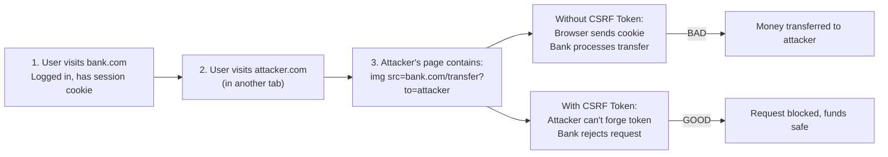

<Hero title="CSRF, Clickjacking & CORS" subtitle="Prevent cross-site attacks and control resource sharing" imageAlt="CSRF illustration" size="large" />

## TL;DR

**CSRF (Cross-Site Request Forgery)**: Attacker tricks user into making unintended request (transfer money, change password). Prevent: CSRF tokens, SameSite cookies. **Clickjacking**: Attacker overlays invisible iframe, tricks user into clicking (button actually clicks attacker's site). Prevent: X-Frame-Options, CSP frame-ancestors. **CORS (Cross-Origin Resource Sharing)**: Control which external sites can access your APIs. Configure headers, validate origin.

## Learning Objectives

- Understand CSRF attack mechanism and prevention
- Implement CSRF tokens
- Use SameSite cookies to prevent CSRF
- Prevent clickjacking with X-Frame-Options and CSP
- Design CORS policies for APIs

## Motivating Scenario

**CSRF**: User logged into bank.com. Attacker's site has ``. User's browser makes request (cookies sent). Bank transfers money.

**Solution**: Transfer requires CSRF token (unique, in form). Attacker can't forge token. Request fails.

## Core Concepts

### CSRF Prevention

<Vs items={[
{
    label: "CSRF Token Approach",
    points: [
      "Generate unique token per user/session",
      "Include in form/header (unpredictable)",
      "Verify token on server before processing",
      "Token never sent to attacker's site",
      "Recommended for traditional forms",
      "Works across browsers uniformly"
    ]
  },
{
    label: "SameSite Cookie Approach",
    points: [
      "Cookie only sent same-site requests",
      "Not automatically sent cross-site",
      "Prevents cookie inclusion by attacker",
      "Simpler, no token management overhead",
      "Modern browser support (2020+)",
      "Complements CSRF tokens (defense-in-depth)"
    ]
  }
]} />

**CSRF Attack Flow and Prevention**:

<Figure caption="CSRF token prevents attacker from forging requests.">

</Figure>

### Clickjacking: The Invisible Click

Clickjacking works by overlaying an invisible iframe over a visible button. User clicks what they see (e.g., "Download"), but actually clicks a hidden button on attacker's site (e.g., "Approve Transfer").

<Figure caption="Clickjacking: user clicks visible button, but invisible iframe captures click.">
```
Visible Layer (user sees):        Hidden Layer (attacker controls):
┌─────────────────────┐           ┌─────────────────────┐
│ [Click to Download] │           │ [Approve Transfer]  │
│                     │           │ (invisible, opacity:0)
└─────────────────────┘           └─────────────────────┘
     ↓ User clicks
   Invisible iframe's button receives click
```
</Figure>

### X-Frame-Options and CSP Prevention

```
X-Frame-Options: DENY
→ Browser won't allow your page in any iframe

X-Frame-Options: SAMEORIGIN
→ Browser allows iframe only if same origin

Content-Security-Policy: frame-ancestors 'self'
→ Same as SAMEORIGIN, more flexible, recommended
```

### CORS: Controlling Cross-Origin Access

CORS allows you to explicitly permit cross-origin requests. Without CORS, browser blocks cross-origin requests by default (same-origin policy).

<Tabs>
<TabItem value="cors_headers" label="CORS Headers">

```
Access-Control-Allow-Origin: https://trusted.com
→ Only trusted.com can fetch from this API

Access-Control-Allow-Origin: *
→ Anyone can fetch (dangerous with credentials)

Access-Control-Allow-Methods: GET, POST, PUT
→ Only these HTTP methods allowed

Access-Control-Allow-Headers: Content-Type, Authorization
→ Only these headers allowed in requests

Access-Control-Allow-Credentials: true
→ Cookies sent with cross-origin requests (be careful!)

Access-Control-Max-Age: 3600
→ Browser can cache preflight response for 1 hour
```

</TabItem>
<TabItem value="preflight" label="Preflight Requests">

Browsers make automatic preflight (OPTIONS) request before complex cross-origin requests:

```
1. Browser makes OPTIONS request to check permissions
2. Server responds with Access-Control headers
3. If allowed, browser makes actual request (GET, POST, etc.)
4. If not allowed, request blocked
```

</TabItem>
</Tabs>

## Practical Examples

<Tabs>
<TabItem value="csrf_nodejs" label="CSRF Token (Node.js)">

```javascript
// CSRF Token Generation & Verification
const crypto = require('crypto');
const session = require('express-session');

function generateCSRFToken() {
  // Generate cryptographically secure random token
  return crypto.randomBytes(32).toString('hex');
}

function verifyCSRFToken(req) {
  const tokenFromRequest = req.body.csrf_token || req.headers['x-csrf-token'];
  const tokenFromSession = req.session.csrfToken;

  if (!tokenFromRequest || !tokenFromSession) {
    return false;
  }

  // Constant-time comparison to prevent timing attacks
  return crypto.timingSafeEqual(
    Buffer.from(tokenFromRequest),
    Buffer.from(tokenFromSession)
  );
}

// Middleware: require CSRF token on state-changing requests
app.post('/transfer', (req, res, next) => {
  if (!verifyCSRFToken(req)) {
    return res.status(403).json({ error: 'CSRF token invalid' });
  }
  // Token verified, safe to process
  processTransfer(req.body);
  res.json({ success: true });
});

// GET request: generate and return token to client
app.get('/form', (req, res) => {
  const token = generateCSRFToken();
  req.session.csrfToken = token;
  res.render('transfer-form', { csrfToken: token });
});

// Client-side form
// <form method="POST" action="/transfer">
//   <input type="hidden" name="csrf_token" value="<%= csrfToken %>">
//   <input type="text" name="amount" required>
//   <button type="submit">Transfer</button>
// </form>
```

</TabItem>
<TabItem value="samesite" label="SameSite Cookies">

```javascript
// SameSite Cookie Configuration
res.cookie('sessionId', token, {
  httpOnly: true,           // Can't access from JavaScript
  secure: true,             // Only sent over HTTPS
  sameSite: 'Strict',       // Never sent cross-site (strictest)
  maxAge: 3600000,          // Expires in 1 hour
  path: '/',
  domain: 'example.com'
});

// SameSite values explained:
// - 'Strict': Never sent on cross-site requests (safest, may break some flows)
// - 'Lax': Sent on top-level navigation (default in modern browsers), not on POST
// - 'None': Always sent (requires Secure flag, use only if needed)
```

</TabItem>
<TabItem value="cors_config" label="CORS Configuration">

```javascript
const cors = require('cors');

// Whitelist trusted origins
const trustedOrigins = [
  'https://app.example.com',
  'https://api.example.com'
];

app.use(cors({
  origin: (origin, callback) => {
    if (!origin || trustedOrigins.includes(origin)) {
      callback(null, true);
    } else {
      callback(new Error('Not allowed by CORS'));
    }
  },
  methods: ['GET', 'POST', 'PUT', 'DELETE'],
  allowedHeaders: ['Content-Type', 'Authorization'],
  credentials: true,  // Allow cookies (careful!)
  maxAge: 3600       // Cache preflight for 1 hour
}));

// Preflight request handling
app.options('*', cors());
```

</TabItem>
<TabItem value="clickjacking" label="Clickjacking Protection">

```javascript
// X-Frame-Options header (older approach)
app.use((req, res, next) => {
  res.set('X-Frame-Options', 'SAMEORIGIN');
  next();
});

// CSP frame-ancestors (modern, recommended)
app.use((req, res, next) => {
  res.set(
    'Content-Security-Policy',
    "frame-ancestors 'self'" // Allow iframe only from same origin
  );
  next();
});

// Helmet.js makes this easier
const helmet = require('helmet');
app.use(helmet.frameguard({ action: 'sameorigin' }));
```

</TabItem>
</Tabs>

## Patterns and Pitfalls

<Showcase sections={[
  {
    label: "CSRF Token Pitfall",
    body: "Token generated but never validated on server. Attacker's forged request succeeds."
  },
  {
    label: "CSRF Token Pattern",
    body: "Middleware validates token before processing state-changing requests. Different token per session, rotated after login."
  },
  {
    label: "SameSite=Lax Pitfall",
    body: "Lax allows token in some cross-site contexts (top-level navigation). May not protect from all attacks."
  },
  {
    label: "SameSite=Strict Pattern",
    body: "Strict prevents cookie on all cross-site requests. Requires token for sensitive operations. Defense-in-depth."
  },
  {
    label: "CORS Wildcard Pitfall",
    body: "Access-Control-Allow-Origin: * with credentials=true. Anyone can access your API."
  },
  {
    label: "CORS Whitelist Pattern",
    body: "Explicitly whitelist trusted origins. Use origin validation function. Test before adding new origins."
  }
]} />

## Self-Check

- What's the difference between SameSite=Strict and SameSite=Lax?
- Why can't attackers forge CSRF tokens?
- What is a preflight request, and when does the browser send it?
- When would you use CORS credentials=true, and what are the risks?
- How does X-Frame-Options differ from CSP frame-ancestors?

## Design Review Checklist

<Checklist items={[
  "CSRF tokens on all state-changing requests (POST, PUT, DELETE)?",
  "CSRF tokens generated cryptographically (not predictable)?",
  "Token validation uses constant-time comparison?",
  "Tokens rotated after user login?",
  "SameSite cookies set to Strict or Lax?",
  "X-Frame-Options header present (DENY or SAMEORIGIN)?",
  "CSP frame-ancestors configured?",
  "CORS origins explicitly whitelisted (no wildcard)?",
  "CORS credentials=true only when necessary?",
  "Preflight requests (OPTIONS) handled?",
  "CORS headers validated on server?",
  "Tests cover CSRF and CORS behavior?",
  "Developers trained on cross-site attack vectors?",
  "Security headers tested in all browsers?"
]} />

## Next Steps

1. **Audit current implementation** — Check for CSRF tokens, SameSite cookies, X-Frame-Options
2. **Implement defense-in-depth** — Use CSRF tokens + SameSite + CSP
3. **Configure CORS carefully** — Whitelist origins, validate requests
4. **Test cross-site scenarios** — Verify tokens can't be forged, CORS blocks unauthorized origins
5. **Monitor for attacks** — Log CSRF rejections, CORS violations

## References

- <a href="https://owasp.org/www-community/attacks/csrf" target="_blank" rel="nofollow noopener noreferrer">OWASP CSRF Attack ↗</a>
- <a href="https://owasp.org/www-community/attacks/Clickjacking" target="_blank" rel="nofollow noopener noreferrer">OWASP Clickjacking ↗</a>
- <a href="https://developer.mozilla.org/en-US/docs/Web/HTTP/CORS" target="_blank" rel="nofollow noopener noreferrer">MDN: CORS ↗</a>
- <a href="https://cheatsheetseries.owasp.org/cheatsheets/Cross-Site_Request_Forgery_Prevention_Cheat_Sheet.html" target="_blank" rel="nofollow noopener noreferrer">OWASP CSRF Prevention Cheat Sheet ↗</a>
