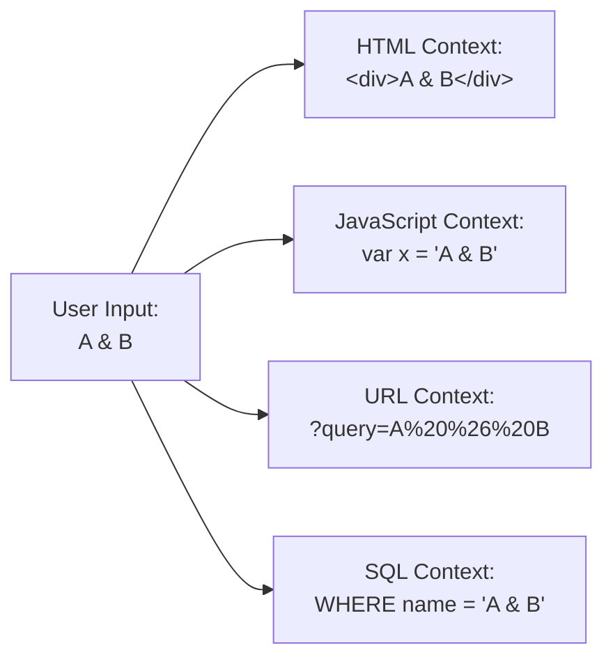

<Hero title="Input Validation & Output Encoding" subtitle="Prevent injection attacks through validation and encoding" imageAlt="validation illustration" size="large" />

## TL;DR

**Input Validation**: Check all user input. Accept only expected format, length, type. Reject or sanitize unexpected. **Output Encoding**: Encode data based on context (HTML, JavaScript, URL, SQL). Prevent injection by making special characters literal. Use whitelist validation (accept known-good) rather than blacklist (reject known-bad). Encode output based on where it's used.

## Learning Objectives

- Implement whitelist-based input validation
- Distinguish validation from sanitization
- Apply context-appropriate encoding (HTML, JS, URL)
- Prevent injection attacks through defense in depth
- Design validation in API contracts

## Motivating Scenario

A user enters `<script>alert('XSS')</script>` in a comment field. Without validation and encoding:
1. App stores the raw string in database
2. Page retrieves and displays the string
3. Browser parses the `<script>` tag and executes JavaScript
4. Attacker's script runs, steals session tokens, redirects user to phishing site

With proper validation and encoding:
1. Input validation rejects HTML-like strings (if not expected)
2. Output encoding converts `<` to `&lt;`, `>` to `&gt;`
3. Browser displays literal text: `&lt;script&gt;alert('XSS')&lt;/script&gt;`
4. No code execution, user sees the string as-is

Real-world impact: Cross-site scripting (XSS) is #3 in OWASP Top 10, leads to credential theft, malware distribution, account takeover.

## Core Concepts

### Validation vs Sanitization vs Encoding

<Vs items={[
{
    label: "Validation (Accept/Reject)",
    points: [
      "Check input against whitelist",
      "Reject if doesn't match",
      "Example: email must match pattern",
      "Early defense (client and server)",
      "Best approach"
    ]
  },
{
    label: "Sanitization (Clean)",
    points: [
      "Remove dangerous parts",
      "Modify input to safe version",
      "Example: strip HTML tags",
      "Can be error-prone",
      "Secondary defense"
    ]
  }
]} />

### Encoding (Context-Dependent)

Context matters. The same data needs different encoding depending on where it's used:

<Figure caption="Encoding depends on output context, not input.">

</Figure>

<Tabs>
<TabItem value="html" label="HTML Context">

```
HTML Context: <div>USER_INPUT</div>
Encode:
  < → &lt;
  > → &gt;
  & → &amp;
  " → &quot;
  ' → &#x27;

Example: "A & B" → "A &amp; B"
Example: "<script>" → "&lt;script&gt;"
```

</TabItem>
<TabItem value="javascript" label="JavaScript Context">

```
JavaScript Context: <script>var x = "USER_INPUT"</script>
Encode:
  " → \"
  \ → \\
  / → \/
  newline → \n
  tab → \t

Example: `A"B` → `A\"B`
Example: `A\B` → `A\\B`

Note: Never eval() or innerHTML with user input!
```

</TabItem>
<TabItem value="url" label="URL Context">

```
URL Context: <a href="?q=USER_INPUT">
Encode:
  space → %20
  & → %26
  = → %3D
  # → %23

Example: "hello world" → "hello%20world"
Example: "user&admin" → "user%26admin"

Use: encodeURIComponent() in JavaScript
```

</TabItem>
<TabItem value="sql" label="SQL Context">

```
SQL Context: SELECT * FROM users WHERE name='USER_INPUT'
Best Practice: Use parameterized queries!

Bad: SELECT * FROM users WHERE name='" + user_input + "'"
Good: SELECT * FROM users WHERE name=?
      (database driver handles encoding)

If must encode: ' → ''
Example: O'Brien → O''Brien
But still: Parameterized queries are safer!
```

</TabItem>
</Tabs>

## Practical Examples

<Tabs>
<TabItem value="validation_patterns" label="Input Validation Patterns">

```javascript
// Whitelist-based validation (GOOD)
function validateEmail(email) {
  // Accept only known-good format
  const pattern = /^[a-zA-Z0-9._%+-]+@[a-zA-Z0-9.-]+\.[a-zA-Z]{2,}$/;
  return pattern.test(email);
}

function validateUsername(username) {
  // Alphanumeric and underscores, 3-20 chars
  return /^[a-zA-Z0-9_]{3,20}$/.test(username);
}

function validatePostalCode(code) {
  // US postal codes: 5 digits or 5+4
  return /^\d{5}(-\d{4})?$/.test(code);
}

// Blacklist validation (BAD - avoid this)
function validateEmailBad(email) {
  // Try to reject known-bad patterns
  // Attackers bypass with encoding, alternate formats
  if (email.includes('<')) return false;
  if (email.includes('>')) return false;
  return true;  // Too permissive!
}

// Server-side validation (always do this!)
app.post('/register', (req, res) => {
  const email = req.body.email;

  // Validate on server, not just client
  if (!validateEmail(email)) {
    return res.status(400).json({ error: 'Invalid email' });
  }

  // Safe to use email
  createUser(email);
});
```

</TabItem>
<TabItem value="encoding_libs" label="Output Encoding (Libraries)">

```javascript
// Use libraries! Don't write your own encoding.

// HTML Encode - Use DOMPurify or similar
const DOMPurify = require('isomorphic-dompurify');

const userComment = '';
const safe = DOMPurify.sanitize(userComment);
// Result:   (onerror removed)

// Template engines handle encoding automatically
// EJS example:
// <div><%= userComment %></div>
// Automatically HTML-encodes userComment

// JavaScript Encode - Use libraries
function jsEscape(str) {
  return JSON.stringify(str);  // Safe JSON encoding
  // Or: str.replace(/[\\"']/g, '\\$&')
}

// URL Encode - Built-in
const encoded = encodeURIComponent(userInput);

// SQL - Use parameterized queries (driver handles encoding)
db.query(
  'SELECT * FROM users WHERE email = ?',
  [userInput],  // Driver encodes this
  (err, rows) => { /* ... */ }
);
```

</TabItem>
<TabItem value="defense_in_depth" label="Defense-in-Depth">

```javascript
// Combine validation + encoding + CSP

// 1. Input Validation
function validateAndSanitize(input) {
  if (!input || typeof input !== 'string') return null;
  if (input.length > 1000) return null;  // Length limit

  const pattern = /^[a-zA-Z0-9\s.,!?'-]*$/;
  if (!pattern.test(input)) return null;  // Whitelist pattern

  return input.trim();
}

// 2. Output Encoding
function renderSafely(userInput) {
  const safe = DOMPurify.sanitize(userInput);
  return safe;  // HTML-encoded
}

// 3. Content Security Policy (CSP)
// Response header: Content-Security-Policy:
//   default-src 'self';
//   script-src 'self';
//   style-src 'self' 'unsafe-inline';
//   img-src 'self' data: https:;
// This prevents inline script execution even if XSS slips through

// 4. HttpOnly Cookies
res.cookie('session', token, {
  httpOnly: true,    // Can't access from JavaScript
  secure: true,      // HTTPS only
  sameSite: 'Strict' // CSRF protection
});
```

</TabItem>
</Tabs>

## Patterns and Pitfalls

<Showcase sections={[
  {
    label: "Blacklist Validation Pitfall",
    body: "Try to reject known-bad patterns (e.g., reject '<script>'). Attackers bypass with HTML encoding, case variation, or alternate syntax."
  },
  {
    label: "Whitelist Validation Pattern",
    body: "Accept only known-good format (e.g., accept email matching regex). Simpler, safer, doesn't require knowing all attacks."
  },
  {
    label: "Inconsistent Encoding Pitfall",
    body: "Encode for HTML context but not JavaScript context. Same data, different output locations, needs different encoding."
  },
  {
    label: "Context-Aware Encoding Pattern",
    body: "Determine output context (HTML, JS, URL, SQL) and encode accordingly. Use libraries, not custom encoding."
  },
  {
    label: "Client-Only Validation Pitfall",
    body: "Validate on client for UX, but attacker can bypass client-side checks. Real attack happens server-side."
  },
  {
    label: "Defense-in-Depth Pattern",
    body: "Validate input + encode output + use CSP + parameterized queries + HttpOnly cookies. Multiple layers."
  }
]} />

## Self-Check

- What's the difference between validation and encoding?
- Why doesn't blacklist validation work against injections?
- If data is HTML-encoded, is it safe to use in JavaScript context?
- Why do you need different encoding for different output contexts?
- What's the purpose of Content Security Policy (CSP)?

## Design Review Checklist

<Checklist items={[
  "All user input validated against whitelist (not blacklist)?",
  "Validation on server-side (not just client)?",
  "Output encoded based on context (HTML, JS, URL, SQL)?",
  "Parameterized queries used for database access?",
  "Input length limits enforced?",
  "Special characters handled safely?",
  "APIs document validation rules?",
  "HTML sanitization used for user-generated HTML (e.g., comments)?",
  "No dangerous functions used (eval, innerHTML, document.write)?",
  "CSP header configured?",
  "HttpOnly and Secure flags on cookies?",
  "Tests verify validation and encoding behavior?",
  "Developers trained on injection attacks?"
]} />

## Real-World Breach Examples

### Case Study 1: Yahoo Stored XSS (2013)

**Vulnerability**: User could inject JavaScript in profile
**Impact**: 3000 accounts compromised before patched
**Root Cause**: No output encoding in profile display

**Fix**: HTML-encode all user-generated content before display

### Case Study 2: PayPal SQL Injection (2002)

**Vulnerability**: Login form allowed SQL injection
**Impact**: Access to all user accounts
**Root Cause**: String concatenation instead of parameterized queries

**Fix**: Parameterized queries prevent injection entirely

### Case Study 3: Target Breach (2013)

**Vulnerability**: Malicious JavaScript injected into checkout
**Impact**: 40M credit cards stolen
**Root Cause**: Third-party vendor account compromised, injected JS

**Fix**: Content Security Policy (CSP) would have blocked injected script

## Next Steps

1. **Audit current code** — Identify all user input points (forms, APIs, uploads, URLs)
2. **Implement whitelist validation** — Define expected format for each input
3. **Use encoding libraries** — DOMPurify, OWASP Encoder, database drivers (don't write own)
4. **Implement CSP** — Restrict inline scripts, limit external sources
5. **Test injection attacks** — Manually try XSS, SQL injection, command injection payloads
6. **Security training** — Ensure team understands context-aware encoding
7. **Automated testing** — Use SAST tools (SonarQube, Snyk) to catch validation gaps

## References

- <a href="https://cheatsheetseries.owasp.org/cheatsheets/Input_Validation_Cheat_Sheet.html" target="_blank" rel="nofollow noopener noreferrer">OWASP Input Validation Cheat Sheet ↗</a>
- <a href="https://cheatsheetseries.owasp.org/cheatsheets/Cross_Site_Scripting_Prevention_Cheat_Sheet.html" target="_blank" rel="nofollow noopener noreferrer">OWASP XSS Prevention Cheat Sheet ↗</a>
- <a href="https://owasp.org/www-community/attacks/xss/" target="_blank" rel="nofollow noopener noreferrer">OWASP: Cross Site Scripting (XSS) ↗</a>
- <a href="https://developer.mozilla.org/en-US/docs/Web/HTTP/CSP" target="_blank" rel="nofollow noopener noreferrer">MDN: Content Security Policy ↗</a>
- OWASP Top 10 vulnerability analysis ↗
