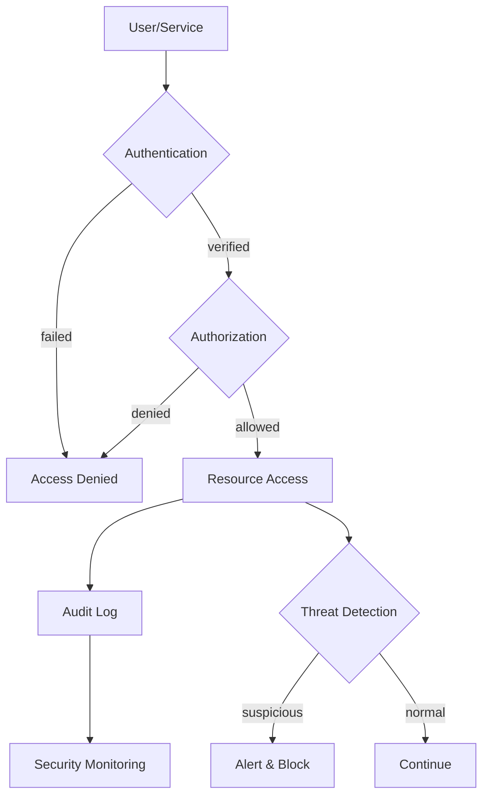

## What this is

The fundamental security principles and practices for designing systems that resist attack and protect sensitive data. It covers identity verification, access control, threat analysis, zero trust principles, and secrets management. Essential when handling user data, financial transactions, or operating in regulated environments where security breaches have legal, financial, or reputational consequences.

## When to use it

- Systems handling personally identifiable information, financial data, or regulated industry requirements (Payment Card Industry Data Security Standard (PCI DSS), Health Insurance Portability and Accountability Act (HIPAA), General Data Protection Regulation (GDPR)).
- Multi-tenant applications where tenant isolation and data separation prevent unauthorized access.
- Distributed systems where service-to-service communication requires authentication and authorization.
- Public-facing applications exposed to internet-scale attack vectors (credential stuffing, injection attacks, distributed denial of service).
- High-value targets where sophisticated threat actors justify advanced persistent threat modeling.
- Organizations adopting cloud infrastructure where shared responsibility models require explicit security design.

## When not to

- Internal tools with well-understood user bases and no sensitive data exposure.
- Proof-of-concept applications where security requirements remain undefined or low-priority.
- Simple applications with basic authentication needs that benefit from mature platform solutions.
- Early-stage products where rapid iteration outweighs security overhead, though foundational practices still apply.

## Core decisions

- Identity provider choice: centralized Identity and Access Management (IAM) vs. federated identity vs. custom authentication based on integration and compliance needs.
- Access control model: Role-Based Access Control (RBAC) vs. Attribute-Based Access Control (ABAC) vs. relationship-based permissions matched to authorization complexity.
- Trust boundaries: network perimeter security vs. zero trust architecture where every request requires verification regardless of source.
- Threat modeling scope: systematic analysis of attack vectors, threat actors, and mitigation strategies proportional to risk exposure.
- Secrets management: centralized vault vs. distributed secrets vs. short-lived credentials with automatic rotation policies.
- Trade-off: security depth vs. operational complexity — each security layer adds overhead that must balance with actual risk reduction.

## Mental model

_Figure: Security layers working together from identity verification through threat detection and audit._

## What to read next

- [Control access with Identity and Access Management](/docs/security/identity-and-access)
- [Identify risks with Threat Modeling processes](/docs/security/threat-modeling)
- [Build resilient defenses with Zero Trust Architecture](/docs/security/zero-trust)
- [Protect sensitive data with Secrets and Keys Management](/docs/security/secrets-keys)

:::note
Orientation: Identity and Access Management provides the foundation for all other security controls. Zero Trust Architecture represents the modern approach to perimeter security.
:::
