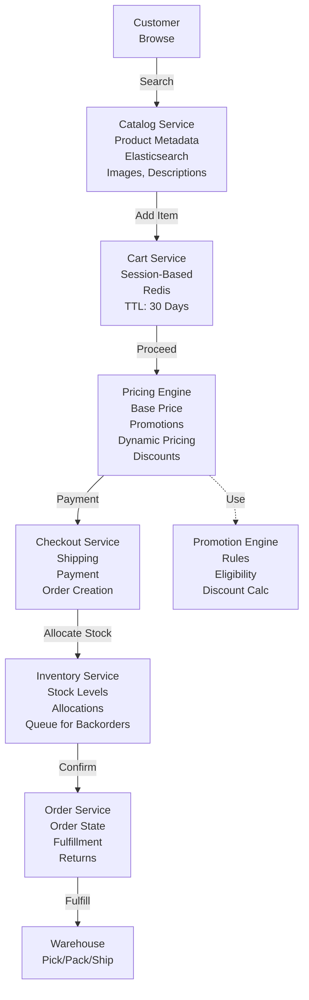

<Hero title="E-Commerce: Catalog, Order, Checkout, and Promotions" subtitle="Scaling product catalogs, managing inventory, and optimizing checkout conversion" imageAlt="E-commerce system with catalog, cart, checkout, and order fulfillment" size="large" />

## TL;DR

E-commerce orchestrates **products, inventory, pricing, orders, and fulfillment**. **Catalog** stores product metadata (images, descriptions, prices) with fast search (Elasticsearch). **Shopping cart** is session-based (Redis), lost if user doesn't convert (expected). **Checkout** flow: add to cart → shipping → payment → confirmation. **Inventory** is critical: prevent overselling (allocate when order placed, not just decremented). **Promotions** apply discounts (codes, volume, membership) calculated at checkout. **Dynamic pricing** adjusts prices based on demand, competitor prices, inventory levels.

## Learning Objectives

- Design catalog for search and personalization
- Manage shopping cart consistency and abandonment
- Implement checkout flows with payment integration
- Allocate inventory to prevent overselling
- Design promotion engines for discounts and offers
- Implement dynamic pricing strategies

## Motivating Scenario

Black Friday flash sale: 10 million visitors, 1M items in stock. If you decrement inventory immediately per add-to-cart, inventory exhausts before customers checkout (cart abandonment, angry users). Solution: allocate inventory only when order placed, hold for 15 minutes. Checkout at 10 items/second, 100,000 concurrent carts. If one service processes both catalog searches and inventory allocation, searches slow down during peak traffic. Solution: microservices (catalog, inventory, orders separate) with eventual consistency.

## Core Concepts

E-commerce systems balance **speed (user experience), correctness (inventory), and scalability**:

**Catalog**: Product metadata (SKU, name, price, images). Searchable, filterable, fast.

**Shopping Cart**: Temporary session data. Expected to be abandoned. TTL-based cleanup.

**Checkout**: Multi-step flow (cart → shipping → payment → order). Stateful, must survive failures.

**Inventory Allocation**: When order placed, reserve stock. Prevents overselling. 15-minute timeout for abandoned orders.

**Promotions**: Discount codes (SAVE10), volume discounts (buy 3, get 10% off), bundle deals.

**Dynamic Pricing**: Adjust prices based on demand (high traffic = higher price), stock levels (low stock = premium).

**Order Fulfillment**: Order placed → Pick → Pack → Ship → Delivered.

<Figure caption="E-commerce platform: Catalog, cart, checkout, inventory, fulfillment">

</Figure>

### Key Concepts

**Overselling**: More items sold than stock. Customer angry, refunds increase. Solution: allocate on order, not on cart.

**Cart Abandonment**: Customers add items, don't checkout. ~70% abandonment rate normal. Can recover with email.

**Inventory Holds**: When order placed, hold inventory for 15 minutes. If payment fails, release back.

**Backorders**: Customer can pre-order out-of-stock item. Notified when available.

**Return Merchandise Authorization (RMA)**: Return process. Verify receipt, check condition, refund/replace.

## Patterns and Pitfalls

<Showcase title="Patterns and Pitfalls" sections={[
  {
    title: "Pitfall: Overselling",
    description: "Two customers add last item to cart. Both check out simultaneously. Both get it (inventory goes negative).",
    fix: "Allocate inventory on order placement, not cart add. Hold for 15 minutes. Release if payment fails."
  },
  {
    title: "Pitfall: Slow Checkout",
    description: "Product search and inventory both hit same database. During peak, searches slow down, checkout times out.",
    fix: "Separate services: catalog (read-heavy, searchable), inventory (write-heavy, allocated). Eventual consistency."
  },
  {
    title: "Pattern: Promotion Engine",
    description: "Rules-based: if user spent > $100 in last 30 days, eligible for VIP discount.",
    fix: "Rules engine (Drools, Easy Rules) evaluates eligibility. Calculate discount at checkout time."
  },
  {
    title: "Pitfall: Cart Data Loss",
    description: "Redis instance crashes. Customer's cart (50 items, 4 hours of browsing) disappears.",
    fix: "Cart is ephemeral (OK to lose), but back up to database for account recovery. TTL 30 days."
  },
  {
    title: "Pattern: Dynamic Pricing",
    description: "Adjust prices based on demand, inventory, time of day.",
    fix: "Price = base + demand_factor + inventory_factor. Cached, updated hourly."
  }
]} />

## Design Review Checklist

<Checklist items={[
  "Does catalog support full-text search efficiently?",
  "Is shopping cart managed separately from inventory (eventual consistency)?",
  "Does checkout flow survive payment failures gracefully?",
  "Is inventory allocated on order, not cart add?",
  "Are inventory holds released after timeout?",
  "Does promotion engine support complex rules?",
  "Can you generate revenue reports by promotion?",
  "Is dynamic pricing cached and updated regularly?",
  "Can customers track orders and returns?",
  "Are failed orders (payment declined) cleaned up?"
]} />

## Self-Check

1. **Why not decrement inventory on cart add?** Customers add items, abandon cart. Inventory would be locked up, low conversion.
2. **How long to hold inventory?** Typically 15 minutes. Balance: enough time to complete checkout, not too long.
3. **What happens if payment fails after inventory allocated?** Release inventory hold back to available. Customer can retry.

:::info
**One Takeaway**: E-commerce is a race between inventory and time. Optimize for conversion (smooth checkout), not perfection (overselling is worse than slight inaccuracy).

:::

## Next Steps

- **Catalog Search**: Elasticsearch, Algolia, MeiliSearch
- **Inventory**: Shopify, SAP, custom allocation systems
- **Promotions**: Coupon engines, loyalty platforms
- **Fulfillment**: Shipment tracking, warehouse management
- **Analytics**: Revenue by product/category, conversion funnels

## Complete Checkout Flow Example

```python
class CheckoutService:
    def create_order(self, cart_id: str, shipping_addr: Address,
                     payment_method: Card) -> Order:
        """Complete checkout process with inventory allocation"""

        # Step 1: Validate cart not expired (30 min timeout)
        cart = self.cart_service.get_cart(cart_id)
        if not cart or cart.age > 30_minutes:
            raise CartExpired("Cart expired, please re-add items")

        # Step 2: Check inventory availability
        for item in cart.items:
            available = self.inventory_service.check_available(
                item.sku, item.quantity
            )
            if not available:
                raise OutOfStock(f"Only {available} of {item.sku} left")

        # Step 3: Reserve inventory (allocate)
        allocation_id = self.inventory_service.allocate(
            items=cart.items,
            timeout_minutes=15  # Release if not paid within 15 min
        )

        # Step 4: Calculate final price
        subtotal = sum(i.price * i.quantity for i in cart.items)
        shipping = self.calculate_shipping(shipping_addr, cart.items)
        discount = self.promotion_service.calculate_discount(
            user_id=cart.user_id,
            items=cart.items,
            promo_code=cart.promo_code
        )
        tax = self.calculate_tax(subtotal + shipping - discount, shipping_addr)
        total = subtotal + shipping + tax - discount

        # Step 5: Process payment
        try:
            transaction = self.payment_service.charge(
                customer_id=cart.user_id,
                amount=total,
                card=payment_method,
                idempotency_key=f"order_{cart_id}_{datetime.now().timestamp()}"
            )
        except PaymentFailed as e:
            # Release inventory hold
            self.inventory_service.release_allocation(allocation_id)
            raise

        # Step 6: Create order record
        order = Order(
            id=str(uuid4()),
            user_id=cart.user_id,
            items=cart.items,
            subtotal=subtotal,
            shipping=shipping,
            discount=discount,
            tax=tax,
            total=total,
            shipping_address=shipping_addr,
            allocation_id=allocation_id,
            transaction_id=transaction.id,
            status='confirmed'
        )

        # Step 7: Persist order
        self.db.save(order)

        # Step 8: Emit event (triggers fulfillment, email, etc.)
        self.event_bus.publish('order_created', {
            'order_id': order.id,
            'user_id': order.user_id,
            'total': order.total
        })

        # Step 9: Clear cart
        self.cart_service.delete(cart_id)

        return order
```

## Inventory Allocation Strategy

```python
class InventoryService:
    def allocate(self, items: List[CartItem], timeout_minutes: int) -> str:
        """Allocate inventory for order (reserve stock)"""
        allocation_id = str(uuid4())
        expiry = datetime.now() + timedelta(minutes=timeout_minutes)

        for item in items:
            # Atomically decrement available inventory
            updated = self.db.execute(
                """
                UPDATE inventory
                SET available = available - ?
                WHERE sku = ? AND available >= ?
                """,
                item.quantity, item.sku, item.quantity
            )

            if updated == 0:
                # Not enough inventory
                # Rollback previous allocations
                self.release_allocation(allocation_id)
                raise OutOfStock(f"{item.sku}")

            # Record allocation (for timeout release)
            self.db.execute(
                """
                INSERT INTO allocations (id, sku, quantity, expires_at)
                VALUES (?, ?, ?, ?)
                """,
                allocation_id, item.sku, item.quantity, expiry
            )

        return allocation_id

    def release_allocation(self, allocation_id: str):
        """Release inventory hold (on payment failure or timeout)"""
        allocations = self.db.query(
            "SELECT * FROM allocations WHERE id = ?",
            allocation_id
        )

        for alloc in allocations:
            # Add inventory back
            self.db.execute(
                "UPDATE inventory SET available = available + ? WHERE sku = ?",
                alloc.quantity, alloc.sku
            )

            # Mark released
            self.db.execute(
                "UPDATE allocations SET released_at = NOW() WHERE id = ?",
                allocation_id
            )

    def cleanup_expired_allocations(self):
        """Periodic job to release timed-out allocations"""
        # Runs every minute
        expired = self.db.query(
            "SELECT * FROM allocations WHERE expires_at < NOW() AND released_at IS NULL"
        )

        for alloc in expired:
            self.release_allocation(alloc.id)
            logger.info(f"Released expired allocation {alloc.id}")
```

## Real-World Optimization Cases

### Case 1: Flash Sale Optimization

```python
class FlashSaleService:
    def handle_flash_sale(self, sale_id: str, inventory_qty: int):
        """Manage inventory during high-traffic flash sales"""

        # Strategy: No cart-based inventory drain
        # Instead: Allocate only when order placed
        # This prevents abandoned carts from locking inventory

        # Customer journey:
        # 1. Browse catalog (no inventory decrement)
        # 2. Add to cart (no inventory decrement)
        # 3. Checkout → Allocate inventory → Process payment

        # Metrics:
        # Without optimization: 10% checkout rate
        #   10M visitors, 1M items in stock
        #   1M add-to-carts (if all allocate, inventory exhausted)
        #   100K checkouts (all successful)
        #   9M carts abandoned (inventory wasted)

        # With optimization: 10% checkout rate
        #   10M visitors, 1M items in stock
        #   1M add-to-carts (NO inventory decrement)
        #   100K checkouts
        #   100K allocations (only during checkout)
        #   Result: Inventory allocated efficiently

        # Impact: 1M → 100K allocations = 90% reduction in wasted inventory holds
```

### Case 2: Dynamic Pricing During Surge

```python
class DynamicPricingService:
    def calculate_price(self, item_id: str, base_price: float) -> float:
        """Adjust price based on demand"""

        # Get current demand
        recent_views = self.analytics.count_views_last_hour(item_id)
        stock_level = self.inventory.get_available(item_id)

        # Pricing formula
        demand_factor = 1.0 + (recent_views / 1000) * 0.2  # Up to 20% premium
        scarcity_factor = 1.0 if stock_level > 100 else 1.2  # 20% premium if low stock

        final_price = base_price * demand_factor * scarcity_factor

        # Constraints: Don't exceed max price
        final_price = min(final_price, base_price * 1.5)  # Cap at 50% increase

        return final_price

        # Example:
        # Item: Widget
        # Base price: $10
        # Recent views: 5,000 (in last hour)
        # Stock: 50 units
        #
        # demand_factor = 1 + (5000 / 1000) * 0.2 = 1 + 1.0 = 2.0 (❌ too much, cap to 1.5)
        # scarcity_factor = 1.2 (low stock)
        # final_price = $10 * 1.5 * 1.2 = $18 (capped at 50% above base)
        #
        # Result: Widget now $18 (instead of $10)
        # More expensive → fewer sales, inventory lasts longer → better availability
```

## Next Steps

- **Catalog Search**: Implement Elasticsearch for fast product discovery
- **Inventory**: Build allocation system with timeout-based release
- **Promotions**: Rules engine (Drools) for complex discount logic
- **Fulfillment**: Integrate with warehouse management systems (WMS)
- **Analytics**: Track conversion funnel, abandonment rate, revenue per visitor
- **Mobile**: Optimize checkout for mobile (biggest source of abandonment)

## References

- <a href="https://www.shopify.com/enterprise/enterprise-ecommerce-infrastructure" target="_blank" rel="nofollow noopener noreferrer">Shopify E-Commerce Infrastructure ↗</a>
- <a href="https://aws.amazon.com/solutions/implementations/ecommerce-platform/" target="_blank" rel="nofollow noopener noreferrer">AWS E-Commerce Platform ↗</a>
- <a href="https://www.elastic.co/use-cases/ecommerce" target="_blank" rel="nofollow noopener noreferrer">Elasticsearch for E-Commerce ↗</a>
- <a href="https://www.drools.org/docs/release/7.58.0.Final/drools-docs/html_single/" target="_blank" rel="nofollow noopener noreferrer">Drools Rules Engine ↗</a>
- Sharda, R. (2019). "E-Commerce Architecture and Scalability." ↗️
- Shopify Engineering Blog: Inventory and scale. ↗️
