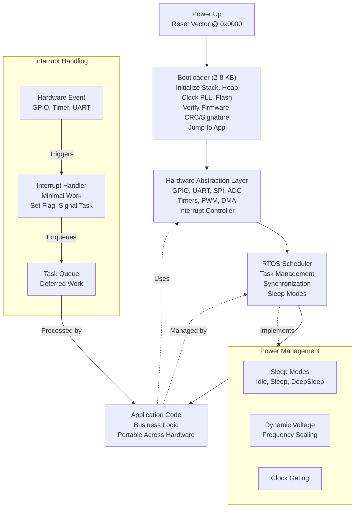

<Hero title="Embedded and Firmware: Resource Constraints and Hardware Abstraction" subtitle="Managing bare-metal constraints, bootloaders, power management, and hardware portability" imageAlt="Embedded system with bootloader, HAL, and peripheral drivers" size="large" />

## TL;DR

Embedded systems manage **extreme constraints**: 32KB RAM, 256KB flash (typical microcontroller), 8-80MHz CPU, milliwatt to watt power budgets. **Bare-metal** (no OS) minimizes overhead (~200 bytes) but requires hand-crafted event loops. **RTOS** (FreeRTOS, Zephyr) adds scheduling and concurrency, but consumes ~5-20KB. **Hardware Abstraction Layer (HAL)** isolates board-specific code from application (GPIO, UART, SPI). **Bootloaders** initialize hardware, verify firmware signatures, enable OTA updates. **Power management** (sleep modes, dynamic voltage scaling) critical for battery life (weeks vs days).

## Learning Objectives

- Design firmware for extreme resource constraints
- Choose bare-metal vs RTOS architecture
- Implement hardware abstraction layers for portability
- Understand bootloader design and OTA updates
- Optimize for power consumption and battery life
- Master interrupt-driven, event-based execution
- Debug embedded systems with limited tools

## Motivating Scenario

You're designing a wearable heart rate monitor: CR2032 battery (30 mAh, 1.5V), ARM Cortex-M0+ (32KB RAM, 256KB flash), must last 7 days (168 hours). Continuous polling drains battery in 8 hours. Solution: interrupt-driven (sleep 99% of time, wake on sensor data), RTOS for task scheduling with sleep hooks, dynamic power management (scale voltage/frequency), HAL to abstract sensor I/O (portable across chip revisions). Result: 7-day battery life, firmware updates over Bluetooth, works on multiple hardware revisions.

## Core Concepts

Embedded systems optimize for **minimal resource footprint** and **deterministic, real-time behavior**:

**Bare-Metal**: No OS, direct hardware control. Minimal overhead, maximum complexity, requires hand-crafted main loop.

**RTOS** (Real-Time Operating System): Scheduler, multitasking, inter-task communication, deterministic timing. ~5-20KB overhead, enables structured concurrency.

**HAL** (Hardware Abstraction Layer): Interface between hardware (GPIO, UART, SPI, ADC) and application. Enables hardware portability and modularity.

**Bootloader**: First code to run (from flash address 0x0000). Initializes RAM, stack, clock, verifies firmware signature, jumps to application.

**Interrupt Handlers** (ISRs): Respond immediately to hardware events (button, timer, UART data). Keep minimal; defer work to tasks or main loop.

**Power Modes**: Sleep (CPU off, timers/interrupts active), idle (waiting for interrupt), active (full CPU). Switch based on workload to extend battery.

<Figure caption="Embedded system layers: Bootloader, HAL, RTOS, Application">



</Figure>

### Key Terminology

**Stack vs Heap**: Stack (automatic, fast, limited, grows downward), heap (malloc, slow, fragmentation). Embedded systems minimize heap; prefer static allocation.

**ISR** (Interrupt Service Routine): Hardware-triggered handler. Must be fast (microseconds), re-entrant. Defer heavy work to tasks.

**Context Switch**: Saving CPU state (registers, program counter), switching to another task. Overhead ~100-500 cycles. Minimize frequency for real-time systems.

**Watchdog Timer**: Hardware timer that resets system if firmware doesn't "pet" it periodically. Prevents infinite loops/hangs.

**Memory Alignment**: 32-bit CPU accesses aligned addresses (4-byte boundaries) faster. Misaligned access is slower or trapped.

**Linker Script**: Defines memory layout: code (flash), initialized data, zero-initialized data (BSS), heap, stack.

## Bare-Metal vs RTOS Comparison

<Vs items={[
{
    label: "Bare-Metal",
    points: [
      "No operating system, direct hardware control",
      "Super-linear interrupt handlers, tight timing",
      "Minimal overhead (~200 bytes)",
      "Complex event loop, state machine required",
      "Difficult to manage multiple concurrent tasks",
      "Best for: Simple sensors, single-task devices, ultra-low power",
      "Example: Smart button, basic thermometer"
    ]
  },
{
    label: "RTOS (FreeRTOS, Zephyr)",
    points: [
      "Scheduler, multitasking, synchronization primitives",
      "Task-based concurrency (queues, semaphores, mutexes)",
      "~5-20KB overhead, adds ~100-500 cycles per switch",
      "Cleaner code, easier to manage multiple tasks",
      "Deterministic timing (priority-based scheduling)",
      "Best for: Multi-sensor devices, complex logic, real-time requirements",
      "Example: Wearable, IoT gateway, drone controller"
    ]
  }
]} />

## Practical Examples

<Tabs>
  <TabItem value="bare-metal" label="Bare-Metal C (ARM Cortex-M0)">
```c
// Minimal bare-metal firmware for ARM Cortex-M0+
// Heart rate monitor with BLE module

#include <stdint.h>

// Hardware definitions (from datasheet)
#define SYST_RVR 0xE000E014  // SysTick Reload Value
#define SYST_CVR 0xE000E018  // SysTick Current Value
#define SYST_CSR 0xE000E010  // SysTick Control/Status

// Sensor reading structure
typedef struct {
    uint16_t heart_rate;
    uint16_t temperature;
    uint32_t timestamp;
} SensorData;

// Global state (no heap, static memory)
static SensorData sensor_data = {0, 0, 0};
static uint32_t tick_count = 0;
static uint8_t ble_buffer[64];
static uint8_t ble_index = 0;

// Linker-provided symbols
extern uint32_t _etext;
extern uint32_t _sdata;
extern uint32_t _edata;
extern uint32_t _sbss;
extern uint32_t _ebss;

// System initialization
void SystemInit(void) {
    // Enable clock to peripherals
    // Configure oscillator/PLL
    // Set up stack pointer (done by bootloader)
}

// Reset handler (entry point after bootloader)
void Reset_Handler(void) {
    // Copy initialized data from flash to RAM
    for (uint32_t *src = &_etext, *dst = &_sdata; dst < &_edata; ) {
        *dst++ = *src++;
    }
    
    // Zero-initialize BSS section
    for (uint32_t *dst = &_sbss; dst < &_ebss; ) {
        *dst++ = 0;
    }
    
    // Initialize system
    SystemInit();
    
    // Configure SysTick (1 ms tick)
    uint32_t ticks = 64000;  // 64 MHz / 1000
    *(volatile uint32_t *)SYST_RVR = ticks - 1;
    *(volatile uint32_t *)SYST_CSR = 0x07;  // Enable SysTick, interrupt
    
    // Call main
    main();
    
    // Hang if main returns
    while (1);
}

// SysTick interrupt handler (1 ms)
void SysTick_Handler(void) {
    tick_count++;
    
    // Every 100 ms: read sensors
    if (tick_count % 100 == 0) {
        sensor_data.heart_rate = read_heart_rate();
        sensor_data.temperature = read_temperature();
        sensor_data.timestamp = tick_count;
    }
    
    // Every 1 second: transmit BLE packet
    if (tick_count % 1000 == 0) {
        ble_transmit(&sensor_data);
    }
}

// UART interrupt handler
void UART0_Handler(void) {
    uint8_t c = read_uart_char();
    
    // Store in ringbuffer
    if (ble_index < sizeof(ble_buffer)) {
        ble_buffer[ble_index++] = c;
        
        if (c == '\n') {
            process_ble_command(ble_buffer, ble_index);
            ble_index = 0;
        }
    }
}

// Main event loop
int main(void) {
    while (1) {
        // Sleep until interrupt (wakes on SysTick or UART)
        asm("wfi");  // Wait for interrupt
        
        // Process any deferred work
        // (in bare-metal, most work done in ISRs)
    }
    return 0;
}

// HAL functions (hardware abstraction)
uint16_t read_heart_rate(void) {
    // Read ADC channel 0 (PPG sensor)
    // Apply digital filter
    // Return BPM
    return 0;
}

uint16_t read_temperature(void) {
    // Read temperature sensor (I2C)
    return 0;
}

void ble_transmit(SensorData *data) {
    // Send data packet over UART to BLE module
}

void process_ble_command(uint8_t *cmd, uint8_t len) {
    // Handle incoming BLE commands (reset, firmware update, etc.)
}
```

**Characteristics**:

<div>

- All timing under ISR control (tick-driven)
- State machine in main loop
- No malloc (all static memory)
- Approximately 2 KB code size with minimal overhead
- Difficult to add new features because the event loop becomes complex

</div>

  </TabItem>

  <TabItem value="rtos-freertos" label="RTOS (FreeRTOS)">
```c
// FreeRTOS-based heart rate monitor firmware
// Cleaner, task-based architecture

#include "FreeRTOS.h"
#include "task.h"
#include "queue.h"
#include "timers.h"

typedef struct {
    uint16_t heart_rate;
    uint16_t temperature;
    uint32_t timestamp;
} SensorData;

// Global queues
static QueueHandle_t sensorQueue;
static QueueHandle_t bleQueue;

// Task prototypes
void sensor_task(void *param);
void ble_task(void *param);
void logging_task(void *param);

int main(void) {
    // Initialize hardware
    SystemInit();
    
    // Create queues
    sensorQueue = xQueueCreate(10, sizeof(SensorData));
    bleQueue = xQueueCreate(20, sizeof(uint8_t));
    
    // Create tasks
    xTaskCreate(sensor_task, "Sensor", 256, NULL, 2, NULL);
    xTaskCreate(ble_task, "BLE", 512, NULL, 1, NULL);
    xTaskCreate(logging_task, "Log", 256, NULL, 0, NULL);
    
    // Start scheduler
    vTaskStartScheduler();
    
    // Should never return
    while (1);
}

// Sensor task: reads sensors every 100 ms
void sensor_task(void *param) {
    (void)param;
    SensorData data;
    
    while (1) {
        // Block for 100 ms
        vTaskDelay(pdMS_TO_TICKS(100));
        
        // Read sensors
        data.heart_rate = read_heart_rate();
        data.temperature = read_temperature();
        data.timestamp = xTaskGetTickCount();
        
        // Send to queue (non-blocking)
        xQueueSend(sensorQueue, &data, 0);
    }
}

// BLE task: transmits data every 1 second
void ble_task(void *param) {
    (void)param;
    SensorData data;
    
    while (1) {
        // Wait for data from sensor queue (blocks until available)
        if (xQueueReceive(sensorQueue, &data, portMAX_DELAY)) {
            // Format and transmit packet
            uint8_t packet[32];
            format_ble_packet(&data, packet);
            ble_transmit(packet, 32);
        }
    }
}

// Logging task: low priority, runs when CPU is free
void logging_task(void *param) {
    (void)param;
    uint32_t last_log = 0;
    
    while (1) {
        // Check every second
        vTaskDelay(pdMS_TO_TICKS(1000));
        
        // Only log if not in sleep mode
        if (is_awake()) {
            log_system_stats();
        }
    }
}

// Timer callback: wakes system every 5 minutes for sync
void wakeup_callback(TimerHandle_t timer) {
    (void)timer;
    // Trigger full system wake-up
    set_wake_event();
}

// Power management hooks
void vApplicationIdleHook(void) {
    // Called when scheduler has no task to run
    // Enter sleep mode until interrupt
    power_enter_idle();
    asm("wfi");
}

// Interrupt handler (now simpler with RTOS)
void UART0_Handler(void) {
    BaseType_t xHigherPriorityTaskWoken = pdFALSE;
    
    uint8_t c = read_uart_char();
    xQueueSendFromISR(bleQueue, &c, &xHigherPriorityTaskWoken);
    
    // Context switch if higher priority task woken
    portYIELD_FROM_ISR(xHigherPriorityTaskWoken);
}

// HAL functions
uint16_t read_heart_rate(void) {
    return 72;  // Placeholder
}

uint16_t read_temperature(void) {
    return 9800;  // 98.00 C (fixed-point)
}

void ble_transmit(uint8_t *packet, uint16_t len) {
    // Send packet
}

void format_ble_packet(SensorData *data, uint8_t *packet) {
    // Pack data into BLE-compatible format
}

void log_system_stats(void) {
    // Log task stack usage, runtime, etc.
}

void power_enter_idle(void) {
    // Reconfigure clocks, disable unused peripherals
}

void set_wake_event(void) {
    // Configure peripherals for wake-up
}

int is_awake(void) {
    return 1;  // Placeholder
}
```

<div>

**Characteristics**:
- Task-based, queue-driven communication
- Scheduler handles timing, switching
- Clean separation of concerns
- ~15 KB code + ~10 KB RTOS
- Easy to extend with new tasks
- Context switch overhead (~500 cycles per switch)

</div>

  </TabItem>

  <TabItem value="hal-design" label="Hardware Abstraction Layer">
```c
// HAL: Abstracts hardware, enables portability
// Same application works on STM32, NRF52, etc.

// hal/gpio.h
#ifndef HAL_GPIO_H
#define HAL_GPIO_H

#include <stdint.h>

typedef enum {
    GPIO_MODE_INPUT = 0,
    GPIO_MODE_OUTPUT = 1,
    GPIO_MODE_ANALOG = 2
} GPIO_Mode;

typedef enum {
    GPIO_PULL_NONE = 0,
    GPIO_PULL_UP = 1,
    GPIO_PULL_DOWN = 2
} GPIO_Pull;

// Abstract GPIO configuration
void hal_gpio_configure(uint8_t port, uint8_t pin, GPIO_Mode mode, GPIO_Pull pull);
void hal_gpio_set(uint8_t port, uint8_t pin, uint8_t value);
uint8_t hal_gpio_get(uint8_t port, uint8_t pin);
void hal_gpio_toggle(uint8_t port, uint8_t pin);

#endif

// hal/uart.h
#ifndef HAL_UART_H
#define HAL_UART_H

typedef void (*uart_callback_t)(uint8_t);

void hal_uart_init(uint32_t baudrate);
void hal_uart_send(uint8_t *data, uint16_t len);
void hal_uart_set_callback(uart_callback_t callback);

#endif

// hal/adc.h
#ifndef HAL_ADC_H
#define HAL_ADC_H

typedef enum {
    ADC_8BIT = 8,
    ADC_10BIT = 10,
    ADC_12BIT = 12,
    ADC_14BIT = 14
} ADC_Resolution;

void hal_adc_init(ADC_Resolution res);
uint16_t hal_adc_read(uint8_t channel);

#endif

// ============================================
// Platform-specific implementations

// platforms/stm32l476/gpio.c
#include "hal/gpio.h"
#include "stm32l476xx.h"

// STM32L476 GPIO implementation
void hal_gpio_configure(uint8_t port, uint8_t pin, GPIO_Mode mode, GPIO_Pull pull) {
    GPIO_TypeDef *gpio = (GPIO_TypeDef *)(GPIOA_BASE + port * 0x400);
    
    // Configure mode
    gpio->MODER = (gpio->MODER & ~(3 << (pin * 2))) | (mode << (pin * 2));
    
    // Configure pull
    gpio->PUPDR = (gpio->PUPDR & ~(3 << (pin * 2))) | (pull << (pin * 2));
}

void hal_gpio_set(uint8_t port, uint8_t pin, uint8_t value) {
    GPIO_TypeDef *gpio = (GPIO_TypeDef *)(GPIOA_BASE + port * 0x400);
    if (value) {
        gpio->BSRR = (1 << pin);
    } else {
        gpio->BSRR = (1 << (pin + 16));
    }
}

// ... other STM32L476-specific implementations

// ============================================
// Nordic NRF52 implementation

// platforms/nrf52/gpio.c
#include "hal/gpio.h"
#include "nrf.h"

void hal_gpio_configure(uint8_t port, uint8_t pin, GPIO_Mode mode, GPIO_Pull pull) {
    uint32_t pin_number = (port << 5) | pin;
    nrf_gpio_cfg(pin_number, mode, pull, NRF_GPIO_PIN_NOPULL, NRF_GPIO_PIN_S0S1);
}

void hal_gpio_set(uint8_t port, uint8_t pin, uint8_t value) {
    uint32_t pin_number = (port << 5) | pin;
    if (value) {
        nrf_gpio_pin_set(pin_number);
    } else {
        nrf_gpio_pin_clear(pin_number);
    }
}

// ... other NRF52-specific implementations

// ============================================
// Application code (platform-independent)

// app/sensor.c
#include "hal/gpio.h"
#include "hal/adc.h"
#include "hal/uart.h"

void sensor_init(void) {
    // Works on any platform!
    hal_adc_init(ADC_12BIT);
    hal_gpio_configure(0, 13, GPIO_MODE_OUTPUT, GPIO_PULL_NONE);  // LED
    hal_uart_init(115200);
}

void sensor_read_and_transmit(void) {
    uint16_t value = hal_adc_read(0);
    uint8_t packet[4];
    packet[0] = (value >> 8) & 0xFF;
    packet[1] = value & 0xFF;
    hal_uart_send(packet, 2);
    
    hal_gpio_toggle(0, 13);  // Toggle LED
}
```

<div>

**Benefits of HAL**:
- Application code portable across platforms
- Platform changes isolated to HAL implementations
- Easier testing (can mock HAL)
- Clear hardware interface
- Reduces coupling to specific microcontroller

</div>

  </TabItem>

  <TabItem value="bootloader" label="Bootloader & OTA Updates">
```c
// Bootloader: First code to run from address 0x0000
// Responsibility: Init hardware, verify firmware, jump to app

#define FLASH_APP_START 0x00010000
#define FLASH_APP_SIZE  0xF0000      // 960 KB
#define FLASH_CRC_OFFSET (FLASH_APP_START + FLASH_APP_SIZE)

typedef struct {
    uint32_t crc32;
    uint32_t version;
    uint32_t timestamp;
    uint32_t reserved;
} FirmwareMetadata;

// Stack pointer and reset vector are at 0x0000-0x0007
extern uint32_t _app_stack_start;

int main(void) {
    // Minimal initialization
    SystemInit();
    configure_watchdog();
    
    // Check for bootloader entry (button held, etc.)
    if (should_enter_bootloader()) {
        bootloader_main();
    }
    
    // Verify firmware
    FirmwareMetadata *metadata = (FirmwareMetadata *)(FLASH_CRC_OFFSET);
    if (!verify_firmware_crc(metadata)) {
        // CRC failed - try rollback or enter recovery
        handle_firmware_corruption();
    }
    
    // Jump to application
    jump_to_app();
}

void jump_to_app(void) {
    // Get application entry point from app's vector table
    uint32_t *app_vector = (uint32_t *)FLASH_APP_START;
    uint32_t app_stack = app_vector[0];
    uint32_t app_entry = app_vector[1];
    
    // Set stack pointer
    asm("mov sp, %0" : : "r"(app_stack));
    
    // Jump to application reset handler
    ((void (*)(void))app_entry)();
}

// Bootloader: Firmware update via UART or BLE
void bootloader_main(void) {
    uint32_t bytes_received = 0;
    uint32_t total_size = 0;
    uint8_t *write_ptr = (uint8_t *)FLASH_APP_START;
    
    // Erase application flash
    flash_erase_range(FLASH_APP_START, FLASH_APP_SIZE);
    
    // Wait for firmware packet header (size, version, checksum)
    total_size = receive_firmware_header();
    
    // Receive firmware in 256-byte chunks
    while (bytes_received < total_size) {
        uint8_t chunk[256];
        uint16_t chunk_size = receive_packet(chunk, 256);
        
        // Write to flash
        flash_write(write_ptr, chunk, chunk_size);
        write_ptr += chunk_size;
        bytes_received += chunk_size;
        
        // Send ACK
        send_ack(bytes_received);
    }
    
    // Verify and store CRC
    uint32_t crc = calculate_crc32((uint8_t *)FLASH_APP_START, total_size);
    FirmwareMetadata *metadata = (FirmwareMetadata *)(FLASH_CRC_OFFSET);
    metadata->crc32 = crc;
    metadata->version = receive_version();
    metadata->timestamp = get_timestamp();
    
    send_ack_final();
    
    // Reboot into application
    delay_ms(100);
    soft_reset();
}

uint32_t verify_firmware_crc(FirmwareMetadata *metadata) {
    uint32_t calculated = calculate_crc32(
        (uint8_t *)FLASH_APP_START, 
        FLASH_APP_SIZE
    );
    return calculated == metadata->crc32;
}

uint32_t calculate_crc32(uint8_t *data, uint32_t len) {
    // CRC32 implementation
    uint32_t crc = 0xFFFFFFFF;
    for (uint32_t i = 0; i < len; i++) {
        crc ^= data[i];
        for (int j = 0; j < 8; j++) {
            if (crc & 1) {
                crc = (crc >> 1) ^ 0xEDB88320;
            } else {
                crc >>= 1;
            }
        }
    }
    return crc ^ 0xFFFFFFFF;
}
```

<div>

**Bootloader Features**:
- Firmware integrity verification (CRC32)
- Rollback on corruption
- OTA update support
- Recovery mode entry
- Version tracking
- Secure boot (optional, uses signing)

</div>

  </TabItem>

  <TabItem value="power-mgmt" label="Power Management">
```c
// Power management: Sleep modes, voltage scaling, clock gating

#include "FreeRTOS.h"
#include "task.h"

typedef enum {
    POWER_MODE_ACTIVE = 0,
    POWER_MODE_IDLE = 1,
    POWER_MODE_SLEEP = 2,
    POWER_MODE_DEEPSLEEP = 3
} PowerMode;

typedef struct {
    uint32_t cpu_freq_mhz;
    uint32_t voltage_mv;
    uint32_t power_mw;
    char *name;
} PowerProfile;

// Typical power profiles
static PowerProfile profiles[] = {
    {32, 1200, 0.5, "UltraLow"},   // 32 MHz, 1.2V, 0.5 mW
    {16, 1200, 0.2, "Low"},        // 16 MHz, 1.2V, 0.2 mW
    {8, 1100, 0.08, "Minimal"},    // 8 MHz, 1.1V, 0.08 mW
};

// Current power state
static PowerMode current_mode = POWER_MODE_ACTIVE;
static uint8_t current_profile = 0;

// Set CPU frequency and voltage
void power_set_profile(uint8_t profile) {
    if (profile >= sizeof(profiles) / sizeof(profiles[0])) {
        return;
    }
    
    PowerProfile *prof = &profiles[profile];
    
    // Reduce voltage first (safe to lower V then reduce F)
    set_core_voltage(prof->voltage_mv);
    
    // Scale CPU frequency
    configure_pll(prof->cpu_freq_mhz);
    set_cpu_clock(prof->cpu_freq_mhz);
    
    current_profile = profile;
}

// Enter low-power sleep mode
void power_enter_sleep(uint32_t duration_ms) {
    // Disable unused peripherals
    disable_uart();
    disable_spi();
    
    // Configure RTC wakeup
    configure_rtc_wakeup(duration_ms);
    
    // Configure GPIO wakeup (button press, sensor interrupt)
    configure_gpio_wakeup();
    
    // Arm watchdog (should wake before this expires)
    configure_watchdog(duration_ms + 500);
    
    // Enter deep sleep mode
    SCB->SCR |= SCB_SCR_SLEEPDEEP_Msk;
    
    // This instruction puts CPU in deep sleep
    // Wakes on RTC, GPIO, or watchdog
    asm("wfi");
    
    // Woke up!
    SCB->SCR &= ~SCB_SCR_SLEEPDEEP_Msk;
    
    // Re-enable peripherals
    enable_uart();
    enable_spi();
}

// RTOS idle hook: Enter sleep when no tasks runnable
void vApplicationIdleHook(void) {
    // Can estimate idle duration from next timer event
    uint32_t idle_ms = estimate_idle_duration();
    
    if (idle_ms > 10) {
        // Worth entering sleep
        power_enter_sleep(idle_ms - 5);
    } else {
        // Just wait for interrupt (less aggressive)
        asm("wfi");
    }
}

// Task: Dynamic voltage/frequency scaling based on load
void power_scaling_task(void *param) {
    uint32_t total_cpu_ticks = 0;
    
    while (1) {
        // Check CPU usage every 100 ms
        vTaskDelay(pdMS_TO_TICKS(100));
        
        uint32_t cpu_usage = get_cpu_usage();  // 0-100
        
        // Adjust power profile based on load
        if (cpu_usage > 80) {
            // High load: use high-power profile
            power_set_profile(0);  // UltraLow (32 MHz)
        } else if (cpu_usage > 30) {
            // Medium load
            power_set_profile(1);  // Low (16 MHz)
        } else {
            // Low load: minimum power
            power_set_profile(2);  // Minimal (8 MHz)
        }
    }
}

// Battery level monitoring
void battery_monitor_task(void *param) {
    while (1) {
        // Check every 5 seconds
        vTaskDelay(pdMS_TO_TICKS(5000));
        
        uint16_t battery_mv = measure_battery_voltage();
        uint8_t percentage = battery_voltage_to_percent(battery_mv);
        
        if (percentage < 20) {
            // Low battery: aggressive power saving
            power_set_profile(2);  // Minimal
            disable_non_critical_features();
        } else if (percentage < 50) {
            power_set_profile(1);  // Low
        }
    }
}
```

<div>

**Power Management Strategies**:
- Sleep when idle (biggest win)
- Dynamic voltage/frequency scaling
- Disable unused peripherals
- Clock gating for unused subsystems
- Efficient interrupt handlers
- Example impact: 200 mW (active) -> 5 mW (sleep) -> 0.1 mW (deep sleep)

</div>

  </TabItem>
</Tabs>

## Common Patterns and Pitfalls

<Showcase sections={[
  {
    title: "Stack Overflow (Silent Corruption)",
    description: "Deep recursion or large local arrays consume stack, overwrite heap. Data corruption without crash.",
    fix: "Estimate stack usage (compiler analysis). Use static allocation, avoid recursion. Stack overflow guard pages."
  },
  {
    title: "ISR Too Slow (Missed Interrupts)",
    description: "Interrupt handler does heavy work (I/O, computation). Blocks other interrupts, drops data.",
    fix: "ISR minimal: signal event, set flag. Defer work to task/main loop using queues."
  },
  {
    title: "Ringbuffer Pattern (Best Practice)",
    description: "UART interrupt populates ringbuffer. Application reads when ready. Decouple I/O (interrupt) from processing (main).",
    fix: "Prevents data loss, improves responsiveness."
  },
  {
    title: "Clock Configuration Errors",
    description: "Set PLL incorrectly. CPU runs at wrong speed. Timings off, UART baud rate wrong.",
    fix: "Use HAL for clock setup. Verify with oscilloscope/logic analyzer."
  },
  {
    title: "Memory Leaks in Embedded",
    description: "malloc without free. Heap fragmentation. System crashes after days/weeks.",
    fix: "Avoid malloc. Use static buffers, memory pools."
  },
  {
    title: "Battery Life Surprises",
    description: "Forgot to sleep CPU. WiFi/radio active all time. Battery lasts hours, not weeks.",
    fix: "Profile power consumption. Use oscilloscope to verify sleep modes."
  }
]} />

## Design Checklist

<Checklist items={[
  "Are memory requirements quantified (RAM, flash, stack depth)?",
  "Is bare-metal vs RTOS justified by requirements?",
  "Is HAL separating hardware from application logic?",
  "Are critical sections (ISR access to variables) protected?",
  "Are interrupts kept minimal (deferred work to tasks)?",
  "Is watchdog timer implemented and monitored?",
  "Are clock/power configurations verified?",
  "Is bootloader protecting against bad firmware?",
  "Can firmware be updated without field technician (OTA)?",
  "Is power consumption optimized (sleep modes, scaling)?",
  "Are stack/heap sizes validated under peak load?",
  "Is the linker script memory layout correct?",
]} />

## Self-Check

1. **Bare-metal vs RTOS?** Bare-metal: less overhead but complex event loops. RTOS: easier task management, some overhead (~5-20 KB).
2. **Why keep ISR minimal?** Blocks everything else, disables other interrupts. Set flag, defer work to task.
3. **How to minimize power?** Sleep when idle (CPU off), dynamic voltage scaling, clock gating, efficient algorithms.
4. **What's a HAL?** Hardware abstraction layer. Interface between hardware and application, enables portability.
5. **Bootloader purpose?** Init hardware, verify firmware, jump to app, handle OTA updates, detect corruption.

:::info
**One Takeaway**: Embedded is about extreme trade-offs. Every byte, every cycle, every mA matters. Start with constraints, not features. Use HAL for portability, RTOS for concurrency, and aggressive power management for battery life.
:::

## Next Steps

- **RTOS**: FreeRTOS, Zephyr, Mbed OS, RIOT
- **HAL/SDKs**: ARM Cortex-M CMSIS, STM32CubeMX, Nordic SDK, nRF SDK
- **Bootloader**: MCUboot, coreboot, U-Boot, NXP mcuboot
- **Power Analysis**: Oscilloscope measurements, energy profilers, simulation
- **Testing**: Unit tests, hardware-in-loop (HIL), fault injection
- **Tools**: GCC/Clang, OpenOCD, J-Link, stlink

## References

- Barr, M. (2011). *Embedded C Coding Standard*. Netrino. 
- Yiu, J. (2014). *The Definitive Guide to ARM Cortex-M3 and M4*. Newnes.
- Barry, R. (2021). *Mastering the FreeRTOS Real Time Kernel*. Real Time Engineers Ltd.
- FreeRTOS Documentation: https://www.freertos.org/
- ARM CMSIS Documentation: https://arm-software.github.io/CMSIS_6/
- Zephyr Project: https://docs.zephyrproject.org/
