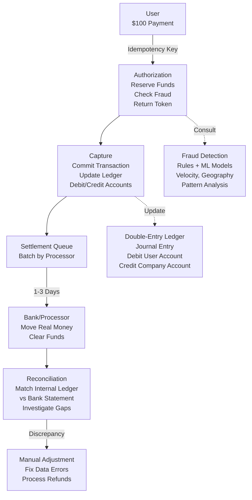

<Hero title="Fintech and Payments: Idempotency, Reconciliation, and Settlement" subtitle="Building payment systems where correctness and auditability are non-negotiable" imageAlt="Payment processing with idempotency, reconciliation, and settlement" size="large" />

## TL;DR

Payment systems move money. Mistakes cost dollars, not milliseconds. **Idempotency keys** prevent double-charging if request retried (user clicks Send twice). **Reconciliation** matches payments sent vs settled (accounts for clearing delays). **Double-entry bookkeeping** ensures every debit has matching credit (funds don't vanish). **Fraud detection** flags unusual transactions (ML models + rule engines). **PCI-DSS compliance** mandates encryption, access controls, network segmentation. **Settlement** moves actual money (1-3 business days), separate from authorization (instant).

## Learning Objectives

- Implement idempotency to prevent duplicate charges
- Design ledger systems with double-entry accounting
- Build reconciliation systems
- Understand payment flows (auth, capture, settlement)
- Implement fraud detection
- Ensure PCI compliance

## Motivating Scenario

User sends $100 payment. Network times out. Unsure if it went through, user retries. Without idempotency, system processes both requests, charges user $200. Regulator investigates, company liable for refunds + penalties. Solution: idempotency key (unique per transaction, prevents duplicates). Also need: reconciliation (daily: confirm $100 actually settled), ledger (audit trail proving money accounted for), fraud detection (flag if user suddenly sends $10,000).

## Core Concepts

Payment systems ensure **correctness, traceability, and regulatory compliance**:

**Idempotency Key**: Unique token per transaction. Retry request with same key, system returns cached result instead of re-processing.

**Ledger**: Immutable record of money movements (journal entry). Every transaction has debit and credit.

**Double-Entry Bookkeeping**: Every transaction affects two accounts. Debit one, credit another. Total assets = liabilities + equity (always).

**Reconciliation**: Reconcile internal ledger with external sources (bank, payment processor) to catch discrepancies.

**Fraud Detection**: Rule-based (velocity, geography) + ML models (transaction patterns). Flag suspicious activity.

**PCI-DSS**: Payment Card Industry compliance. Encrypt card data, audit access, segment networks.

**Settlement**: Actual money movement (1-3 days). Distinct from authorization (instant virtual).

<Figure caption="Payment flow: Authorization, capture, settlement, reconciliation">

</Figure>

### Key Concepts

**Tokenization**: Replace actual card data with token. Prevents exposure of PAN (Primary Account Number).

**3D Secure**: Extra authentication (card issuer, customer enters password). Reduces fraud.

**Chargeback**: Customer disputes transaction, bank reverses it, company loses money + fee.

**PSD2/SCA**: Regulator mandates Strong Customer Authentication (2FA). Reduces fraud.

**Liquidity Buffer**: Funds held to cover chargebacks, refunds, regulatory issues.

## Patterns and Pitfalls

<Showcase title="Patterns and Pitfalls" sections={[
  {
    title: "Pitfall: Missing Idempotency Key",
    description: "User retries payment. System processes twice, charges $200 instead of $100.",
    fix: "Require idempotency key in API. Cache result (30 days). Retry returns cached response."
  },
  {
    title: "Pitfall: Unbalanced Ledger",
    description: "Transaction only debits user, forgets to credit company. Money vanishes.",
    fix: "Double-entry bookkeeping. Every transaction: debit one, credit another. Ledger always balanced."
  },
  {
    title: "Pitfall: No Reconciliation",
    description: "Internal ledger shows $1M collected, bank shows $950K. $50K missing, no alerts.",
    fix: "Daily reconciliation: compare internal ledger vs bank statement. Investigate gaps within 24 hours."
  },
  {
    title: "Pattern: Fraud Rule Engine",
    description: "Rule-based: velocity (> 5 transactions/min), geography (charge in NY, then Tokyo 5 min later), unusual amount.",
    fix: "Combine rules + ML models. Flag suspicious, require verification, manual review."
  },
  {
    title: "Pitfall: PCI Violation",
    description: "Store card number in logs. Attacker breaches server, steals thousands of card numbers.",
    fix: "Never store full PAN. Tokenize. Use PCI-compliant payment processors. Encrypt audit logs."
  }
]} />

## Design Review Checklist

<Checklist items={[
  "Is idempotency key required and cached for 30+ days?",
  "Is double-entry bookkeeping enforced (every transaction: debit/credit)?",
  "Can you generate daily reconciliation reports (internal vs bank)?",
  "Is ledger immutable (append-only, cryptographically sealed)?",
  "Is fraud detection (rules + ML) monitoring every transaction?",
  "Is PCI-DSS compliance verified (encryption, access controls)?",
  "Can you reverse transactions (refunds) with audit trail?",
  "Is settlement queue batching transactions correctly?",
  "Can you explain every dollar in the system (fund flow)?",
  "Are chargebacks monitored and disputes managed?"
]} />

## Self-Check

1. **Why idempotency keys?** Prevent double-charge if network retries. Same key → cached result, not re-processing.
2. **What's double-entry bookkeeping?** Every transaction has debit and credit. Money doesn't vanish, always accounted for.
3. **When does settlement happen?** 1-3 business days after capture. Authorization (instant), capture (same day), settlement (delayed).

:::info
**One Takeaway**: In fintech, move fast but verify everything. Correctness beats speed. Every dollar must be accounted for.

:::

## Complete Idempotency Implementation

Idempotency is critical for reliability. Here's a production-ready example:

```python
import hashlib
import json
from datetime import datetime, timedelta
from typing import Optional, Dict, Any

class PaymentService:
    def __init__(self, db, payment_gateway):
        self.db = db
        self.gateway = payment_gateway
        # Idempotency key cache: {key → result} with TTL
        self.idempotency_cache = {}

    def charge(self,
               customer_id: str,
               amount: float,
               card: Card,
               idempotency_key: str) -> Transaction:
        """Charge payment with idempotency guarantee"""

        # Step 1: Check cache for duplicate
        cached = self.check_cache(idempotency_key)
        if cached:
            logger.info(f"Idempotency hit: {idempotency_key}")
            return cached  # Return cached result (no double-charge)

        # Step 2: Process charge (first time)
        try:
            # Call payment gateway
            result = self.gateway.charge(card, amount)
            transaction = Transaction(
                id=str(uuid4()),
                customer_id=customer_id,
                amount=amount,
                status='authorized',
                gateway_transaction_id=result.id
            )

            # Step 3: Persist to ledger (double-entry bookkeeping)
            self.ledger.debit(customer_id, amount, transaction.id)
            self.ledger.credit('company_account', amount, transaction.id)

            # Verify balance (ledger invariant)
            balance = self.ledger.get_balance(customer_id)
            if balance < 0:
                # Data corruption! Rollback everything
                self.gateway.refund(result.id)
                self.ledger.reverse_transaction(transaction.id)
                raise LedgerIntegrityError("Balance went negative")

            # Step 4: Cache result for 30 days (idempotency window)
            self.cache_result(idempotency_key, transaction, ttl_days=30)

            # Step 5: Log for audit trail
            self.audit_log.log(
                user_id=customer_id,
                action='PAYMENT_CHARGED',
                details={
                    'idempotency_key': idempotency_key,
                    'amount': amount,
                    'transaction_id': transaction.id
                }
            )

            return transaction

        except PaymentGatewayError as e:
            # On failure, DON'T cache (retry might succeed)
            logger.error(f"Payment failed: {e}")
            raise

    def check_cache(self, idempotency_key: str) -> Optional[Transaction]:
        """Check if we've seen this idempotency key before"""
        # Check in-memory cache first (fast)
        if idempotency_key in self.idempotency_cache:
            entry = self.idempotency_cache[idempotency_key]
            if not self.is_expired(entry['timestamp']):
                return entry['transaction']

        # Check database (persistent, survives restarts)
        db_entry = self.db.query(
            "SELECT transaction_id FROM idempotency_cache WHERE key = ?",
            idempotency_key
        )
        if db_entry:
            return self.db.query(
                "SELECT * FROM transactions WHERE id = ?",
                db_entry.transaction_id
            )

        return None

    def cache_result(self,
                     idempotency_key: str,
                     transaction: Transaction,
                     ttl_days: int = 30):
        """Cache result for idempotency window"""
        # In-memory cache
        self.idempotency_cache[idempotency_key] = {
            'transaction': transaction,
            'timestamp': datetime.now()
        }

        # Database cache (persistent)
        expiry = datetime.now() + timedelta(days=ttl_days)
        self.db.execute(
            """
            INSERT INTO idempotency_cache (key, transaction_id, expires_at)
            VALUES (?, ?, ?)
            """,
            idempotency_key, transaction.id, expiry
        )

# Usage
service = PaymentService(db, stripe_gateway)

# Request 1 (succeeds)
tx = service.charge(
    customer_id='cust_123',
    amount=100.00,
    card=card,
    idempotency_key='req_abc123'
)
# Result: Transaction created, ledger updated, amount charged

# Request 2 (retry with same key)
tx = service.charge(
    customer_id='cust_123',
    amount=100.00,
    card=card,
    idempotency_key='req_abc123'  # Same key
)
# Result: Cache hit! Returns cached transaction. No double-charge.
```

## Reconciliation Deep Dive

Daily reconciliation catches discrepancies:

```python
class ReconciliationService:
    def daily_reconciliation(self):
        """Compare internal ledger vs external bank statement"""
        today = date.today()

        # Get transactions from ledger
        ledger_txns = self.ledger.query(
            from_date=today,
            to_date=today + timedelta(days=1)
        )

        # Get transactions from bank
        bank_txns = self.bank_api.get_transactions(
            from_date=today,
            to_date=today + timedelta(days=1)
        )

        # Reconcile
        discrepancies = self.find_discrepancies(ledger_txns, bank_txns)

        if discrepancies:
            logger.error(f"Found {len(discrepancies)} discrepancies")
            for disc in discrepancies:
                self.escalate_to_finance(disc)
        else:
            logger.info("Reconciliation successful")

    def find_discrepancies(self, ledger, bank):
        """Find transactions that don't match"""
        discrepancies = []

        # Transactions in ledger but not in bank
        for txn in ledger:
            if not self.find_matching_bank_txn(txn, bank):
                discrepancies.append({
                    'type': 'missing_from_bank',
                    'ledger_txn': txn,
                    'cause': 'Not yet settled? Pending?'
                })

        # Transactions in bank but not in ledger
        for btxn in bank:
            if not self.find_matching_ledger_txn(btxn, ledger):
                discrepancies.append({
                    'type': 'missing_from_ledger',
                    'bank_txn': btxn,
                    'cause': 'Refund? Chargeback? Bug?'
                })

        # Transactions in both but amounts differ
        for txn in ledger:
            btxn = self.find_matching_bank_txn(txn, bank)
            if btxn and txn.amount != btxn.amount:
                discrepancies.append({
                    'type': 'amount_mismatch',
                    'ledger_amount': txn.amount,
                    'bank_amount': btxn.amount,
                    'cause': 'Fee difference? Rounding?'
                })

        return discrepancies

# Daily report
reconciliation = ReconciliationService(ledger, bank_api)
report = reconciliation.daily_reconciliation()

# Output:
# Reconciliation Report for 2025-02-14
# ============================================
# Ledger transactions: 1,000
# Bank transactions: 998
# Discrepancies: 2
#
# Missing from bank:
#   - Transaction XYZ: $500 (settled? pending?)
#   - Transaction ABC: $250 (settled? pending?)
#
# Action: Investigate, file exception, manual review
```

## Fraud Detection Rules

```python
class FraudDetector:
    def evaluate_transaction(self, txn: Transaction) -> (bool, str):
        """Evaluate if transaction is suspicious"""
        score = 0

        # Rule 1: Unusual amount
        if txn.amount > self.user_max_transaction(txn.user_id) * 2:
            score += 50
            logger.warn(f"High amount: {txn.amount}")

        # Rule 2: Velocity check (too many txns in short time)
        recent_count = self.count_recent_transactions(
            txn.user_id,
            minutes=10
        )
        if recent_count > 5:
            score += 40
            logger.warn(f"High velocity: {recent_count} txns in 10 min")

        # Rule 3: Geographic anomaly
        if self.is_geographically_impossible(txn):
            score += 60
            logger.warn(f"Impossible geography")

        # Rule 4: Card mismatch
        if not self.card_matches_user(txn.card, txn.user_id):
            score += 30
            logger.warn(f"Card mismatch")

        # Rule 5: New card (first use)
        if self.is_new_card(txn.card):
            score += 20

        # Rule 6: ML model score
        ml_score = self.ml_model.predict(txn)
        score += ml_score

        # Decision
        if score > 80:
            return False, f"HIGH RISK (score: {score})"
        elif score > 50:
            return True, f"MEDIUM RISK (score: {score}) - require 3D Secure"
        else:
            return True, f"LOW RISK (score: {score})"

# Usage
is_approved, reason = detector.evaluate_transaction(transaction)
if is_approved:
    proceed_with_payment()
else:
    challenge_user_with_3d_secure()  # OR deny
```

## Next Steps

- **Payment Processors**: Study Stripe/Square/PayPal idempotency APIs
- **Ledger Systems**: Explore event sourcing patterns (immutable audit trail)
- **Reconciliation**: Build daily reconciliation dashboards with alerts
- **Fraud Detection**: Integrate ML models (scikit-learn, XGBoost)
- **PCI Compliance**: Get QSA audit, implement network segmentation
- **Settlement**: Understand processor settlement timelines (1-3 business days)

## References

- <a href="https://stripe.com/docs/api/idempotent_requests" target="_blank" rel="nofollow noopener noreferrer">Stripe: Idempotent Requests ↗</a>
- <a href="https://www.pcisecuritystandards.org/document_library" target="_blank" rel="nofollow noopener noreferrer">PCI-DSS Documentation ↗</a>
- <a href="https://en.wikipedia.org/wiki/Double-entry_bookkeeping" target="_blank" rel="nofollow noopener noreferrer">Double-Entry Bookkeeping ↗</a>
- Berinato, S. (2015). "Incremental Deployment to PCI DSS Compliance." ↗️
- Petty, H. (2017). *Fintech Law and Compliance*. ↗️
