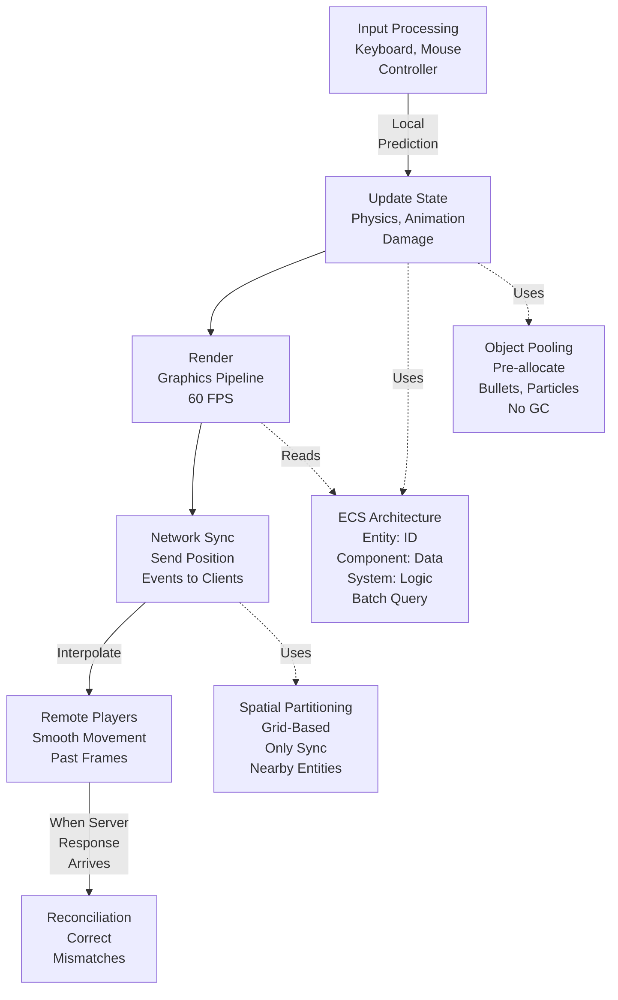

<Hero title="Gaming: Game Loops, ECS Patterns, and State Synchronization" subtitle="Architecture for real-time multiplayer games with low latency and consistency" imageAlt="Game loop with ECS architecture and network synchronization" size="large" />

## TL;DR

Games run in **tight loops** (60+ FPS) processing input, updating state, rendering. **Fixed timestep** ensures physics determinism (100ms per frame). **Variable timestep** adapts to frame rate but requires interpolation. **ECS (Entity-Component-System)** decouples data (components) from logic (systems), enabling efficient batching. Multiplayer games sync state across clients with **network prediction** to hide latency (player shoots, server confirms). **Object pooling** pre-allocates bullets/effects to avoid GC pauses. **Spatial partitioning** culls invisible entities, reducing network traffic.

## Learning Objectives

- Understand game loop architecture and timestep choices
- Implement entity-component-system pattern
- Synchronize game state across network
- Use network prediction and interpolation
- Optimize with spatial partitioning and object pooling
- Handle latency and input prediction

## Motivating Scenario

You're building a multiplayer FPS. 100 players, each firing at 1000 rounds per second. Server receives bullets, must hit-detect, update 100 clients within 16ms (60 FPS). If you send each bullet event to all clients, network explodes (100,000 messages/sec). Solutions: client-side prediction (shoot locally, server validates), spatial partitioning (only sync entities near player), object pooling (reuse bullet objects, avoid allocations).

## Core Concepts

Game systems balance **correctness, latency, and bandwidth**:

**Game Loop**: Input → Update → Render. Repeats at fixed rate (60 FPS = 16.67ms/frame).

**Fixed Timestep**: Each frame is exactly dt time (e.g., 16ms). Physics deterministic. But might skip/duplicate frames.

**Variable Timestep**: Adapt to frame rate. Smooth but requires interpolation, non-deterministic physics.

**ECS**: Entities (player, bullet). Components (position, velocity, health). Systems (physics, rendering).

**Network Prediction**: Client predicts local action (shoot, move), server validates asynchronously.

**Interpolation**: Smooth movement between server-sent positions using past frame data.

**Spatial Partitioning**: Divide world into grid. Only sync nearby entities (reduces bandwidth 100x).

<Figure caption="Game loop with ECS and network synchronization">

</Figure>

### Key Concepts

**Delta Time (dt)**: Time since last frame. Used to scale movement (position += velocity * dt).

**Latency Compensation**: Client prediction + server confirmation minimizes perceived lag.

**Client Authority vs Server Authority**: Client simulates locally (fast, can cheat), server validates (correct but slow).

**State Snapshots**: Server periodically sends full game state. Clients interpolate between snapshots.

**Frame Interpolation**: Render at frame time between server updates. Smooth 60 FPS from 20 Hz server updates.

## Practical Example

<Tabs>
<TabItem value="python" label="Python (Game Loop + ECS)" default>
```python
import time
from typing import Dict, List
from dataclasses import dataclass, field

@dataclass
class Vector2:
    x: float = 0.0
    y: float = 0.0

    def __add__(self, other):
        return Vector2(self.x + other.x, self.y + other.y)

    def __mul__(self, scalar):
        return Vector2(self.x * scalar, self.y * scalar)

@dataclass
class Component:
    pass

@dataclass
class Transform(Component):
    position: Vector2 = field(default_factory=Vector2)
    velocity: Vector2 = field(default_factory=Vector2)

@dataclass
class Health(Component):
    hp: int = 100

@dataclass
class Entity:
    id: int
    components: Dict[type, Component] = field(default_factory=dict)

    def add_component(self, component: Component):
        self.components[type(component)] = component

    def get_component(self, comp_type: type) -> Component:
        return self.components.get(comp_type)

class PhysicsSystem:
    @staticmethod
    def update(entities: List[Entity], dt: float):
        for entity in entities:
            transform = entity.get_component(Transform)
            if transform:
                # position += velocity * dt
                transform.position = transform.position + transform.velocity * dt

class RenderSystem:
    @staticmethod
    def render(entities: List[Entity]):
        for entity in entities:
            transform = entity.get_component(Transform)
            if transform:
                print(f"Entity {entity.id}: ({transform.position.x:.1f}, {transform.position.y:.1f})")

class GameLoop:
    def __init__(self, target_fps: int = 60):
        self.target_fps = target_fps
        self.frame_time = 1.0 / target_fps  # 16.67ms @ 60 FPS
        self.entities = []
        self.entity_id_counter = 0

    def create_entity(self) -> Entity:
        entity = Entity(self.entity_id_counter)
        self.entity_id_counter += 1
        self.entities.append(entity)
        return entity

    def run(self, iterations: int = 3):
        for frame in range(iterations):
            frame_start = time.time()

            # Input (simulate player input)
            for entity in self.entities:
                transform = entity.get_component(Transform)
                if transform and entity.id == 0:  # Player 0 moves right
                    transform.velocity = Vector2(100, 0)

            # Update (physics, animation, logic)
            PhysicsSystem.update(self.entities, self.frame_time)

            # Render
            print(f"\nFrame {frame}:")
            RenderSystem.render(self.entities)

            # Maintain fixed timestep
            elapsed = time.time() - frame_start
            sleep_time = max(0, self.frame_time - elapsed)
            time.sleep(sleep_time)

# Example
game = GameLoop(target_fps=60)

# Create entities
player = game.create_entity()
player.add_component(Transform(position=Vector2(0, 0), velocity=Vector2(0, 0)))
player.add_component(Health(hp=100))

enemy = game.create_entity()
enemy.add_component(Transform(position=Vector2(100, 50), velocity=Vector2(-50, 0)))
enemy.add_component(Health(hp=50))

print("Game Loop (60 FPS, 16.67ms per frame)")
game.run(iterations=5)
```
</TabItem>
<TabItem value="go" label="Go (Network Synchronization)">
```go
package main

import (
	"fmt"
	"time"
)

type PlayerState struct {
	ID        int
	X, Y      float32
	VX, VY    float32
	Timestamp int64
}

type NetworkSync struct {
	serverState PlayerState
	clientState PlayerState
	history     []PlayerState
}

func NewNetworkSync() *NetworkSync {
	return &NetworkSync{
		history: make([]PlayerState, 0),
	}
}

func (ns *NetworkSync) ClientPredict(input float32, dt float32) {
	// Client-side prediction: update position locally before server confirms
	ns.clientState.X += input * dt
	ns.clientState.VX = input
	ns.clientState.Timestamp = time.Now().UnixMilli()
}

func (ns *NetworkSync) ServerUpdate(state PlayerState) {
	// Server confirms state
	ns.serverState = state
	ns.history = append(ns.history, state)

	// Limit history
	if len(ns.history) > 10 {
		ns.history = ns.history[1:]
	}
}

func (ns *NetworkSync) Interpolate(alpha float32) PlayerState {
	// Interpolate between past two server updates
	if len(ns.history) < 2 {
		return ns.clientState
	}

	prev := ns.history[len(ns.history)-2]
	curr := ns.history[len(ns.history)-1]

	// Linear interpolation
	interpX := prev.X + (curr.X-prev.X)*alpha
	interpY := prev.Y + (curr.Y-prev.Y)*alpha

	return PlayerState{
		X:         interpX,
		Y:         interpY,
		Timestamp: curr.Timestamp,
	}
}

func (ns *NetworkSync) Reconcile(serverState PlayerState) {
	// Reconciliation: if client prediction diverged, correct it
	diff := serverState.X - ns.clientState.X
	if diff > 1.0 || diff < -1.0 {
		fmt.Printf("Prediction error: %.2f, correcting...\n", diff)
		ns.clientState.X = serverState.X
		ns.clientState.Y = serverState.Y
	}
}

func main() {
	sync := NewNetworkSync()

	// Frame 1: Client predicts, sends to server
	fmt.Println("--- Frame 1: Client Prediction ---")
	sync.ClientPredict(100, 0.016) // Move right at velocity 100
	fmt.Printf("Client state: X=%.2f\n", sync.clientState.X)

	// Simulate server processing (50ms latency)
	fmt.Println("\n--- Frame 3: Server Confirms (50ms latency) ---")
	serverConfirm := PlayerState{X: 1.6, Y: 0, VX: 100, Timestamp: time.Now().UnixMilli()}
	sync.ServerUpdate(serverConfirm)
	fmt.Printf("Server state: X=%.2f\n", sync.serverState.X)

	// Reconcile
	sync.Reconcile(serverConfirm)
	fmt.Printf("After reconciliation: X=%.2f\n", sync.clientState.X)

	// Interpolate for rendering
	fmt.Println("\n--- Interpolation for Smooth Rendering ---")
	for alpha := float32(0); alpha <= 1.0; alpha += 0.25 {
		interp := sync.Interpolate(alpha)
		fmt.Printf("Alpha %.2f: X=%.2f\n", alpha, interp.X)
	}
}
```
</TabItem>
<TabItem value="nodejs" label="Node.js (Object Pooling)">
```javascript
class Bullet {
  constructor(id) {
    this.id = id;
    this.x = 0;
    this.y = 0;
    this.vx = 0;
    this.vy = 0;
    this.active = false;
  }

  fire(x, y, vx, vy) {
    this.x = x;
    this.y = y;
    this.vx = vx;
    this.vy = vy;
    this.active = true;
  }

  update(dt) {
    if (this.active) {
      this.x += this.vx * dt;
      this.y += this.vy * dt;

      // Deactivate if out of bounds
      if (this.x < 0 || this.x > 800 || this.y < 0 || this.y > 600) {
        this.active = false;
      }
    }
  }

  reset() {
    this.x = 0;
    this.y = 0;
    this.vx = 0;
    this.vy = 0;
    this.active = false;
  }
}

class BulletPool {
  constructor(size = 1000) {
    this.pool = [];
    for (let i = 0; i < size; i++) {
      this.pool.push(new Bullet(i));
    }
    this.active = [];
  }

  get() {
    // Avoid allocation: reuse from pool
    const bullet = this.pool.pop();
    if (!bullet) {
      console.warn('Pool exhausted, creating new bullet');
      return new Bullet(this.pool.length + this.active.length);
    }
    this.active.push(bullet);
    return bullet;
  }

  return(bullet) {
    // Return to pool for reuse
    bullet.reset();
    const idx = this.active.indexOf(bullet);
    if (idx !== -1) {
      this.active.splice(idx, 1);
    }
    this.pool.push(bullet);
  }

  updateAll(dt) {
    for (const bullet of this.active) {
      bullet.update(dt);
      if (!bullet.active) {
        this.return(bullet);
      }
    }
  }

  getStats() {
    return {
      active: this.active.length,
      pooled: this.pool.length,
      total: this.active.length + this.pool.length,
    };
  }
}

// Example
const bulletPool = new BulletPool(1000);

console.log('--- Firing bullets ---');
for (let i = 0; i < 50; i++) {
  const bullet = bulletPool.get();
  bullet.fire(400, 300, Math.random() * 500, Math.random() * 500);
}

console.log(`Stats: ${JSON.stringify(bulletPool.getStats())}`);

console.log('\n--- Updating bullets ---');
for (let frame = 0; frame < 5; frame++) {
  bulletPool.updateAll(0.016); // 60 FPS
  const stats = bulletPool.getStats();
  console.log(`Frame ${frame}: ${stats.active} active, ${stats.pooled} pooled`);
}
```
</TabItem>
</Tabs>

## When to Use / When Not to Use

<Vs highlight={[1]} items={[
{
    label: "Use Gaming Patterns When:",
    points: [
      "Real-time multiplayer game (60+ FPS)",
      "Low latency critical (< 100ms perceived)",
      "High entity count (1000+ objects)",
      "Need deterministic physics",
      "Network bandwidth constrained",
      "Client prediction needed for responsiveness"
    ],
    highlightTone: "positive"
  },
{
    label: "Avoid Complex Gaming Patterns When:",
    points: [
      "Turn-based game (seconds per turn)",
      "Single-player, no network sync",
      "Low entity count (< 100)",
      "Server authority is acceptable",
      "Simplicity prioritized over latency"
    ],
    highlightTone: "warning"
  }
]} />

## Patterns and Pitfalls

<Showcase title="Patterns and Pitfalls" sections={[
  {
    label: "Pitfall: Unbounded Garbage Collection",
    body: "Create bullet objects every frame. GC pauses cause frame drops (100ms freeze). Object pooling: pre-allocate bullets, reuse them. No allocation in hot path."
  },
  {
    label: "Pitfall: Prediction Divergence",
    body: "Client predicts movement, server disagrees. Player sees themselves teleport. Reconciliation: correct mispredictions smoothly. Validate server state."
  },
  {
    label: "Pattern: Spatial Partitioning",
    body: "Divide world into grid. Only sync entities in adjacent cells. Reduce network traffic 100x. Only send relevant entities to clients."
  },
  {
    label: "Pattern: Fixed Timestep Physics",
    body: "Physics deterministic (same inputs → same result). Multiplayer consistency. Advance physics by fixed dt, skip/duplicate frames as needed."
  },
  {
    label: "Pitfall: No Interpolation",
    body: "Render at server update rate (20 Hz). Jerky movement. Interpolate positions between updates. Smooth 60 FPS from 20 Hz updates."
  }
]} />

## Design Review Checklist

<Checklist items={[
  "Is the game loop fixed timestep or variable? Justified?",
  "Is ECS pattern used for entity-component decoupling?",
  "Are systems batching queries efficiently (cache locality)?",
  "Is object pooling used for frequently created/destroyed objects?",
  "Is network synchronization client-predicting with server confirmation?",
  "Is interpolation implemented for smooth rendering?",
  "Is spatial partitioning reducing network traffic?",
  "Can the frame rate sustain target FPS under max load?",
  "Is latency compensation (prediction + reconciliation) transparent to player?",
  "Are there no allocations in hot path (update/render)?",
]}/>

## Self-Check

1. **Fixed vs variable timestep?** Fixed: deterministic physics, easier consistency. Variable: smooth FPS adaptation, needs interpolation.
2. **Why ECS?** Decouples data (components) from logic (systems). Enables efficient batching and cache locality.
3. **How to hide 100ms latency?** Client prediction (shoot locally), server validation async. By the time server responds, it's not noticeable.

:::info
**One Takeaway**: Games are optimization machines. Every ms and MB matters. Profile first, then optimize.

:::

## Next Steps

- **Game Engines**: Unity, Unreal, Godot physics loops
- **Networking**: Photon, Mirror, Fusion for multiplayer
- **Spatial Structures**: Quadtrees, R-trees, grid-based partitioning
- **Frame Pacing**: Adaptive V-sync, frame interpolation
- **Prediction**: Dead reckoning, Kalman filtering

## References

- Nystrom, R. (2014). *Game Programming Patterns*. ↗️
- West, M. (2013). "Latency Compensation Methods in Client/Server In-game Protocol Design and Optimization." ↗️
- GDC Vault: ECS talks from major studios. ↗️