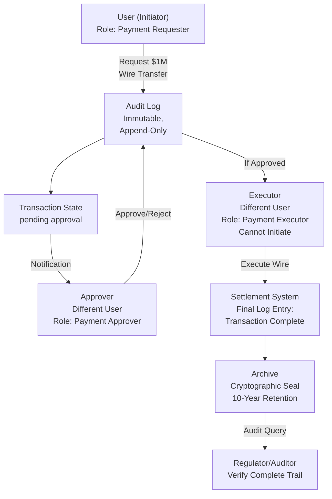

<Hero title="High-Compliance Systems" subtitle="Immutable audit logs, segregation of duties, and regulatory compliance architecture" imageAlt="Compliance system with audit logs, access controls, and segregation of duties" size="large" />

## TL;DR

Compliance systems enforce **immutable audit trails** where every action is logged (who, what, when, where). **Segregation of Duties (SoD)** prevents single person from both initiating and approving critical actions (e.g., payment approval requires separate approver). HIPAA (healthcare), PCI-DSS (payments), SOX (financial reporting) mandate 7-10 year data retention, encryption, access logging. Key challenge: balancing security with user experience. Regulatory audits expect complete, tamper-proof audit trails.

## Learning Objectives

- Design immutable audit logging systems
- Implement segregation of duties patterns
- Understand HIPAA, PCI-DSS, SOX requirements
- Design access control matrices (RBAC, ABAC)
- Manage encryption keys securely
- Plan data retention and purge strategies

## Motivating Scenario

You're building a financial transaction system. Regulator (SEC) requires audit trail proving who initiated, approved, and executed each transaction. If someone alters a $1M wire transfer after the fact, audit log must prove it (and regulators reject the transaction). System must implement: 4-eye principle (two people approve), immutable logs (append-only, cryptographically signed), and 10-year retention. A junior engineer must not approve their own transaction requests.

## Core Concepts

Compliance systems enforce **accountability and traceability** through structured controls:

**Audit Trail**: Immutable record of every action (user, action, timestamp, IP, result).

**Segregation of Duties (SoD)**: One person initiates action, another approves/executes. Prevents fraud.

**4-Eye Principle**: Two independent approvers required for critical action.

**Immutability**: Logs append-only, cryptographically signed, stored on WORM (Write-Once-Read-Many) media.

**Access Control**: RBAC (Role-Based), ABAC (Attribute-Based). Least privilege.

**Data Retention**: Keep logs 7-10 years (HIPAA, SOX). Purge securely post-retention.

**Encryption**: TLS in transit, encryption at rest. Key rotation every 90 days.

<Figure caption="Compliance architecture: Segregation of duties, immutable audit logs">

</Figure>

### Key Concepts

**Append-Only Log**: Can only add entries, never modify/delete. Even operators can't alter logs.

**Cryptographic Seal**: Hash-chain each log entry. Single bit change detectable.

**RBAC**: Users assigned roles (Admin, Approver, Executor). Permissions tied to role.

**ABAC**: Access based on attributes (user attributes, resource attributes, context). More flexible.

**Least Privilege**: Grant minimum permissions needed. Default deny.

**Compliance Evidence**: System generates reports for auditors (access logs, approval chains, data flows).

## Practical Example

<Tabs>
<TabItem value="python" label="Python (Audit Logging)" default>
```python
import hashlib
import json
from datetime import datetime
from typing import Dict, List

class AuditLog:
    """Immutable audit log with cryptographic sealing."""

    def __init__(self):
        self.entries = []
        self.last_hash = "0" * 64  # Genesis hash

    def append(self, action: str, user: str, resource: str, result: str, details: Dict = None):
        """Append entry to log (append-only, never modify)."""
        entry = {
            'timestamp': datetime.utcnow().isoformat(),
            'action': action,
            'user': user,
            'resource': resource,
            'result': result,  # success, denied, etc.
            'details': details or {},
            'previous_hash': self.last_hash
        }

        # Compute hash (chain)
        entry_json = json.dumps(entry, sort_keys=True)
        entry_hash = hashlib.sha256(entry_json.encode()).hexdigest()
        entry['hash'] = entry_hash
        self.last_hash = entry_hash

        self.entries.append(entry)
        return entry_hash

    def verify_integrity(self) -> bool:
        """Verify no entries were tampered with."""
        prev_hash = "0" * 64
        for entry in self.entries:
            if entry['previous_hash'] != prev_hash:
                return False
            computed_hash = hashlib.sha256(
                json.dumps({k: v for k, v in entry.items() if k != 'hash'}, sort_keys=True).encode()
            ).hexdigest()
            if computed_hash != entry['hash']:
                return False
            prev_hash = entry['hash']
        return True

    def get_audit_trail(self, resource_id: str) -> List[Dict]:
        """Retrieve audit trail for a resource."""
        return [e for e in self.entries if e['resource'] == resource_id]

class SegregationOfDuties:
    """Enforce segregation of duties for critical actions."""

    def __init__(self):
        self.roles = {
            'initiator': ['request_payment'],
            'approver': ['approve_payment'],
            'executor': ['execute_payment']
        }
        self.assignments = {}  # user -> role
        self.audit = AuditLog()

    def assign_role(self, user: str, role: str):
        """Assign role to user."""
        if role not in self.roles:
            raise ValueError(f"Unknown role: {role}")
        self.assignments[user] = role

    def can_action(self, user: str, action: str) -> bool:
        """Check if user can perform action."""
        user_role = self.assignments.get(user)
        if not user_role:
            return False
        return action in self.roles[user_role]

    def request_payment(self, initiator: str, amount: float, recipient: str) -> str:
        """Request payment (segregation: initiator can't approve/execute)."""
        if not self.can_action(initiator, 'request_payment'):
            self.audit.append('request_payment', initiator, f'payment_{amount}', 'denied', {'reason': 'role_mismatch'})
            raise PermissionError(f"{initiator} cannot request payment")

        request_id = f"pay_{datetime.utcnow().timestamp()}"
        self.audit.append('request_payment', initiator, request_id, 'initiated', {
            'amount': amount,
            'recipient': recipient
        })
        return request_id

    def approve_payment(self, approver: str, request_id: str) -> bool:
        """Approve payment (segregation: approver can't initiate or execute)."""
        if not self.can_action(approver, 'approve_payment'):
            self.audit.append('approve_payment', approver, request_id, 'denied', {'reason': 'role_mismatch'})
            raise PermissionError(f"{approver} cannot approve payment")

        self.audit.append('approve_payment', approver, request_id, 'approved', {})
        return True

    def execute_payment(self, executor: str, request_id: str) -> bool:
        """Execute payment (segregation: executor can't initiate or approve)."""
        if not self.can_action(executor, 'execute_payment'):
            self.audit.append('execute_payment', executor, request_id, 'denied', {'reason': 'role_mismatch'})
            raise PermissionError(f"{executor} cannot execute payment")

        self.audit.append('execute_payment', executor, request_id, 'executed', {})
        return True

# Example
sod = SegregationOfDuties()

# Assign roles
sod.assign_role('alice', 'initiator')
sod.assign_role('bob', 'approver')
sod.assign_role('charlie', 'executor')

# Execute segregated flow
try:
    request_id = sod.request_payment('alice', 1000, 'recipient@bank')
    print(f"Payment requested: {request_id}")

    sod.approve_payment('bob', request_id)
    print("Payment approved by bob")

    sod.execute_payment('charlie', request_id)
    print("Payment executed by charlie")
except PermissionError as e:
    print(f"Error: {e}")

# Attempt violation: alice tries to approve (fails)
try:
    sod.approve_payment('alice', request_id)
except PermissionError as e:
    print(f"Violation prevented: {e}")

# Verify audit trail
print("\n--- Audit Trail ---")
trail = sod.audit.get_audit_trail(request_id)
for entry in trail:
    print(f"{entry['timestamp']}: {entry['user']} {entry['action']} -> {entry['result']}")

# Verify integrity
print(f"\nAudit log integrity check: {sod.audit.verify_integrity()}")
```
</TabItem>
<TabItem value="go" label="Go (Role-Based Access Control)">
```go
package main

import (
	"fmt"
	"log"
)

type Permission string

const (
	PermInitiate  Permission = "initiate_payment"
	PermApprove   Permission = "approve_payment"
	PermExecute   Permission = "execute_payment"
	PermView      Permission = "view_logs"
)

type Role string

const (
	RoleInitiator Role = "initiator"
	RoleApprover  Role = "approver"
	RoleExecutor  Role = "executor"
	RoleAuditor   Role = "auditor"
)

type RolePermissionMatrix map[Role]map[Permission]bool

type AccessControl struct {
	rolePerms map[Role]map[Permission]bool
	users     map[string]Role
}

func NewAccessControl() *AccessControl {
	matrix := RolePermissionMatrix{
		RoleInitiator: {
			PermInitiate: true,
		},
		RoleApprover: {
			PermApprove: true,
		},
		RoleExecutor: {
			PermExecute: true,
		},
		RoleAuditor: {
			PermView: true,
		},
	}

	return &AccessControl{
		rolePerms: matrix,
		users:     make(map[string]Role),
	}
}

func (ac *AccessControl) AssignRole(user string, role Role) {
	ac.users[user] = role
	fmt.Printf("Assigned %s to role %s\n", user, role)
}

func (ac *AccessControl) CanDo(user string, perm Permission) bool {
	role, exists := ac.users[user]
	if !exists {
		return false
	}

	perms, roleExists := ac.rolePerms[role]
	if !roleExists {
		return false
	}

	return perms[perm]
}

func (ac *AccessControl) CheckAction(user string, action string) error {
	var perm Permission
	switch action {
	case "request":
		perm = PermInitiate
	case "approve":
		perm = PermApprove
	case "execute":
		perm = PermExecute
	case "view":
		perm = PermView
	default:
		return fmt.Errorf("unknown action: %s", action)
	}

	if !ac.CanDo(user, perm) {
		return fmt.Errorf("%s cannot %s", user, action)
	}
	return nil
}

func main() {
	ac := NewAccessControl()

	ac.AssignRole("alice", RoleInitiator)
	ac.AssignRole("bob", RoleApprover)
	ac.AssignRole("charlie", RoleExecutor)
	ac.AssignRole("diana", RoleAuditor)

	// Test actions
	tests := []struct {
		user   string
		action string
	}{
		{"alice", "request"},   // OK
		{"alice", "approve"},   // NOT OK
		{"bob", "approve"},     // OK
		{"bob", "execute"},     // NOT OK
		{"charlie", "execute"}, // OK
		{"diana", "view"},      // OK
	}

	for _, test := range tests {
		err := ac.CheckAction(test.user, test.action)
		if err != nil {
			fmt.Printf("❌ %s: %v\n", test.user, err)
		} else {
			fmt.Printf("✓ %s can %s\n", test.user, test.action)
		}
	}
}
```
</TabItem>
<TabItem value="nodejs" label="Node.js (Data Retention Policy)">
```javascript
class CompliancePolicy {
  constructor() {
    this.retentionYears = 10;
    this.encryptionRequired = true;
    this.soDRequired = true;
  }
}

class DataRetentionManager {
  constructor(policy) {
    this.policy = policy;
    this.records = new Map(); // id -> {data, createdAt, expiresAt}
  }

  storeRecord(id, data) {
    const createdAt = new Date();
    const expiresAt = new Date();
    expiresAt.setFullYear(expiresAt.getFullYear() + this.policy.retentionYears);

    this.records.set(id, {
      data,
      createdAt,
      expiresAt,
      encrypted: this.policy.encryptionRequired,
    });

    console.log(`Record ${id} stored. Expires: ${expiresAt.toISOString()}`);
  }

  getRecord(id) {
    const record = this.records.get(id);
    if (!record) return null;

    if (record.expiresAt < new Date()) {
      console.warn(`Record ${id} expired, cannot retrieve`);
      return null;
    }

    return record.data;
  }

  purgeExpired() {
    let purged = 0;
    for (const [id, record] of this.records) {
      if (record.expiresAt < new Date()) {
        this.records.delete(id);
        purged++;
      }
    }
    console.log(`Purged ${purged} expired records`);
    return purged;
  }

  getRetentionReport() {
    const expiring = [];
    const now = new Date();

    for (const [id, record] of this.records) {
      const daysUntilExpiry = Math.ceil((record.expiresAt - now) / (1000 * 60 * 60 * 24));
      expiring.push({ id, daysUntilExpiry });
    }

    expiring.sort((a, b) => a.daysUntilExpiry - b.daysUntilExpiry);
    return expiring.slice(0, 10); // Top 10 expiring soon
  }
}

// Example
const policy = new CompliancePolicy();
const manager = new DataRetentionManager(policy);

// Store some records
manager.storeRecord('record_1', { transaction: 'payment', amount: 1000 });
manager.storeRecord('record_2', { transaction: 'refund', amount: 100 });

// Retrieve
console.log('\nRetrieval:');
console.log('record_1:', manager.getRecord('record_1'));

// Retention report
console.log('\nExpiring soon:');
const expiring = manager.getRetentionReport();
expiring.forEach(r => console.log(`  ${r.id}: expires in ${r.daysUntilExpiry} days`));

// Simulate purge (normally scheduled job)
console.log('\nPurging expired records...');
manager.purgeExpired();
```
</TabItem>
</Tabs>

## When to Use / When Not to Use

<Vs highlight={[1]} items={[
{
    label: "Use Compliance Patterns When:",
    points: [
      "Operating in regulated industry (healthcare, finance, utilities)",
      "Handling PII or sensitive customer data",
      "Required by law/regulation (HIPAA, SOX, GDPR, PCI-DSS)",
      "Audits and compliance reports are mandatory",
      "Multi-person approval workflows needed",
      "Data retention requirements (7-10 years)"
    ],
    highlightTone: "positive"
  },
{
    label: "Avoid Complex Compliance Patterns When:",
    points: [
      "Unregulated industry, no data sensitivity",
      "Single-user or team-based (no SoD needed)",
      "Short data retention acceptable",
      "Operational simplicity prioritized",
      "Cost is primary concern"
    ],
    highlightTone: "warning"
  }
]} />

## Patterns and Pitfalls

<Showcase title="Patterns and Pitfalls" sections={[
  {
    label: "Pitfall: Modifiable Audit Logs",
    body: "Admin can delete audit entries. Regulator rejects system (cannot verify integrity). Append-only logs with cryptographic sealing. Operators cannot modify, only append."
  },
  {
    label: "Pitfall: SoD Not Enforced",
    body: "Same person initiates and approves payment. Embezzlement undetected. RBAC enforces: Initiator role cannot approve. Database constraint prevents violations."
  },
  {
    label: "Pattern: 4-Eye Principle",
    body: "Two independent approvers for critical action. Fraud requires collusion. Workflow: Initiator → Approver1 → Approver2 → Executor (all different users)."
  },
  {
    label: "Pitfall: Missing Audit Context",
    body: "Log shows action but not reason or circumstances. Auditor can't understand decision. Log rich details: who, what, when, where, why. IP address, reason for approval, etc."
  },
  {
    label: "Pattern: Encryption and Key Rotation",
    body: "Data encrypted at rest, keys rotated every 90 days. Regulatory requirement. Use KMS (Key Management Service). Automatic key rotation. Audit key usage."
  }
]} />

## Design Review Checklist

<Checklist items={[
  "Are audit logs append-only and cryptographically sealed?",
  "Is segregation of duties enforced for critical actions?",
  "Does RBAC matrix prevent single-user approval workflows?",
  "Are all data modifications logged (who, what, when)?",
  "Is data retention policy documented and implemented?",
  "Is encryption at rest configured for sensitive data?",
  "Are encryption keys rotated regularly?",
  "Can you generate compliance reports for auditors?",
  "Is audit log access restricted (least privilege)?",
  "Are data purges logged and verified?"
]} />

## Self-Check

1. **What's segregation of duties?** Splitting critical workflows so no single person can complete it alone. Initiator can't approve their own request.
2. **Why immutable logs?** Prevent tampering. If someone alters a log entry, cryptographic hash changes, proving tampering.
3. **How long to retain audit logs?** Depends on regulation: HIPAA (6 years minimum), SOX (7 years), PCI-DSS (1 year). Design for longest requirement.

:::info
**One Takeaway**: Compliance is not a feature bolted on later—it's architectural. Design for auditability from the start.

:::

## Next Steps

- **HIPAA/HITECH**: Healthcare data privacy and breach notification
- **PCI-DSS**: Payment card processing requirements
- **SOX**: Sarbanes-Oxley for financial reporting
- **GDPR**: Right to be forgotten, consent management
- **Key Management**: HSM (Hardware Security Module), KMS

## References

- CMS. (2022). HIPAA Security Rule. ↗️
- PCI Security Standards Council. (2022). PCI-DSS v3.2.1. ↗️
- SEC. (2002). Sarbanes-Oxley Act Section 302. ↗️