import { useCurrentSidebarCategory } from "@docusaurus/theme-common";

## Overview

Different problem domains demand different architectural approaches. A real-time trading system has fundamentally different constraints than an e-commerce platform. An IoT device with kilobytes of memory faces challenges that a data center with terabytes doesn't. Machine learning systems introduce novel concerns around model serving, drift, and experiment tracking. Compliance-heavy systems require audit trails and segregation of duties.

This section explores **10 specialized domains** where architecture decisions matter most:

**Real-Time Systems** require deterministic latency, hard deadlines, and prioritized scheduling. Think embedded controllers, autonomous vehicles, and industrial automation.

**Streaming and Event Processing** handle unbounded data flows with exactly-once semantics, watermarks, and backpressure. Kafka, Flink, and Spark Streaming enable this.

**IoT and Edge Computing** balance constrained devices (limited CPU, memory, power) with cloud connectivity. OTA updates, gateway patterns, and device management are critical.

**Machine Learning Systems** introduce feature engineering, model serving, training/serving skew, concept drift, and the data science lifecycle alongside software engineering.

**High-Compliance Systems** (HIPAA, PCI-DSS, SOX) require immutable audit logs, segregation of duties, access controls, and regulatory reporting—not just security.

**Gaming Systems** optimize for minimal latency, state synchronization across players, prediction and extrapolation, and massive concurrent connections.

**Embedded and Firmware** manage bare-metal constraints, interrupt-driven execution, memory-constrained algorithms, and hardware abstraction layers.

**Fintech and Payments** ensure idempotency, reconciliation, double-entry bookkeeping, fraud detection, and settlement correctness—where failures cost money.

**E-Commerce** orchestrates catalog management, cart/checkout flows, inventory allocation, dynamic pricing, and promotion engines at scale.

**Social and Communication** builds feeds (fan-out on write vs read), real-time messaging, content moderation, abuse prevention, and notification systems.

Each domain has **unique constraints, tradeoffs, and patterns**. This section provides the architectural vocabulary, decision frameworks, and practical examples to guide you.

## Learning Map

```mermaid
graph TB
    Domains["Specialized Domains"]

    Domains --> RealTime["Real-Time Systems<br/>Determinism, Low Latency"]
    Domains --> Streaming["Streaming<br/>Unbounded Data, Exactly-Once"]
    Domains --> IoT["IoT & Edge<br/>Constraints, OTA Updates"]
    Domains --> ML["ML Systems<br/>Feature Stores, Model Drift"]
    Domains --> Compliance["Compliance Systems<br/>Audit Trails, Segregation of Duties"]
    Domains --> Gaming["Gaming<br/>Low Latency, State Sync, Prediction"]
    Domains --> Embedded["Embedded & Firmware<br/>Memory, Interrupt-Driven"]
    Domains --> Fintech["Fintech<br/>Idempotency, Reconciliation"]
    Domains --> ECommerce["E-Commerce<br/>Catalog, Checkout, Inventory"]
    Domains --> Social["Social & Communication<br/>Feeds, Moderation, Messaging"]

    RealTime --> Scheduling["Scheduling Algorithms"]
    RealTime --> RTOS["Real-Time OS"]
    RealTime --> Watchdog["Watchdog Timers"]

    Streaming --> Semantics["Exactly-Once Semantics"]
    Streaming --> Watermarks["Watermarks"]
    Streaming --> Backpressure["Backpressure Handling"]

    IoT --> Connectivity["MQTT/CoAP"]
    IoT --> Gateway["Gateway Patterns"]
    IoT --> Device["Device Management"]

    ML --> FeatureStore["Feature Stores"]
    ML --> ModelServing["Model Serving"]
    ML --> Drift["Concept Drift Detection"]

    Compliance --> Audit["Immutable Logs"]
    Compliance --> SOD["Segregation of Duties"]
    Compliance --> Reporting["Regulatory Reporting"]

    Gaming --> Sync["State Synchronization"]
    Gaming --> Prediction["Network Prediction"]
    Gaming --> Pool["Object Pooling"]

    Embedded --> HAL["Hardware Abstraction"]
    Embedded --> Bootloader["Bootloaders"]
    Embedded --> Power["Power Management"]

    Fintech --> Reconcile["Reconciliation"]
    Fintech --> Bookkeeping["Double-Entry Bookkeeping"]
    Fintech --> Settlement["Settlement"]

    ECommerce --> Dynamic["Dynamic Pricing"]
    ECommerce --> Promotion["Promotion Engine"]
    ECommerce --> Inventory["Inventory Allocation"]

    Social --> FanOut["Fan-Out Strategies"]
    Social --> Moderation["Content Moderation"]
    Social --> Notification["Notification Systems"]
```

<Figure caption="How specialized domains relate and their key concerns">

</Figure>

## Prerequisites

Before diving into specialized domains, you should be comfortable with:

- **Architectural Fundamentals**: Layers, decomposition, interfaces, APIs
- **Distributed Systems Basics**: CAP theorem, eventual consistency, message-driven communication
- **Quality Attributes**: Performance, reliability, security, scalability
- **Design Patterns**: Observer, Command, State, Strategy
- **Data Architecture**: Databases, caches, queues, topics
- **Observability**: Logging, metrics, distributed tracing

## Articles in This Section

<DocCardList items={useCurrentSidebarCategory().items} />
