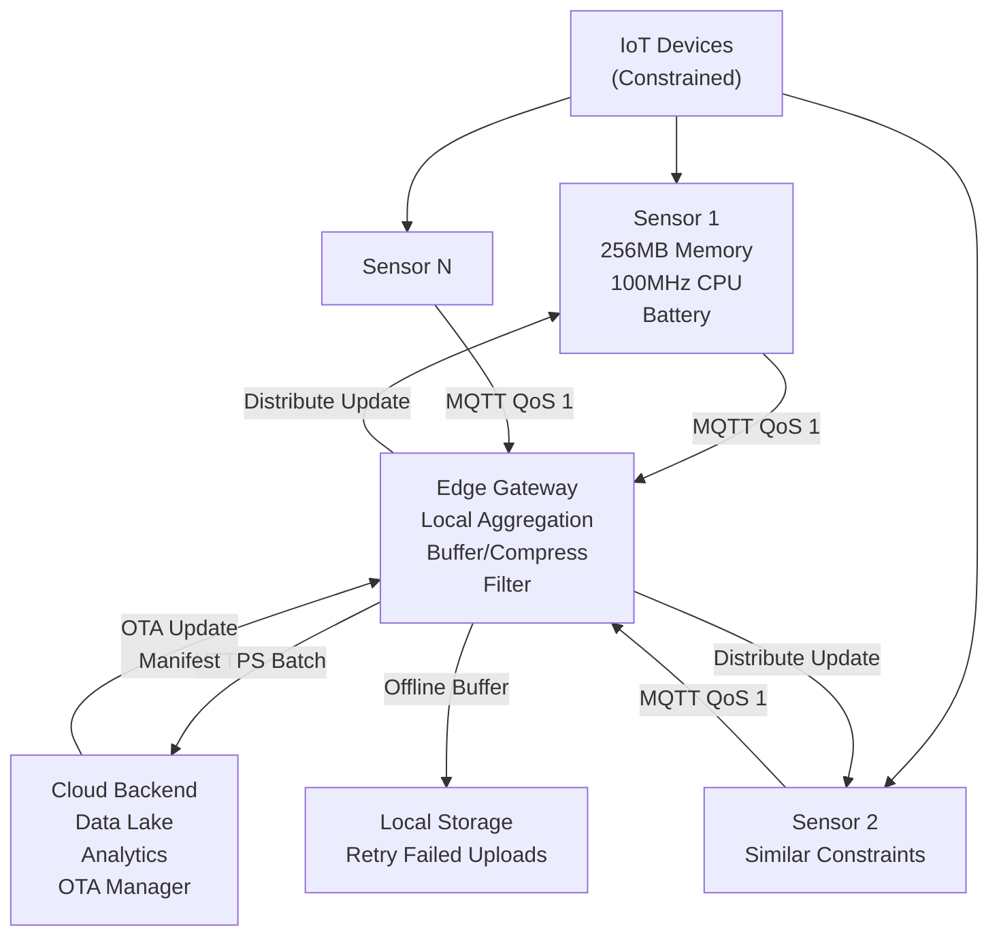

<Hero title="IoT and Edge: Connectivity, OTA Updates, and Constraints" subtitle="Balancing constrained devices with cloud connectivity, edge processing, and reliable firmware updates" imageAlt="IoT network with edge gateway, cloud connectivity, and OTA updates" size="large" />

## TL;DR

IoT systems manage **constrained devices** (limited CPU, memory, power) that send sensor data to cloud. MQTT (publish/subscribe, lightweight) or CoAP (REST-like, UDP) replace HTTP. OTA (Over-The-Air) updates deploy firmware without physical access. Edge gateways aggregate data and filter locally to reduce cloud bandwidth. Device management tracks firmware versions, certificates, provisioning. Challenges: intermittent connectivity, battery life, security updates at scale.

## Learning Objectives

- Design for constrained device limitations
- Choose between MQTT, CoAP, or custom protocols
- Implement reliable OTA firmware updates
- Build edge gateways for local processing
- Manage device provisioning and certificates
- Handle disconnection and offline scenarios

## Motivating Scenario

You're deploying 1 million smart meters across a city. Each meter has 256MB memory, 100MHz CPU, cellular connection. Meters must report consumption every 5 minutes, but connectivity is intermittent (tunnels, remote areas). Sending raw data to cloud for every meter would overwhelm bandwidth. You need: local aggregation (edge gateway collects nearby meters), compression, OTA updates (fix bugs without field technician visit), and offline buffering. Devices must securely authenticate to cloud.

## Core Concepts

IoT systems balance **constrained device capabilities** with **cloud connectivity and reliability**:

**Constrained Device**: Limited CPU, memory (kilobytes to tens of MB), no persistent storage, battery-powered.

**MQTT**: Publish/subscribe protocol, lightweight header (2 bytes), QoS 0/1/2, persistent connections. Standard IoT messaging.

**CoAP**: REST-like protocol over UDP, connectionless, designed for low-power devices.

**OTA (Over-The-Air) Update**: Remote firmware deployment without physical device access.

**Edge Gateway**: Local device aggregating IoT sensors, filtering, compressing, buffering. Acts as bridge to cloud.

**Device Provisioning**: Secure initialization, certificate distribution, device identity.

**Offline-First**: Buffer data locally when disconnected, sync when connectivity restored.

<Figure caption="IoT architecture: Constrained devices, edge gateway, cloud connectivity">

</Figure>

### Key Concepts

**QoS Levels (MQTT)**: 0 (at-most-once, fast), 1 (at-least-once, guaranteed), 2 (exactly-once, slower).

**Retain Flags**: Broker stores last message for late subscribers.

**Last Will Testament**: Message sent if device disconnects unexpectedly.

**Certificate Management**: Securely issue/renew certificates without manual intervention.

**Differential Updates**: Send only changed bytes of firmware, not entire image (bandwidth savings).

**Rollback Strategy**: Keep previous firmware version for quick rollback if update fails.

## Practical Example

<Tabs>
<TabItem value="python" label="Python (MQTT Client)" default>
```python
import paho.mqtt.client as mqtt
import json
import time
from typing import Dict, Callable
import os

class IoTDevice:
    """Simulated IoT device with MQTT connection."""

    def __init__(self, device_id: str, broker_host: str = "localhost"):
        self.device_id = device_id
        self.broker_host = broker_host
        self.connected = False
        self.client = mqtt.Client(client_id=device_id)
        self.callbacks = {}
        self.offline_buffer = []

        # Set up callbacks
        self.client.on_connect = self.on_connect
        self.client.on_disconnect = self.on_disconnect
        self.client.on_message = self.on_message

    def on_connect(self, client, userdata, flags, rc):
        """Called when device connects to broker."""
        if rc == 0:
            self.connected = True
            print(f"{self.device_id}: Connected to broker")
            # Subscribe to OTA and command topics
            self.client.subscribe(f"ota/{self.device_id}")
            self.client.subscribe(f"cmd/{self.device_id}")
            # Flush offline buffer
            self.flush_buffer()
        else:
            print(f"{self.device_id}: Connection failed with code {rc}")

    def on_disconnect(self, client, userdata, rc):
        """Called when device disconnects."""
        self.connected = False
        print(f"{self.device_id}: Disconnected (rc={rc})")

    def on_message(self, client, userdata, msg):
        """Called when device receives message."""
        if msg.topic.startswith("ota/"):
            # OTA update manifest received
            manifest = json.loads(msg.payload)
            print(f"{self.device_id}: Received OTA manifest: {manifest['version']}")
            self.handle_ota_update(manifest)
        elif msg.topic.startswith("cmd/"):
            # Command from cloud
            command = json.loads(msg.payload)
            if command['type'] in self.callbacks:
                self.callbacks[command['type']](command)

    def publish_telemetry(self, sensor_data: Dict):
        """Publish sensor data with QoS 1 (at-least-once)."""
        payload = json.dumps({
            'device_id': self.device_id,
            'timestamp': int(time.time()),
            'data': sensor_data
        })

        if self.connected:
            result = self.client.publish(
                f"telemetry/{self.device_id}",
                payload,
                qos=1,
                retain=False
            )
            if result.rc == mqtt.MQTT_ERR_SUCCESS:
                print(f"{self.device_id}: Published telemetry")
            else:
                self.offline_buffer.append(payload)
        else:
            # Buffer for later
            self.offline_buffer.append(payload)
            print(f"{self.device_id}: Buffered (offline). Buffer size: {len(self.offline_buffer)}")

    def flush_buffer(self):
        """Send buffered messages when reconnected."""
        while self.offline_buffer:
            payload = self.offline_buffer.pop(0)
            result = self.client.publish(
                f"telemetry/{self.device_id}",
                payload,
                qos=1
            )
            print(f"{self.device_id}: Flushed buffered message")

    def handle_ota_update(self, manifest: Dict):
        """Simulate OTA firmware update."""
        print(f"{self.device_id}: Starting OTA update to version {manifest['version']}")
        # In reality: download firmware in chunks, verify checksum, install
        time.sleep(0.5)  # Simulate download/install
        print(f"{self.device_id}: OTA update complete, rebooting...")

    def register_callback(self, command_type: str, callback: Callable):
        """Register callback for command."""
        self.callbacks[command_type] = callback

    def connect(self):
        """Connect to MQTT broker."""
        self.client.connect(self.broker_host, 1883, keepalive=60)
        self.client.loop_start()

    def disconnect(self):
        """Disconnect from broker."""
        self.client.loop_stop()
        self.client.disconnect()

# Example: Simulate 3 IoT devices
if __name__ == "__main__":
    # Create devices
    device1 = IoTDevice("meter_001")
    device2 = IoTDevice("meter_002")

    # Connect (assumes mosquitto broker running on localhost)
    try:
        device1.connect()
        device2.connect()
        time.sleep(1)

        # Publish sensor data
        for i in range(3):
            device1.publish_telemetry({"power_mw": 1500 + i * 10, "temperature_c": 25})
            device2.publish_telemetry({"power_mw": 2000 + i * 5, "temperature_c": 23})
            time.sleep(0.5)

        # Simulate disconnection
        print("\n--- Simulating disconnection ---")
        device1.client.disconnect()
        time.sleep(1)

        # Publish while disconnected
        device1.publish_telemetry({"power_mw": 1600, "temperature_c": 26})
        print(f"Buffer size: {len(device1.offline_buffer)}")

        # Reconnect
        print("\n--- Reconnecting ---")
        device1.client.connect(device1.broker_host, 1883, keepalive=60)
        time.sleep(1)

        time.sleep(2)
        device1.disconnect()
        device2.disconnect()

    except Exception as e:
        print(f"Error: {e}")
```
</TabItem>
<TabItem value="go" label="Go (MQTT Client)">
```go
package main

import (
	"encoding/json"
	"fmt"
	"log"
	"sync"
	"time"

	mqtt "github.com/eclipse/paho.mqtt.golang"
)

type IoTDevice struct {
	DeviceID      string
	BrokerHost    string
	Connected     bool
	Client        mqtt.Client
	OfflineBuffer []string
	mu            sync.Mutex
}

type TelemetryData struct {
	DeviceID  string      `json:"device_id"`
	Timestamp int64       `json:"timestamp"`
	Data      interface{} `json:"data"`
}

func NewIoTDevice(deviceID, brokerHost string) *IoTDevice {
	return &IoTDevice{
		DeviceID:      deviceID,
		BrokerHost:    brokerHost,
		OfflineBuffer: make([]string, 0),
	}
}

func (d *IoTDevice) Connect() error {
	opts := mqtt.NewClientOptions()
	opts.AddBroker(fmt.Sprintf("tcp://%s:1883", d.BrokerHost))
	opts.SetClientID(d.DeviceID)
	opts.SetDefaultPublishHandler(d.messageHandler)
	opts.OnConnect = d.onConnect
	opts.OnConnectionLost = d.onDisconnect

	d.Client = mqtt.NewClient(opts)
	if token := d.Client.Connect(); token.Wait() && token.Error() != nil {
		return token.Error()
	}
	return nil
}

func (d *IoTDevice) onConnect(client mqtt.Client) {
	d.mu.Lock()
	d.Connected = true
	d.mu.Unlock()
	fmt.Printf("%s: Connected to broker\n", d.DeviceID)
	client.Subscribe(fmt.Sprintf("ota/%s", d.DeviceID), 1, nil)
	d.FlushBuffer()
}

func (d *IoTDevice) onDisconnect(client mqtt.Client, err error) {
	d.mu.Lock()
	d.Connected = false
	d.mu.Unlock()
	fmt.Printf("%s: Disconnected\n", d.DeviceID)
}

func (d *IoTDevice) messageHandler(client mqtt.Client, msg mqtt.Message) {
	var manifest map[string]interface{}
	json.Unmarshal(msg.Payload(), &manifest)
	fmt.Printf("%s: Received OTA manifest: %v\n", d.DeviceID, manifest["version"])
}

func (d *IoTDevice) PublishTelemetry(sensorData interface{}) {
	payload := TelemetryData{
		DeviceID:  d.DeviceID,
		Timestamp: time.Now().Unix(),
		Data:      sensorData,
	}

	jsonPayload, _ := json.Marshal(payload)
	topic := fmt.Sprintf("telemetry/%s", d.DeviceID)

	d.mu.Lock()
	defer d.mu.Unlock()

	if d.Connected {
		token := d.Client.Publish(topic, 1, false, jsonPayload)
		if token.Wait() && token.Error() == nil {
			fmt.Printf("%s: Published telemetry\n", d.DeviceID)
		} else {
			d.OfflineBuffer = append(d.OfflineBuffer, string(jsonPayload))
		}
	} else {
		d.OfflineBuffer = append(d.OfflineBuffer, string(jsonPayload))
		fmt.Printf("%s: Buffered (offline). Buffer size: %d\n", d.DeviceID, len(d.OfflineBuffer))
	}
}

func (d *IoTDevice) FlushBuffer() {
	d.mu.Lock()
	defer d.mu.Unlock()

	topic := fmt.Sprintf("telemetry/%s", d.DeviceID)
	for len(d.OfflineBuffer) > 0 {
		payload := d.OfflineBuffer[0]
		d.OfflineBuffer = d.OfflineBuffer[1:]

		d.Client.Publish(topic, 1, false, payload)
		fmt.Printf("%s: Flushed buffered message\n", d.DeviceID)
	}
}

func (d *IoTDevice) Disconnect() {
	d.Client.Disconnect(250)
}

func main() {
	device1 := NewIoTDevice("meter_001", "localhost")

	if err := device1.Connect(); err != nil {
		log.Fatal(err)
	}

	time.Sleep(1 * time.Second)

	for i := 0; i < 3; i++ {
		data := map[string]int{"power_mw": 1500 + i*10, "temperature_c": 25}
		device1.PublishTelemetry(data)
		time.Sleep(500 * time.Millisecond)
	}

	fmt.Println("\n--- Simulating disconnection ---")
	device1.Disconnect()
	time.Sleep(1 * time.Second)

	data := map[string]int{"power_mw": 1600, "temperature_c": 26}
	device1.PublishTelemetry(data)

	fmt.Println("\n--- Reconnecting ---")
	device1.Connect()
	time.Sleep(2 * time.Second)

	device1.Disconnect()
}
```
</TabItem>
<TabItem value="nodejs" label="Node.js (MQTT Client)">
```javascript
const mqtt = require('mqtt');

class IoTDevice {
  constructor(deviceId, brokerHost = 'localhost') {
    this.deviceId = deviceId;
    this.brokerHost = brokerHost;
    this.connected = false;
    this.offlineBuffer = [];
    this.client = null;
  }

  connect() {
    return new Promise((resolve) => {
      this.client = mqtt.connect(`mqtt://${this.brokerHost}`, {
        clientId: this.deviceId,
        keepalive: 60,
      });

      this.client.on('connect', () => {
        this.connected = true;
        console.log(`${this.deviceId}: Connected to broker`);
        this.client.subscribe(`ota/${this.deviceId}`, { qos: 1 });
        this.flushBuffer();
        resolve();
      });

      this.client.on('disconnect', () => {
        this.connected = false;
        console.log(`${this.deviceId}: Disconnected`);
      });

      this.client.on('message', (topic, payload) => {
        if (topic.startsWith('ota/')) {
          const manifest = JSON.parse(payload);
          console.log(`${this.deviceId}: Received OTA manifest: ${manifest.version}`);
        }
      });
    });
  }

  publishTelemetry(sensorData) {
    const payload = JSON.stringify({
      device_id: this.deviceId,
      timestamp: Math.floor(Date.now() / 1000),
      data: sensorData,
    });

    const topic = `telemetry/${this.deviceId}`;

    if (this.connected) {
      this.client.publish(topic, payload, { qos: 1 }, (err) => {
        if (err) {
          this.offlineBuffer.push(payload);
          console.log(`${this.deviceId}: Publish failed, buffered`);
        } else {
          console.log(`${this.deviceId}: Published telemetry`);
        }
      });
    } else {
      this.offlineBuffer.push(payload);
      console.log(`${this.deviceId}: Buffered (offline). Buffer size: ${this.offlineBuffer.length}`);
    }
  }

  flushBuffer() {
    const topic = `telemetry/${this.deviceId}`;
    while (this.offlineBuffer.length > 0) {
      const payload = this.offlineBuffer.shift();
      this.client.publish(topic, payload, { qos: 1 });
      console.log(`${this.deviceId}: Flushed buffered message`);
    }
  }

  disconnect() {
    return new Promise((resolve) => {
      this.client.end(resolve);
    });
  }
}

// Example
async function main() {
  const device = new IoTDevice('meter_001');
  await device.connect();

  for (let i = 0; i < 3; i++) {
    device.publishTelemetry({ power_mw: 1500 + i * 10, temperature_c: 25 });
    await new Promise(r => setTimeout(r, 500));
  }

  console.log('\n--- Simulating disconnection ---');
  await device.disconnect();
  await new Promise(r => setTimeout(r, 1000));

  await device.connect();
  device.publishTelemetry({ power_mw: 1600, temperature_c: 26 });

  await new Promise(r => setTimeout(r, 1000));
  await device.disconnect();
}

main().catch(console.error);
```
</TabItem>
</Tabs>

## When to Use / When Not to Use

<Vs highlight={[1]} items={[
{
    label: "Use IoT/Edge Patterns When:",
    points: [
      "Constrained devices (limited CPU, memory, power)",
      "Intermittent or unreliable connectivity",
      "Need to reduce cloud bandwidth (local aggregation)",
      "Remote firmware updates required",
      "Offline-first scenarios (buffer local, sync later)",
      "Scale: thousands to millions of devices"
    ],
    highlightTone: "positive"
  },
{
    label: "Avoid Complex IoT Patterns When:",
    points: [
      "Unconstrained devices (servers, workstations)",
      "Always-on, reliable connectivity",
      "Small device count (< 100)",
      "Real-time centralized control required",
      "Team lacks embedded systems expertise"
    ],
    highlightTone: "warning"
  }
]} />

## Patterns and Pitfalls

<Showcase title="Patterns and Pitfalls" sections={[
  {
    label: "Pitfall: Flooding Network with All Data",
    body: "Each device sends raw sensor data every second to cloud. Network overwhelmed, cloud ingestion bottleneck. Local aggregation/filtering at edge gateway. Send summaries, not raw data. Compression (msgpack, protobuf)."
  },
  {
    label: "Pitfall: OTA Update Bricking Device",
    body: "Update fails halfway. Device stuck in bad state, can't recover. Entire fleet affected. Dual-bank bootloader. Always maintain rollback version. Checksum verification. Staged rollout (5%, 25%, 100%)."
  },
  {
    label: "Pattern: Offline-First Buffering",
    body: "Device buffers data locally when disconnected, syncs on reconnect. Implement circular buffer on device. MQTT QoS 1 with persistent sessions. Timestamp all data."
  },
  {
    label: "Pitfall: Certificate Expiration",
    body: "Device certificates expire in field. Device can't authenticate. No way to renew without technician. Automated certificate renewal before expiry. Pre-provision with long-lived certs. Delta updates."
  },
  {
    label: "Pattern: Edge Gateway Aggregation",
    body: "Gateway collects nearby device data, buffers, filters, sends batch to cloud. Local aggregation reduces bandwidth 10-100x. Gateway acts as bridge with retries and buffering."
  }
]} />

## Design Review Checklist

<Checklist items={[
  "What are device constraints (memory, CPU, power, connectivity)?",
  "Is MQTT QoS level appropriate (0 for metrics, 1 for telemetry)?",
  "Is offline buffering implemented with size limits?",
  "Does OTA update strategy include dual-bank bootloader and rollback?",
  "Are device certificates provisioned securely and renewed before expiry?",
  "Is local aggregation/filtering reducing cloud bandwidth?",
  "Can edge gateway handle temporary cloud outages?",
  "Are firmware updates staged (not pushed to all at once)?",
  "Is device authentication mutual (device verifies cloud too)?",
  "Are you monitoring device connectivity and update success rates?"
]} />

## Self-Check

1. **Why MQTT over HTTP?** HTTP requires persistent connections and larger headers. MQTT pub/sub is lightweight, supports QoS, and connection can drop without message loss.
2. **What happens during OTA update failure?** Device should rollback to previous version. Requires dual-bank bootloader (two firmware slots, one active, one backup).
3. **How to handle offline devices?** Buffer data locally with timestamp. When reconnected, sync with cloud. Cloud must handle out-of-order/late data.

:::info
**One Takeaway**: IoT is about managing constraints. Every bit of bandwidth, every byte of memory, every milliwatt of power matters. Design for the edge, not the cloud.

:::

## Next Steps

- **MQTT Deep Dive**: QoS, retained messages, last will testament, persistent sessions
- **CoAP**: REST-like alternative for sleeping devices
- **Edge Computing**: Kubernetes at the edge, local analytics
- **Device Provisioning**: JITP (Just-In-Time-Provisioning), certificate management
- **OTA Strategies**: Delta updates, staged rollouts, firmware versioning

## References

- Deshmukh, A. (2018). *Hands-On Embedded Systems Programming*. Packt. ↗️
- MQTT Specification (mqtt.org). ↗️
- AWS IoT Core Best Practices. ↗️