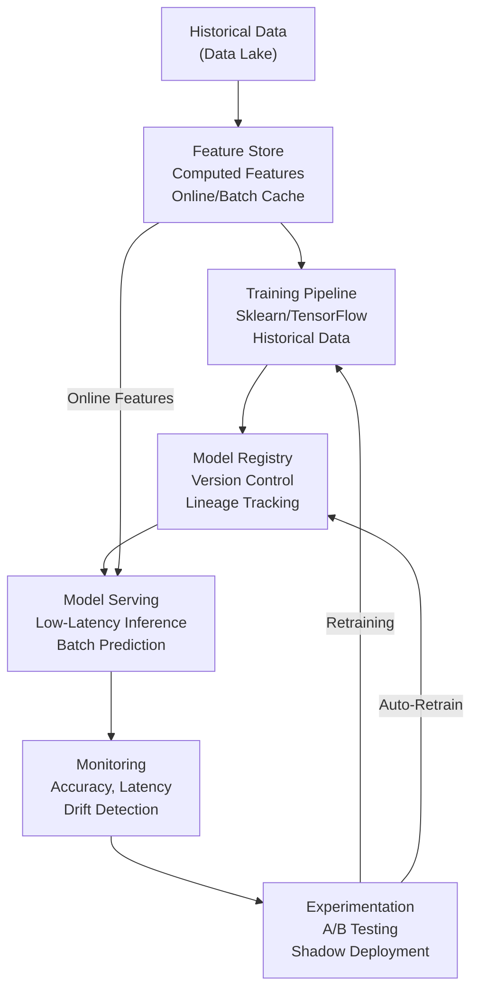

<Hero title="ML Systems: Feature Stores, Model Serving, and Concept Drift" subtitle="Managing the ML lifecycle from feature engineering to production monitoring" imageAlt="ML system with feature store, model serving, and drift detection" size="large" />

## TL;DR

ML systems manage **two lifecycles**: training (data science) and serving (software engineering). **Feature stores** centralize feature computation and caching for consistency. **Training/serving skew** occurs when training uses different data/logic than serving, causing accuracy drops. **Concept drift** happens when real-world data distribution shifts (model trained on 2022 data, deployed in 2024). MLOps integrates model versioning, A/B testing, shadow deployments, and monitoring. Key complexity: managing data quality, feature lineage, and model performance over time.

## Learning Objectives

- Understand feature stores and feature engineering patterns
- Prevent training/serving skew
- Detect and handle concept drift
- Implement model versioning and experimentation
- Use A/B testing and shadow deployments
- Monitor model performance in production

## Motivating Scenario

You've trained a fraud detection model with 95% accuracy on 2022 credit card transaction data. Deployed to production, accuracy drops to 78% in weeks. Why? Concept drift: transaction patterns changed (post-pandemic spending, new fraud tactics). Meanwhile, the training pipeline uses raw SQL queries, but serving uses cached features with different aggregation windows. Training/serving skew introduced bugs. Feature store solves this by centralizing feature logic. Monitoring detects accuracy drops within hours, triggering retraining.

## Core Concepts

ML systems balance **data science (experimentation) with software engineering (production reliability)**:

**Feature Store**: Centralized repository for computed features (user spend, transaction velocity). Used by both training and serving.

**Training/Serving Skew**: Model trained with feature A, but serving uses feature B (different window, aggregation). Accuracy drops.

**Concept Drift**: Real-world distribution shifts over time. Model trained on old data becomes stale.

**Model Registry**: Version control for models, tracks lineage (features, training data, hyperparameters).

**A/B Testing**: Canary new model on 10% of traffic, compare metrics vs old model. Rollout if better.

**Shadow Deployment**: New model runs in parallel, shadows all requests, but doesn't affect users. Catches issues before traffic.

**Online Learning**: Model updates continuously as new data arrives. High variance but adaptable.

<Figure caption="ML system architecture: Feature store, training/serving, drift detection">

</Figure>

### Key Concepts

**Online Feature Store**: Sub-millisecond lookup (Redis, DynamoDB). Used during serving.

**Batch Feature Store**: Compute features over historical data. Used for training.

**Model Explainability**: Feature importance, SHAP values. Understand why model made prediction.

**Data Validation**: Great Expectations, schema validation. Ensure input data quality.

**Retraining Schedule**: Periodic (daily, weekly) or on-demand (drift detected).

**Serving Infrastructure**: Batch (offline predictions), Real-time (HTTP server), Streaming (event-based).

## Practical Example

<Tabs>
<TabItem value="python" label="Python (Feature Store Simulation)" default>
```python
import time
from typing import Dict, List
from dataclasses import dataclass

@dataclass
class User:
    user_id: str
    total_spend: float
    transaction_count: int
    days_active: int

class FeatureStore:
    """Simplified feature store for training and serving."""

    def __init__(self):
        self.online_cache = {}  # Redis-like cache for serving
        self.batch_data = {}    # Historical data for training

    def compute_features(self, user: User) -> Dict[str, float]:
        """Compute features (training and serving)."""
        features = {
            'user_spend_total': user.total_spend,
            'avg_transaction': user.total_spend / max(user.transaction_count, 1),
            'transaction_velocity': user.transaction_count / max(user.days_active, 1),
            'user_tenure_days': user.days_active
        }
        return features

    def register_training_features(self, user: User):
        """Store features for training (batch compute)."""
        features = self.compute_features(user)
        self.batch_data[user.user_id] = features

    def register_online_features(self, user: User):
        """Cache features for serving (online)."""
        features = self.compute_features(user)
        self.online_cache[user.user_id] = {
            'features': features,
            'timestamp': time.time()
        }

    def get_training_features(self, user_ids: List[str]) -> List[Dict]:
        """Get features for model training."""
        return [self.batch_data[uid] for uid in user_ids if uid in self.batch_data]

    def get_serving_features(self, user_id: str) -> Dict:
        """Get features for inference (low-latency, from cache)."""
        if user_id in self.online_cache:
            return self.online_cache[user_id]['features']
        return None

class Model:
    """Simplified fraud detection model."""

    def __init__(self, threshold: float = 0.5):
        self.threshold = threshold
        self.version = "v1"
        self.training_date = None

    def predict(self, features: Dict) -> tuple:
        """Predict fraud probability."""
        # Simplified: fraud if spend is high and velocity is odd
        fraud_score = (
            (features['avg_transaction'] / 1000) * 0.5 +
            (features['transaction_velocity'] * 10) * 0.5
        )
        fraud_score = min(fraud_score, 1.0)
        is_fraud = fraud_score > self.threshold
        return is_fraud, fraud_score

class ModelMonitor:
    """Monitor model performance and drift."""

    def __init__(self, model: Model):
        self.model = model
        self.predictions = []
        self.accuracy_history = []

    def record_prediction(self, prediction: tuple, ground_truth: bool):
        """Record prediction for monitoring."""
        self.predictions.append({
            'prediction': prediction[0],
            'score': prediction[1],
            'ground_truth': ground_truth,
            'correct': prediction[0] == ground_truth
        })

    def calculate_accuracy(self) -> float:
        """Calculate accuracy from recent predictions."""
        if not self.predictions:
            return 0.0
        correct = sum(1 for p in self.predictions if p['correct'])
        accuracy = correct / len(self.predictions)
        self.accuracy_history.append(accuracy)
        return accuracy

    def detect_drift(self, window_size: int = 100) -> bool:
        """Detect concept drift (accuracy drop)."""
        if len(self.accuracy_history) < 2:
            return False
        recent_acc = self.accuracy_history[-1]
        prev_acc = self.accuracy_history[-2] if len(self.accuracy_history) > 1 else recent_acc

        drift_threshold = 0.05  # 5% drop
        return (prev_acc - recent_acc) > drift_threshold

# Example
feature_store = FeatureStore()
model = Model(threshold=0.5)
monitor = ModelMonitor(model)

# Training data
training_users = [
    User("user1", 5000, 50, 365),
    User("user2", 100, 5, 30),
    User("user3", 8000, 80, 365),
]

for user in training_users:
    feature_store.register_training_features(user)

training_features = feature_store.get_training_features([u.user_id for u in training_users])
print(f"Training features collected for {len(training_features)} users")

# Serving (cache features)
for user in training_users:
    feature_store.register_online_features(user)

serving_features = feature_store.get_serving_features("user1")
print(f"Serving features for user1: {serving_features}")

# Make predictions
print("\n--- Initial predictions (good accuracy) ---")
for user in training_users:
    features = feature_store.get_serving_features(user.user_id)
    prediction = model.predict(features)
    # Simulate ground truth
    ground_truth = features['avg_transaction'] > 100
    monitor.record_prediction(prediction, ground_truth)
    print(f"{user.user_id}: Fraud={prediction[0]}, Score={prediction[1]:.2f}")

accuracy = monitor.calculate_accuracy()
print(f"Accuracy: {accuracy:.2%}")

# Simulate concept drift (spending patterns change)
print("\n--- After drift (accuracy drops) ---")
drifted_users = [
    User("user1", 2000, 100, 365),  # More transactions, lower spend
    User("user2", 50, 10, 30),
    User("user3", 3000, 150, 365),
]

for user in drifted_users:
    feature_store.register_online_features(user)
    features = feature_store.get_serving_features(user.user_id)
    prediction = model.predict(features)
    ground_truth = features['avg_transaction'] > 100
    monitor.record_prediction(prediction, ground_truth)
    print(f"{user.user_id}: Fraud={prediction[0]}, Score={prediction[1]:.2f}")

accuracy = monitor.calculate_accuracy()
print(f"Accuracy after drift: {accuracy:.2%}")

if monitor.detect_drift():
    print("DRIFT DETECTED! Triggering retraining...")
```
</TabItem>
<TabItem value="go" label="Go (Model Registry)">
```go
package main

import (
	"fmt"
	"time"
)

type Model struct {
	Version      string
	TrainingDate time.Time
	Metrics      map[string]float64
	Features     []string
	Status       string // draft, production, archived
}

type ModelRegistry struct {
	models map[string][]*Model
	active map[string]string // service -> active model version
}

func NewModelRegistry() *ModelRegistry {
	return &ModelRegistry{
		models: make(map[string][]*Model),
		active: make(map[string]string),
	}
}

func (mr *ModelRegistry) RegisterModel(service string, model *Model) {
	if _, exists := mr.models[service]; !exists {
		mr.models[service] = make([]*Model, 0)
	}
	mr.models[service] = append(mr.models[service], model)
	fmt.Printf("Registered %s for %s\n", model.Version, service)
}

func (mr *ModelRegistry) PromoteToProduction(service, version string) error {
	models, exists := mr.models[service]
	if !exists {
		return fmt.Errorf("service not found")
	}

	for _, m := range models {
		if m.Version == version {
			m.Status = "production"
			mr.active[service] = version
			fmt.Printf("Promoted %s to production\n", version)
			return nil
		}
	}
	return fmt.Errorf("model version not found")
}

func (mr *ModelRegistry) GetActiveModel(service string) *Model {
	version, exists := mr.active[service]
	if !exists {
		return nil
	}

	models, _ := mr.models[service]
	for _, m := range models {
		if m.Version == version && m.Status == "production" {
			return m
		}
	}
	return nil
}

func (mr *ModelRegistry) GetModelHistory(service string) []*Model {
	return mr.models[service]
}

func main() {
	registry := NewModelRegistry()

	// Register model versions
	model1 := &Model{
		Version:      "v1.0",
		TrainingDate: time.Now(),
		Metrics:      map[string]float64{"accuracy": 0.95, "precision": 0.92},
		Features:     []string{"spend_total", "velocity", "tenure"},
		Status:       "draft",
	}

	model2 := &Model{
		Version:      "v1.1",
		TrainingDate: time.Now(),
		Metrics:      map[string]float64{"accuracy": 0.96, "precision": 0.94},
		Features:     []string{"spend_total", "velocity", "tenure", "geographic_risk"},
		Status:       "draft",
	}

	registry.RegisterModel("fraud-detection", model1)
	registry.RegisterModel("fraud-detection", model2)

	// Promote best model
	registry.PromoteToProduction("fraud-detection", "v1.1")

	// Retrieve active model
	active := registry.GetActiveModel("fraud-detection")
	fmt.Printf("\nActive model: %s (Accuracy: %.2f%%)\n", active.Version, active.Metrics["accuracy"]*100)

	// View history
	history := registry.GetModelHistory("fraud-detection")
	fmt.Printf("Model history for fraud-detection:\n")
	for _, m := range history {
		fmt.Printf("  %s - %s (Accuracy: %.2f%%)\n", m.Version, m.Status, m.Metrics["accuracy"]*100)
	}
}
```
</TabItem>
<TabItem value="nodejs" label="Node.js (A/B Testing)">
```javascript
class ABTest {
  constructor(serviceId, controlModel, treatmentModel, trafficSplit = 0.5) {
    this.serviceId = serviceId;
    this.controlModel = controlModel;
    this.treatmentModel = treatmentModel;
    this.trafficSplit = trafficSplit; // % traffic to treatment
    this.results = { control: [], treatment: [] };
    this.startTime = Date.now();
  }

  route(userId) {
    // Deterministic routing based on user ID hash
    const hash = userId.split('').reduce((h, c) => h + c.charCodeAt(0), 0);
    return (hash % 100) < (this.trafficSplit * 100) ? 'treatment' : 'control';
  }

  predict(userId, features) {
    const variant = this.route(userId);
    const model = variant === 'treatment' ? this.treatmentModel : this.controlModel;
    const prediction = model.predict(features);

    return {
      variant,
      prediction,
      userId,
      timestamp: Date.now(),
    };
  }

  recordResult(predictionResult, groundTruth) {
    const variant = predictionResult.variant;
    this.results[variant].push({
      ...predictionResult,
      correct: predictionResult.prediction === groundTruth,
    });
  }

  getMetrics() {
    const calcMetrics = (results) => {
      if (results.length === 0) return { accuracy: 0, count: 0 };
      const correct = results.filter(r => r.correct).length;
      return {
        accuracy: correct / results.length,
        count: results.length,
      };
    };

    return {
      control: calcMetrics(this.results.control),
      treatment: calcMetrics(this.results.treatment),
      confidenceToPromote: this.calculateConfidence(),
    };
  }

  calculateConfidence() {
    const c = this.results.control;
    const t = this.results.treatment;
    if (c.length < 30 || t.length < 30) return 'low'; // Need 30+ samples

    const cAcc = c.filter(r => r.correct).length / c.length;
    const tAcc = t.filter(r => r.correct).length / t.length;

    if (tAcc > cAcc + 0.02) return 'high'; // 2% improvement threshold
    if (tAcc > cAcc) return 'medium';
    return 'low';
  }
}

// Example
class SimpleModel {
  constructor(threshold) {
    this.threshold = threshold;
  }

  predict(features) {
    const score = (features.spend / 1000) * 0.5 + (features.velocity * 10) * 0.5;
    return score > this.threshold;
  }
}

const controlModel = new SimpleModel(0.5);
const treatmentModel = new SimpleModel(0.45); // Slightly lower threshold

const test = new ABTest('fraud-detection', controlModel, treatmentModel, 0.1); // 10% to treatment

// Run test
const users = Array.from({ length: 100 }, (_, i) => `user_${i}`);
for (const userId of users) {
  const features = {
    spend: Math.random() * 5000,
    velocity: Math.random() * 100,
  };

  const result = test.predict(userId, features);
  const groundTruth = features.spend > 2500; // Simulate ground truth
  test.recordResult(result, groundTruth);
}

const metrics = test.getMetrics();
console.log('A/B Test Results:');
console.log(`Control: ${metrics.control.accuracy.toFixed(2)} accuracy (${metrics.control.count} samples)`);
console.log(`Treatment: ${metrics.treatment.accuracy.toFixed(2)} accuracy (${metrics.treatment.count} samples)`);
console.log(`Confidence to promote: ${metrics.confidenceToPromote}`);
```
</TabItem>
</Tabs>

## When to Use / When Not to Use

<Vs highlight={[1]} items={[
{
    label: "Use Advanced ML Patterns When:",
    points: [
      "Model deployed to production with real users",
      "Data distribution likely to shift over time",
      "Need to experiment with model variants",
      "Mistakes have business/user impact",
      "Multiple teams own different models",
      "Serving latency < 100ms required"
    ],
    highlightTone: "positive"
  },
{
    label: "Avoid Complex ML Patterns When:",
    points: [
      "Research/experimentation phase only",
      "Model runs offline (batch scoring)",
      "Accuracy variance acceptable",
      "Single model, rarely updated",
      "Team lacks MLOps expertise"
    ],
    highlightTone: "warning"
  }
]} />

## Patterns and Pitfalls

<Showcase title="Patterns and Pitfalls" sections={[
  {
    label: "Pitfall: Training/Serving Skew",
    body: "Training pipeline uses raw SQL, serving uses cached features with different windows. Accuracy drops in production. Centralized feature store shared by training and serving. Single source of truth."
  },
  {
    label: "Pitfall: Concept Drift Ignored",
    body: "Model trained 2 years ago, never retrained. Real-world patterns changed. Accuracy degrades silently. Monitor prediction accuracy, data drift. Trigger retraining on drift detection. Periodic retraining schedule."
  },
  {
    label: "Pattern: Shadow Deployment",
    body: "New model runs in parallel, shadows requests, but doesn't affect users. Catches issues before traffic. Compare new vs old model predictions offline. Monitor for disagreement, latency, errors."
  ,
    body: "New model runs in parallel, shadows requests, but doesn't affect users. Catches issues before traffic. Compare new vs old model predictions offline. Monitor for disagreement, latency, errors."
  ,
    highlightTone: "positive"
  },
  {
    label: "Pitfall: Data Quality Issues",
    body: "Training data had bugs, but not caught. Model learns from garbage. Predictions terrible in production. Data validation (Great Expectations). Schema checks. Outlier detection. Training/serving feature parity tests."
  },
  {
    label: "Pattern: Model Explainability",
    body: "Feature importance, SHAP values. Understand why model made decision. Log feature values with predictions. Enable debugging and trust."
  }
]} />

## Design Review Checklist

<Checklist items={[
  "Is feature store centralizing feature logic (used by training and serving)?",
  "Are training and serving features identical (feature parity)?",
  "Is model version tracked with lineage (features, training data, hyperparameters)?",
  "Is concept drift monitored (accuracy, data distribution)?",
  "Are A/B tests or shadow deployments used for new models?",
  "Is retraining triggered manually or automatically (drift-based)?",
  "Can you rollback to previous model version quickly?",
  "Are predictions logged with features and ground truth for monitoring?",
  "Is model serving latency acceptable for use case?",
  "Can you explain predictions to stakeholders (explainability)?"
]} />

## Self-Check

1. **What's training/serving skew?** Using different feature logic during training vs serving. Training uses raw SQL, serving uses cached features. Causes accuracy drops.
2. **How to detect concept drift?** Monitor prediction accuracy, data distribution. If accuracy drops without code changes, likely drift.
3. **Why A/B test models?** Compare new model vs current on real users. Ensures improvements before full rollout.

:::info
**One Takeaway**: ML in production is not just about training a good model—it's about keeping it good over time. Monitoring, retraining, and experimentation are as important as accuracy.

:::

## Next Steps

- **Feature Store Platforms**: Tecton, Feast, Iceberglocal
- **Model Serving**: KServe, Seldon Core, BentoML, TensorFlow Serving
- **MLOps Tools**: DVC, Weights & Biases, Neptune, Kubeflow
- **Drift Detection**: Evidently AI, Arize, Fiddler
- **Data Validation**: Great Expectations, TFDV

## References

- Sculley, D., et al. (2015). "Hidden Technical Debt in Machine Learning Systems." ↗️
- Polyzotis, N., et al. (2018). *The ML Test Score*. ↗️
- Huyen, C. (2022). *Designing Machine Learning Systems*. O'Reilly. ↗️