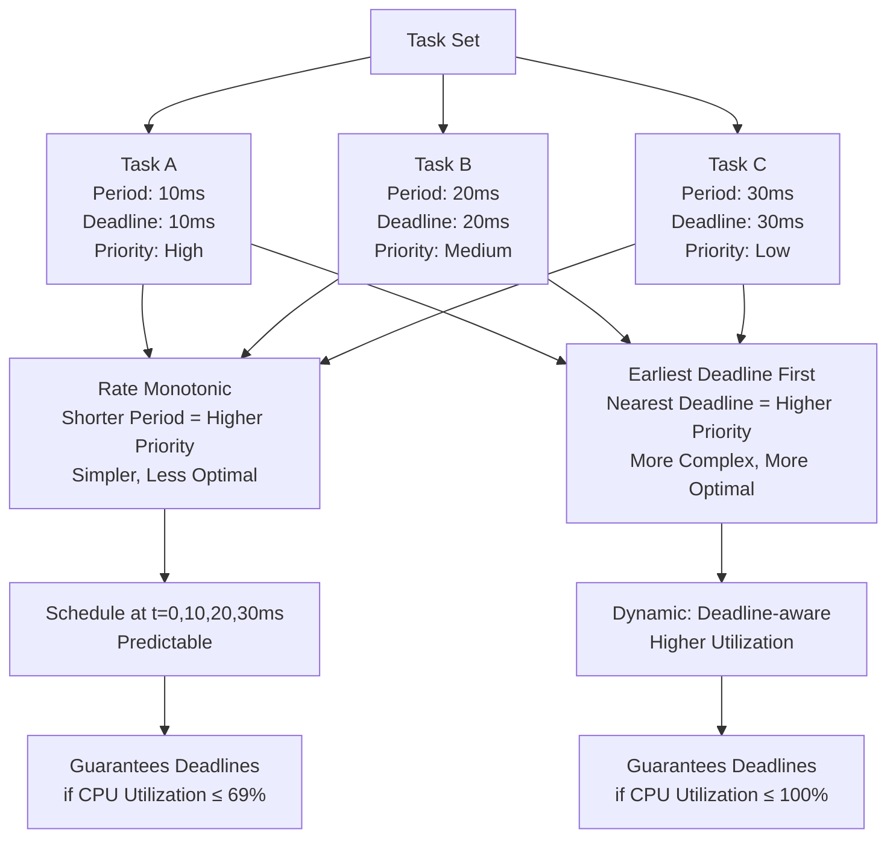

<Hero title="Real-Time Systems: Latency and Determinism" subtitle="Hard vs soft real-time requirements, scheduling algorithms, and priority inversion prevention" imageAlt="Real-time system with predictable latency and deadline enforcement" size="large" />

## TL;DR

Real-time systems guarantee **predictable, bounded latency** and **deadline adherence**, not necessarily fast responses. Hard real-time means missing a deadline is unacceptable (aircraft control). Soft real-time means missing deadlines degrades quality but is recoverable (video playback). Determinism requires careful scheduling (Rate Monotonic, Earliest Deadline First), avoiding priority inversion, and watchdog timers. RTOS (Real-Time Operating Systems) provide preemption and bounded interrupt handling.

## Learning Objectives

- Distinguish hard vs soft real-time requirements
- Understand scheduling algorithms and their tradeoffs
- Prevent and handle priority inversion
- Design deterministic systems with bounded latency
- Implement watchdog timers and fault recovery
- Choose RTOS vs general-purpose OS

## Motivating Scenario

You're building a braking system for autonomous vehicles. A sensor detects an obstacle 50 meters ahead. Software must detect, compute deceleration, and send command to brake within **50 milliseconds** (hard deadline). Missing this deadline by 1ms could cause a crash. The OS scheduler must guarantee that the brake logic thread runs within that window, regardless of other tasks (music playback, telemetry logging). General-purpose OS (Linux, Windows) offer no such guarantee; they're optimized for throughput, not deadline predictability. A hard real-time RTOS (FreeRTOS, QNX, VxWorks) provides determinism through preemptive scheduling.

## Core Concepts

Real-time systems guarantee **bounded latency** through deterministic scheduling and execution:

**Hard Real-Time**: Missing deadline is catastrophic (surgery, aircraft, power plants).

**Soft Real-Time**: Missing deadline degrades quality but system continues (video streaming, game AI).

**Firm Real-Time**: Missing deadline is wasteful but not catastrophic (missed video frame in livestream).

**Scheduling**: Preemptive algorithm that ensures high-priority tasks always run within deadline.

**Priority Inversion**: Low-priority task holds resource (lock) that high-priority task needs, blocking it.

**Watchdog Timer**: Hardware timer that resets if code periodically "feeds" it. If code hangs, timer expires and system recovers (resets).

<Figure caption="Real-time scheduling: Rate Monotonic vs Earliest Deadline First">

</Figure>

### Key Concepts

**Preemptive Scheduling**: Higher-priority task immediately interrupts lower-priority task.

**Context Switch**: Saving/restoring thread state (registers, stack). Adds bounded overhead (microseconds).

**Priority Inversion Prevention**: Priority inheritance or priority ceiling protocols ensure high-priority tasks never blocked by low-priority ones.

**Bounded Execution**: Worst-case execution time (WCET) must be provably less than deadline.

**Interrupt Latency**: Time from hardware interrupt to ISR start. Must be bounded (not thousands of interrupts queued).

## Practical Example

<Tabs>
<TabItem value="python" label="Python (ThreadPriority)" default>
```python
import threading
import time
import queue
from threading import Lock

class RealTimeTask:
    """Simplified real-time task with deadline."""
    def __init__(self, name: str, period_ms: int, deadline_ms: int, work_ms: int):
        self.name = name
        self.period_ms = period_ms
        self.deadline_ms = deadline_ms
        self.work_ms = work_ms
        self.deadline_missed = 0
        self.deadline_met = 0

    def execute(self) -> bool:
        """Simulate work that takes approximately work_ms."""
        start = time.time_ns() // 1_000_000
        time.sleep(self.work_ms / 1000.0)
        elapsed = (time.time_ns() // 1_000_000) - start

        met = elapsed <= self.deadline_ms
        if met:
            self.deadline_met += 1
        else:
            self.deadline_missed += 1
        return met

class RealTimeScheduler:
    """Simple rate-monotonic scheduler."""
    def __init__(self):
        self.tasks = []
        self.shared_resource = Lock()
        self.stop_event = threading.Event()

    def add_task(self, task: RealTimeTask):
        """Add task, sorted by period (shorter period = higher priority)."""
        self.tasks.append(task)
        self.tasks.sort(key=lambda t: t.period_ms)  # Rate monotonic

    def run_task(self, task: RealTimeTask):
        """Run task periodically with deadline checking."""
        while not self.stop_event.is_set():
            start = time.time_ns() // 1_000_000

            # With priority inheritance: acquire lock with priority boost
            with self.shared_resource:  # Simulate critical section
                task.execute()

            elapsed = (time.time_ns() // 1_000_000) - start
            sleep_time = max(0, (task.period_ms - elapsed) / 1000.0)

            if elapsed > task.deadline_ms:
                print(f"{task.name} DEADLINE MISSED: {elapsed}ms > {task.deadline_ms}ms")

            time.sleep(sleep_time)

    def start_all(self):
        """Start all tasks in separate threads."""
        threads = []
        for i, task in enumerate(self.tasks):
            # In a real RTOS, set OS-level priority
            # On Linux: os.sched_setscheduler(), but limited to root
            thread = threading.Thread(target=self.run_task, args=(task,), daemon=False)
            thread.start()
            threads.append(thread)
        return threads

    def stop_all(self):
        self.stop_event.set()

# Example: Brake system (hard real-time)
scheduler = RealTimeScheduler()

# High-priority: Sensor reading (must meet 5ms deadline)
sensor_task = RealTimeTask("BrakeSensor", period_ms=5, deadline_ms=5, work_ms=1)
# Medium-priority: Brake actuation (must meet 10ms deadline)
brake_task = RealTimeTask("BrakeActuator", period_ms=10, deadline_ms=10, work_ms=2)
# Low-priority: Telemetry logging (soft real-time, 100ms deadline)
telemetry_task = RealTimeTask("Telemetry", period_ms=100, deadline_ms=100, work_ms=5)

scheduler.add_task(sensor_task)
scheduler.add_task(brake_task)
scheduler.add_task(telemetry_task)

threads = scheduler.start_all()

# Run for 2 seconds
time.sleep(2)
scheduler.stop_all()

for t in threads:
    t.join()

# Results
print(f"\nSensor: {sensor_task.deadline_met} met, {sensor_task.deadline_missed} missed")
print(f"Brake: {brake_task.deadline_met} met, {brake_task.deadline_missed} missed")
print(f"Telemetry: {telemetry_task.deadline_met} met, {telemetry_task.deadline_missed} missed")
```
</TabItem>
<TabItem value="go" label="Go (Goroutine Priority)">
```go
package main

import (
	"fmt"
	"sync"
	"time"
)

type RealTimeTask struct {
	Name           string
	PeriodMs       int
	DeadlineMs     int
	WorkMs         int
	DeadlineMet    int
	DeadlineMissed int
	mu             sync.Mutex
}

func (t *RealTimeTask) Execute() bool {
	start := time.Now()
	time.Sleep(time.Duration(t.WorkMs) * time.Millisecond)
	elapsed := time.Since(start).Milliseconds()

	t.mu.Lock()
	if elapsed <= int64(t.DeadlineMs) {
		t.DeadlineMet++
	} else {
		t.DeadlineMissed++
	}
	t.mu.Unlock()

	return elapsed <= int64(t.DeadlineMs)
}

type RealTimeScheduler struct {
	tasks []*RealTimeTask
	mu    sync.Mutex
	done  chan struct{}
}

func NewRealTimeScheduler() *RealTimeScheduler {
	return &RealTimeScheduler{
		done: make(chan struct{}),
	}
}

func (s *RealTimeScheduler) AddTask(task *RealTimeTask) {
	s.mu.Lock()
	defer s.mu.Unlock()
	s.tasks = append(s.tasks, task)
	// Sort by period (rate monotonic)
	for i := len(s.tasks) - 1; i > 0; i-- {
		if s.tasks[i].PeriodMs < s.tasks[i-1].PeriodMs {
			s.tasks[i], s.tasks[i-1] = s.tasks[i-1], s.tasks[i]
		}
	}
}

func (s *RealTimeScheduler) RunTask(task *RealTimeTask) {
	ticker := time.NewTicker(time.Duration(task.PeriodMs) * time.Millisecond)
	defer ticker.Stop()

	for {
		select {
		case <-s.done:
			return
		case <-ticker.C:
			start := time.Now()
			task.Execute()
			elapsed := time.Since(start).Milliseconds()
			if elapsed > int64(task.DeadlineMs) {
				fmt.Printf("%s DEADLINE MISSED: %dms > %dms\n",
					task.Name, elapsed, task.DeadlineMs)
			}
		}
	}
}

func (s *RealTimeScheduler) StartAll() {
	s.mu.Lock()
	tasks := s.tasks
	s.mu.Unlock()

	for _, task := range tasks {
		// Go doesn't support OS-level priority for goroutines
		// This is a limitation compared to real RTOS
		go s.RunTask(task)
	}
}

func (s *RealTimeScheduler) StopAll() {
	close(s.done)
}

func main() {
	scheduler := NewRealTimeScheduler()

	sensor := &RealTimeTask{"BrakeSensor", 5, 5, 1, 0, 0, sync.Mutex{}}
	brake := &RealTimeTask{"BrakeActuator", 10, 10, 2, 0, 0, sync.Mutex{}}
	telemetry := &RealTimeTask{"Telemetry", 100, 100, 5, 0, 0, sync.Mutex{}}

	scheduler.AddTask(sensor)
	scheduler.AddTask(brake)
	scheduler.AddTask(telemetry)

	scheduler.StartAll()
	time.Sleep(2 * time.Second)
	scheduler.StopAll()
	time.Sleep(100 * time.Millisecond)

	fmt.Printf("Sensor: %d met, %d missed\n", sensor.DeadlineMet, sensor.DeadlineMissed)
	fmt.Printf("Brake: %d met, %d missed\n", brake.DeadlineMet, brake.DeadlineMissed)
	fmt.Printf("Telemetry: %d met, %d missed\n", telemetry.DeadlineMet, telemetry.DeadlineMissed)
}
```
</TabItem>
<TabItem value="nodejs" label="Node.js (Worker Threads)">
```javascript
const { Worker } = require('worker_threads');

class RealTimeTask {
  constructor(name, periodMs, deadlineMs, workMs) {
    this.name = name;
    this.periodMs = periodMs;
    this.deadlineMs = deadlineMs;
    this.workMs = workMs;
    this.deadlineMet = 0;
    this.deadlineMissed = 0;
  }

  async execute() {
    const start = Date.now();
    await new Promise(r => setTimeout(r, this.workMs));
    const elapsed = Date.now() - start;

    if (elapsed <= this.deadlineMs) {
      this.deadlineMet++;
    } else {
      this.deadlineMissed++;
    }
    return elapsed <= this.deadlineMs;
  }
}

class RealTimeScheduler {
  constructor() {
    this.tasks = [];
    this.running = false;
  }

  addTask(task) {
    this.tasks.push(task);
    // Sort by period (rate monotonic)
    this.tasks.sort((a, b) => a.periodMs - b.periodMs);
  }

  async runTask(task) {
    while (this.running) {
      const start = Date.now();
      await task.execute();
      const elapsed = Date.now() - start;

      if (elapsed > task.deadlineMs) {
        console.log(`${task.name} DEADLINE MISSED: ${elapsed}ms > ${task.deadlineMs}ms`);
      }

      const sleepTime = Math.max(0, task.periodMs - elapsed);
      await new Promise(r => setTimeout(r, sleepTime));
    }
  }

  async startAll() {
    this.running = true;
    const promises = this.tasks.map(t => this.runTask(t));
    return promises;
  }

  stopAll() {
    this.running = false;
  }
}

async function main() {
  const scheduler = new RealTimeScheduler();

  const sensor = new RealTimeTask('BrakeSensor', 5, 5, 1);
  const brake = new RealTimeTask('BrakeActuator', 10, 10, 2);
  const telemetry = new RealTimeTask('Telemetry', 100, 100, 5);

  scheduler.addTask(sensor);
  scheduler.addTask(brake);
  scheduler.addTask(telemetry);

  const promises = await scheduler.startAll();

  await new Promise(r => setTimeout(r, 2000));
  scheduler.stopAll();
  await Promise.all(promises).catch(() => {});

  console.log(`Sensor: ${sensor.deadlineMet} met, ${sensor.deadlineMissed} missed`);
  console.log(`Brake: ${brake.deadlineMet} met, ${brake.deadlineMissed} missed`);
  console.log(`Telemetry: ${telemetry.deadlineMet} met, ${telemetry.deadlineMissed} missed`);
}

main().catch(console.error);
```
</TabItem>
</Tabs>

## When to Use / When Not to Use

<Vs items={[
{
    title: "Use Real-Time Design When:",
    points: [
      "Hard deadlines (safety-critical systems)",
      "Predictable latency is non-negotiable",
      "Embedded/IoT with predictable workloads",
      "Industrial automation, aerospace, medical devices",
      "Need deterministic behavior across all conditions",
      "Performance variability could cause harm"
    ]
  },
{
    title: "Avoid Real-Time When:",
    points: [
      "Soft guarantees are acceptable",
      "General-purpose server with variable workloads",
      "Web applications, CRUD services",
      "Average-case performance matters more than worst-case",
      "Team lacks real-time OS expertise",
      "Complexity/cost not justified by requirements"
    ]
  }
]} />

## Patterns and Pitfalls

<Showcase title="Patterns and Pitfalls" sections={[
  {
    title: "Pitfall: Priority Inversion",
    description: "Low-priority task holds lock that high-priority task needs. High-priority task starves.",
    fix: "Use priority inheritance or priority ceiling protocols. Never hold locks across long operations."
  },
  {
    title: "Pitfall: Unbounded Interrupt Latency",
    description: "Many interrupts queue up, delaying high-priority task. Predictability lost.",
    fix: "Defer work from ISR to threaded handler. Bound interrupt count in critical window."
  },
  {
    title: "Pattern: Watchdog Timer",
    description: "Hardware timer resets if code periodically feeds it. If code hangs, timer expires.",
    fix: "Implement watchdog feed in critical path. Detect and recover from task hangs."
  },
  {
    title: "Pattern: Bounded Execution Time (WCET)",
    description: "Prove that task can always complete within deadline using static analysis.",
    fix: "Use WCET tools (Chronos, aiT). Avoid unbounded loops, recursion, dynamic allocation."
  },
  {
    title: "Pitfall: Dynamic Memory in Hard RT",
    description: "malloc/free have unbounded latency. Can cause garbage collection pauses.",
    fix: "Pre-allocate all memory at startup. Use static buffers or object pools."
  }
]} />

## Design Review Checklist

<Checklist items={[
  "Are deadlines clearly specified (hard vs soft vs firm)?",
  "Is scheduling algorithm chosen (Rate Monotonic, EDF, fixed priority)?",
  "Can you prove all tasks meet deadlines under worst-case load?",
  "Are priority inversion risks identified and mitigated?",
  "Is interrupt latency bounded and measured?",
  "Is memory pre-allocated (no malloc in critical path)?",
  "Are watchdog timers implemented for critical tasks?",
  "Can you measure worst-case execution time (WCET)?",
  "Is thread/task synchronization lock-free where possible?",
  "Does team understand real-time OS limitations and capabilities?"
]} />

## Self-Check

1. **What's the difference between hard and soft real-time?** Hard real-time: missing deadline is catastrophic (surgery, aircraft). Soft real-time: missing deadline degrades quality but is recoverable (video playback).
2. **Why is priority inversion a problem?** Low-priority task holds lock that high-priority task needs, so high-priority task can't run. Defeats the purpose of prioritization.
3. **How do you prevent priority inversion?** Priority inheritance or priority ceiling protocols. High-priority task temporarily boosts low-priority task's priority while it holds the critical resource.

:::info
**One Takeaway**: Real-time is about predictability, not raw speed. A system that's slow but predictable beats one that's fast but unpredictable when missing deadlines is catastrophic.

:::

## Next Steps

- **Scheduling Theory**: Rate Monotonic Analysis (RMA), Earliest Deadline First (EDF)
- **RTOS Examples**: FreeRTOS, QNX, VxWorks, Zephyr
- **Worst-Case Execution Time (WCET)**: Static analysis tools and timing validation
- **Interrupt Handling**: Latency bounds, deferred execution, ISR design
- **Lock-Free Programming**: Alternatives to locks for synchronization

## References

- Liu, J. W. S. (2000). *Real-Time Systems*. Prentice Hall. ↗️
- Buttazzo, G. (2011). *Hard Real-Time Computing Systems*. Springer. ↗️
- FreeRTOS Documentation. ↗️
