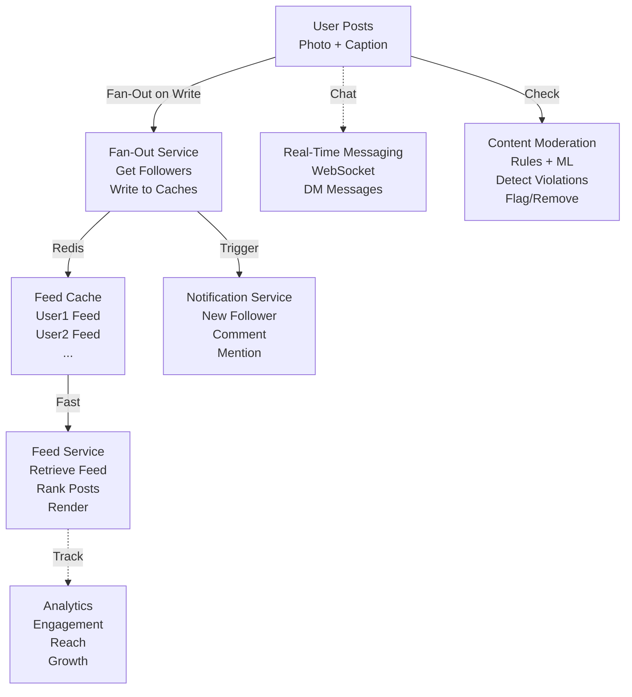

<Hero title="Social and Communication: Feeds, Fan-Out, and Content Moderation" subtitle="Real-time social graphs, efficient feed generation, and scale-safe content moderation" imageAlt="Social network with feed generation, real-time messaging, and moderation" size="large" />

## TL;DR

Social networks show **feeds** (timeline of posts from followed users). **Fan-out on write** (pre-compute when post created): post flows to all followers' feeds immediately. Fast reads, expensive writes (celebrity's post fans-out to 100M followers). **Fan-out on read** (compute when requested): slower reads, cheap writes. **Real-time messaging** uses WebSockets, polling, or push notifications. **Content moderation** uses rules + ML (hate speech, CSAM, spam). **Notifications** (push, email, in-app) inform users of activity. **Abuse prevention** flags spam, coordinated inauthentic behavior.

## Learning Objectives

- Design feed generation systems
- Choose fan-out on write vs read strategies
- Implement real-time messaging (WebSockets)
- Build content moderation pipelines
- Design notification systems
- Detect and prevent abuse

## Motivating Scenario

You launch a social network. User posts photo, instantly visible to 100,000 followers. Each follower's feed must refresh within 500ms. Two approaches: fan-out on write (push post to all followers' caches immediately) or fan-out on read (fetch followers' posts when user opens feed). Fan-out on write is fast (reads instant) but expensive (100M followers = 100M cache updates). Fan-out on read is cheaper but slow (fetch 1000 posts, sort, rank). Hybrid: use fan-out on write for normal users, fan-out on read for celebrities (too expensive to fan-out).

## Core Concepts

Social systems prioritize **engagement (speed, relevance) and safety (moderation, abuse prevention)**:

**Feed**: Chronological or ranked list of posts from followed users.

**Fan-Out on Write (FOW)**: When user posts, immediately write to all followers' feed caches. Fast reads.

**Fan-Out on Read (FOR)**: When user opens feed, fetch all followed users' posts, rank, return. Fast writes.

**Social Graph**: Who follows whom. Used to find followers and feed targets.

**Real-Time Messaging**: Instant communication (chat, DMs) via WebSocket, polling, or push.

**Content Moderation**: ML + rules to detect hate speech, CSAM, spam, and automatically remove/flag.

**Notifications**: Inform users of activity (new follower, comment, mention) via push/email/in-app.

**Ranking Algorithm**: What posts to show first (recency, engagement, user interests).

<Figure caption="Social network: Feed generation, real-time messaging, moderation">

</Figure>

### Key Concepts

**Timeline**: Chronological feed (most recent first).

**Algorithmic Feed**: Ranked by engagement, relevance. More engaging (higher conversion).

**Follower Graph**: Adjacency list or matrix. Used for fan-out.

**Lazy Materialization**: Don't pre-compute, generate on demand (more flexible).

**Abuse Patterns**: Spam (repetitive posts), harassment (targeted hate), coordinated inauthentic behavior (bot networks).

## Patterns and Pitfalls

<Showcase title="Patterns and Pitfalls" sections={[
  {
    title: "Pitfall: Fan-Out Explosion",
    description: "Celebrity posts, fan-out to 100M followers. 100M cache writes cause cascading failures.",
    fix: "Hybrid: FOW for normal users (< 10K followers), FOR for celebrities. Or eventual consistency."
  },
  {
    title: "Pitfall: Feed Stale",
    description: "User opens app, sees posts from 1 hour ago. Feels outdated, low engagement.",
    fix: "Real-time push: WebSocket or polling. Cache posts by timestamp, invalidate frequently."
  },
  {
    title: "Pattern: Moderation Pipeline",
    description: "Post submitted → rules check → ML model → human review if uncertain → decision.",
    fix: "Automated + human loop. ML for obvious cases, humans for borderline."
  },
  {
    title: "Pitfall: Lack of Abuse Detection",
    description: "Bot account posts 10,000 identical messages. Spam pollutes feed, users leave.",
    fix: "Rate limiting (max posts/hour). Account velocity analysis. Coordinated behavior detection."
  },
  {
    title: "Pattern: Tiered Moderation",
    description: "Remove (violation clear), suppress (reduce visibility), label (warn users, context).",
    fix: "Nuanced approach: not all violations = removal. Context matters."
  }
]} />

## Design Review Checklist

<Checklist items={[
  "Is feed generation strategy (FOW vs FOR) chosen based on user base?",
  "Can normal users' posts fan-out to followers without cascading failures?",
  "Is real-time messaging (chat, DMs) low-latency (< 1 second)?",
  "Is content moderation automated (rules + ML) with human escalation?",
  "Are notifications batched to avoid spam (max 5/hour)?",
  "Is abuse detection active (rate limiting, coordinated behavior)?",
  "Can you suppress/remove content rapidly (< 5 minutes)?",
  "Are feed rankings optimized for engagement without promoting bad content?",
  "Is user reporting of abuse handled promptly?",
  "Can you audit all moderation decisions (who, when, why)?"
]} />

## Self-Check

1. **Fan-out on write vs read?** FOW: fast reads, expensive writes. FOR: cheap writes, slow reads. Choose based on celebrity/normal user ratio.
2. **How to handle celebrity (100M followers)?** Can't FOW (100M writes). Use FOR or hybrid (FOW only to online followers).
3. **What's content moderation?** Detect violations (hate speech, CSAM) via rules + ML. Automated remove obvious, escalate uncertain to humans.

:::info
**One Takeaway**: Social platforms scale on engagement, but must moderate to prevent toxicity. Fast moderation (< 5 minutes) is critical.

:::

## Next Steps

- **Feed Ranking**: Recommendation systems, ML models (collaborative filtering, content-based)
- **Real-Time Messaging**: Socket.IO, Firebase, Pusher
- **Content Moderation**: Perspective API, Crisp, AWS Rekognition for CSAM
- **Analytics**: Spark, Kafka for event tracking
- **Spam Detection**: Anomaly detection, network analysis, bot detection

## Detailed Implementation Strategies

### Fan-Out on Write Implementation

```python
class FanOutOnWriteService:
    """Fan-out when user posts."""
    def __init__(self, social_graph_repo, feed_cache, notification_service):
        self.social_graph = social_graph_repo
        self.cache = feed_cache
        self.notifications = notification_service

    def post_published(self, post: Post):
        """Called when user publishes a post."""
        # Get all followers
        followers = self.social_graph.get_followers(post.user_id)

        # Batch writes to cache for efficiency
        cache_updates = []
        for follower_id in followers:
            cache_key = f"feed:{follower_id}"
            cache_updates.append((cache_key, post))

        # Write all at once (pipeline in Redis)
        self.cache.batch_add_to_list(cache_updates)

        # Send notifications asynchronously
        for follower_id in followers:
            self.notifications.notify_new_post(follower_id, post)

        # Track metrics
        metrics.counter('posts.published.fanout_count', len(followers))
```

**Pros**: Feed reads are instant (cache hit). User sees posts immediately.

**Cons**: Heavy load on celebrity posts (millions of followers). May need to fall back to fan-out on read for celebrities.

### Fan-Out on Read Implementation

```python
class FanOutOnReadService:
    """Compute feed when user opens app."""
    def __init__(self, social_graph_repo, post_repo, ranking_service):
        self.social_graph = social_graph_repo
        self.posts = post_repo
        self.ranking = ranking_service

    def get_feed(self, user_id: str, limit: int = 20) -> List[Post]:
        """Compute feed dynamically."""
        # Get following list
        following = self.social_graph.get_following(user_id)

        # Fetch recent posts from all following
        recent_posts = self.posts.get_recent_from_users(
            following, limit=limit * 3  # Get extra for ranking
        )

        # Rank posts (engagement, relevance, recency)
        ranked = self.ranking.rank_posts(recent_posts, user_id)

        # Return top N
        return ranked[:limit]
```

**Pros**: Works for celebrities (no expensive fan-out). Flexible ranking.

**Cons**: Feed computation is slower (200-500ms). Requires efficient database queries.

### Hybrid Approach

```python
class HybridFanOutService:
    """Use FOW for normal users, FOR for celebrities."""
    def __init__(self, social_graph, cache, post_repo, ranking):
        self.social_graph = social_graph
        self.cache = cache
        self.posts = post_repo
        self.ranking = ranking
        self.celebrity_threshold = 100000  # If >100k followers, use FOR

    def post_published(self, post: Post):
        """Publish post using optimal strategy."""
        follower_count = self.social_graph.get_follower_count(post.user_id)

        if follower_count > self.celebrity_threshold:
            # Celebrity: don't fan-out, will be discovered in FOR
            self._mark_for_discovery(post)
        else:
            # Normal user: fan-out to followers
            self._fanout_on_write(post)

    def get_feed(self, user_id: str) -> List[Post]:
        """Get feed using cached + discovered posts."""
        # Cached posts from followed non-celebrities
        cached = self.cache.get_feed(user_id)

        # Posts from followed celebrities (computed)
        following = self.social_graph.get_following(user_id)
        celebrity_posts = self.posts.get_recent_from_users(
            [u for u in following if self.is_celebrity(u)],
            limit=5
        )

        # Merge and rank
        all_posts = cached + celebrity_posts
        return self.ranking.rank_posts(all_posts, user_id)[:20]
```

## Real-Time Messaging (Chat, DMs)

WebSocket-based instant messaging:

```python
class RealtimeMessagingService:
    """WebSocket-based instant messaging."""
    def __init__(self, message_store, user_presence):
        self.messages = message_store
        self.presence = user_presence
        self.ws_connections = {}  # user_id -> [WebSocket]

    async def send_message(self, from_user: str, to_user: str, text: str):
        """Send DM with real-time delivery."""
        # Create message
        msg = Message(from_id=from_user, to_id=to_user, text=text, timestamp=now())

        # Persist
        await self.messages.save(msg)

        # If recipient online, push immediately
        if self.presence.is_online(to_user):
            for ws in self.ws_connections.get(to_user, []):
                await ws.send(json.dumps({
                    'type': 'new_message',
                    'from': from_user,
                    'text': text,
                    'timestamp': msg.timestamp
                }))
        else:
            # Offline: will fetch when they log in
            await self.messages.mark_unread(to_user, msg.id)

    async def subscribe_to_dms(self, user_id: str, ws: WebSocket):
        """WebSocket connection for DMs."""
        if user_id not in self.ws_connections:
            self.ws_connections[user_id] = []
        self.ws_connections[user_id].append(ws)

        # Mark user online
        await self.presence.mark_online(user_id)

        try:
            async for message in ws:
                # Process incoming messages
                data = json.loads(message)
                await self.send_message(user_id, data['to_user'], data['text'])
        finally:
            self.ws_connections[user_id].remove(ws)
            if not self.ws_connections[user_id]:
                await self.presence.mark_offline(user_id)
```

## Content Moderation Pipeline

Multi-layered moderation:

```python
class ContentModerationService:
    """Rules + ML + human review."""
    def __init__(self, rules_engine, ml_model, human_review_queue):
        self.rules = rules_engine
        self.ml = ml_model
        self.queue = human_review_queue

    async def moderate_post(self, post: Post) -> ModerationDecision:
        """Moderate post with multi-layer pipeline."""
        # Layer 1: Rule-based (spam, known CSAM hashes, etc.)
        rule_decision = self.rules.evaluate(post.content)
        if rule_decision.action == 'remove':
            return ModerationDecision(action='remove', reason='rule_violation', confidence=1.0)

        # Layer 2: ML model (hate speech, harassment, etc.)
        ml_result = await self.ml.predict(post.content)
        if ml_result.score > 0.9:  # High confidence
            if ml_result.category in ['hate_speech', 'violence']:
                return ModerationDecision(action='remove', reason=ml_result.category, confidence=ml_result.score)

        if ml_result.score > 0.7:  # Medium confidence
            # Human review
            await self.queue.enqueue({
                'post_id': post.id,
                'content': post.content,
                'reason': ml_result.category,
                'confidence': ml_result.score
            })
            # Meanwhile, suppress visibility
            return ModerationDecision(action='suppress', reason='pending_review')

        # Layer 3: Automated checks pass, post approved
        return ModerationDecision(action='approve', reason='passed_all_checks')
```

## Abuse Detection Patterns

Detecting spam, coordinated behavior, bot networks:

```python
class AbuseDetectionService:
    """Detect spam, bots, coordinated inauthentic behavior."""
    def __init__(self, user_repo, post_repo, graph_repo):
        self.users = user_repo
        self.posts = post_repo
        self.graph = graph_repo

    def detect_spam_account(self, user_id: str) -> AbuseScore:
        """Detect if account is a spam bot."""
        score = 0

        # Signal 1: Very high posting rate (e.g., >100 posts/day)
        post_count = self.posts.count_posts_today(user_id)
        if post_count > 100:
            score += 0.3

        # Signal 2: Low engagement ratio (posts many, gets few likes)
        avg_engagement = self.posts.get_avg_engagement(user_id)
        if avg_engagement < 0.01:  # < 1% of followers engage
            score += 0.2

        # Signal 3: New account with high activity
        user = self.users.get(user_id)
        if user.age_days < 7 and post_count > 20:
            score += 0.3

        # Signal 4: Follows/unfollows many users rapidly
        follow_churn = self.graph.get_follow_churn(user_id)
        if follow_churn > 500 / 3600:  # > 500 follows/hour
            score += 0.2

        return AbuseScore(user_id=user_id, spam_score=score)

    def detect_coordinated_behavior(self, user_ids: List[str]) -> bool:
        """Detect if group of accounts act in coordinated manner."""
        # Check if they post same content within short time window
        content_hashes = {}
        for user_id in user_ids:
            posts = self.posts.get_recent(user_id, limit=10)
            for post in posts:
                content_hash = hash(post.content)
                if content_hash in content_hashes:
                    content_hashes[content_hash] += 1
                else:
                    content_hashes[content_hash] = 1

        # If >50% of posts are duplicated, likely coordinated
        if max(content_hashes.values()) > len(user_ids) * 0.5:
            return True

        return False
```

## Feed Ranking Algorithms

What determines feed order (chronological vs algorithmic):

```python
class FeedRankingService:
    """Rank posts by engagement, relevance, recency."""
    def __init__(self, interaction_repo, user_graph):
        self.interactions = interaction_repo
        self.graph = user_graph

    def rank_posts(self, posts: List[Post], viewer_id: str) -> List[Post]:
        """Rank posts using multi-factor score."""
        scores = []

        for post in posts:
            score = self._calculate_score(post, viewer_id)
            scores.append((post, score))

        # Sort by score descending
        return [post for post, score in sorted(scores, key=lambda x: x[1], reverse=True)]

    def _calculate_score(self, post: Post, viewer_id: str) -> float:
        score = 0.0

        # Factor 1: Recency (recent posts scored higher)
        age_hours = (now() - post.created_at).total_seconds() / 3600
        recency = 1.0 / (1.0 + age_hours)  # Decay over time
        score += recency * 0.3

        # Factor 2: Engagement (likes, comments)
        engagement = post.likes + post.comments * 2  # Comments weighted more
        score += min(engagement / 1000, 1.0) * 0.3  # Cap at 1.0

        # Factor 3: Social relevance (from accounts you interact with often)
        follower = self.graph.get_user(post.author_id)
        if self.interactions.is_frequent_interactor(viewer_id, post.author_id):
            score += 0.2
        else:
            score += 0.05

        # Factor 4: Content quality (posts with images/videos rank higher)
        if post.media_type in ['image', 'video']:
            score += 0.15

        return score
```

## Notification System Design

Push, email, in-app notifications:

```python
class NotificationService:
    """Multi-channel notification delivery."""
    def __init__(self, push_service, email_service, db):
        self.push = push_service
        self.email = email_service
        self.db = db

    async def notify_new_follower(self, user_id: str, follower_id: str):
        """Notify user of new follower."""
        # Get user preferences
        prefs = self.db.get_notification_preferences(user_id)

        # Push notification (if enabled, real-time)
        if prefs.push_enabled:
            await self.push.send(user_id, {
                'title': f'{follower_id} started following you',
                'action': 'open_profile',
                'target': follower_id
            })

        # Email digest (batch, send once daily)
        if prefs.email_digest:
            await self.db.add_to_digest(user_id, 'new_follower', {
                'follower_id': follower_id,
                'timestamp': now()
            })

        # In-app notification (always shown)
        await self.db.create_notification(
            user_id=user_id,
            type='new_follower',
            data={'follower_id': follower_id},
            created_at=now()
        )
```

## References

- Xing, L., et al. (2011). "Comprehensive Vertex-Based Neighborhood Aggregation." (Social graphs) ↗️
- Facebook Engineering: "The Timeline Architecture." ↗️
- Twitter Engineering: "Real-Time Messaging." ↗️
- "Large-Scale Social Graph Processing" — Research paper on scalable social network algorithms
- Amazon SQS/SNS: "Building Real-Time Applications"
- Google Cloud Pub/Sub: "Message-Driven Architectures"
