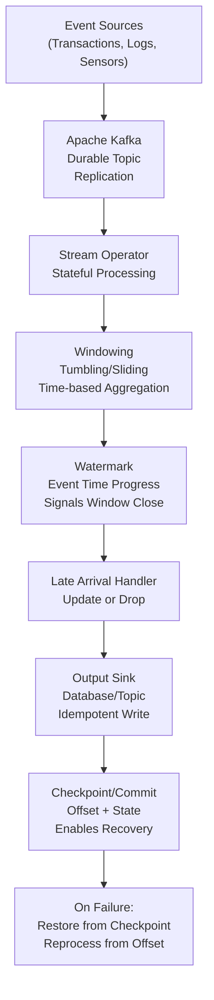

<Hero title="Streaming and Event Processing" subtitle="Exactly-once semantics, windowing, watermarks, checkpointing, and backpressure in unbounded data" imageAlt="Event stream processing with windowing and checkpointing" size="large" />

## TL;DR

Stream processing handles **unbounded, continuous data** from multiple sources (sensors, logs, user actions). Three key semantics: **at-most-once** (fastest, may lose data), **at-least-once** (some duplication, exactly-once achieved via deduplication), **exactly-once** (most expensive, requires checkpointing and idempotent updates). Kafka provides durable, replicated message queue. Flink/Spark offer windowing, watermarks, stateful processing. Watermarks coordinate event time vs processing time. Backpressure prevents overwhelming downstream systems.

## Learning Objectives

- Understand exactly-once vs at-least-once vs at-most-once semantics
- Design checkpoint-based fault tolerance
- Implement windowing and watermarks
- Handle late/out-of-order events
- Manage backpressure and flow control
- Choose streaming platform (Kafka, Flink, Spark)

## Motivating Scenario

You're building a real-time fraud detection system. Credit card transactions flow in from thousands of merchants. System must detect patterns (rapid purchases in distant cities, unusual amounts) and flag fraudulent transactions within **200 milliseconds**. Key challenges: transactions can arrive out of order (network delays), arrive late, or fail mid-processing. If a transaction is processed twice, the fraud score is corrupted. Exactly-once semantics are non-negotiable for financial accuracy.

## Core Concepts

Stream processing handles unbounded, continuous data with emphasis on **delivery guarantees** and **time semantics**:

**At-Most-Once**: Event processed ≤1 time. Fastest but data loss. Acceptable for metrics (sampling).

**At-Least-Once**: Event processed ≥1 time. Some duplication. Requires idempotent operations or deduplication.

**Exactly-Once**: Event processed exactly 1 time. Most expensive via transactions + snapshots.

**Event Time**: Timestamp when event actually occurred (transaction time). Key for correctness.

**Processing Time**: When system processes event. Affected by queuing, network delays.

**Watermark**: Marker indicating "all events before this timestamp have arrived" (approximately).

**Window**: Time-bounded aggregation (e.g., count transactions per 5-minute window).

**Checkpoint**: Snapshot of operator state + offset. Enables recovery without data loss.

<Figure caption="Streaming architecture: Event time vs processing time, watermarks, windowing">

</Figure>

### Key Concepts

**Idempotency**: Same update applied twice = same result. Essential for at-least-once.

**State Backend**: Where operator state lives (in-memory, RocksDB, external store).

**Savepoint**: Manual snapshot for code updates or debugging.

**Kafka Consumer Group**: Multiple processes read partition, with offset management.

**Exactly-Once via 2-Phase Commit**: Coordinated commit between Kafka offset and sink.

## Practical Example

<Tabs>
<TabItem value="python" label="Python (Simulation)" default>
```python
from collections import defaultdict
from dataclasses import dataclass
from typing import Dict, List, Tuple
import heapq
import time

@dataclass
class Event:
    event_id: str
    event_time: int  # seconds since epoch
    value: float
    processing_time: int = None  # set when received

class StreamProcessor:
    """Simplified streaming processor with windowing and watermarks."""

    def __init__(self, window_size_sec: int = 5, watermark_lag_sec: int = 2):
        self.window_size = window_size_sec
        self.watermark_lag = watermark_lag_sec
        self.events: List[Event] = []
        self.state: Dict[int, float] = defaultdict(float)
        self.watermark_time = 0
        self.offset = 0
        self.checkpoint = {"offset": 0, "state": {}}

    def ingest(self, event: Event):
        """Receive event and update watermark."""
        event.processing_time = int(time.time())
        self.events.append(event)
        heapq.heappush(self.events, (event.event_time, event))

    def watermark(self) -> int:
        """Calculate current watermark (max event_time - lag)."""
        if not self.events:
            return 0
        max_event_time = max(e.event_time for e in self.events)
        return max_event_time - self.watermark_lag

    def window_key(self, event_time: int) -> int:
        """Map event_time to window start."""
        return (event_time // self.window_size) * self.window_size

    def process(self):
        """Process events up to watermark."""
        current_watermark = self.watermark()

        # Process all events before watermark
        events_to_process = [e for e in self.events if e.event_time < current_watermark]
        events_to_process.sort(key=lambda e: e.event_time)

        for event in events_to_process:
            # Idempotent: process event, update state
            window = self.window_key(event.event_time)
            self.state[window] += event.value
            self.offset += 1

        # Remove processed events
        self.events = [e for e in self.events if e.event_time >= current_watermark]

        # Checkpoint: save offset and state
        self.checkpoint["offset"] = self.offset
        self.checkpoint["state"] = dict(self.state)

    def get_windowed_results(self) -> Dict[int, float]:
        """Get aggregated windows."""
        return dict(self.state)

    def recover_from_checkpoint(self):
        """Restore from checkpoint after failure."""
        self.offset = self.checkpoint["offset"]
        self.state = self.checkpoint["state"].copy()
        print(f"Recovered: offset={self.offset}, state keys={len(self.state)}")

# Example: Process transaction stream
processor = StreamProcessor(window_size_sec=5, watermark_lag_sec=2)

# Simulate events arriving out of order
events_in = [
    Event("tx1", event_time=10, value=100),
    Event("tx2", event_time=12, value=150),  # Out of order
    Event("tx3", event_time=8, value=200),   # Late arrival
    Event("tx4", event_time=15, value=50),
    Event("tx5", event_time=20, value=300),
    Event("tx6", event_time=19, value=100),
]

for event in events_in:
    processor.ingest(event)
    processor.process()
    results = processor.get_windowed_results()
    print(f"Window {processor.window_key(event.event_time)}: {results.get(processor.window_key(event.event_time), 0)}")

print(f"\nFinal state: {processor.get_windowed_results()}")
print(f"Checkpoint: offset={processor.checkpoint['offset']}")

# Simulate failure and recovery
print("\n--- Simulating failure ---")
processor.recover_from_checkpoint()
print(f"Recovered state: {processor.state}")
```
</TabItem>
<TabItem value="go" label="Go (Event Stream)">
```go
package main

import (
	"fmt"
	"sort"
	"sync"
	"time"
)

type Event struct {
	EventID        string
	EventTime      int64 // seconds
	Value          float64
	ProcessingTime int64
}

type StreamProcessor struct {
	windowSize   int64
	watermarkLag int64
	events       []*Event
	state        map[int64]float64
	offset       int
	checkpoint   map[string]interface{}
	mu           sync.Mutex
}

func NewStreamProcessor(windowSizeSec int64, watermarkLagSec int64) *StreamProcessor {
	return &StreamProcessor{
		windowSize:   windowSizeSec,
		watermarkLag: watermarkLagSec,
		events:       make([]*Event, 0),
		state:        make(map[int64]float64),
		checkpoint:   make(map[string]interface{}),
	}
}

func (sp *StreamProcessor) Ingest(event *Event) {
	sp.mu.Lock()
	defer sp.mu.Unlock()
	event.ProcessingTime = time.Now().Unix()
	sp.events = append(sp.events, event)
}

func (sp *StreamProcessor) Watermark() int64 {
	sp.mu.Lock()
	defer sp.mu.Unlock()
	if len(sp.events) == 0 {
		return 0
	}
	maxTime := sp.events[0].EventTime
	for _, e := range sp.events {
		if e.EventTime > maxTime {
			maxTime = e.EventTime
		}
	}
	return maxTime - sp.watermarkLag
}

func (sp *StreamProcessor) WindowKey(eventTime int64) int64 {
	return (eventTime / sp.windowSize) * sp.windowSize
}

func (sp *StreamProcessor) Process() {
	sp.mu.Lock()
	defer sp.mu.Unlock()

	wm := sp.Watermark()
	var toProcess []*Event

	for _, e := range sp.events {
		if e.EventTime < wm {
			toProcess = append(toProcess, e)
		}
	}

	sort.Slice(toProcess, func(i, j int) bool {
		return toProcess[i].EventTime < toProcess[j].EventTime
	})

	for _, e := range toProcess {
		window := sp.WindowKey(e.EventTime)
		sp.state[window] += e.Value
		sp.offset++
	}

	// Remove processed
	var remaining []*Event
	for _, e := range sp.events {
		if e.EventTime >= wm {
			remaining = append(remaining, e)
		}
	}
	sp.events = remaining

	// Checkpoint
	sp.checkpoint["offset"] = sp.offset
	stateCopy := make(map[int64]float64)
	for k, v := range sp.state {
		stateCopy[k] = v
	}
	sp.checkpoint["state"] = stateCopy
}

func (sp *StreamProcessor) GetResults() map[int64]float64 {
	sp.mu.Lock()
	defer sp.mu.Unlock()
	result := make(map[int64]float64)
	for k, v := range sp.state {
		result[k] = v
	}
	return result
}

func (sp *StreamProcessor) RecoverFromCheckpoint() {
	sp.mu.Lock()
	defer sp.mu.Unlock()
	sp.offset = sp.checkpoint["offset"].(int)
	if stateCopy, ok := sp.checkpoint["state"].(map[int64]float64); ok {
		sp.state = stateCopy
	}
	fmt.Printf("Recovered: offset=%d\n", sp.offset)
}

func main() {
	processor := NewStreamProcessor(5, 2)

	events := []*Event{
		{EventID: "tx1", EventTime: 10, Value: 100},
		{EventID: "tx2", EventTime: 12, Value: 150},
		{EventID: "tx3", EventTime: 8, Value: 200},
		{EventID: "tx4", EventTime: 15, Value: 50},
		{EventID: "tx5", EventTime: 20, Value: 300},
	}

	for _, e := range events {
		processor.Ingest(e)
		processor.Process()
		results := processor.GetResults()
		window := processor.WindowKey(e.EventTime)
		fmt.Printf("Window %d: %.0f\n", window, results[window])
	}

	results := processor.GetResults()
	fmt.Printf("\nFinal state: %v\n", results)

	fmt.Println("\n--- Simulating failure ---")
	processor.RecoverFromCheckpoint()
}
```
</TabItem>
<TabItem value="nodejs" label="Node.js (Event Stream)">
```javascript
class Event {
  constructor(eventId, eventTime, value) {
    this.eventId = eventId;
    this.eventTime = eventTime; // seconds
    this.value = value;
    this.processingTime = null;
  }
}

class StreamProcessor {
  constructor(windowSizeSec = 5, watermarkLagSec = 2) {
    this.windowSize = windowSizeSec;
    this.watermarkLag = watermarkLagSec;
    this.events = [];
    this.state = new Map();
    this.offset = 0;
    this.checkpoint = { offset: 0, state: {} };
  }

  ingest(event) {
    event.processingTime = Math.floor(Date.now() / 1000);
    this.events.push(event);
  }

  watermark() {
    if (this.events.length === 0) return 0;
    const maxTime = Math.max(...this.events.map(e => e.eventTime));
    return maxTime - this.watermarkLag;
  }

  windowKey(eventTime) {
    return Math.floor(eventTime / this.windowSize) * this.windowSize;
  }

  process() {
    const wm = this.watermark();

    const toProcess = this.events
      .filter(e => e.eventTime < wm)
      .sort((a, b) => a.eventTime - b.eventTime);

    for (const event of toProcess) {
      const window = this.windowKey(event.eventTime);
      const current = this.state.get(window) || 0;
      this.state.set(window, current + event.value);
      this.offset++;
    }

    // Remove processed
    this.events = this.events.filter(e => e.eventTime >= wm);

    // Checkpoint
    this.checkpoint.offset = this.offset;
    this.checkpoint.state = Object.fromEntries(this.state);
  }

  getResults() {
    return Object.fromEntries(this.state);
  }

  recoverFromCheckpoint() {
    this.offset = this.checkpoint.offset;
    this.state = new Map(Object.entries(this.checkpoint.state).map(
      ([k, v]) => [parseInt(k), v]
    ));
    console.log(`Recovered: offset=${this.offset}`);
  }
}

// Example
const processor = new StreamProcessor(5, 2);

const events = [
  new Event('tx1', 10, 100),
  new Event('tx2', 12, 150),
  new Event('tx3', 8, 200),
  new Event('tx4', 15, 50),
  new Event('tx5', 20, 300),
];

for (const event of events) {
  processor.ingest(event);
  processor.process();
  const results = processor.getResults();
  const window = processor.windowKey(event.eventTime);
  console.log(`Window ${window}: ${results[window] || 0}`);
}

console.log(`\nFinal state:`, processor.getResults());
console.log('Checkpoint offset:', processor.checkpoint.offset);

console.log('\n--- Simulating failure ---');
processor.recoverFromCheckpoint();
```
</TabItem>
</Tabs>

## When to Use / When Not to Use

<Vs items={[
{
    title: "Use Streaming When:",
    points: [
      "Processing unbounded, continuous data streams",
      "Sub-second latency required for results",
      "Event order/time matters for correctness",
      "Real-time fraud detection, recommendations, monitoring",
      "Complex windowing, stateful aggregations",
      "Need exactly-once guarantees"
    ]
  },
{
    title: "Avoid Streaming When:",
    points: [
      "Bounded, batch data (use batch processing)",
      "Latency of minutes/hours is acceptable",
      "Simple aggregations (standard SQL suffices)",
      "Operational complexity is a concern",
      "One-time historical analysis"
    ]
  }
]} />

## Patterns and Pitfalls

<Showcase title="Patterns and Pitfalls" sections={[
  {
    title: "Pitfall: Ignoring Late Events",
    description: "Event arrives after watermark closed. Data skipped, results incorrect.",
    fix: "Use late arrival handlers (update window, hold grace period, emit late-fire pane)."
  },
  {
    title: "Pitfall: Duplicate Processing",
    description: "At-least-once without deduplication. Fraud score counted twice, incorrect.",
    fix: "Idempotent operations (upsert vs insert). Deduplication window. Exactly-once semantics."
  },
  {
    title: "Pattern: Exactly-Once via 2-Phase Commit",
    description: "Kafka offset and sink update atomically. Either both succeed or both rollback.",
    fix: "Flink/Spark use transactional writes to idempotent sinks (database unique key)."
  },
  {
    title: "Pitfall: Backpressure Ignored",
    description: "Source produces faster than operator consumes. Memory exhausted, system crashes.",
    fix: "Implement backpressure: throttle source or buffer on disk. Kafka rebalancing."
  },
  {
    title: "Pattern: Stateful Processing with State Backends",
    description: "Operator state (aggregations) stored in RocksDB, snapshotted in checkpoints.",
    fix: "Choose state backend based on tradeoff: in-memory (fast), RocksDB (durable), external."
  }
]} />

## Design Review Checklist

<Checklist items={[
  "What delivery guarantee is required (at-most-once, at-least-once, exactly-once)?",
  "Is idempotency implemented in sinks (critical for at-least-once)?",
  "Are late-arriving events handled (grace period, late pane)?",
  "Is watermarking strategy appropriate for your data?",
  "Are windowing semantics correct (tumbling, sliding, session)?",
  "Is checkpoint/savepoint strategy tested for recovery?",
  "Can system handle out-of-order events?",
  "Is backpressure configured to prevent memory overflow?",
  "Are you monitoring watermark lag and event time drift?",
  "Is state backend appropriate (in-memory vs RocksDB vs external)?"
]} />

## Self-Check

1. **What's the difference between event time and processing time?** Event time: when event occurred (transaction time). Processing time: when system processes it (affected by network, queueing).
2. **Why is exactly-once hard?** Requires coordinated commit between source offset and sink. Also requires idempotent sinks to handle duplicate processing.
3. **What's a watermark?** Marker indicating "all events before this timestamp have (probably) arrived." Signals when to close a window.

:::info
**One Takeaway**: The gap between event time and processing time is where correctness lives. Watermarks bridge this gap, but understanding the tradeoff (latency vs completeness) is critical.

:::

## Next Steps

- **Kafka**: Topic design, consumer groups, exactly-once semantics (transactions)
- **Flink**: DataStream API, windowing, savepoints, distributed snapshots
- **Spark Streaming**: Micro-batch architecture, structured streaming
- **State Management**: RocksDB backends, incremental checkpoints
- **Monitoring**: Watermark lag, backpressure metrics, late event rates

## References

- Kreps, J. (2014). "The Log: What every software engineer should know about real-time data's unifying abstraction." ↗️
- Akidau, T., et al. (2015). *The Dataflow Model* (Google). ↗️
- Flink Documentation: Streaming Architecture. ↗️
