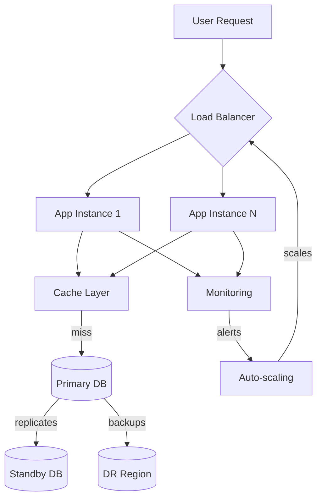

## What this is

The practical application of architectural principles to design end-to-end systems that work at scale. It bridges the gap between theory and implementation, covering capacity planning, multi-tenant data isolation, caching strategies, and disaster recovery. Essential when moving beyond single-service designs to systems that serve real users with real constraints.

## When to use it

- Designing new systems expected to serve thousands or millions of users with varying load patterns.
- Scaling existing applications beyond current capacity limits (database, compute, network).
- Multi-tenant Software as a Service (SaaS) products where tenant isolation and fair resource sharing matter.
- Business-critical systems where downtime costs exceed infrastructure investment (financial, healthcare, e-commerce).
- Global products requiring multi-region deployment with consistent user experience.
- Systems with strict performance requirements (sub-100ms latency, 99.99% availability, predictable costs).

## When not to

- Internal tools with well-understood, stable usage patterns and small user bases.
- Proof-of-concept applications where scalability requirements remain undefined.
- Single-region systems serving homogeneous user bases with relaxed performance requirements.
- Early-stage products where product-market fit takes priority over technical scalability.

## Core decisions

- Tenant isolation model: shared database with row-level security vs. database-per-tenant vs. hybrid approaches based on compliance and scale needs.
- Scalability strategy: horizontal scaling with load balancing vs. vertical scaling vs. auto-scaling policies that match traffic patterns.
- Caching layers: application-level, database query caching, Content Delivery Network (CDN), and cache invalidation strategies.
- Performance targets: specific latency (p95 < 200ms), throughput (requests per second), and availability Service Level Objectives (SLOs) with monitoring.
- Disaster recovery approach: Recovery Time Objective (RTO) and Recovery Point Objective (RPO) requirements that drive backup, replication, and failover strategies.
- Trade-off: system complexity vs. operational overhead — design for the scale needed today plus reasonable growth, not theoretical maximums.

## Mental model

_Figure: System components working together to handle scale, failure, and performance requirements._

## What to read next

- [Design multi-tenant systems with proper isolation](/docs/system-design/multitenancy)
- [Plan for growth with Scalability strategies](/docs/system-design/scalability)
- [Estimate system needs with Capacity and Performance modeling](/docs/system-design/capacity-performance)
- [Improve response times with Caching patterns](/docs/system-design/caching)
- [Build resilience with Multi-Region and Disaster Recovery](/docs/system-design/multi-region-dr)

:::note
Orientation: Scalability and Caching address immediate performance concerns, while Multitenancy and Disaster Recovery solve longer-term business requirements.
:::
