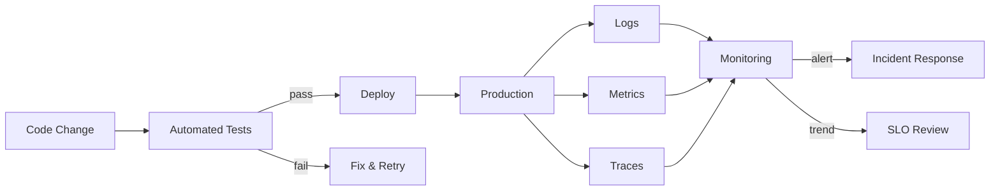

## What this is

The essential practices for proving systems work correctly and quickly diagnosing problems when they fail. It covers testing strategies from unit to end-to-end, proactive resilience testing through chaos engineering, Service Level Objectives (SLOs) definition, and observability through logging, metrics, and distributed tracing. Critical when system reliability directly affects user experience or business outcomes.

## When to use it

- Production systems where downtime or performance degradation has measurable business impact.
- Distributed architectures where failures cascade across service boundaries and root cause analysis becomes complex.
- High-frequency deployment environments where testing automation prevents regression and observability enables safe releases.
- Regulated industries requiring audit trails and precise incident response documentation.
- Growing teams where consistent testing practices and shared observability reduce knowledge silos and improve incident response time.
- Systems with strict Service Level Agreements (SLAs) where proactive monitoring and testing help maintain reliability commitments.

## When not to

- Simple applications with well-understood behavior and infrequent changes where basic monitoring suffices.
- Early-stage products where rapid iteration takes priority over comprehensive testing infrastructure.
- Internal tools with forgiving users where informal testing and basic logging meet reliability needs.
- Single-developer projects where the cognitive overhead of formal testing and observability exceeds the benefit.

## Core decisions

- Testing pyramid balance: unit tests for fast feedback vs. integration tests for interaction validation vs. end-to-end tests for user journey coverage.
- Observability strategy: structured logging for searchability vs. metrics for alerting vs. distributed tracing for request flow understanding.
- Service Level Objectives: defining specific, measurable reliability targets (99.9% availability, p95 latency under 200ms) with error budgets.
- Chaos engineering scope: controlled failure injection in staging vs. production testing vs. game day exercises for team preparation.
- Monitoring granularity: application-level business metrics vs. infrastructure metrics vs. synthetic monitoring for user experience validation.
- Trade-off: observability depth vs. performance overhead — each instrumentation point adds latency and storage costs that must justify their diagnostic value.

## Mental model

_Figure: Testing validates changes before deployment; observability monitors system health and guides incident response._

## What to read next

- [Build confidence with comprehensive Testing Strategies](/docs/testing-observability/testing-strategies)
- [Test resilience proactively with Chaos Engineering](/docs/testing-observability/chaos-engineering)
- [Define reliability targets with SLOs and Metrics](/docs/testing-observability/slos-metrics)
- [Capture system behavior with effective Logging](/docs/testing-observability/logging)
- [Monitor system health with key Metrics](/docs/testing-observability/metrics)
- [Understand request flow with distributed Tracing](/docs/testing-observability/tracing)

:::note
Orientation: Testing Strategies and SLOs provide the foundation for reliability practices. Logging, Metrics, and Tracing form the observability triad for production monitoring.
:::
