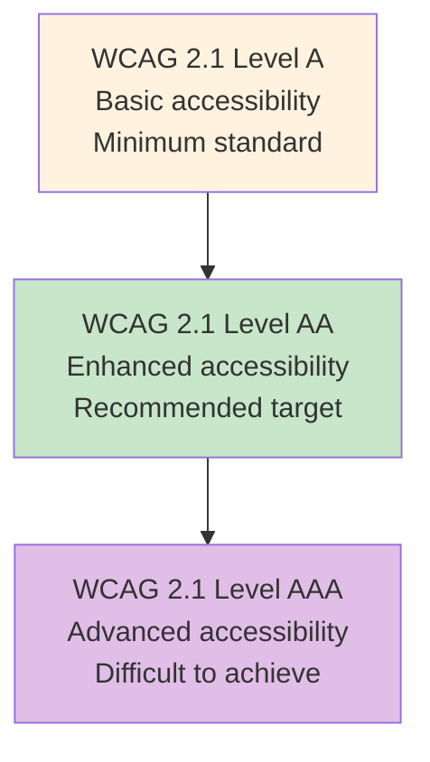

<Hero title="Accessibility Testing" subtitle="Ensure systems work for users with disabilities and comply with accessibility standards." size="large" />

## TL;DR

Accessibility testing ensures systems work for users with disabilities (visual, hearing, motor, cognitive). WCAG 2.1 is the standard: **Level A** (basic), **Level AA** (recommended), **Level AAA** (advanced). Most organizations target AA. Test for: color contrast (4.5:1 for normal text), alt text on images, keyboard navigation, screen reader compatibility, captions on videos, form labels. Use automated tools (axe, Lighthouse) to catch common issues; manual testing with actual assistive technologies (screen readers, magnifiers) to find edge cases. Accessibility is not an afterthought—design and test from the start.

## Learning Objectives

After reading this article, you will understand:

- WCAG 2.1 standards and accessibility levels (A, AA, AAA)
- Common accessibility issues and how to fix them
- Automated vs. manual accessibility testing
- How to test with assistive technologies (screen readers, voice control)
- Accessible design patterns and best practices
- How to integrate accessibility testing into development workflow

## Motivating Scenario

Your e-commerce site works great for most users. But when a blind user tries to purchase with a screen reader, they can't complete checkout because form fields aren't labeled. A hearing-impaired user can't watch your product demos because videos lack captions. A motor-impaired user can't navigate using just the keyboard because focus indicators are invisible.

Accessibility testing catches this: Automated tests find missing alt text and poor color contrast. Manual testing with actual assistive technologies uncovers keyboard navigation and screen reader issues. By testing with accessibility in mind, you serve all users.

## Core Concepts

### WCAG 2.1 Standards

<Figure caption="WCAG 2.1 defines three conformance levels; most target Level AA">

</Figure>

**Four Principles (POUR):**
1. **Perceivable**: Users can see/hear content (color contrast, alt text, captions)
2. **Operable**: Users can navigate (keyboard, focus indicators, no traps)
3. **Understandable**: Content is clear (plain language, consistent labels)
4. **Robust**: Works with assistive technologies (semantic HTML, ARIA labels)

### Common Accessibility Issues and Fixes

| Issue | Problem | Fix |
|-------|---------|-----|
| Poor color contrast | Unreadable for low-vision users | Ensure 4.5:1 contrast ratio |
| Missing alt text | Images invisible to screen readers | Add descriptive alt text |
| No keyboard navigation | Can't use without mouse | Use Tab key, focus indicators |
| Unlabeled form fields | Screen readers can't explain fields | `<label>` tags or ARIA labels |
| No video captions | Deaf users can't watch | Add captions/transcripts |
| Unclear focus indicator | Can't see where keyboard is | Add visible focus styling |
| Color-only information | Colorblind users miss meaning | Use icons, patterns, labels too |

## Practical Example

<Tabs>
  <TabItem value="Accessible HTML" label="Accessible HTML" default>
```html
<!-- Inaccessible form -->
<form>
  Email: <input type="email" name="email">
  Password: <input type="password" name="password">
  <input type="checkbox"> Remember me
  <button>Login</button>
</form>

<!-- Accessible form -->
<form>
  <div class="form-group">
    <label for="email">Email address</label>
    <input type="email" id="email" name="email" required aria-describedby="email-help">
    <small id="email-help">We'll never share your email</small>
  </div>

  <div class="form-group">
    <label for="password">Password</label>
    <input type="password" id="password" name="password" required>
  </div>

  <div class="form-group">
    <input type="checkbox" id="remember" name="remember">
    <label for="remember">Remember me for 30 days</label>
  </div>

  <button type="submit">Login</button>
</form>

<!-- Accessible image -->


<!-- Inaccessible heading -->
<div style="font-size: 24px; font-weight: bold;">Products</div>

<!-- Accessible heading -->
<h1>Products</h1>

<!-- Accessible link (not "Click here") -->
<a href="/about">Learn more about our company</a>

<!-- Accessible video -->
<video controls>
  <source src="demo.mp4" type="video/mp4">
  <track kind="captions" src="demo-captions.vtt" srclang="en" label="English">
  Your browser doesn't support HTML5 video.
</video>

<!-- Accessible color with pattern -->
<div style="background: #ff0000; color: white;">
  Status: <span style="color: #ff0000;">❌</span> Failed
</div>
```
  </TabItem>
  <TabItem value="Automated Testing (Axe)">
```javascript
// Automated accessibility testing with Axe
const { AxeBuilder } = require('@axe-core/playwright');
const { chromium } = require('playwright');

describe('Accessibility Tests', () => {
  it('should pass accessibility checks on homepage', async () => {
    const browser = await chromium.launch();
    const page = await browser.newPage();
    await page.goto('https://example.com');

    // Run Axe accessibility scan
    const results = await new AxeBuilder({ page }).analyze();

    // Check for violations
    expect(results.violations).toHaveLength(0);
    expect(results.passes.length).toBeGreaterThan(0);

    await browser.close();
  });

  it('should check color contrast', async () => {
    const browser = await chromium.launch();
    const page = await browser.newPage();
    await page.goto('https://example.com');

    const results = await new AxeBuilder({ page })
      .withRules(['color-contrast'])
      .analyze();

    // Ensure no color contrast violations
    expect(results.violations).toHaveLength(0);

    await browser.close();
  });
});
```
  </TabItem>
  <TabItem value="Manual Testing Checklist">
```markdown
# Accessibility Manual Testing Checklist

## Keyboard Navigation
- [ ] Can navigate all interactive elements using Tab key
- [ ] Focus indicator is visible on every focusable element
- [ ] Can activate buttons/links with Enter key
- [ ] Can submit forms with Enter key
- [ ] No keyboard traps (focus doesn't get stuck)
- [ ] Tab order is logical and intuitive

## Screen Reader Testing (NVDA, JAWS, VoiceOver)
- [ ] All images have meaningful alt text (or marked as decorative)
- [ ] Form labels are associated with inputs
- [ ] Error messages are announced
- [ ] Page structure makes sense when read aloud
- [ ] Links have descriptive text ("Click here" is bad)
- [ ] Headings are semantic (h1, h2, etc.)

## Color and Contrast
- [ ] Text contrast is at least 4.5:1 (normal text) or 3:1 (large text)
- [ ] Information isn't conveyed by color alone
- [ ] Color picker tested with different color blindness types

## Visual Design
- [ ] Focus indicators are clearly visible
- [ ] Buttons are recognizable as clickable
- [ ] Text is not too small (at least 12px)
- [ ] Line spacing is adequate

## Content
- [ ] Captions or transcripts for audio/video
- [ ] Plain language (avoid jargon)
- [ ] Lists are semantic (not just line breaks)
- [ ] Tables have headers and structure

## Forms
- [ ] All inputs have labels
- [ ] Required fields are marked
- [ ] Error messages are clear and helpful
- [ ] Success messages are announced
- [ ] Form can be completed with keyboard alone

## Assistive Tech
- [ ] Tested with screen reader (NVDA, JAWS, VoiceOver)
- [ ] Tested with magnifier (200%+ zoom)
- [ ] Tested with voice control
- [ ] Tested with switch access (single-button navigation)
```
  </TabItem>
</Tabs>

## When to Use / When Not to Use

<Vs highlight={[1]} items={[
{
    label: "Use Accessibility Testing When:",
    points: [
      "You have any public-facing application or website",
      "You serve diverse users (government, healthcare, finance do)",
      "Legal compliance is required (ADA, WCAG mandates)",
      "You want to expand your audience to all users",
      "You're building features with rich interactions"
    ],
    highlightTone: "positive"
  },
{
    label: "Avoid (but reconsider):",
    points: [
      "Internal tools only (still should be accessible)",
      "No disabled users (yet—expand your audience)",
      "Too expensive to fix (it's usually cheaper than lawsuits)"
    ],
    highlightTone: "warning"
  }
]} />

## Patterns and Pitfalls

<Showcase title="Accessibility Testing Best Practices and Anti-Patterns" sections={[
  {
    label: "✓ Best Practices",
    body: "**Design for accessibility first**: Build accessible from the start; retrofitting is hard. **Test with real assistive tech**: Automated tools catch 30-40%; screen readers find the rest. **Follow semantic HTML**: Use proper tags (h1, label, button) not styled divs. **Provide alt text**: Describe images for screen reader users; include context. **Keyboard navigation everywhere**: Tab, Enter, Escape should work. **Test with actual users**: People with disabilities find issues you'll miss. **Define SLOs**: 'No critical violations' doesn't cut it; aim for AA. **Automate and manual**: Combine axe, Lighthouse with manual testing."
  ,
    body: "**Design for accessibility first**: Build accessible from the start; retrofitting is hard. **Test with real assistive tech**: Automated tools catch 30-40%; screen readers find the rest. **Follow semantic HTML**: Use proper tags (h1, label, button) not styled divs. **Provide alt text**: Describe images for screen reader users; include context. **Keyboard navigation everywhere**: Tab, Enter, Escape should work. **Test with actual users**: People with disabilities find issues you'll miss. **Define SLOs**: 'No critical violations' doesn't cut it; aim for AA. **Automate and manual**: Combine axe, Lighthouse with manual testing."
  ,
    highlightTone: "positive"
  },
  {
    label: "✗ Anti-Patterns",
    body: "**Ignoring accessibility**: Building without considering it. **Only automated testing**: Axe catches obvious issues; manual testing finds subtle ones. **Placeholder labels**: `<input placeholder='Email'>` is not a label. **Color-only**: Status shown only by color; add icons/text. **Skip keyboard**: 'Most users have mice' ignores disabled users. **Poor focus indicators**: Removing focus styling to look fancy; breaks keyboard nav. **No captions**: Videos without captions lock out deaf users. **Accessibility theater**: Running axe, seeing zero violations, claiming victory (doesn't mean it's accessible)."
  ,
    body: "**Ignoring accessibility**: Building without considering it. **Only automated testing**: Axe catches obvious issues; manual testing finds subtle ones. **Placeholder labels**: `<input placeholder='Email'>` is not a label. **Color-only**: Status shown only by color; add icons/text. **Skip keyboard**: 'Most users have mice' ignores disabled users. **Poor focus indicators**: Removing focus styling to look fancy; breaks keyboard nav. **No captions**: Videos without captions lock out deaf users. **Accessibility theater**: Running axe, seeing zero violations, claiming victory (doesn't mean it's accessible)."
  ,
    highlightTone: "warning"
  }
]} />

## Design Review Checklist

<Checklist items={[
  "WCAG 2.1 Level AA is the target (minimum: Level A)",
  "Color contrast is at least 4.5:1 for normal text",
  "All images have meaningful alt text",
  "Videos have captions and transcripts",
  "All form inputs have associated labels",
  "Keyboard navigation works for all interactive elements",
  "Focus indicators are visible and clear",
  "Page structure is semantic (h1, h2, lists, etc.)",
  "Link text is descriptive (not 'Click here')",
  "Error messages are clear and helpful",
  "No information conveyed by color alone",
  "Interactive elements are at least 44x44 pixels (touch targets)",
  "Automated testing (axe, Lighthouse) runs in CI/CD",
  "Manual testing with screen readers completed",
  "ARIA attributes used correctly (not div role=button)"
]} />

## Self-Check Questions

- **Q: What's the difference between WCAG A, AA, and AAA?** A: A = basic (bare minimum), AA = enhanced (recommended), AAA = advanced (hard to achieve). Most target AA.

- **Q: Why is alt text important?** A: Screen reader users can't see images. Alt text describes the image. Decorative images can have empty alt="".

- **Q: Can you just use color to show errors?** A: No. Color-blind users won't see it. Add an icon, text, or other indicator too.

- **Q: Is keyboard navigation just for screen reader users?** A: No. People with mobility disabilities use keyboard. Motor-impaired users use switch controls. Test keyboard thoroughly.

- **Q: Do we really need captions on videos?** A: Yes. Deaf users need them. Even hearing users in loud places appreciate captions.

## Next Steps

1. **Audit current accessibility** — Run Lighthouse, axe to find issues
2. **Prioritize fixes** — Critical (blocking access) → Important → Nice-to-have
3. **Define SLOs** — "No Level A violations; minimal Level AA"
4. **Make design accessible** — Semantic HTML, color contrast, spacing
5. **Test with assistive tech** — Screen readers, magnifiers, switch control
6. **Train the team** — Accessibility isn't QA's job; everyone owns it
7. **Automate testing** — axe, Lighthouse in CI/CD
8. **Involve users** — Test with actual people who use assistive tech

## References

1. <a href="https://www.w3.org/WAI/WCAG21/quickref/" target="_blank" rel="nofollow noopener noreferrer">WCAG 2.1 Quick Reference ↗️</a>
2. <a href="https://www.deque.com/axe/" target="_blank" rel="nofollow noopener noreferrer">Axe DevTools Accessibility Scanner ↗️</a>
3. <a href="https://www.nvaccess.org/" target="_blank" rel="nofollow noopener noreferrer">NVDA Screen Reader (Free) ↗️</a>
4. <a href="https://webaim.org/articles/contrast/" target="_blank" rel="nofollow noopener noreferrer">WebAIM Color Contrast Checker ↗️</a>
5. <a href="https://www.w3.org/WAI/test-evaluate/" target="_blank" rel="nofollow noopener noreferrer">W3C Testing and Evaluation ↗️</a>