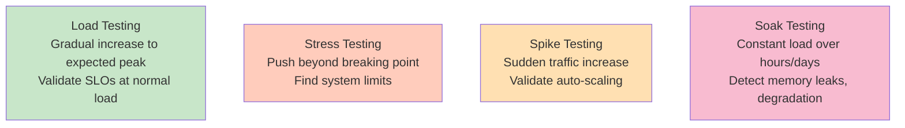

<Hero title="Performance, Load, Stress, Spike, and Soak Testing" subtitle="Validate latency, throughput, and scalability under various load conditions." size="large" />

## TL;DR

Performance testing validates system behavior under load. Different load patterns test different things: **Load testing** gradually increases to expected peak load and verifies P99 latency meets SLOs. **Stress testing** pushes beyond expected load to find breaking point. **Spike testing** suddenly increases load to validate auto-scaling. **Soak testing** runs constant load over hours/days to detect memory leaks and degradation. Use tools like JMeter, k6, or Locust. Run tests in staging (must mirror production). Automate in CI/CD for continuous performance validation. Define SLOs (e.g., P99 < 500ms) before testing; monitor during load tests.

## Learning Objectives

After reading this article, you will understand:

- The difference between load, stress, spike, and soak testing
- How to define performance SLOs and success criteria
- How to design realistic load tests
- How to interpret performance metrics (latency, throughput, error rate)
- Best practices for performance testing
- How to identify and fix performance bottlenecks

## Motivating Scenario

Your microservices platform handles 1,000 requests/second in production. During Black Friday, traffic spikes to 10,000 requests/second. You never tested at that scale; the system crashes. Auto-scaling is misconfigured, databases hit connection limits, and users experience timeouts.

Performance tests catch this: Load tests validate you handle expected peak (1,000 RPS). Spike tests validate auto-scaling when traffic suddenly jumps. Soak tests (running constant load for 24h) reveal memory leaks. Before production load hits, performance tests find and fix bottlenecks.

## Core Concepts

### Types of Performance Testing

<Figure caption="Different load patterns test different aspects of system resilience">

</Figure>

| Type | What | Why | Duration | Peak Load |
|------|------|-----|----------|-----------|
| **Load** | Gradual increase to expected peak | Validate SLOs | 20-60 min | 1x expected |
| **Stress** | Push beyond limits | Find breaking point | 10-30 min | 2-5x expected |
| **Spike** | Sudden jump in load | Validate auto-scaling | 5-15 min | 2-3x expected |
| **Soak** | Constant load over long time | Detect leaks, degradation | 4-24 hours | 0.5x expected |

### Key Metrics

**Latency (Response Time)**: How long requests take
- P50, P95, P99 percentiles (not average!)
- SLO example: "P99 < 500ms"

**Throughput**: Requests per second the system handles
- Measured at different load levels
- Find the plateau where throughput stops increasing

**Error Rate**: % of failed requests
- Should be 0% or very low (< 0.1%)
- Spike indicates breaking point

**Resource Utilization**: CPU, memory, disk, network
- CPU usually 70-80% at peak load (headroom for spikes)
- Memory should be stable (not growing = no leak)

## Practical Example

<Tabs>
  <TabItem value="k6 (JavaScript)" label="k6 (JavaScript)" default>
```javascript
// k6 load test: Gradual increase to expected peak
import http from 'k6/http';
import { check } from 'k6';

export const options = {
  stages: [
    { duration: '5m', target: 100 },    // Ramp up to 100 users
    { duration: '10m', target: 100 },   // Stay at 100 users
    { duration: '5m', target: 0 },      // Ramp down
  ],
  thresholds: {
    'http_req_duration': ['p(99)<500'],  // P99 latency < 500ms
    'http_req_failed': ['rate<0.01'],    // Error rate < 1%
  },
};

export default function() {
  // Simulate user fetching a product
  const res = http.get('https://api.example.com/products/123');

  check(res, {
    'status is 200': (r) => r.status === 200,
    'response time < 500ms': (r) => r.timings.duration < 500,
    'body contains product': (r) => r.body.includes('Product Name'),
  });
}

// Spike test: Sudden increase in load
export const spikeTest = {
  stages: [
    { duration: '2m', target: 100 },      // Normal load
    { duration: '2m', target: 500 },      // Sudden spike
    { duration: '3m', target: 500 },      // Sustain spike
    { duration: '2m', target: 100 },      // Back to normal
    { duration: '1m', target: 0 },        // Ramp down
  ],
  thresholds: {
    'http_req_duration': ['p(99)<1000'],  // Latency can increase during spike
    'http_req_failed': ['rate<0.05'],     // More failures during spike
  },
};

// Soak test: Constant load over extended time
export const soakTest = {
  stages: [
    { duration: '5m', target: 100 },      // Ramp up
    { duration: '8h', target: 100 },      // Constant load for 8 hours
    { duration: '5m', target: 0 },        // Ramp down
  ],
  thresholds: {
    'http_req_duration': ['p(99)<500'],
    'http_req_failed': ['rate<0.01'],
  },
};
```
  </TabItem>
  <TabItem value="JMeter (XML)">
```xml
<?xml version="1.0" encoding="UTF-8"?>
<jmeterTestPlan version="1.2">
  <hashTree>
    <!-- Load Test: Gradual ramp-up -->
    <ThreadGroup guiclass="ThreadGroupGui" testname="Load Test">
      <!-- Ramp up: 0-100 users over 5 minutes -->
      <elementProp name="ThreadGroup.main_controller" ... >
        <stringProp name="ThreadGroup.num_threads">100</stringProp>
        <stringProp name="ThreadGroup.ramp_time">300</stringProp>
        <elementProp name="ThreadGroup.main_controller" ... >
          <stringProp name="LoopController.loops">-1</stringProp>
          <boolProp name="LoopController.continue_forever">true</boolProp>
        </elementProp>
      </elementProp>
      <!-- Duration: 15 minutes total -->
      <stringProp name="ThreadGroup.scheduler">true</stringProp>
      <stringProp name="ThreadGroup.duration">900</stringProp>

      <!-- HTTP Request: GET /products/123 -->
      <ConfigTestElement guiclass="HttpDefaultsGui" testname="HTTP Request Defaults">
        <elementProp name="HTTPsampler.Arguments" ... >
          <stringProp name="HTTPSampler.domain">api.example.com</stringProp>
          <stringProp name="HTTPSampler.protocol">https</stringProp>
        </elementProp>
      </ConfigTestElement>

      <HTTPSamplerProxy guiclass="HttpTestSampleGui" testname="Get Product">
        <elementProp name="HTTPsampler.Arguments" ... >
          <stringProp name="HTTPSampler.path">/products/123</stringProp>
          <stringProp name="HTTPSampler.method">GET</stringProp>
        </elementProp>
      </HTTPSamplerProxy>

      <!-- Assertions -->
      <ResponseAssertion guiclass="AssertionGui" testname="Response Assertion">
        <stringProp name="Assertion.test_type">2</stringProp>
        <stringProp name="Assertion.test_strings">200</stringProp>
      </ResponseAssertion>

      <!-- Results: CSV file -->
      <ResultCollector guiclass="SimpleDataWriter" testname="Results File">
        <stringProp name="filename">results.csv</stringProp>
        <stringProp name="SampleSaveConfiguration.output_format">csv</stringProp>
      </ResultCollector>
    </ThreadGroup>
  </hashTree>
</jmeterTestPlan>
```
  </TabItem>
  <TabItem value="Locust (Python)">
```python
# Locust: Load testing in Python
from locust import HttpUser, task, between
import random

class ProductUser(HttpUser):
    """Simulate a user browsing products"""

    wait_time = between(1, 5)  # Wait 1-5 seconds between requests

    @task(3)
    def browse_products(self):
        """Browse products (3x as frequent as checkout)"""
        product_id = random.randint(1, 1000)
        response = self.client.get(f'/products/{product_id}')
        assert response.status_code == 200

    @task(1)
    def checkout(self):
        """Checkout (less frequent)"""
        response = self.client.post('/checkout', json={
            'items': [{'id': 1, 'quantity': 1}],
            'payment': 'credit_card'
        })
        assert response.status_code in [200, 201]

    def on_start(self):
        """Called when user starts"""
        # Login before making requests
        self.client.post('/login', json={
            'email': f'user{random.randint(1,10000)}@example.com',
            'password': 'password'
        })

if __name__ == '__main__':
    # Run with: locust -f locustfile.py --headless -u 100 -r 10 -t 10m
    # -u 100: 100 users
    # -r 10: ramp up 10 users/sec
    # -t 10m: run for 10 minutes
    pass
```
  </TabItem>
</Tabs>

## When to Use / When Not to Use

<Vs highlight={[1]} items={[
{
    label: "Use Performance Testing When:",
    points: [
      "You need to validate system meets latency SLOs",
      "You're approaching a major scale milestone (e.g., Black Friday)",
      "You've made infrastructure changes (database upgrade, new caching layer)",
      "You're introducing a new feature that might impact performance",
      "You want to establish baseline metrics before optimization"
    ],
    highlightTone: "positive"
  },
{
    label: "Avoid Performance Testing When:",
    points: [
      "You haven't defined SLOs (what are you validating?)",
      "Your staging environment doesn't mirror production",
      "You're testing individual function performance (use profilers instead)",
      "The cost of testing exceeds the risk of performance issues",
      "You have no way to implement changes based on test results"
    ],
    highlightTone: "warning"
  }
]} />

## Patterns and Pitfalls

<Showcase title="Performance Testing Best Practices and Anti-Patterns" sections={[
  {
    label: "✓ Best Practices",
    body: "**Define SLOs first**: Before testing, define success criteria (P99 < 500ms). **Realistic load patterns**: Simulate actual user behavior, not constant throughput. **Staging mirrors production**: Same database version, same infrastructure scale (at least proportionally). **Monitor resources**: Track CPU, memory, disk during tests; identify bottlenecks. **Separate concerns**: Test DB separately, cache separately, full stack together. **Document results**: Save baseline metrics; compare after changes. **Iterate**: Fix bottlenecks, retest; measure improvements. **Automate in CI/CD**: Run performance tests before releases; fail if SLOs violated."
  ,
    body: "**Define SLOs first**: Before testing, define success criteria (P99 < 500ms). **Realistic load patterns**: Simulate actual user behavior, not constant throughput. **Staging mirrors production**: Same database version, same infrastructure scale (at least proportionally). **Monitor resources**: Track CPU, memory, disk during tests; identify bottlenecks. **Separate concerns**: Test DB separately, cache separately, full stack together. **Document results**: Save baseline metrics; compare after changes. **Iterate**: Fix bottlenecks, retest; measure improvements. **Automate in CI/CD**: Run performance tests before releases; fail if SLOs violated."
  ,
    highlightTone: "positive"
  },
  {
    label: "✗ Anti-Patterns",
    body: "**No SLOs**: Testing without knowing success criteria. **Unrealistic load**: Constant 1000 RPS doesn't match actual traffic patterns (bursty). **Staging != production**: Testing on underpowered staging; results don't apply to production. **Load from wrong location**: Testing from office network; doesn't include geographic latency. **No baseline**: No before/after comparison; can't tell if changes helped. **Ignoring percentiles**: Only tracking average latency; P99 tells the real story. **Single test**: One load test doesn't prove scalability; test multiple scenarios. **No capacity planning**: Testing finds bottleneck but no plan to fix it."
  ,
    body: "**No SLOs**: Testing without knowing success criteria. **Unrealistic load**: Constant 1000 RPS doesn't match actual traffic patterns (bursty). **Staging != production**: Testing on underpowered staging; results don't apply to production. **Load from wrong location**: Testing from office network; doesn't include geographic latency. **No baseline**: No before/after comparison; can't tell if changes helped. **Ignoring percentiles**: Only tracking average latency; P99 tells the real story. **Single test**: One load test doesn't prove scalability; test multiple scenarios. **No capacity planning**: Testing finds bottleneck but no plan to fix it."
  ,
    highlightTone: "warning"
  }
]} />

## Design Review Checklist

<Checklist items={[
  "SLOs (Service Level Objectives) defined before testing",
  "Load test simulates realistic user behavior and traffic patterns",
  "Staging environment matches production in scale and configuration",
  "Database, cache, and third-party services are production-like",
  "Tests measure P50, P95, P99 latencies (not just averages)",
  "Throughput, error rate, and resource utilization tracked",
  "Load tests run for sufficient duration (at least 15-20 minutes)",
  "Spike tests validate auto-scaling works as expected",
  "Soak tests detect memory leaks and long-term degradation",
  "Tests fail if SLOs violated (gates deployment if needed)",
  "Results documented with baseline metrics for comparison",
  "Bottlenecks identified and prioritized for optimization",
  "Performance tests run in CI/CD (nightly or on demand)",
  "Team has capacity to implement changes based on results",
  "Monitoring dashboards created for metrics tracked in tests"
]} />

## Self-Check Questions

- **Q: What's the difference between load testing and stress testing?** A: Load testing validates SLOs at expected peak load. Stress testing pushes beyond breaking point to find system limits.

- **Q: Why measure P99 latency instead of average?** A: Average hides outliers. P99 means 99% of users see < that latency; the 1% who don't see poor performance.

- **Q: What causes latency spikes during load tests?** A: GC pauses, database connection pool exhaustion, resource contention. Identify by monitoring resource utilization during tests.

- **Q: Should you test from your office network?** A: No. Test from a location that simulates production geography. Latency varies by region.

- **Q: How often should you run performance tests?** A: Before major releases (always). Nightly for high-traffic services. Ad hoc when making performance-impacting changes.

## Next Steps

1. **Define SLOs** — P99 latency, error rate, throughput targets
2. **Design load scenarios** — Match actual traffic patterns
3. **Set up test environment** — Staging that mirrors production
4. **Run baseline tests** — Establish metrics before changes
5. **Identify bottlenecks** — CPU, memory, database, network?
6. **Implement fixes** — Cache, database tuning, autoscaling config
7. **Retest and compare** — Measure improvements
8. **Automate in CI/CD** — Run tests before releases

## References

1. <a href="https://k6.io/" target="_blank" rel="nofollow noopener noreferrer">k6 Performance Testing ↗️</a>
2. <a href="https://jmeter.apache.org/" target="_blank" rel="nofollow noopener noreferrer">Apache JMeter ↗️</a>
3. <a href="https://locust.io/" target="_blank" rel="nofollow noopener noreferrer">Locust Load Testing ↗️</a>
4. <a href="https://cloud.google.com/architecture/performance-testing" target="_blank" rel="nofollow noopener noreferrer">Google Cloud Performance Testing Guide ↗️</a>