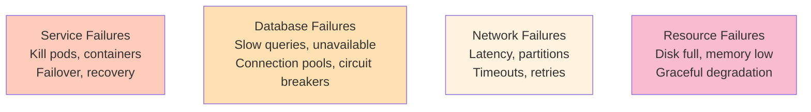

<Hero title="Resilience and Chaos Engineering" subtitle="Test how systems behave when things fail; improve resilience proactively." size="large" />

## TL;DR

Chaos engineering deliberately injects failures into your system to discover weaknesses before users encounter them. Instead of waiting for outages, you deliberately break things: kill pods, delete databases, add latency, simulate network partitions. Watch how the system responds. Run experiments in staging first, then in production with controls. Tools: Gremlin (SaaS), Chaos Toolkit (open-source), Pumba (Docker). Iterate: identify issues from failures, fix them, retest. Gamedays are simulated incidents where teams practice responding. Measure MTTR (Mean Time To Recovery); iterate to drive it down. Resilience is an ongoing practice.

## Learning Objectives

After reading this article, you will understand:

- Chaos engineering principles and motivation
- How to design failure scenarios and experiments
- How to run chaos tests safely in staging and production
- Tools for chaos engineering and fault injection
- How to organize gamedays and incident simulations
- How to measure and improve MTTR

## Motivating Scenario

Your microservices platform is running smoothly. One day, a database replica fails. Your connection pooling isn't configured correctly; all connections exhaust. The system goes down for 4 hours. Post-mortem: "We should have tested this scenario."

Chaos engineering prevents this: You deliberately kill a database replica in staging. You discover connection pooling breaks. You fix it. In production, when the real replica fails, your system gracefully degrades. MTTR drops from hours to minutes because you've practiced this scenario before.

## Core Concepts

### Failure Scenarios

<Figure caption="Common failure scenarios to test: services, databases, networks, resources">

</Figure>

| Scenario | How | What To Test |
|----------|-----|--------------|
| Service down | Kill pod/container | Failover, alerts, health checks |
| Database slow | Inject latency | Circuit breakers, timeouts, fallbacks |
| Network partition | Block traffic | Split-brain handling, consistency |
| Disk full | Fill filesystem | Graceful degradation, alerts |
| Memory leak | Reduce available memory | OOM handling, autoscaling |
| High CPU | CPU throttle | Performance, cascading failures |

## Practical Example

<Tabs>
  <TabItem value="Kubernetes Chaos" label="Kubernetes Chaos" default>
```yaml
# Chaos Mesh: Kill random pods in production namespace
apiVersion: chaos-mesh.org/v1alpha1
kind: PodChaos
metadata:
  name: kill-random-pods
  namespace: production
spec:
  action: pod-kill
  mode: random
  duration: 5m
  scheduler:
    cron: "0 2 * * *"  # 2 AM daily
  selector:
    namespaces:
      - production
    labelSelectors:
      app: api-server
  # Grace period for graceful shutdown
  gracePeriod: 30s
---
# Add latency to database connections
apiVersion: chaos-mesh.org/v1alpha1
kind: NetworkChaos
metadata:
  name: db-latency
spec:
  action: delay
  mode: all
  duration: 10m
  scheduler:
    cron: "0 3 * * *"
  selector:
    namespaces:
      - production
    labelSelectors:
      app: api-server
  delay:
    latency: "500ms"  # Add 500ms latency to DB
    jitter: "100ms"
  target:
    namespaces:
      - production
    labelSelectors:
      app: postgres-db
---
# Network partition: split brain scenario
apiVersion: chaos-mesh.org/v1alpha1
kind: NetworkChaos
metadata:
  name: network-partition
spec:
  action: partition
  mode: all
  duration: 2m
  selector:
    namespaces:
      - production
    labelSelectors:
      zone: us-east-1a
  target:
    namespaces:
      - production
    labelSelectors:
      zone: us-east-1b
```
  </TabItem>
  <TabItem value="Python (Chaos Toolkit)">
```python
# Chaos Toolkit: Comprehensive chaos experiments in Python
from chaoslib.extension import init_extension
from chaoslib.action import action
from chaosgke.pod.actions import kill_pod
import time

def setup_database_state():
    """Setup: Ensure test data exists"""
    # Create test database with known state
    conn = db.connect()
    cursor = conn.cursor()
    cursor.execute("CREATE TABLE test_orders (id INT, status VARCHAR)")
    cursor.execute("INSERT INTO test_orders VALUES (1, 'pending')")
    conn.commit()

def teardown():
    """Cleanup after experiment"""
    conn = db.connect()
    cursor = conn.cursor()
    cursor.execute("DROP TABLE test_orders")
    conn.commit()

@action
def inject_database_latency(duration_ms=500, target_namespace='production'):
    """Inject latency into database calls"""
    # This would use actual chaos toolkit libraries
    print(f"Injecting {duration_ms}ms latency for {target_namespace}")
    # Implementation: use iptables, tc (traffic control), or proxy middleware

@action
def verify_circuit_breaker_triggered():
    """After injecting latency, verify circuit breaker activates"""
    # Try to call DB-dependent service
    try:
        response = requests.get('http://api:8080/orders', timeout=2)
        if response.status_code == 503:  # Service unavailable
            print("Circuit breaker correctly triggered!")
            return True
    except requests.Timeout:
        print("Circuit breaker activated (timeout)")
        return True
    return False

@action
def verify_graceful_degradation():
    """Verify system degraded gracefully, not crashed"""
    # Check: primary features work, non-essential features disabled
    response = requests.get('http://api:8080/health')
    health = response.json()

    assert health['status'] == 'degraded'  # Not 'healthy', not 'down'
    assert 'orders' in health['disabled_services']  # DB unavailable
    assert 'search' in health['available_services']  # Cache still works
    print("Graceful degradation confirmed")
    return True

def experiment():
    """Run the chaos experiment"""
    setup_database_state()

    try:
        # Blast: Inject latency
        inject_database_latency(duration_ms=500, target_namespace='production')
        time.sleep(2)

        # Probe: Does circuit breaker activate?
        verify_circuit_breaker_triggered()

        # Verify: System degrades gracefully
        verify_graceful_degradation()

        print("Experiment passed!")
        return True
    except Exception as e:
        print(f"Experiment failed: {e}")
        return False
    finally:
        teardown()
```
  </TabItem>
  <TabItem value="Gameday Script">
```markdown
# Database Failure Gameday

## Objective
Practice responding to database replica failure. Validate MTTR < 5 min.

## Setup (10 min, 2:00 PM)
- Monitoring dashboards open on big screen
- Incident commander (IC), on-call engineers, SRE team present
- Communication channels open (Slack, Zoom)

## Scenario (2:10 PM)
**Chaos engineer injects:** Kill database replica-1
- Database connection pool exhaustion expected
- Slowness in read-heavy endpoints

## Expected Behavior
- Monitoring alerts fire (database CPU high, connection pool near limit)
- Team page via on-call escalation
- Engineers discover replica down
- Failover to replica-2 (should be automatic, but verify)
- System recovers to normal latency

## Metrics (throughout)
- Track latency P99 (should spike, then recover)
- Track error rate (should stay < 1%)
- Track MTTR (time from alert to recovery)

## Post-Game (2:30 PM, 20 min)
- What went well?
- What went badly?
- What did we learn?
- Create tickets to fix issues found

## Success Criteria
- MTTR < 5 minutes
- No manual intervention required (automatic failover works)
- All team members understood their roles
- Alerts fired correctly

## Failure Modes Discovered (and Fixed)
1. Failover didn't activate automatically (fix: PagerDuty alert wasn't configured)
2. Engineers didn't know how to check replica status (fix: added runbook)
3. Error rate spiked to 2% during failover (fix: configured circuit breaker)
```
  </TabItem>
</Tabs>

## When to Use / When Not to Use

<Vs highlight={[1]} items={[
{
    label: "Use Chaos Engineering When:",
    points: [
      "You have distributed systems with multiple failure points",
      "You want to discover weaknesses before users do",
      "MTTR (Mean Time To Recovery) is critical business metric",
      "You're building mission-critical systems (financial, healthcare, infrastructure)",
      "You want to practice incident response before real incidents"
    ],
    highlightTone: "positive"
  },
{
    label: "Avoid (or De-prioritize) When:",
    points: [
      "You haven't built monitoring and alerting yet (can't detect failures)",
      "You don't have runbooks or incident response processes",
      "Your system is too immature (focus on reliability first)",
      "Cost to run experiments exceeds value (very small systems)"
    ],
    highlightTone: "warning"
  }
]} />

## Patterns and Pitfalls

<Showcase title="Chaos Engineering Best Practices and Anti-Patterns" sections={[
  {
    label: "✓ Best Practices",
    body: "**Start in staging**: Never start chaos in production. Validate scenarios in staging first. **Define success criteria**: Before experiment, define what 'recovery' looks like. **Have rollback plan**: Chaos should have timeout/automatic stop. **Monitor everything**: Can't learn from failures you don't observe. **Automate incident response**: Chaos reveals gaps in automation. **Run regularly**: Quarterly gamedays keep skills sharp. **Share learnings**: Communicate results to team; update runbooks. **Measure MTTR**: Track improvement over time."
  ,
    body: "**Start in staging**: Never start chaos in production. Validate scenarios in staging first. **Define success criteria**: Before experiment, define what 'recovery' looks like. **Have rollback plan**: Chaos should have timeout/automatic stop. **Monitor everything**: Can't learn from failures you don't observe. **Automate incident response**: Chaos reveals gaps in automation. **Run regularly**: Quarterly gamedays keep skills sharp. **Share learnings**: Communicate results to team; update runbooks. **Measure MTTR**: Track improvement over time."
  ,
    highlightTone: "positive"
  },
  {
    label: "✗ Anti-Patterns",
    body: "**Chaos without monitoring**: Can't diagnose what went wrong. **No rollback**: Experiment hangs system for hours. **Too chaotic**: Multiple failures at once; can't isolate causes. **Theater**: Chaos experiments without learning anything. **Team not prepared**: Gameday happens; engineers panic; no improvement. **Ignoring failures found**: 'We found a bug but didn't fix it.' Defeats purpose. **Production chaos without controls**: Kill critical service; entire business down. **One-off experiments**: No institutional knowledge; next incident surprises you again."
  ,
    body: "**Chaos without monitoring**: Can't diagnose what went wrong. **No rollback**: Experiment hangs system for hours. **Too chaotic**: Multiple failures at once; can't isolate causes. **Theater**: Chaos experiments without learning anything. **Team not prepared**: Gameday happens; engineers panic; no improvement. **Ignoring failures found**: 'We found a bug but didn't fix it.' Defeats purpose. **Production chaos without controls**: Kill critical service; entire business down. **One-off experiments**: No institutional knowledge; next incident surprises you again."
  ,
    highlightTone: "warning"
  }
]} />

## Design Review Checklist

<Checklist items={[
  "Chaos experiments have defined success criteria",
  "Experiments start in staging, not production",
  "Each experiment has automatic rollback/timeout",
  "Monitoring dashboards set up before running chaos",
  "Incident response runbooks exist and are up-to-date",
  "Circuit breakers configured to fail gracefully",
  "Alerting rules tested (fire when they should)",
  "Team trained on roles (IC, responder, observer, chaos engineer)",
  "MTTR measured before and after experiments",
  "Post-game reviews scheduled and documented",
  "Findings converted to tickets and prioritized",
  "Gamedays run at least quarterly",
  "Communication channels established (Slack, Zoom, etc.)",
  "Graceful degradation tested (can system continue partially?)",
  "Automated failover validated (no manual intervention needed)"
]} />

## Self-Check Questions

- **Q: What's the difference between chaos engineering and testing?** A: Testing validates expected behavior. Chaos engineering discovers unexpected failures; you deliberately break things.

- **Q: Should we do chaos engineering in production?** A: Yes, but carefully. Start in staging. Once comfortable, run controlled chaos in production during low-traffic periods with rollback plan.

- **Q: What's MTTR and why does it matter?** A: Mean Time To Recovery = how long until system recovers from failure. Measured in minutes. Lower MTTR = better reliability. Chaos helps you practice and improve it.

- **Q: What's a gameday?** A: Simulated incident where team practices responding to a failure scenario. Reveals gaps in processes, tools, training.

- **Q: How do you measure if chaos engineering is working?** A: MTTR trend (should decrease over time). Incident severity (fewer critical incidents). Team confidence (engineers less stressed during real incidents).

## Next Steps

1. **Audit resilience** — What failures could hurt us most?
2. **Start small** — First chaos: kill non-critical service pod
3. **Set up monitoring** — Dashboards to observe chaos experiments
4. **Define SLOs** — Recovery time targets (e.g., < 5 min)
5. **Run gamedays** — Quarterly incident simulations
6. **Measure MTTR** — Track improvement over time
7. **Automate** — Failover, circuit breakers, health checks
8. **Iterate** — Each gameday finds issues; fix them; retest

## References

1. <a href="https://www.gremlin.com/" target="_blank" rel="nofollow noopener noreferrer">Gremlin Chaos Engineering Platform ↗️</a>
2. <a href="https://chaos-mesh.org/" target="_blank" rel="nofollow noopener noreferrer">Chaos Mesh (Kubernetes) ↗️</a>
3. <a href="https://chaostoolkit.org/" target="_blank" rel="nofollow noopener noreferrer">Chaos Toolkit (Open Source) ↗️</a>
4. <a href="https://www.oreilly.com/library/view/chaos-engineering/9781491988474/" target="_blank" rel="nofollow noopener noreferrer">Chaos Engineering Book (O'Reilly) ↗️</a>
5. <a href="https://principlesofchaos.org/" target="_blank" rel="nofollow noopener noreferrer">Principles of Chaos Engineering ↗️</a>