<Hero title="Security Testing, Pen Tests, and Fuzzing" subtitle="Identify and fix vulnerabilities before production." size="large" />

## TL;DR

Security testing finds vulnerabilities before attackers: SQL injection, XSS, auth flaws, data leaks, misconfigured permissions. Use automated scanning (SAST analyzes code, DAST tests running application), manual penetration testing by security experts, and fuzzing (send random/malformed input to find crashes). SAST runs on every commit (fast). DAST runs before release (takes longer). Penetration testing quarterly by experts. Fix critical vulnerabilities immediately (SLA: < 24h). Use OWASP Top 10 as a checklist. No security testing at the end—security is in every stage.

## Learning Objectives

After reading this article, you will understand:

- OWASP Top 10 vulnerabilities and how to prevent them
- Difference between SAST, DAST, and penetration testing
- Automated security scanning tools and how to use them
- Fuzzing and edge case testing for security
- Vulnerability management and remediation
- How to integrate security testing into development

## Motivating Scenario

Your authentication system has an input validation flaw. Attackers find it and compromise user accounts. Your security team says, "Should have done penetration testing." Developers say, "Should have used prepared statements." Both are right. Security testing—automated and manual—catches this before production.

## Core Concepts

### OWASP Top 10 (2021)

```mermaid
flowchart TB
    A["1. Broken Access Control<br/>Wrong permissions, bypassed"]
    B["2. Cryptographic Failures<br/>Weak/missing encryption"]
    C["3. Injection<br/>SQL, command, path traversal"]
    D["4. Insecure Design<br/>Missing threat modeling"]
    E["5. Security Misconfiguration<br/>Defaults, unpatched"]
    F["6. Vulnerable Components<br/>Outdated libraries"]
    G["7. Auth Failures<br/>Weak passwords, broken reset"]
    H["8. Data Integrity Failures<br/>Unsigned tokens, tampered data"]
    I["9. Logging Failures<br/>Not monitoring attacks"]
    J["10. SSRF<br/>Fetching unintended resources"]
    style A fill:#ffccbc
    style B fill:#ffe0b2
    style C fill:#fff3e0
    style D fill:#f8bbd0
```

<Figure caption="Top 10 security vulnerabilities organizations must address">

</Figure>

### Security Testing Types

| Type | Tools | When | Speed |
|------|-------|------|-------|
| **SAST** (Static) | SonarQube, Snyk | Every commit | < 5 min |
| **DAST** (Dynamic) | OWASP ZAP, Burp | Before release | 20-60 min |
| **Fuzzing** | libFuzzer, AFL | Edge cases | 1-24 hours |
| **Pen Testing** | Manual experts | Quarterly | 1-2 weeks |
| **Supply Chain** | Snyk, Dependabot | Every commit | < 5 min |

## Practical Example

<Tabs>
  <TabItem value="SAST (SonarQube)" label="SAST (SonarQube)" default>
```yaml
# GitHub Actions: Run SonarQube on every commit
name: SAST Security Scan
on: [push, pull_request]

jobs:
  sonarqube:
    runs-on: ubuntu-latest
    steps:
      - uses: actions/checkout@v3
      - name: SonarQube Scan
        uses: sonarsource/sonarcloud-github-action@master
        env:
          GITHUB_TOKEN: ${{ secrets.GITHUB_TOKEN }}
          SONAR_TOKEN: ${{ secrets.SONAR_TOKEN }}
```
  </TabItem>
  <TabItem value="DAST (OWASP ZAP)">
```bash
#!/bin/bash
# Run OWASP ZAP on staging environment

docker run -t owasp/zap2docker-stable zap-baseline.py \
  -t https://staging.example.com \
  -r zap-report.html \
  -J zap-report.json

# Exit with error if vulnerabilities found
if grep -q "risk: High" zap-report.html; then
  echo "High risk vulnerabilities found!"
  exit 1
fi
```
  </TabItem>
  <TabItem value="Fuzzing (libFuzzer)">
```cpp
// Fuzz test for URL parser
#include <stdint.h>
#include <stddef.h>
#include "url_parser.h"

extern "C" int LLVMFuzzerTestOneInput(const uint8_t *data, size_t size) {
  // Create a string from fuzzer input
  std::string input(reinterpret_cast<const char*>(data), size);

  // Try to parse URL with malformed input
  try {
    URLParser parser(input);
    parser.parse();
    // If no crash, fuzzer moves on
  } catch (...) {
    // If exception thrown, fuzzer logs it
  }

  return 0;
}
```
  </TabItem>
  <TabItem value="Dependency Scanning">
```yaml
# Snyk: Scan dependencies for vulnerabilities
name: Dependency Security Check
on: [push, pull_request]

jobs:
  snyk:
    runs-on: ubuntu-latest
    steps:
      - uses: actions/checkout@v3
      - uses: snyk/actions/setup@master
      - name: Snyk scan
        run: snyk test --severity-threshold=high
        env:
          SNYK_TOKEN: ${{ secrets.SNYK_TOKEN }}
```
  </TabItem>
</Tabs>

## When to Use / When Not to Use

<Vs highlight={[1]} items={[
{
    label: "Use Security Testing When:",
    points: [
      "You handle user data (PII, payments, credentials)",
      "You have public-facing applications",
      "You're in regulated industries (healthcare, finance)",
      "You process payments or sensitive information",
      "You have a compliance requirement (PCI-DSS, HIPAA, SOC2)"
    ],
    highlightTone: "positive"
  },
{
    label: "Avoid (but reconsider):",
    points: [
      "Internal tools with no internet access (still should be secure)",
      "Zero users yet (secure from the start)",
      "No data of value (false—all systems are targets)"
    ],
    highlightTone: "warning"
  }
]} />

## Patterns and Pitfalls

<Showcase title="Security Testing Best Practices and Anti-Patterns" sections={[
  {
    label: "✓ Best Practices",
    body: "**Defense in depth**: Multiple layers of security. **Shift left**: Security in every stage, not at the end. **Automated + manual**: Automation finds known vulns; experts find novel ones. **Patch management**: Keep dependencies up-to-date. **Threat modeling**: Design for security before coding. **Secrets management**: Never commit credentials. **Principle of least privilege**: Minimal permissions. **Monitor and log**: Detect attacks. **Incident response**: Plan for breaches; test the plan."
  ,
    body: "**Defense in depth**: Multiple layers of security. **Shift left**: Security in every stage, not at the end. **Automated + manual**: Automation finds known vulns; experts find novel ones. **Patch management**: Keep dependencies up-to-date. **Threat modeling**: Design for security before coding. **Secrets management**: Never commit credentials. **Principle of least privilege**: Minimal permissions. **Monitor and log**: Detect attacks. **Incident response**: Plan for breaches; test the plan."
  ,
    highlightTone: "positive"
  },
  {
    label: "✗ Anti-Patterns",
    body: "**Security by obscurity**: Relying on secrecy, not proper controls. **Only automated scanning**: Missing novel vulnerabilities. **No threat modeling**: Building without thinking about attacks. **Ignoring vulns**: 'Low severity, can wait.' Accumulates over time. **Hardcoded secrets**: Credentials in source code. **No logging**: Can't detect or investigate attacks. **Outdated dependencies**: Known vulns in libraries. **Reactive security**: Testing only after breaches."
  ,
    body: "**Security by obscurity**: Relying on secrecy, not proper controls. **Only automated scanning**: Missing novel vulnerabilities. **No threat modeling**: Building without thinking about attacks. **Ignoring vulns**: 'Low severity, can wait.' Accumulates over time. **Hardcoded secrets**: Credentials in source code. **No logging**: Can't detect or investigate attacks. **Outdated dependencies**: Known vulns in libraries. **Reactive security**: Testing only after breaches."
  ,
    highlightTone: "warning"
  }
]} />

## Design Review Checklist

<Checklist items={[
  "Input validation on all user inputs (no blind trust)",
  "SQL queries use parameterized statements (no string interpolation)",
  "Authentication strong (multi-factor, secure session handling)",
  "Authorization correct (least privilege, access control)",
  "Secrets stored in secure vaults, never hardcoded",
  "HTTPS enforced everywhere (no plaintext on network)",
  "Dependencies scanned for vulnerabilities (Snyk, Dependabot)",
  "SAST scanning runs on every commit (SonarQube, etc.)",
  "DAST scanning runs before release (OWASP ZAP, Burp)",
  "Logging captures security events (logins, failures, unauthorized access)",
  "Error messages don't leak sensitive info (no stack traces to users)",
  "Fuzzing conducted on parsers, decoders, complex inputs",
  "Penetration testing scheduled quarterly",
  "Vulnerability response SLA defined (critical < 24h)",
  "Developers trained on secure coding practices"
]} />

## Self-Check Questions

- **Q: What's the difference between SAST and DAST?** A: SAST analyzes source code (static). DAST tests running application (dynamic). Use both.

- **Q: Should I fix all vulnerabilities?** A: No—prioritize. Critical/high fixed immediately. Medium next sprint. Low as you have time.

- **Q: What's a vulnerability SLA?** A: Response time. Example: critical vulns fixed within 24h. High within 1 week.

- **Q: Can I just use prepared statements and be secure?** A: Prepared statements prevent SQL injection (common). But security needs defense in depth: validation, auth, logging, etc.

- **Q: How often should I do penetration testing?** A: Minimum quarterly. After major changes, more frequently.

## Next Steps

1. **Audit vulnerabilities** — Run SAST, DAST scans today
2. **Fix critical vulns** — Immediately
3. **Define SLAs** — Response times by severity
4. **Automate scanning** — SAST on every commit, DAST nightly
5. **Train developers** — Secure coding practices
6. **Threat modeling** — Design for security
7. **Incident plan** — What to do if breached?
8. **Penetration testing** — Quarterly by experts

## References

1. <a href="https://owasp.org/Top10/" target="_blank" rel="nofollow noopener noreferrer">OWASP Top 10 ↗️</a>
2. <a href="https://www.sonarqube.org/" target="_blank" rel="nofollow noopener noreferrer">SonarQube SAST ↗️</a>
3. <a href="https://snyk.io/" target="_blank" rel="nofollow noopener noreferrer">Snyk Vulnerability Scanning ↗️</a>
4. <a href="https://www.zaproxy.org/" target="_blank" rel="nofollow noopener noreferrer">OWASP ZAP DAST ↗️</a>
5. <a href="https://libfuzzer.info/" target="_blank" rel="nofollow noopener noreferrer">libFuzzer ↗️</a>