<Hero title="CI/CD Integration" subtitle="Run tests automatically; gate deployments; fail fast." size="large" />

## TL;DR

Continuous Integration (CI) runs tests automatically on every commit, providing rapid feedback before code reaches production. Build a pipeline: unit tests (< 5 min) on every commit, integration tests (5-15 min) on PR or after, contract tests (2-5 min) on API changes, E2E tests (10-30 min) on nightly or pre-release, security scanning (5-10 min) on every commit, performance tests (15-60 min) on releases. Use GitHub Actions, GitLab CI, or Jenkins. Gate deployments: fail if tests fail, coverage drops, security issues found. Monitor lead time (commit → production), deployment frequency, MTTR, change failure rate. Fast feedback loops (< 15 min to know if commit is good) drive quality and velocity.

## Learning Objectives

After reading this article, you will understand:

- How to design CI/CD pipelines for testing
- Which tests run when (commit, PR, nightly, release)
- Deployment gates and quality checks
- How to balance speed vs. thoroughness
- Key metrics: lead time, deployment frequency, MTTR
- Best practices for CI/CD implementation

## Motivating Scenario

Developers push code without testing. A week later, integration fails and blocks release. Another developer pushed a change that broke database compatibility; no one caught it. With CI, every commit runs tests immediately. Breaking changes fail in CI, not production. Developers get feedback in 15 minutes, not a week.

## Core Concepts

### Test Pipeline Stages

```mermaid
flowchart LR
    A["Commit"] -->|< 5 min| B["Unit Tests"]
    B -->|Pass| C["Integration Tests"]
    C -->|Pass| D["Contract Tests"]
    D -->|Pass| E["Security Scan"]
    E -->|Pass| F["E2E Tests"]
    F -->|Pass| G["Deploy to Staging"]
    G -->|Manual Approval| H["Deploy to Production"]
    style A fill:#c8e6c9
    style B fill:#fff9c4
    style C fill:#ffe0b2
    style D fill:#f3e5f5
    style E fill:#ffccbc
    style F fill:#e3f2fd
    style G fill:#c8e6c9
    style H fill:#c8e6c9
```

<Figure caption="Typical CI/CD pipeline: quick feedback early, thorough testing late">

</Figure>

| Stage | Tests | Time | Runs |
|-------|-------|------|------|
| Commit | Unit, lint, static analysis | < 5 min | Every commit |
| PR | Integration, contracts | 5-15 min | Every PR |
| Pre-release | E2E, perf, security DAST | 30-60 min | Before release |
| Nightly | Full suite, chaos, soak | 4+ hours | Off-hours |

### Key Metrics

- **Lead Time**: Commit → production. Target: hours, not days.
- **Deployment Frequency**: How often you release. Target: daily.
- **MTTR**: Mean time to recover from failure. Target: < 15 min.
- **Change Failure Rate**: % of deployments causing incidents. Target: < 15%.

## Practical Example

<Tabs>
  <TabItem value="GitHub Actions" label="GitHub Actions" default>
```yaml
name: CI/CD Pipeline
on: [push, pull_request]

jobs:
  test:
    runs-on: ubuntu-latest
    steps:
      - uses: actions/checkout@v3

      # Unit tests: fast, run first
      - name: Run Unit Tests
        run: npm test -- --coverage

      - name: Check Coverage
        run: npm run coverage:check -- --threshold=80

      # Lint and static analysis
      - name: Lint Code
        run: npm run lint

      # Security scanning
      - name: SAST Scan
        uses: sonarsource/sonarcloud-github-action@master

      # Integration tests (only on PR)
      - name: Run Integration Tests
        if: github.event_name == 'pull_request'
        run: npm run test:integration

      # Build
      - name: Build
        run: npm run build

  # E2E tests: slower, conditional
  e2e:
    if: github.event_name == 'pull_request'
    runs-on: ubuntu-latest
    steps:
      - uses: actions/checkout@v3
      - name: Install dependencies
        run: npm ci
      - name: Build
        run: npm run build
      - name: E2E Tests
        run: npm run test:e2e

  # Deploy to staging (after tests pass)
  deploy-staging:
    if: github.ref == 'refs/heads/main'
    needs: [test, e2e]
    runs-on: ubuntu-latest
    steps:
      - uses: actions/checkout@v3
      - name: Deploy to Staging
        run: ./scripts/deploy.sh staging
        env:
          DEPLOY_KEY: ${{ secrets.DEPLOY_KEY }}
```
  </TabItem>
  <TabItem value="GitLab CI">
```yaml
stages:
  - test
  - build
  - deploy-staging
  - deploy-prod

variables:
  DOCKER_IMAGE: registry.gitlab.com/$CI_PROJECT_PATH:$CI_COMMIT_SHA

# Unit tests
unit-tests:
  stage: test
  image: node:18
  script:
    - npm ci
    - npm test -- --coverage
    - npm run coverage:check -- --threshold=80
  coverage: '/Coverage: \d+%/'
  artifacts:
    reports:
      coverage_report:
        coverage_format: cobertura
        path: coverage/cobertura-coverage.xml

# Integration tests
integration-tests:
  stage: test
  image: node:18
  script:
    - npm ci
    - npm run test:integration
  only:
    - merge_requests

# E2E tests
e2e-tests:
  stage: test
  image: node:18
  script:
    - npm ci
    - npm run build
    - npm run test:e2e
  only:
    - merge_requests

# Build Docker image
build:
  stage: build
  image: docker:latest
  script:
    - docker login -u $CI_REGISTRY_USER -p $CI_REGISTRY_PASSWORD $CI_REGISTRY
    - docker build -t $DOCKER_IMAGE .
    - docker push $DOCKER_IMAGE

# Deploy to staging
deploy-staging:
  stage: deploy-staging
  script:
    - ./scripts/deploy.sh staging $DOCKER_IMAGE
  only:
    - main

# Manual deploy to production
deploy-prod:
  stage: deploy-prod
  script:
    - ./scripts/deploy.sh production $DOCKER_IMAGE
  only:
    - main
  when: manual
```
  </TabItem>
  <TabItem value="Pipeline Config">
```yaml
# Generic CI/CD pipeline configuration
pipeline:
  fast:
    # < 5 minutes: commit-level checks
    - unit_tests:
        timeout: 5m
        required: true  # Fail if fails
    - linting:
        timeout: 2m
        required: true
    - static_analysis:
        timeout: 3m
        required: true

  medium:
    # 5-20 minutes: PR-level checks
    - integration_tests:
        timeout: 15m
        required: true
        only: [pull_request]
    - contract_tests:
        timeout: 5m
        required: true
    - security_sast:
        timeout: 10m
        required: true

  slow:
    # 20-60 minutes: release-level checks
    - e2e_tests:
        timeout: 30m
        required: for_release
        only: [main]
    - performance_tests:
        timeout: 45m
        required: for_release
    - security_dast:
        timeout: 30m
        required: for_release

  nightly:
    # 4+ hours: thorough testing
    - soak_tests:
        timeout: 8h
        schedule: "0 2 * * *"
    - chaos_engineering:
        timeout: 2h
        schedule: "0 4 * * *"

deployments:
  staging:
    trigger: main
    after: [fast, medium, e2e]
    approval: automatic

  production:
    trigger: main
    after: [staging]
    approval: manual
    required_checks:
      - all_tests_pass
      - coverage >= 80%
      - no_critical_security_issues
```
  </TabItem>
</Tabs>

## When to Use / When Not to Use

<Vs highlight={[1]} items={[
{
    label: "Use CI/CD When:",
    points: [
      "You have multiple developers/branches",
      "You deploy frequently (daily or more)",
      "You want rapid feedback (minutes, not hours)",
      "Quality is important (catch bugs early)",
      "You value deployment reliability"
    ],
    highlightTone: "positive"
  },
{
    label: "Avoid (or Simplify) When:",
    points: [
      "Solo developer, no branching (still good practice)",
      "Deploy once a year (automate anyway)",
      "No automated tests yet (set up tests first)"
    ],
    highlightTone: "warning"
  }
]} />

## Patterns and Pitfalls

<Showcase title="CI/CD Best Practices and Anti-Patterns" sections={[
  {
    label: "✓ Best Practices",
    body: "**Fast feedback**: Commits should know pass/fail in < 15 min. **Stage tests by speed**: Fast tests first (unit), slow tests last (E2E). **Gate deployments**: Fail if tests fail, coverage drops, security issues. **Monitor metrics**: Lead time, deployment frequency, MTTR. **Parallel runs**: Run independent stages concurrently. **Cache dependencies**: Don't re-download npm/pip every run. **Logs & artifacts**: Save test reports for investigation. **Notification**: Slack/email when CI fails; unblock developers."
  ,
    body: "**Fast feedback**: Commits should know pass/fail in < 15 min. **Stage tests by speed**: Fast tests first (unit), slow tests last (E2E). **Gate deployments**: Fail if tests fail, coverage drops, security issues. **Monitor metrics**: Lead time, deployment frequency, MTTR. **Parallel runs**: Run independent stages concurrently. **Cache dependencies**: Don't re-download npm/pip every run. **Logs & artifacts**: Save test reports for investigation. **Notification**: Slack/email when CI fails; unblock developers."
  ,
    highlightTone: "positive"
  },
  {
    label: "✗ Anti-Patterns",
    body: "**Slow CI**: 30+ minutes for feedback; developers ignore it. **No gates**: Tests fail but deployment proceeds. **Flaky tests in CI**: Tests pass locally, fail in CI; noise. **No parallelization**: Tests run sequentially; slow. **Ignore metrics**: No visibility into lead time, MTTR. **No logging**: CI fails; no idea why. **Manual deployment**: No automation; error-prone. **Skip security/perf**: 'Too slow for CI; test later'; problems in production."
  ,
    body: "**Slow CI**: 30+ minutes for feedback; developers ignore it. **No gates**: Tests fail but deployment proceeds. **Flaky tests in CI**: Tests pass locally, fail in CI; noise. **No parallelization**: Tests run sequentially; slow. **Ignore metrics**: No visibility into lead time, MTTR. **No logging**: CI fails; no idea why. **Manual deployment**: No automation; error-prone. **Skip security/perf**: 'Too slow for CI; test later'; problems in production."
  ,
    highlightTone: "warning"
  }
]} />

## Design Review Checklist

<Checklist items={[
  "Fast stage (unit, lint) runs on every commit, < 5 min",
  "Medium stage (integration, contracts) runs on PR, < 15 min",
  "Slow stage (E2E, perf) runs pre-release or nightly",
  "Pipeline fails if tests fail (gates deployment)",
  "Coverage gates enforced (e.g., > 80%)",
  "Security scanning runs automatically",
  "Flaky tests identified and quarantined",
  "Parallelization used to speed up pipeline",
  "Logs and artifacts saved for debugging",
  "Notifications alert developers of failures",
  "Deployment gates prevent broken code reaching production",
  "Performance benchmarks tracked over time",
  "Metrics monitored: lead time, deployment frequency, MTTR",
  "Dependencies cached (npm, pip, etc.)",
  "Manual approval required for production"
]} />

## Self-Check Questions

- **Q: How fast should CI be?** A: < 15 min for feedback on every commit. Slow CI defeats purpose (developers ignore it).

- **Q: Should E2E tests run on every commit?** A: No, too slow. Run on PR or nightly. Run faster tests (unit, integration) on every commit.

- **Q: What does 'gate' mean?** A: Deployment is blocked if tests fail. Can't deploy without passing gates.

- **Q: Why monitor lead time?** A: It measures how fast you can ship. Lower lead time = faster iteration = competitive advantage.

- **Q: What if CI is flaky?** A: Quarantine flaky tests immediately. Fix root cause. Re-enable. Flaky CI is worse than no CI.

## Next Steps

1. **Set up CI/CD** — GitHub Actions, GitLab CI, or Jenkins
2. **Stage tests** — Fast (< 5 min) run first; slow run late
3. **Gate deployments** — Tests must pass before deployment
4. **Monitor metrics** — Lead time, deployment frequency, MTTR
5. **Improve pipeline** — Cache, parallelize, optimize
6. **Notify developers** — Slack/email on failures
7. **Fix flakiness** — Quarantine and fix flaky tests
8. **Iterate** — Measure improvements; keep optimizing

## References

1. <a href="https://github.com/features/actions" target="_blank" rel="nofollow noopener noreferrer">GitHub Actions ↗️</a>
2. <a href="https://docs.gitlab.com/ee/ci/" target="_blank" rel="nofollow noopener noreferrer">GitLab CI/CD ↗️</a>
3. <a href="https://www.jenkins.io/" target="_blank" rel="nofollow noopener noreferrer">Jenkins ↗️</a>
4. <a href="https://circleci.com/" target="_blank" rel="nofollow noopener noreferrer">CircleCI ↗️</a>
5. <a href="https://cloud.google.com/solutions/continuous-delivery" target="_blank" rel="nofollow noopener noreferrer">Google Cloud CI/CD Solutions ↗️</a>