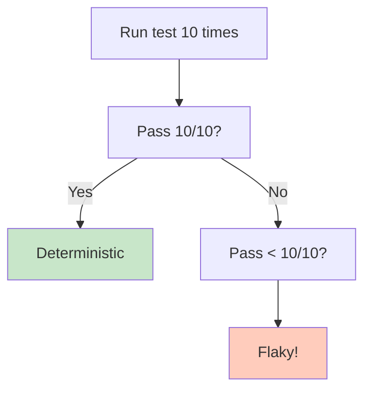

<Hero title="Flake Management and Quarantine" subtitle="Detect and fix flaky tests to maintain CI/CD reliability." size="large" />

## TL;DR

Flaky tests (sometimes pass, sometimes fail) erode trust in CI/CD. Detect by running tests 10+ times; if not all pass, it's flaky. Quarantine immediately: mark with `@quarantine` or `.skip`, document why. Root causes: timing (time.now(), sleep()), shared state, external services, threading. Fixes: mock time, reset state, mock services, use deterministic locks. Run quarantined tests 10+ times to confirm fix. Re-enable. Track flakiness rate (% of tests that occasionally fail); drive toward zero. Zero flakiness = developers trust test results.

## Learning Objectives

After reading this article, you will understand:

- How to detect flaky tests
- Root causes of flakiness
- Quarantine strategies
- How to fix common causes
- How to prevent flakiness in future tests
- Metrics for tracking flakiness

## Motivating Scenario

Your test suite passes locally but fails randomly in CI. Developers get paged at 3 AM because a test failed that has nothing to do with their change. They stop trusting tests and skip them. Your CI becomes theater; broken code sneaks to production. One flaky test ruins CI for everyone.

Solution: Detect flakiness immediately. Quarantine offending tests. Fix root cause. Re-enable. Zero tolerance for flakiness in CI.

## Core Concepts

### Detecting Flakiness

<Figure caption="Run test 10+ times; if not all pass, it's flaky">

</Figure>

### Root Causes and Fixes

| Cause | Example | Fix |
|-------|---------|-----|
| Time-dependent | `time.time()` | Mock time, use fake clock (freezegun, sinon) |
| Sleep/fixed delays | `sleep(1)` | Use explicit waits (waitForElement) |
| Shared state | Tests share database | Isolate: fresh data per test |
| External service | HTTP to real API | Mock service |
| Threading | Race condition | Deterministic locks, no timeouts |
| Randomness | `random.choice()` | Seed RNG, use deterministic data |

## Practical Example

<Tabs>
  <TabItem value="Detecting Flakiness" label="Detecting Flakiness" default>
```bash
#!/bin/bash
# Test for flakiness: run 10 times
TEST_NAME=$1
RUNS=10
PASSES=0

for i in $(seq 1 $RUNS); do
  if npm test -- $TEST_NAME; then
    ((PASSES++))
  fi
done

echo "Passed $PASSES/$RUNS times"
if [ $PASSES -lt $RUNS ]; then
  echo "FLAKY: Test fails occasionally"
  exit 1
else
  echo "DETERMINISTIC: Test passes consistently"
  exit 0
fi
```
  </TabItem>
  <TabItem value="Fixing Time Dependency">
```python
# Flaky: depends on time.now()
def test_expiration():
    token = create_token()
    sleep(1)  # Flaky! Timing varies
    assert token.is_expired()

# Fixed: mock the clock
from freezegun import freeze_time

@freeze_time("2025-01-01 12:00:00")
def test_expiration():
    token = create_token()

    # Move time forward, not real clock
    with freeze_time("2025-01-01 12:01:00"):
        assert token.is_expired()
```
  </TabItem>
  <TabItem value="Fixing Shared State">
```python
# Flaky: tests interfere with each other
class TestUserDatabase:
    @classmethod
    def setUpClass(cls):
        cls.user = User(name='Alice')
        cls.user.save()  # Shared across tests!

    def test_user_exists(self):
        assert User.objects.get(name='Alice')

    def test_update_user(self):
        user = User.objects.get(name='Alice')
        user.name = 'Bob'
        user.save()
        # Other tests now see 'Bob', not 'Alice'

# Fixed: isolate test data
class TestUserDatabase(TestCase):
    def setUp(self):
        # Fresh data per test
        self.user = User(name='Alice')
        self.user.save()

    def test_user_exists(self):
        assert User.objects.filter(name='Alice').exists()

    def test_update_user(self):
        self.user.name = 'Bob'
        self.user.save()
        # setUp runs again for next test
```
  </TabItem>
  <TabItem value="Quarantine Marker">
```javascript
// Mark flaky test for quarantine
describe.skip('Flaky test - quarantined until fixed', () => {
  it('should handle concurrent requests', async () => {
    // This test sometimes fails due to race condition
    // TODO: Fix by using deterministic locking
    // GitHub Issue: #1234

    const results = await Promise.all([
      service.process(data),
      service.process(data)
    ]);

    expect(results).toEqual([...]);
  });
});

// Or use custom tag
test.tag('flaky')('should handle timeouts', () => {
  // Mark as flaky for monitoring
});
```
  </TabItem>
</Tabs>

## When to Use / When Not to Use

<Vs items={[
{
    label: "Quarantine When:",
    points: [
      "Test fails occasionally (< 100% pass rate)",
      "Root cause not immediately obvious",
      "Fixing takes time (blocking others)",
      "Need to unblock CI quickly"
    ]
  },
{
    label: "Fix Without Quarantine When:",
    points: [
      "Root cause obvious (missing mock, wrong assertion)",
      "Fix is quick (< 15 min)",
      "Multiple tests affected (need to fix all at once)"
    ]
  }
]} />

## Patterns and Pitfalls

<Showcase title="Flake Management Best Practices and Anti-Patterns" sections={[
  {
    label: "✓ Best Practices",
    body: "**Detect early**: Run tests 10+ times to confirm flakiness. **Quarantine immediately**: Mark with `@quarantine`, don't ignore. **Document root cause**: Why is it flaky? Link to issue. **Fix deterministically**: Mock time, isolate state, mock services. **Verify fix**: Run 10+ times to confirm. **Monitor flakiness**: Track % of occasionally-failing tests. **Zero tolerance**: Flaky tests erode trust; must be fixed."
  },
  {
    label: "✗ Anti-Patterns",
    body: "**Flaky tests in CI**: Developers ignore CI results. **Blaming test infrastructure**: 'CI is slow', ignore the test. **Re-running failed tests**: 'It passes on rerun'; not a fix. **Skipping flaky tests permanently**: Removing test that catches real bugs. **Adding sleep delays**: 'sleep(5)' doesn't fix flakiness. **Not tracking metrics**: Don't know how many flaky tests exist. **Ignoring flakiness**: 'It only fails sometimes'; it'll fail in production."
  }
]} />

## Design Review Checklist

<Checklist items={[
  "All tests are deterministic (100% pass rate)",
  "No hardcoded sleep() delays (use explicit waits)",
  "Time-dependent logic mocked (frozen time)",
  "Test data isolated (fresh per test)",
  "External services mocked",
  "Shared state reset between tests",
  "Threading uses deterministic locking",
  "Random data seeded",
  "Flaky tests quarantined with documentation",
  "Quarantined tests tracked and prioritized",
  "Flakiness rate monitored (target: 0%)",
  "CI fails if flaky tests re-enabled without fix",
  "Tests run 10+ times during development",
  "Timeouts generous (not too tight)",
  "No test interdependencies"
]} />

## Self-Check Questions

- **Q: How do I detect flakiness?** A: Run test 10+ times. If not all pass, it's flaky.

- **Q: What's the most common cause of flakiness?** A: Time-dependent code. Use frozen time instead of time.now().

- **Q: Should I re-run failing tests?** A: Rerunning masks the problem. Fix the root cause.

- **Q: Can I have 1-2 flaky tests?** A: No. Even one erodes trust. Zero tolerance.

- **Q: How long should I wait for a flaky test to be fixed?** A: Quarantine immediately. Fix within a sprint.

## Advanced Flake Detection and Analysis

### Flake Severity Metrics

Not all flakes are equal. Categorize by impact:

```python
class FlakeSeverity(Enum):
    CRITICAL = 1    # Fails > 50% of runs; blocks development
    HIGH = 2        # Fails 10-50% of runs; frequently blocks CI
    MEDIUM = 3      # Fails 1-10% of runs; occasional CI blocks
    LOW = 4         # Fails < 1% of runs; rare annoyance

def classify_flakiness(pass_rate):
    """Classify test based on pass rate across 100 runs."""
    if pass_rate < 0.5:
        return FlakeSeverity.CRITICAL
    elif pass_rate < 0.9:
        return FlakeSeverity.HIGH
    elif pass_rate < 0.99:
        return FlakeSeverity.MEDIUM
    else:
        return FlakeSeverity.LOW

# CRITICAL flakes block the entire team; fix immediately
# HIGH flakes should be quarantined within hours
# MEDIUM flakes quarantine within a sprint
# LOW flakes document and deprioritize
```

### Flake Root Cause Taxonomy

Systematically identify and fix root causes:

```
Timing/Threading (40% of flakes):
├─ System.currentTimeMillis() / time.now() varies
├─ sleep(fixed_seconds) doesn't guarantee event completion
├─ Thread.sleep() instead of CountDownLatch or explicit waits
├─ Race conditions between threads (no synchronization)
├─ Timeout too tight; environment sometimes slow
└─ Pool exhaustion (thread/connection pool runs out)

External Dependencies (30%):
├─ HTTP calls to real API (network flaky)
├─ Database queries slow on loaded CI
├─ Disk I/O slow on overloaded agent
├─ DNS resolution fails occasionally
└─ Transient service failures (cloud API hiccups)

Test Data/State (20%):
├─ Shared state between tests
├─ Database not rolled back between tests
├─ Cached data stale across tests
├─ Test order dependency
└─ Hardcoded assumptions (e.g., port 8080 free)

Randomness (10%):
├─ Random test data varies
├─ Hash map iteration order undefined
├─ UUID generation non-deterministic
└─ Floating point comparison without tolerance
```

### Flake Reproduction Script

Create runnable artifact for developers:

```bash
#!/bin/bash
# flake-reproducer.sh
# Usage: ./flake-reproducer.sh TestClassName::testMethod 50

TEST_NAME=$1
RUNS=${2:-50}
PASSED=0
FAILED=0

echo "Reproducing flakiness for: $TEST_NAME"
echo "Target: $RUNS runs"
echo ""

for i in $(seq 1 $RUNS); do
    if npm test -- --testNamePattern="$TEST_NAME" > /dev/null 2>&1; then
        ((PASSED++))
        echo -n "."
    else
        ((FAILED++))
        echo -n "F"
    fi

    # Every 50 runs, print progress
    if [ $((i % 50)) -eq 0 ]; then
        echo " [$i/$RUNS]"
    fi
done

echo ""
echo ""
echo "Results:"
echo "  Passed: $PASSED/$RUNS"
echo "  Failed: $FAILED/$RUNS"
echo "  Pass Rate: $(echo "scale=2; $PASSED * 100 / $RUNS" | bc)%"

if [ $FAILED -gt 0 ]; then
    echo ""
    echo "FLAKY: Test fails occasionally. See above for failure pattern."
    exit 1
else
    echo ""
    echo "STABLE: Test passed all $RUNS runs. May be fixed or low flakiness."
    exit 0
fi
```

## Flake Dashboard and Metrics

Track flakiness over time to drive culture change:

```javascript
// Flakiness metrics dashboard
const flakeDashboard = {
  overall_flakiness: {
    metric: "% of tests that occasionally fail",
    target: 0,          // zero tolerance
    current: 2.3,       // 23 of 1000 tests
    trend: "improving"  // down from 5.2% last month
  },

  critical_flakes: {
    count: 2,           // only 2 critical remaining
    list: [
      "PaymentService.testChargeCard",
      "DatabaseMigration.testLargeDataset"
    ],
    action: "Fix immediately; block deployments"
  },

  high_flakes: {
    count: 8,
    aging: {
      "< 1 week": 2,
      "1-4 weeks": 4,
      "> 1 month": 2    // these are stale; fix or delete
    }
  },

  mean_time_to_quarantine: "3.2 days",  // avg time from detect to quarantine
  target_mtq: "24 hours",                // new target

  mean_time_to_fix: "8.7 days",          // avg time to fix after quarantine
  target_mtf: "3 days"                   // aspirational target
};
```

## Flake Prevention Patterns

Build testing culture that prevents flakes:

```python
# Pattern 1: Deterministic test fixtures
@pytest.fixture
def seeded_random():
    """All random operations use same seed; reproducible."""
    random.seed(42)
    numpy.random.seed(42)
    return random.Random(42)

def test_shuffle_stability(seeded_random):
    """Same seed, same shuffle order."""
    items = list(range(100))
    seeded_random.shuffle(items)
    assert items[0] == 5  # Deterministic order, not random

# Pattern 2: Explicit waits, not sleep
def test_async_operation():
    result = start_async_task()

    # Bad: hope 1 second is enough
    # time.sleep(1)

    # Good: wait for condition with timeout
    for _ in range(100):  # max 10 seconds
        if result.is_complete():
            break
        time.sleep(0.1)

    assert result.is_complete()

# Pattern 3: Test isolation via fixtures
@pytest.fixture
def fresh_database():
    """Fresh DB per test; no state leakage."""
    db = create_test_db()
    yield db
    db.teardown()

def test_user_creation(fresh_database):
    fresh_database.create_user('alice')
    assert fresh_database.get_user('alice')

def test_user_deletion(fresh_database):
    # fresh_database is clean; won't see alice from other test
    fresh_database.create_user('bob')
    assert fresh_database.get_user('bob')
```

## When to Delete (Not Fix) Flaky Tests

Some tests aren't worth saving:

```python
def test_integration_with_external_service():
    """
    Flaky: Makes real HTTP calls to external API.
    That API has 99% uptime; test fails ~1% of time.

    Fix: Mock the external service instead.
    But if mocking isn't feasible:
    - Delete this test
    - Add monitoring/alerting for real API uptime
    - Document the gap (no end-to-end integration test)
    """
    response = requests.get('https://weather.api.com/forecast')
    assert response.status_code == 200
```

Delete tests that:
1. Require external services (internet dependency)
2. Test environment-specific behavior (OS, hardware)
3. Have no way to be isolated or mocked
4. Add no real coverage (duplicate existing tests)

Document the gap so future developers know it's intentional.

## Next Steps

1. **Run tests 10+ times** — Detect flaky tests
2. **Quarantine immediately** — Mark, document root cause
3. **Fix root causes** — Determinism, isolation, mocking
4. **Verify fix** — Run 10+ times
5. **Re-enable** — Back into CI
6. **Monitor** — Track flakiness rate
7. **Iterate** — Drive toward zero
8. **Culture** — Celebrate zero flakiness; treat flakes as critical bugs

## References

1. <a href="https://github.com/google/flaky-test-reporter" target="_blank" rel="nofollow noopener noreferrer">Google Flaky Test Reporter ↗️</a>
2. <a href="https://testing.googleblog.com/2020/12/test-flakiness-one-of-biggest.html" target="_blank" rel="nofollow noopener noreferrer">Google: Test Flakiness ↗️</a>
3. <a href="https://github.com/simonmeister/freezegun" target="_blank" rel="nofollow noopener noreferrer">Freezegun (Python) ↗️</a>
4. <a href="https://sinonjs.org/releases/latest/" target="_blank" rel="nofollow noopener noreferrer">Sinon.js (JavaScript) ↗️</a>
5. "Eliminating Flakiness" — Google's Testing Blog and practices
6. "The 99% Problem" — Why that last 1% matters in testing
