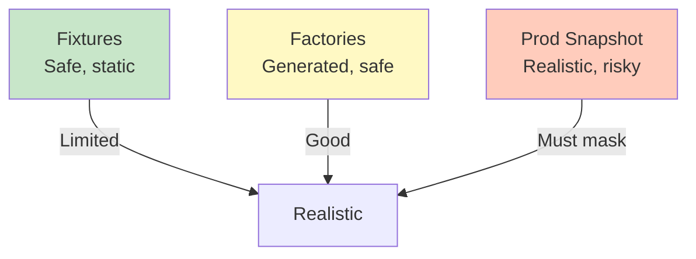

<Hero title="Data Seeding and Masking" subtitle="Populate test data safely; protect sensitive information." size="large" />

## TL;DR

Test environments need realistic data but must protect privacy (GDPR, CCPA, etc.). Never copy production data raw. Use fixtures (static files), factories (generated), or masked production snapshots. Mask PII: replace emails with test@example.com, SSNs with 000-00-0000, credit cards with ****-****-****-****. Automate masking in data pipeline. Document which fields are PII. Verify compliance. Test with realistic data volume/patterns but fake identity.

## Learning Objectives

After reading this article, you will understand:

- Data seeding strategies (fixtures, factories, production copies)
- Data masking techniques and tools
- GDPR/CCPA compliance
- Risk mitigation when using production data
- Realistic test data without privacy violation
- Automating safe data seeding

## Motivating Scenario

You copy production database to staging to test data migration. A developer accidentally leaks staging credentials on GitHub. Production data (SSNs, credit cards, emails) is exposed. GDPR violation. Lawsuits. Better approach: copy production data but mask all PII automatically.

## Core Concepts

### Data Seeding Approaches

<Figure caption="Trade-offs between seeding approaches">

</Figure>

### Data Masking

Replace PII with fake but realistic data:
- Email: `real@example.com` → `user123@test.com`
- SSN: `123-45-6789` → `000-00-0000`
- Credit Card: `4532...6789` → `****-****-****-****`
- Name: `John Doe` → `Test User`

## Practical Example

<Tabs>
  <TabItem value="SQL Masking" label="SQL Masking">
```sql
-- Mask sensitive fields when copying production data
UPDATE users SET
  email = CONCAT('test_user_', id, '@example.com'),
  phone = '555-0000',
  ssn = '000-00-0000'
WHERE environment = 'test';

UPDATE payments SET
  credit_card = CONCAT('****-****-****-', RIGHT(credit_card, 4)),
  cvv = '000'
WHERE environment = 'test';

-- Anonymize PII after masking
UPDATE users SET
  name = CONCAT('TestUser', id),
  address = '123 Test St'
WHERE environment = 'test';
```
  </TabItem>
  <TabItem value="Python Masking">
```python
from faker import Faker

def mask_user_data(users):
    """Mask sensitive fields"""
    fake = Faker()
    for user in users:
        user['email'] = f'testuser{user["id"]}@example.com'
        user['phone'] = '555-0000'
        user['ssn'] = '000-00-0000'
        user['name'] = f'TestUser{user["id"]}'
    return users

def mask_payments(payments):
    """Mask credit card data"""
    for payment in payments:
        cc = payment['credit_card']
        payment['credit_card'] = f'****-****-****-{cc[-4:]}'
        payment['cvv'] = '000'
    return payments

# Usage: copy prod data, mask, insert into test DB
prod_data = export_from_production()
masked_users = mask_user_data(prod_data['users'])
masked_payments = mask_payments(prod_data['payments'])
insert_into_test_db(masked_users, masked_payments)
```
  </TabItem>
  <TabItem value="Fixture Example">
```yaml
# Safe fixture: no real PII
test_data:
  users:
    - id: 1
      email: testuser1@example.com
      phone: '555-0001'
      ssn: '000-00-0001'
      name: Test User 1
    - id: 2
      email: testuser2@example.com
      phone: '555-0002'
      ssn: '000-00-0002'
      name: Test User 2

  payments:
    - id: 1
      user_id: 1
      credit_card: '****-****-****-1111'
      cvv: '000'
      amount: 99.99
```
  </TabItem>
</Tabs>

## When to Use / When Not to Use

<Vs highlight={[0,1,0,0]} items={[
{
    label: "Use Masking When:",
    points: [
      "You need realistic data (volume, patterns)",
      "Production data provides best test coverage",
      "You can automate masking safely"
    ],
    highlightTone: "positive"
  },
{
    label: "Use Synthetic Instead When:",
    points: [
      "Masking risks exposing real PII",
      "Regulatory risk too high",
      "Synthetic data sufficient for testing"
    ],
    highlightTone: "positive"
  }
]} />

## Patterns and Pitfalls

<Showcase title="Data Masking Best Practices and Anti-Patterns" sections={[
  {
    label: "✓ Best Practices",
    body: "**Automate masking**: Don't manually mask (errors). **Document PII fields**: Which fields are sensitive? **Verify masking**: Audit results. **Encrypt test DBs**: Even masked data deserves protection. **Audit access**: Who accesses test data? Log it. **Delete old copies**: Don't keep stale masked data. **Compliance review**: Does masking meet GDPR/CCPA?"
  },
  {
    label: "✗ Anti-Patterns",
    body: "**Raw production data**: Exposing PII is a breach. **Manual masking**: Error-prone, inconsistent. **Hardcoded masks**: '000-00-0000' everywhere; obvious. **No audit trail**: Don't know who accessed PII. **Unencrypted test DB**: Masked data still deserves encryption. **Keeping old copies**: Stale masked data accumulates. **No compliance check**: Is masking enough? Verify."
  }
]} />

## Design Review Checklist

<Checklist items={[
  "All PII identified and documented",
  "Masking rules automated (not manual)",
  "Test data doesn't expose real PII",
  "Masked data realistic (not obviously fake)",
  "Encryption used for test databases",
  "Access to test data logged and audited",
  "Masking verified with spot checks",
  "Old data copies deleted (retention policy)",
  "GDPR/CCPA compliance verified",
  "Masking documentation exists",
  "Synthetic data used when masking insufficient",
  "Test environment separate from production",
  "No credentials in test data",
  "Data retention policy enforced",
  "Privacy notice includes test environments"
]} />

## Data Seeding Strategy Selection

### Small Projects (< 100 users)

**Use**: Static fixtures in YAML/JSON

```yaml
# fixtures.yaml
users:
  - id: 1
    email: testuser1@example.com
    name: Test User 1
    created_at: 2025-01-01

  - id: 2
    email: testuser2@example.com
    name: Test User 2
    created_at: 2025-01-02
```

**Pros**: Simple, no dependencies, reproducible
**Cons**: Limited to small data volumes

### Medium Projects (100K - 1M users)

**Use**: Factories with Faker

```python
def seed_users(count=100000):
    fake = Faker()
    batch = []
    for i in range(count):
        batch.append({
            'email': fake.email(),
            'name': fake.name(),
            'phone': fake.phone_number()
        })
        if len(batch) >= 1000:
            db.insert_batch(batch)
            batch = []
    if batch:
        db.insert_batch(batch)
```

**Pros**: Realistic, scalable, varied data
**Cons**: Slower than fixtures

### Large Projects (10M+ users)

**Use**: Masked production snapshot

```bash
# Export production data
pg_dump --data-only prod_db | \
  sed 's/email_pattern/[MASKED]/g' | \
  sed 's/ssn_pattern/000-00-0000/g' | \
  psql test_db
```

**Pros**: Realistic scale, real relationships
**Cons**: Risk if masking fails, requires careful handling

## Self-Check Questions

- **Q: Is masked data safe enough?** A: Mostly. But encrypt it anyway. Defense in depth. Consider tokenization for extra protection.

- **Q: Can I copy raw production data?** A: Only if you mask PII immediately. Otherwise: GDPR violation, potential lawsuits.

- **Q: What's realistic synthetic data?** A: Faker generates realistic emails, names, addresses. Good for testing without PII risk. Combine with actual volume/patterns for realism.

- **Q: How do I verify masking worked?** A: Spot checks. Query test DB. Ensure no real SSNs/CCs visible. Use automated PII detection tools.

- **Q: How long should I keep masked data?** A: Only as long as needed. Delete after tests/retention period. Follow data minimization principle.

- **Q: What about compliance with masked data?** A: Masked data still needs protection. Encrypt, audit access, limit retention. It's still PII-adjacent.

- **Q: Can I share masked test data with contractors?** A: Safer than raw data, but still review for re-identification risks. Use tokenization instead.

## Next Steps

1. **Identify PII** — Which fields are sensitive?
2. **Choose seeding approach** — Fixtures, factories, or masked prod?
3. **Implement masking** — Automated, not manual
4. **Verify compliance** — GDPR/CCPA checklist
5. **Encrypt test DBs** — Extra protection layer
6. **Audit access** — Log who accesses test data
7. **Document** — Masking rules, retention policy

## Advanced Masking Techniques

### PII Detection and Classification

```python
import re
from enum import Enum

class PIIType(Enum):
    EMAIL = "email"
    PHONE = "phone"
    SSN = "ssn"
    CREDIT_CARD = "credit_card"
    NAME = "name"
    ADDRESS = "address"
    IP_ADDRESS = "ip_address"

class PIIDetector:
    """Automatically detect PII in data."""

    patterns = {
        PIIType.EMAIL: r'[a-zA-Z0-9._%+-]+@[a-zA-Z0-9.-]+\.[a-zA-Z]{2,}',
        PIIType.PHONE: r'(\+1|1)?[-.\s]?\(?\d{3}\)?[-.\s]?\d{3}[-.\s]?\d{4}',
        PIIType.SSN: r'\d{3}-\d{2}-\d{4}',
        PIIType.CREDIT_CARD: r'\d{4}[-\s]?\d{4}[-\s]?\d{4}[-\s]?\d{4}',
        PIIType.IP_ADDRESS: r'\d{1,3}\.\d{1,3}\.\d{1,3}\.\d{1,3}'
    }

    def detect_pii_fields(self, data: dict) -> dict:
        """Scan data for PII fields."""
        pii_found = {}

        for field, value in data.items():
            if isinstance(value, str):
                for pii_type, pattern in self.patterns.items():
                    if re.match(pattern, value):
                        if field not in pii_found:
                            pii_found[field] = []
                        pii_found[field].append(pii_type)

        return pii_found

    def suggest_masking_rules(self, pii_found: dict) -> dict:
        """Suggest masking rules based on detected PII."""
        masking_rules = {}

        for field, types in pii_found.items():
            primary_type = types[0]  # Use first detected type

            if primary_type == PIIType.EMAIL:
                masking_rules[field] = lambda: f"testuser{random.randint(1, 1000000)}@example.com"
            elif primary_type == PIIType.PHONE:
                masking_rules[field] = lambda: f"555-{random.randint(100, 999)}-{random.randint(1000, 9999)}"
            elif primary_type == PIIType.SSN:
                masking_rules[field] = lambda: "000-00-0000"
            elif primary_type == PIIType.CREDIT_CARD:
                masking_rules[field] = lambda: f"****-****-****-{random.randint(1000, 9999)}"
            elif primary_type == PIIType.IP_ADDRESS:
                masking_rules[field] = lambda: f"192.0.2.{random.randint(1, 255)}"

        return masking_rules
```

### Reversible Masking (Tokenization)

```python
from cryptography.fernet import Fernet

class TokenizedDataMasking:
    """Mask PII with tokens that can be decrypted later."""

    def __init__(self, encryption_key):
        self.cipher = Fernet(encryption_key)
        self.token_map = {}  # token -> original value

    def mask_field(self, value: str) -> str:
        """Tokenize value."""
        encrypted = self.cipher.encrypt(value.encode())
        token = f"TOKEN_{encrypted.hex()[:16]}"
        self.token_map[token] = encrypted
        return token

    def unmask_field(self, token: str) -> str:
        """Detokenize value."""
        if token in self.token_map:
            decrypted = self.cipher.decrypt(self.token_map[token])
            return decrypted.decode()
        raise ValueError(f"Unknown token: {token}")

    def mask_dataset(self, data: list, pii_fields: list) -> list:
        """Mask entire dataset with reversibility."""
        masked = []
        for row in data:
            masked_row = row.copy()
            for field in pii_fields:
                if field in masked_row:
                    masked_row[field] = self.mask_field(row[field])
            masked.append(masked_row)
        return masked

# Usage
key = Fernet.generate_key()
masking = TokenizedDataMasking(key)

data = [
    {'id': 1, 'email': 'alice@example.com', 'ssn': '123-45-6789'},
    {'id': 2, 'email': 'bob@example.com', 'ssn': '987-65-4321'}
]

masked_data = masking.mask_dataset(data, ['email', 'ssn'])
# Now masked_data has tokens instead of real PII

# Can be decrypted later with same key
# for testing purposes
```

### Data Generation with Realistic Patterns

```python
from faker import Faker
import random

class RealisticDataGenerator:
    """Generate realistic test data that mirrors production patterns."""

    def __init__(self):
        self.fake = Faker()

    def generate_users(self, count: int) -> list:
        """Generate realistic user records."""
        users = []

        for i in range(count):
            # Generate with realistic patterns
            user = {
                'id': i + 1,
                'email': self.fake.email(),
                'phone': self.fake.phone_number(),
                'name': self.fake.name(),
                'address': self.fake.address(),
                'created_at': self.fake.date_time_this_year(),
                'last_login': self.fake.date_time_this_month(),
                'is_active': random.choices([True, False], weights=[0.9, 0.1])[0],
                'subscription_tier': random.choice(['free', 'pro', 'enterprise']),
            }
            users.append(user)

        return users

    def generate_orders(self, users: list, orders_per_user=5) -> list:
        """Generate realistic orders with foreign keys."""
        orders = []
        order_id = 1

        for user in users:
            # Not every user has orders
            if random.random() < 0.7:
                num_orders = random.randint(1, orders_per_user)

                for _ in range(num_orders):
                    order = {
                        'id': order_id,
                        'user_id': user['id'],
                        'total': round(random.uniform(10, 500), 2),
                        'status': random.choice(['pending', 'processing', 'shipped', 'delivered']),
                        'created_at': self.fake.date_time_this_year(),
                    }
                    orders.append(order)
                    order_id += 1

        return orders

# Usage
gen = RealisticDataGenerator()
users = gen.generate_users(1000)
orders = gen.generate_orders(users, orders_per_user=10)
# Now have realistic 1000 users with ~7000 orders, matching production patterns
```

### Docker-based Data Seeding

```dockerfile
# Dockerfile for test data seeding service
FROM python:3.11-slim

WORKDIR /app
COPY requirements.txt .
RUN pip install -r requirements.txt

COPY seed.py .
COPY data_templates/ ./data_templates/

# Environment for target database
ENV DB_HOST=postgres
ENV DB_PORT=5432
ENV DB_NAME=test_db

CMD ["python", "seed.py"]
```

```python
# seed.py - Automated data seeding
import os
import psycopg2
from faker import Faker
from data_masking import DataMasker

class DatabaseSeeder:
    def __init__(self):
        self.conn = psycopg2.connect(
            host=os.getenv('DB_HOST'),
            port=os.getenv('DB_PORT'),
            database=os.getenv('DB_NAME'),
            user=os.getenv('DB_USER'),
            password=os.getenv('DB_PASSWORD')
        )
        self.cursor = self.conn.cursor()
        self.masker = DataMasker()

    def seed_production_copy_with_masking(self):
        """Copy production data and mask PII."""
        # Connect to production DB (read-only)
        prod_conn = self._connect_production()

        # Stream data from production
        prod_cursor = prod_conn.cursor()
        prod_cursor.execute("SELECT * FROM users")

        # Mask and insert into test DB
        for row in prod_cursor.fetchall():
            masked = self.masker.mask_row(row, pii_fields=['email', 'phone', 'ssn'])
            self.cursor.execute(
                "INSERT INTO users (id, email, phone, ssn, ...) VALUES (%s, %s, %s, %s, ...)",
                masked
            )

        self.conn.commit()
```

## Compliance-Focused Data Seeding

```python
class ComplianceAwareSeeder:
    """Ensure test data respects compliance requirements."""

    def seed_gdpr_compliant(self):
        """Seed data that respects GDPR constraints."""
        # Only keep data for legitimate purposes
        # No unnecessary PII collection
        users = [
            {
                'id': i,
                'email': f'testuser{i}@example.com',
                # No name, address, phone unless needed
            }
            for i in range(100)
        ]
        return users

    def seed_ccpa_compliant(self):
        """Seed data respecting CCPA right-to-deletion."""
        # Ensure test data includes records with deletion flags
        users = []
        for i in range(100):
            users.append({
                'id': i,
                'email': f'testuser{i}@example.com',
                'deleted_at': None if random.random() < 0.9 else datetime.now()
            })
        return users

    def seed_hipaa_compliant(self):
        """Seed healthcare data safely."""
        patients = []
        for i in range(50):
            patients.append({
                'id': i,
                'mrn': f'MRN{i:06d}',  # Medical Record Number
                'encrypted_ssn': encrypt(f'123-45-{6789+i:04d}'),
                'health_data': 'REDACTED',  # Don't include actual health info in test
            })
        return patients
```

## References

1. <a href="https://gdpr-info.eu/" target="_blank" rel="nofollow noopener noreferrer">GDPR Documentation ↗️</a>
2. <a href="https://oag.ca.gov/privacy/ccpa" target="_blank" rel="nofollow noopener noreferrer">CCPA Information ↗️</a>
3. <a href="https://github.com/faker-js/faker" target="_blank" rel="nofollow noopener noreferrer">Faker.js ↗️</a>
4. <a href="https://www.imperva.com/learn/data-security/data-masking/" target="_blank" rel="nofollow noopener noreferrer">Data Masking Techniques ↗️</a>
5. "Building Secure and Reliable Systems" — Chapter on Data Privacy
6. "Practical Data Privacy" by Bart Curcuiulescu
