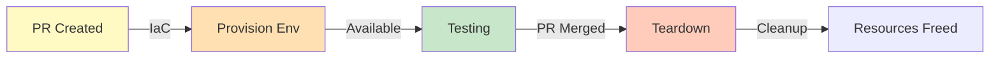

<Hero title="Ephemeral Environments and Preview Apps" subtitle="Spin up test environments on-demand; tear down after testing." size="large" />

## TL;DR

Ephemeral environments are temporary, per-feature test environments. Spin up on PR creation (infrastructure as code); tear down on merge. No resource contention (two developers don't interfere). Preview apps provide unique URLs for stakeholders to test before release. Use Docker/Kubernetes for easy provisioning. Tools: Vercel (frontend), Render (any app), custom K8s. Cost optimization: auto-cleanup after 24-48h, right-size instances, share resources (e.g., one database). Key benefit: parallel testing, isolation, fast feedback.

## Learning Objectives

After reading this article, you will understand:

- Benefits of ephemeral environments
- How to automate environment provisioning
- Cost optimization strategies
- Preview apps and stakeholder feedback
- Infrastructure as Code for reproducible environments
- Best practices for cleanup and resource management

## Motivating Scenario

Two developers test independently on shared staging. They collide: one deletes test data, the other's tests break. They want independent environments but provisioning takes 2 hours. With ephemeral environments, each PR gets its own isolated environment, provisioned in 10 minutes, deleted after merge. No contention, no manual provisioning.

## Core Concepts

### Ephemeral Environment Lifecycle

<Figure caption="Temporary environments: provision on PR, teardown on merge">

</Figure>

### Infrastructure as Code (IaC)

Use Terraform, CloudFormation, or K8s manifests to define environments reproducibly.

## Practical Example

<Tabs>
  <TabItem value="Kubernetes" label="Kubernetes">
```yaml
# Temporary namespace per PR
apiVersion: v1
kind: Namespace
metadata:
  name: feature-pr-123
---
apiVersion: v1
kind: ConfigMap
metadata:
  name: app-config
  namespace: feature-pr-123
data:
  environment: preview
  database_url: postgresql://db:5432/pr_123_db
---
apiVersion: apps/v1
kind: Deployment
metadata:
  name: app
  namespace: feature-pr-123
spec:
  replicas: 1
  selector:
    matchLabels:
      app: app
  template:
    metadata:
      labels:
        app: app
    spec:
      containers:
      - name: app
        image: myapp:pr-123
        env:
        - name: DATABASE_URL
          valueFrom:
            configMapKeyRef:
              name: app-config
              key: database_url
```
  </TabItem>
  <TabItem value="Terraform">
```hcl
variable "pr_number" {
  type = number
}

resource "aws_ecs_cluster" "ephemeral" {
  name = "pr-${var.pr_number}-cluster"
}

resource "aws_rds_cluster" "ephemeral_db" {
  cluster_identifier = "pr-${var.pr_number}-db"
  engine             = "aurora-postgresql"
  database_name      = "pr_${replace(var.pr_number, "-", "_")}"
  # ... other config
}

resource "aws_ecs_service" "app" {
  name            = "pr-${var.pr_number}-app"
  cluster         = aws_ecs_cluster.ephemeral.id
  task_definition = aws_ecs_task_definition.app.arn

  depends_on = [aws_rds_cluster.ephemeral_db]
}

output "app_url" {
  value = "https://pr-${var.pr_number}.preview.example.com"
}
```
  </TabItem>
  <TabItem value="GitHub Actions">
```yaml
name: Create Preview Environment
on: [pull_request]

jobs:
  create-env:
    runs-on: ubuntu-latest
    steps:
      - uses: actions/checkout@v3

      - name: Build Docker image
        run: docker build -t myapp:pr-${{ github.event.pull_request.number }} .

      - name: Deploy with Terraform
        run: |
          terraform init
          terraform apply -auto-approve \
            -var pr_number=${{ github.event.pull_request.number }}
        env:
          TF_VAR_docker_image: myapp:pr-${{ github.event.pull_request.number }}

      - name: Get preview URL
        run: |
          URL=$(terraform output -raw app_url)
          echo "Preview URL: $URL"
          gh pr comment -R ${{ github.repository }} -N ${{ github.event.pull_request.number }} \
            -b "Preview available at: $URL"

  cleanup:
    if: github.event.action == 'closed'
    runs-on: ubuntu-latest
    steps:
      - uses: actions/checkout@v3
      - name: Destroy environment
        run: |
          terraform init
          terraform destroy -auto-approve \
            -var pr_number=${{ github.event.pull_request.number }}
```
  </TabItem>
</Tabs>

## When to Use / When Not to Use

<Vs highlight={[1]} items={[
{
    label: "Use When:",
    points: [
      "Multiple developers working on features",
      "You need isolation between test runs",
      "Infrastructure provisioning is automated",
      "Budget allows for temporary resources"
    ],
    highlightTone: "positive"
  },
{
    label: "Avoid When:",
    points: [
      "Single developer (one shared env enough)",
      "Infrastructure not automated (manual provisioning too slow)",
      "Zero test budget (ephemeral envs cost money)"
    ],
    highlightTone: "warning"
  }
]} />

## Patterns and Pitfalls

### Key Patterns

**Idempotent IaC**: Terraform/K8s manifests can run multiple times safely. If environment exists, update it. If not, create it. No manual steps needed.

**Automatic Naming**: Use PR number in resource names to prevent collisions.
```hcl
resource "aws_ecs_cluster" "ephemeral" {
  name = "pr-${var.pr_number}-cluster"  # Unique per PR
}
```

**Cost Awareness**: Ephemeral resources cost money. Track spending per PR. Set budgets. Alert if spending is high.

### Anti-Patterns to Avoid

| Anti-Pattern | Problem | Solution |
|---|---|---|
| Manual provisioning | Takes hours; defeats purpose | Automate with IaC |
| No cleanup | Orphaned resources pile up | Auto-cleanup after 24-48h |
| Large instances | Full prod-size per PR is expensive | Use t2.micro or equivalent |
| Separate databases | One DB per PR is unnecessary | Share one database |
| No unique URLs | Hard to share preview | Use preview.example.com/pr-123 |
| Ignored errors | Provision fails silently | Notify on Slack if provision fails |
| Long-lived ephemeral | "Preview" env up for weeks | Tear down on PR merge |

<Showcase title="Ephemeral Environments Best Practices and Anti-Patterns" sections={[
  {
    label: "✓ Best Practices",
    body: "**IaC for reproducibility**: Terraform, K8s manifests define infrastructure. **Auto-cleanup**: Teardown on PR merge or after 24-48h. **Unique URLs**: Each PR gets preview.example.com/pr-123. **Right-size instances**: Small instances for ephemeral; scale up if needed. **Shared resources**: One database for all ephemeral envs (cheaper). **Cost monitoring**: Track spend; optimize. **Documentation**: How to access preview env? Link in PR comment. **Monitoring**: Even ephemeral envs should have basic logging and metrics."
  ,
    body: "**IaC for reproducibility**: Terraform, K8s manifests define infrastructure. **Auto-cleanup**: Teardown on PR merge or after 24-48h. **Unique URLs**: Each PR gets preview.example.com/pr-123. **Right-size instances**: Small instances for ephemeral; scale up if needed. **Shared resources**: One database for all ephemeral envs (cheaper). **Cost monitoring**: Track spend; optimize. **Documentation**: How to access preview env? Link in PR comment. **Monitoring**: Even ephemeral envs should have basic logging and metrics."
  ,
    highlightTone: "positive"
  },
  {
    label: "✗ Anti-Patterns",
    body: "**Manual provisioning**: Takes hours; defeats purpose. **No cleanup**: Orphaned resources pile up; expensive. **Large instances**: Full prod-size instances for every PR; expensive. **Separate databases**: One database per PR; overkill. **No unique URLs**: Hard to share preview with team. **Ignored errors**: Provision fails; no notification. **Long-lived ephemeral**: 'Preview' env up for weeks; not temporary. **No data seeding**: Env provisioned but has no test data; useless."
  ,
    body: "**Manual provisioning**: Takes hours; defeats purpose. **No cleanup**: Orphaned resources pile up; expensive. **Large instances**: Full prod-size instances for every PR; expensive. **Separate databases**: One database per PR; overkill. **No unique URLs**: Hard to share preview with team. **Ignored errors**: Provision fails; no notification. **Long-lived ephemeral**: 'Preview' env up for weeks; not temporary. **No data seeding**: Env provisioned but has no test data; useless."
  ,
    highlightTone: "warning"
  }
]} />

## Design Review Checklist

<Checklist items={[
  "Infrastructure defined in code (Terraform, K8s, CloudFormation)",
  "Provisioning automated in CI/CD",
  "Unique URL per PR/feature",
  "Automatic cleanup on PR merge or timeout",
  "Cost monitoring and optimization",
  "Right-sized instances (not full production size)",
  "Shared resources between ephemeral envs",
  "Database seeding automated",
  "Preview URL shared with team (PR comment)",
  "Monitoring/logging for ephemeral envs",
  "Security: ephemeral envs isolated",
  "Configuration management per environment",
  "Error handling and notifications",
  "Rollback strategy if deployment fails",
  "Documentation for accessing previews"
]} />

## Self-Check Questions

- **Q: Why ephemeral instead of one shared staging?** A: Isolation (no interference), parallel testing, fast feedback.

- **Q: How do you prevent resource bloat?** A: Auto-cleanup after 24-48h. Cost monitoring.

- **Q: Should ephemeral databases be full production size?** A: No. Small databases (less data) for ephemeral. Scale up if needed.

- **Q: Can multiple tests run simultaneously on one ephemeral env?** A: Yes, if infrastructure is stateless. Better: separate ephemeral per test.

- **Q: How long does provisioning take?** A: 5-15 minutes with IaC. Acceptable delay for parallel testing.

## Next Steps

1. **Choose platform** — Vercel (web), Render, or DIY K8s
2. **Define infrastructure as code** — Terraform or K8s
3. **Automate provisioning** — GitHub Actions, GitLab CI
4. **Set cost limits** — Budget per PR, auto-cleanup
5. **Test the workflow** — Provision, test, cleanup
6. **Monitor costs** — Track spending; optimize
7. **Document** — How to access previews?

## References

1. <a href="https://vercel.com/" target="_blank" rel="nofollow noopener noreferrer">Vercel Preview Deployments ↗️</a>
2. <a href="https://render.com/" target="_blank" rel="nofollow noopener noreferrer">Render Ephemeral Environments ↗️</a>
3. <a href="https://www.terraform.io/" target="_blank" rel="nofollow noopener noreferrer">Terraform IaC ↗️</a>
4. <a href="https://kubernetes.io/" target="_blank" rel="nofollow noopener noreferrer">Kubernetes ↗️</a>