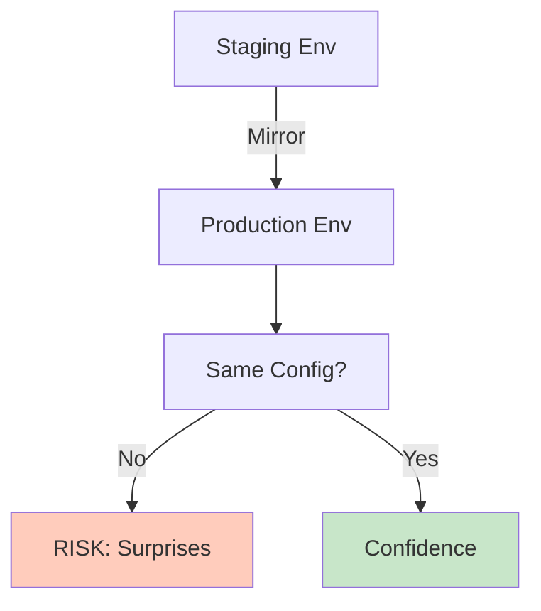

<Hero title="Parity with Production" subtitle="Test environments should mirror production to catch environment-specific bugs early." size="large" />

## TL;DR

Test and staging environments must match production: same OS, database version, service versions, network topology, similar scale. "Works in staging" should mean "works in production." Use Infrastructure as Code (IaC) to keep environments in sync. Detect drift: monthly audits comparing actual vs. declared infrastructure. Environment mismatch causes bugs: code works in staging (Ubuntu, PostgreSQL 12) but fails in production (Alpine, PostgreSQL 14) due to version differences. Automate environment definition; no manual changes.

## Learning Objectives

After reading this article, you will understand:

- Importance of environment parity
- How to define consistent infrastructure
- Drift detection strategies
- Best practices for IaC
- Scaling considerations
- Operational consistency

## Motivating Scenario

Service passes all tests in staging (Ubuntu 22.04, PostgreSQL 12, Node 16). Deploys to production (Alpine 3.17, PostgreSQL 14, Node 18). Crashes because Alpine doesn't include glibc library that app depends on. Database schema migration fails on PostgreSQL 14. Node 18 has different garbage collection. All preventable with environment parity.

## Core Concepts

### Production Parity Checklist

<Figure caption="Environment consistency: reduce surprises when deploying">

</Figure>

- Same base OS/image (ubuntu:22.04 everywhere)
- Same database version (PostgreSQL 15.0)
- Same service versions (dependencies locked)
- Same network topology (VPC, security groups)
- Similar scale (not necessarily full production size)
- Same monitoring tools and dashboards

## Practical Example

<Tabs>
  <TabItem value="Terraform" label="Terraform IaC" default>
```hcl
# Define infrastructure once; apply to staging/production
variable "environment" {
  type = string
}

variable "instance_size" {
  type = string
  default = "t3.medium"
}

variable "database_size" {
  type = string
  default = "db.t3.medium"
}

resource "aws_rds_cluster" "database" {
  engine_version = "15.0"  # Same version everywhere
  engine         = "aurora-postgresql"

  instance_class = var.environment == "production" ? "db.r6g.2xlarge" : var.database_size

  # Everything else identical
  backup_retention_period = 30
  preferred_backup_window = "03:00-04:00"
  deletion_protection     = var.environment == "production" ? true : false
}

resource "aws_instance" "app_server" {
  ami           = "ami-0c55b159cbfafe1f0"  # Same AMI
  instance_type = var.instance_size

  tags = {
    Name        = "app-${var.environment}"
    Environment = var.environment
  }
}

resource "aws_security_group" "app" {
  ingress {
    from_port   = 5432
    to_port     = 5432
    protocol    = "tcp"
    cidr_blocks = ["10.0.0.0/8"]  # Same network
  }

  # All rules identical between staging/production
}

# Apply with:
# terraform apply -var environment=staging
# terraform apply -var environment=production
```
  </TabItem>
  <TabItem value="Drift Detection">
```bash
#!/bin/bash
# Detect environment drift: actual vs. declared

echo "Detecting infrastructure drift..."

# Check database version
STAGING_DB=$(terraform -chdir=./terraform output -raw staging_db_version)
PROD_DB=$(terraform -chdir=./terraform output -raw prod_db_version)

if [ "$STAGING_DB" != "$PROD_DB" ]; then
  echo "DRIFT: Database versions differ"
  echo "  Staging: $STAGING_DB"
  echo "  Production: $PROD_DB"
fi

# Check Node version
STAGING_NODE=$(ssh staging.example.com "node --version")
PROD_NODE=$(ssh prod.example.com "node --version")

if [ "$STAGING_NODE" != "$PROD_NODE" ]; then
  echo "DRIFT: Node versions differ"
  echo "  Staging: $STAGING_NODE"
  echo "  Production: $PROD_NODE"
fi

# Check Docker image tags
STAGING_IMAGE=$(aws ecs describe-services \
  --cluster staging \
  --services app \
  --query 'services[0].taskDefinition' \
  --output text)

PROD_IMAGE=$(aws ecs describe-services \
  --cluster production \
  --services app \
  --query 'services[0].taskDefinition' \
  --output text)

if [ "$STAGING_IMAGE" != "$PROD_IMAGE" ]; then
  echo "DRIFT: Docker image tags differ"
  echo "  Staging: $STAGING_IMAGE"
  echo "  Production: $PROD_IMAGE"
fi
```
  </TabItem>
  <TabItem value="Configuration as Code">
```yaml
# kubernetes/values-staging.yaml (mostly identical to production)
replicaCount: 1  # Smaller for staging

image:
  repository: myapp
  tag: latest
  pullPolicy: Always

database:
  host: postgres-staging.example.com
  port: 5432
  version: "15.0"  # Same as production!
  pool_size: 10

cache:
  host: redis-staging.example.com
  version: "7.0"  # Same as production!
---
# kubernetes/values-production.yaml
replicaCount: 3  # More replicas

image:
  repository: myapp
  tag: v1.2.3  # Production tag
  pullPolicy: IfNotPresent

database:
  host: postgres-prod.example.com
  port: 5432
  version: "15.0"  # SAME as staging!
  pool_size: 100

cache:
  host: redis-prod.example.com
  version: "7.0"  # SAME as staging!
```
  </TabItem>
</Tabs>

## When to Use / When Not to Use

<Vs highlight={[0,0]} items={[
{
    label: "Use Full Parity When:",
    points: [
      "Production issues are critical (e.g., financial, healthcare)",
      "Environment-specific bugs are common",
      "You have budget for staging that mirrors production"
    ],
    highlightTone: "positive"
  },
{
    label: "Partial Parity When:",
    points: [
      "Budget limited (smaller staging instance, same software versions)",
      "Traffic patterns don't need replication",
      "You test mostly code logic, not infrastructure"
    ]
  }
]} />

## Patterns and Pitfalls

<Showcase title="Environment Parity Best Practices and Anti-Patterns" sections={[
  {
    label: "✓ Best Practices",
    body: "**Infrastructure as Code**: Define everything (Terraform, K8s). **Automated deployment**: Same process for staging/production. **Version everything**: Lock database, library, service versions. **Regular drift audits**: Monthly comparison of actual vs. declared. **Same monitoring**: Staging and production use identical dashboards/tools. **Document assumptions**: If staging is smaller, why and how? **Automated testing**: Tests run in staging before production."
  },
  {
    label: "✗ Anti-Patterns",
    body: "**Manual configuration**: 'I'll just SSH and change config.' Drift happens. **Different versions**: 'Staging has old Node; we'll upgrade next sprint.' Meanwhile, bugs hide. **No drift detection**: You don't know if staging matches production. **Unversioned changes**: Manual updates no one tracked. **'Works in staging'**: Only true if staging matches production. **Undocumented differences**: 'Staging uses SQLite, production uses PostgreSQL.' Big surprise when deploying. **No rollback plan**: Environment configuration wrong; stuck."
  }
]} />

## Design Review Checklist

<Checklist items={[
  "Infrastructure defined in code (IaC)",
  "Same base OS image (ubuntu:22.04, not alpine vs. ubuntu)",
  "Same database version (PostgreSQL 15 everywhere)",
  "Same service versions (dependencies locked, not latest)",
  "Same network topology (VPC, security groups)",
  "Same monitoring/logging tools",
  "Configuration parameterized (staging/production differ in scale/replicas only)",
  "Deployment process identical for all environments",
  "No manual SSH/config changes (use IaC)",
  "Monthly drift detection audits",
  "Staging smaller in scale but same software",
  "Documentation explains intentional differences",
  "Automated rollback if deployment fails",
  "Version control for all infrastructure code",
  "CI/CD prevents deploying without staging test"
]} />

## Advanced Drift Detection Techniques

### Automated Weekly Drift Audit

```bash
#!/bin/bash
# Compare staging vs production infrastructure

echo "=== Database Version Check ==="
STAGING_DB_VERSION=$(terraform -chdir=staging output -raw db_version)
PROD_DB_VERSION=$(terraform -chdir=production output -raw db_version)
[[ "$STAGING_DB_VERSION" != "$PROD_DB_VERSION" ]] && echo "DRIFT: Database versions differ"

echo "=== OS Image Check ==="
STAGING_AMI=$(terraform -chdir=staging output -raw ami_id)
PROD_AMI=$(terraform -chdir=production output -raw ami_id)
[[ "$STAGING_AMI" != "$PROD_AMI" ]] && echo "DRIFT: AMI IDs differ"

echo "=== Dependency Versions ==="
diff <(curl -s https://staging.example.com/versions.json | jq -S) \
     <(curl -s https://production.example.com/versions.json | jq -S) \
  || echo "DRIFT: Dependency versions differ"

echo "=== Network Configuration ==="
STAGING_SG=$(terraform -chdir=staging output -raw security_group)
PROD_SG=$(terraform -chdir=production output -raw security_group)
aws ec2 describe-security-groups --group-ids "$STAGING_SG" | jq '.SecurityGroups[0].IpPermissions' > /tmp/staging_sg.json
aws ec2 describe-security-groups --group-ids "$PROD_SG" | jq '.SecurityGroups[0].IpPermissions' > /tmp/prod_sg.json
diff /tmp/staging_sg.json /tmp/prod_sg.json || echo "DRIFT: Security groups differ"
```

### Configuration Compliance Check

```python
class EnvironmentCompliance:
    """Ensures environments meet required standards"""
    def __init__(self, expected_config):
        self.expected = expected_config
        self.violations = []

    def check_database_version(self, env_name, actual_version):
        expected = self.expected['database']['version']
        if actual_version != expected:
            self.violations.append({
                'env': env_name,
                'check': 'database_version',
                'expected': expected,
                'actual': actual_version,
                'severity': 'critical'
            })

    def check_tls_version(self, env_name, actual_tls):
        expected = self.expected['security']['min_tls']
        if actual_tls < expected:
            self.violations.append({
                'env': env_name,
                'check': 'tls_version',
                'expected': expected,
                'actual': actual_tls,
                'severity': 'high'
            })

    def check_monitoring_enabled(self, env_name, has_monitoring):
        if not has_monitoring:
            self.violations.append({
                'env': env_name,
                'check': 'monitoring',
                'expected': True,
                'actual': False,
                'severity': 'high'
            })

    def generate_report(self):
        if not self.violations:
            return "All environments compliant"

        report = f"Found {len(self.violations)} compliance violations:\n"
        for v in self.violations:
            report += f"  [{v['severity']}] {v['env']}: {v['check']} "
            report += f"(expected {v['expected']}, got {v['actual']})\n"
        return report
```

### Observability Parity

```yaml
# Both staging and production must have identical observability
prometheus:
  staging:
    scrape_interval: 30s
    targets:
      - localhost:9090
    retention: 15d
  production:
    scrape_interval: 30s  # SAME
    targets:
      - prod-prometheus:9090
    retention: 15d  # SAME

logging:
  staging:
    level: INFO
    output: /var/log/app.log
    format: json
  production:
    level: INFO  # SAME
    output: /var/log/app.log  # SAME
    format: json  # SAME

tracing:
  staging:
    sample_rate: 0.1  # Sample 10%
    jaeger_endpoint: staging-jaeger:6831
  production:
    sample_rate: 0.1  # SAME sampling
    jaeger_endpoint: prod-jaeger:6831
```

## Intentional Environment Differences

Some differences are legitimate and documented:

```yaml
# Explicitly document intentional differences
differences:
  - aspect: "Compute Resources"
    staging: "t3.medium (1 vCPU, 4GB RAM)"
    production: "t3.xlarge (4 vCPU, 16GB RAM)"
    justification: "Staging doesn't need production capacity"
    risk: "Load test results don't directly apply; scale tests separately"

  - aspect: "Data Volume"
    staging: "1M sample records"
    production: "1B production records"
    justification: "Full production data would be expensive to maintain"
    risk: "Query performance at scale untested in staging; monitor production closely"

  - aspect: "Geographic Region"
    staging: "us-west-2"
    production: "us-east-1, us-west-2 (multi-region)"
    justification: "Staging in one region sufficient for testing"
    risk: "Multi-region issues (consistency, latency) may not surface in staging"

  - aspect: "Backup Retention"
    staging: "7 days"
    production: "90 days"
    justification: "Compliance requirement; staging doesn't need same retention"
    risk: "None; backup testing can happen in production"
```

## Self-Check Questions

- **Q: Should staging be exactly same size as production?** A: Software versions: 100% yes. Compute size: No. Staging can be smaller; scale differently, not different versions. Cost justifies smaller size.

- **Q: Why do environment differences cause bugs?** A: Different library versions (code works with lib v1 but crashes with v2). Different OS (glibc vs musl). Different database versions (new SQL syntax not supported in old version). Different configuration (timeout differs between envs).

- **Q: How often should I check for drift?** A: Automated daily drift detection. Manual monthly audit. Weekly if manually changing infrastructure. Continuous if full IaC and no manual changes.

- **Q: What if staging and production diverged?** A: Redeploy staging from IaC (authoritative source). Don't manually fix; it will drift again. Treat IaC as the source of truth.

- **Q: Can I test in Docker locally instead of staging?** A: Docker helps verify behavior, but localhost != staging != production. Still test in staging environment that matches production configuration.

- **Q: Who's responsible for environment parity?** A: DevOps/Platform team owns infrastructure code. Release/QA team owns pre-production testing. Both must collaborate to maintain parity.

## Next Steps

1. **Audit current environments** — Document staging/production configs
2. **Identify differences** — Which are intentional? Which are drift?
3. **Define infrastructure as code** — Terraform, K8s, CloudFormation
4. **Remove manual changes** — Everything in IaC
5. **Version lock dependencies** — Docker image tags, library versions
6. **Set up drift detection** — Monthly audits
7. **Automate deployment** — Same process for all environments
8. **Document intentional differences** — Staging vs. production scale

## References

1. <a href="https://www.terraform.io/" target="_blank" rel="nofollow noopener noreferrer">Terraform Infrastructure as Code ↗️</a>
2. <a href="https://kubernetes.io/" target="_blank" rel="nofollow noopener noreferrer">Kubernetes ↗️</a>
3. <a href="https://12factor.net/dev-prod-parity" target="_blank" rel="nofollow noopener noreferrer">12-Factor App: Dev/Prod Parity ↗️</a>
4. <a href="https://www.oreilly.com/library/view/infrastructure-as-code/9781491924334/" target="_blank" rel="nofollow noopener noreferrer">Infrastructure as Code Book (O'Reilly) ↗️</a>
