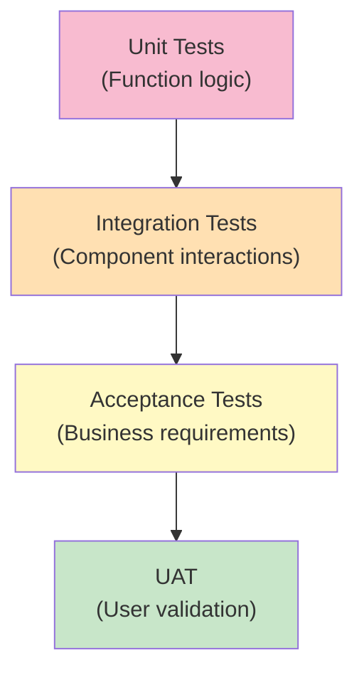

<Hero title="Acceptance and User Acceptance Testing (UAT)" subtitle="Validate that the system meets business requirements and user expectations." size="large" />

## TL;DR

Acceptance tests validate that the system meets business requirements from the user's perspective. UAT (User Acceptance Testing) is formal acceptance testing with actual end-users before release. Use behavior-driven development (BDD) frameworks like Cucumber to write tests in business language (Gherkin), making them readable to non-technical stakeholders. Acceptance tests are high-level scenarios; don't test every technical detail—focus on user outcomes. Run acceptance tests before every release; involve actual users in UAT on staging.

## Learning Objectives

After reading this article, you will understand:

- The difference between automated acceptance tests and UAT
- How to write acceptance criteria in Gherkin language
- How to implement step definitions linking business language to code
- How to involve stakeholders and users in acceptance testing
- Best practices for managing acceptance test suites
- How to balance BDD tests with lower-level unit/integration tests

## Motivating Scenario

Your team built a new payment feature. Technical tests pass: unit tests validate calculations, integration tests verify API calls. But when released to production, users complain the checkout flow doesn't match the promised business requirements from the specification. No one verified that the implementation actually matched what was promised to users.

Acceptance tests written in Gherkin (business language) would have caught this: they'd define "When a user applies a discount, then the total must be reduced by X%"—in language both engineers and product owners understand. Acceptance tests and UAT ensure the built feature matches what was actually required.

## Core Concepts

### Acceptance Testing vs. Unit/Integration Testing

<Figure caption="Acceptance testing validates complete business requirements; lower-level tests validate implementation details">

</Figure>

**Unit Tests**: Verify implementation details (does calculateDiscount() return the correct value?)

**Acceptance Tests**: Verify business outcomes (can users apply a discount code and see the reduced total?)

**UAT**: Users verify that the delivered system meets their needs

### Gherkin Language and BDD

Gherkin is a structured language for writing acceptance criteria that's readable to everyone:

```gherkin
Feature: User can check out with discount code
  Scenario: Apply valid discount code
    Given a user with items in cart
    When they enter discount code "SAVE20"
    Then the total should be reduced by 20%

  Scenario: Apply invalid discount code
    Given a user with items in cart
    When they enter discount code "INVALID"
    Then an error message appears
    And the total remains unchanged
```

**Key elements:**
- **Feature**: High-level description of a capability
- **Scenario**: Concrete example of the feature
- **Given**: Initial context/state
- **When**: Action the user takes
- **Then**: Expected outcome

### The Acceptance Testing Process

1. **Define acceptance criteria** — Product/QA write Gherkin scenarios
2. **Automate step definitions** — Engineers implement Given/When/Then steps
3. **Run automated tests** — Before every commit
4. **Perform UAT with users** — On staging environment before release
5. **Document feedback** — Fix issues discovered by users
6. **Sign off** — Users approve the feature

## Practical Example

<Tabs>
  <TabItem value="Gherkin" label="Gherkin Specification" default>
```gherkin
Feature: E-commerce checkout with discount codes
  As a customer
  I want to apply discount codes to my order
  So that I can save money

  Scenario: Apply valid percentage discount
    Given a user with items totaling $100 in cart
    When they apply discount code "SAVE20"
    Then the discount of $20 should be applied
    And the new total should be $80
    And a success message appears

  Scenario: Apply invalid discount code
    Given a user with items in cart
    When they apply discount code "INVALID"
    Then an error message appears
    And no discount is applied

  Scenario: Cannot combine multiple discount codes
    Given a user with items totaling $100 in cart
    When they apply discount code "SAVE20"
    And they apply discount code "SAVE10"
    Then only the first discount is applied
    And a message states "Only one discount per order"

  Scenario: Discount expires
    Given a user with items in cart
    When they apply discount code "EXPIRED"
    And the discount code expired on 2025-01-01
    Then an error appears: "This discount code has expired"
    And no discount is applied
```
  </TabItem>
  <TabItem value="Cucumber (Python)">
```python
# features/steps/checkout_steps.py
from behave import given, when, then
from decimal import Decimal
from app.discount import apply_discount_code
from app.cart import Cart

@given('a user with items totaling {amount} in cart')
def step_user_with_items(context, amount):
    context.cart = Cart()
    context.cart.set_subtotal(Decimal(amount.replace('$', '')))

@when('they apply discount code "{code}"')
def step_apply_discount(context, code):
    try:
        context.result = apply_discount_code(context.cart, code)
        context.error = None
    except Exception as e:
        context.error = str(e)
        context.result = None

@then('the discount of {discount_amount} should be applied')
def step_discount_applied(context, discount_amount):
    expected = Decimal(discount_amount.replace('$', ''))
    assert context.result is not None, "No result from discount"
    assert context.result['discount'] == expected, \
        f"Expected discount {expected}, got {context.result['discount']}"

@then('the new total should be {total}')
def step_new_total(context, total):
    expected_total = Decimal(total.replace('$', ''))
    assert context.result['new_total'] == expected_total

@then('a success message appears')
def step_success_message(context):
    assert context.result['success'] is True
    assert context.result['message'] is not None

@then('an error message appears')
def step_error_message(context):
    assert context.error is not None

@then('no discount is applied')
def step_no_discount(context):
    if context.result:
        assert context.result['discount'] == 0
    assert context.error is not None
```
  </TabItem>
  <TabItem value="Cucumber (JavaScript)">
```javascript
// features/steps/checkoutSteps.js
const { Given, When, Then } = require('@cucumber/cucumber');
const { expect } = require('chai');
const { applyDiscountCode } = require('../../src/discount');
const { Cart } = require('../../src/cart');

Given('a user with items totaling {string} in cart', function(amount) {
  this.cart = new Cart();
  const numericAmount = parseFloat(amount.replace('$', ''));
  this.cart.setSubtotal(numericAmount);
});

When('they apply discount code {string}', async function(code) {
  try {
    this.result = await applyDiscountCode(this.cart, code);
    this.error = null;
  } catch (error) {
    this.error = error.message;
    this.result = null;
  }
});

Then('the discount of {string} should be applied', function(discountAmount) {
  expect(this.result).to.exist;
  const expected = parseFloat(discountAmount.replace('$', ''));
  expect(this.result.discount).to.equal(expected);
});

Then('the new total should be {string}', function(total) {
  const expected = parseFloat(total.replace('$', ''));
  expect(this.result.newTotal).to.equal(expected);
});

Then('a success message appears', function() {
  expect(this.result.success).to.be.true;
  expect(this.result.message).to.exist;
});

Then('an error message appears', function() {
  expect(this.error).to.exist;
});

Then('no discount is applied', function() {
  if (this.result) {
    expect(this.result.discount).to.equal(0);
  }
  expect(this.error).to.exist;
});
```
  </TabItem>
</Tabs>

## When to Use / When Not to Use

<Vs highlight={[1]} items={[
{
    label: "Use Acceptance Testing When:",
    points: [
      "You need to verify business requirements are met",
      "Multiple stakeholders need to understand test cases",
      "Requirements change frequently; tests document the contract",
      "You want executable documentation of business rules",
      "UAT with real users is planned before release"
    ],
    highlightTone: "positive"
  },
{
    label: "Avoid Acceptance Testing When:",
    points: [
      "Testing low-level algorithmic edge cases (use unit tests)",
      "Performance/load testing is needed (use performance tests)",
      "UI layout/styling validation is primary (use visual regression)",
      "Tests are so complex they're unmaintainable",
      "No non-technical stakeholders need to understand tests"
    ],
    highlightTone: "warning"
  }
]} />

## Patterns and Pitfalls

<Showcase title="Acceptance Testing Best Practices and Pitfalls" sections={[
  {
    label: "✓ Best Practices",
    body: "**Use readable Gherkin**: Write scenarios that product managers can understand. **Involve stakeholders early**: Get acceptance criteria from product/users before development. **Keep scenarios simple**: One business outcome per scenario. **Reuse step definitions**: DRY principle applies; extract common steps. **Test business rules, not UI**: Focus on outcomes, not implementation. **Automate critical paths**: Prioritize scenarios that matter most. **Run before release**: No release without passing acceptance tests. **Gather UAT feedback**: Real users reveal gaps automated tests miss."
  ,
    body: "**Use readable Gherkin**: Write scenarios that product managers can understand. **Involve stakeholders early**: Get acceptance criteria from product/users before development. **Keep scenarios simple**: One business outcome per scenario. **Reuse step definitions**: DRY principle applies; extract common steps. **Test business rules, not UI**: Focus on outcomes, not implementation. **Automate critical paths**: Prioritize scenarios that matter most. **Run before release**: No release without passing acceptance tests. **Gather UAT feedback**: Real users reveal gaps automated tests miss."
  ,
    highlightTone: "positive"
  },
  {
    label: "✗ Anti-Patterns",
    body: "**Complex Gherkin**: Scenarios so convoluted non-technical people can't understand them. **Testing implementation details**: 'Then the API endpoint is called' instead of 'Then discount is applied'. **Tightly coupled to UI**: Tests break if CSS changes. **No step reuse**: Each scenario duplicates Given/When/Then logic. **Scenarios as stories**: Trying to capture too much in one scenario. **Ignoring UAT feedback**: Automated acceptance tests don't replace user feedback. **No prioritization**: Testing every edge case; should focus on critical paths. **Flaky tests**: Acceptance tests should be deterministic; fix flakiness immediately."
  ,
    body: "**Complex Gherkin**: Scenarios so convoluted non-technical people can't understand them. **Testing implementation details**: 'Then the API endpoint is called' instead of 'Then discount is applied'. **Tightly coupled to UI**: Tests break if CSS changes. **No step reuse**: Each scenario duplicates Given/When/Then logic. **Scenarios as stories**: Trying to capture too much in one scenario. **Ignoring UAT feedback**: Automated acceptance tests don't replace user feedback. **No prioritization**: Testing every edge case; should focus on critical paths. **Flaky tests**: Acceptance tests should be deterministic; fix flakiness immediately."
  ,
    highlightTone: "warning"
  }
]} />

## Design Review Checklist

<Checklist items={[
  "Gherkin scenarios are readable to non-technical stakeholders",
  "Each scenario tests one business outcome",
  "Step definitions are DRY; common steps extracted and reused",
  "Scenarios test business rules, not UI implementation details",
  "Critical user journeys have acceptance tests",
  "Edge cases/errors tested in separate scenarios",
  "Setup/teardown (Given steps) is clear and maintainable",
  "Steps are deterministic and not flaky",
  "Acceptance tests run in CI/CD; failure blocks deployment",
  "Test data is seeded reliably; no dependency on test order",
  "Scenarios are organized by feature (Feature files)",
  "Documentation exists for how to run acceptance tests",
  "UAT process is defined (who, when, how to sign off)",
  "Feedback from real users is collected and acted upon",
  "Mocks/stubs used for external services; not dependent on third parties"
]} />

## Self-Check Questions

- **Q: What's the difference between unit tests and acceptance tests?** A: Unit tests verify implementation details (does this function work?); acceptance tests verify business outcomes (does the user get the right result?).

- **Q: Why use Gherkin instead of plain code?** A: Gherkin is readable to product managers and business people, making it true executable documentation. It bridges the gap between business requirements and code.

- **Q: How do you prevent acceptance tests from becoming too technical?** A: Focus on the "what" (business outcome) not the "how" (implementation). Avoid mentioning UI selectors, API endpoints, database details.

- **Q: What's the difference between automated acceptance tests and UAT?** A: Automated tests verify that the system meets automated criteria. UAT involves real users validating that the system meets their needs.

- **Q: Should acceptance tests cover every edge case?** A: No. Acceptance tests cover critical business scenarios and happy paths. Edge cases belong in unit/integration tests.

## Next Steps

1. **Define acceptance criteria** — With product/QA, write Gherkin scenarios for critical features
2. **Choose a BDD framework** — Cucumber (polyglot), Behave (Python), SpecFlow (.NET)
3. **Implement step definitions** — Engineers code the Given/When/Then logic
4. **Automate in CI/CD** — Acceptance tests run before every deployment
5. **Plan UAT** — Schedule user testing on staging before releases
6. **Collect feedback** — Real users identify gaps automated tests miss
7. **Iterate** — Update scenarios as requirements change

## References

1. <a href="https://cucumber.io/" target="_blank" rel="nofollow noopener noreferrer">Cucumber Documentation ↗️</a>
2. <a href="https://cucumber.io/docs/bdd/" target="_blank" rel="nofollow noopener noreferrer">BDD Best Practices ↗️</a>
3. <a href="https://cucumber.io/docs/gherkin/" target="_blank" rel="nofollow noopener noreferrer">Gherkin Language Reference ↗️</a>
4. <a href="https://en.wikipedia.org/wiki/Behavior-driven_development" target="_blank" rel="nofollow noopener noreferrer">Behavior-Driven Development on Wikipedia ↗️</a>