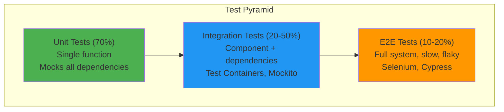

<Hero
  title="Component and Integration Testing"
  subtitle="Test service boundaries, API contracts, and data flows with reproducible component and integration tests using test containers and contract testing frameworks."
  difficulty="intermediate"
  time="15 min read"
/>

## TL;DR

Component tests verify a single service/component in isolation with its real dependencies (databases, caches) replaced by test doubles. Integration tests verify multiple components interact correctly across process boundaries (HTTP APIs, messaging). Use test containers for reproducible DB/external service setup, contract tests for API compatibility, and test data builders to avoid brittle fixtures. Target 20-50% integration test coverage; layer with fast unit tests (70%) and slow E2E tests (10-20%) for efficient feedback.

## Learning Objectives

By the end of this article, you'll understand:
- Component vs integration vs unit testing trade-offs
- Test isolation strategies and avoiding flaky tests
- API contract testing for backward compatibility
- Database integration testing best practices
- Test containers for reproducible external dependencies
- Test data management and avoiding duplication

## Motivating Scenario

Your microservice updated its database schema, breaking the downstream payment service integration. The integration tests passed because they tested in isolation. A new team member adds API parameters that weren't documented; they work locally but fail in staging. Your test database grows to 5GB with duplicate test data, making CI jobs timeout. You need integration tests that catch these real failures, run reliably in CI, and stay fast enough not to become a bottleneck.

## Core Concepts

<Figure title="Testing Pyramid with Component/Integration Focus">

</Figure>

### Component Testing

Tests a single service with real dependencies (database, cache) but mocked external services (other microservices, third-party APIs). Verifies business logic and database interactions within a service boundary.

**Characteristics:**
- Tests one service/component in isolation
- Uses test database, real ORM, real storage logic
- Mocks external services (HTTP, messaging)
- Faster than E2E (seconds to minutes)
- Catches business logic, database schema issues
- Deterministic and reproducible

**Example:** Testing order service with real PostgreSQL but mocked payment service.

### Integration Testing

Verifies multiple components interact correctly across process boundaries (APIs, message queues, databases). Tests the contracts between services.

**Characteristics:**
- Tests 2-3 loosely coupled components
- May involve real HTTP calls or message brokers
- Tests API contracts (request/response formats)
- Detects serialization, naming, version mismatches
- Slower than component tests (seconds)
- Requires isolated test environments

**Example:** Order service calls payment service; verify request payload matches API contract.

### Test Containers

Docker containers that provide ephemeral databases and services for testing. Each test gets a fresh instance; no state pollution between tests.

**Benefits:**
- Identical schema to production
- No test data setup complexity
- Parallel test execution (each gets own container)
- Tests real driver logic (JDBC, TCP protocol)
- Portable (same setup locally and CI)

### API Contract Testing

Consumer-driven contracts specify API expectations (request format, response schema, status codes). Caught mismatches before deployment.

**Patterns:**
- Provider tests (service verifies it meets contracts)
- Consumer tests (client verifies expected API shape)
- Bi-directional contracts prevent surprises
- Can run without actual services running

## Practical Example

<Tabs>
<TabItem value="java" label="Java (TestContainers + Mockito)">
```java
import org.junit.jupiter.api.Test;
import org.testcontainers.containers.PostgreSQLContainer;
import org.testcontainers.junit.jupiter.Container;
import org.testcontainers.junit.jupiter.Testcontainers;
import static org.junit.jupiter.api.Assertions.*;
import static org.mockito.Mockito.*;

@Testcontainers
class OrderServiceComponentTest {

    @Container
    static PostgreSQLContainer<?> postgres = new PostgreSQLContainer<>()
        .withDatabaseName("testdb")
        .withUsername("test")
        .withPassword("test");

    private OrderRepository orderRepository;
    private OrderService orderService;
    private PaymentClient paymentClientMock;

    @BeforeEach
    void setup() {
        // Setup real database connection from container
        DataSource dataSource = createDataSource(
            postgres.getJdbcUrl(),
            postgres.getUsername(),
            postgres.getPassword()
        );

        orderRepository = new PostgresOrderRepository(dataSource);

        // Mock external service
        paymentClientMock = mock(PaymentClient.class);

        orderService = new OrderService(
            orderRepository,
            paymentClientMock
        );
    }

    @Test
    void testCreateOrderWithValidPayment() {
        // Arrange
        CreateOrderRequest request = new CreateOrderRequest(
            userId = 123,
            items = [new OrderItem(productId = 1, quantity = 2)]
        );

        when(paymentClientMock.charge(any()))
            .thenReturn(new PaymentResponse(success = true, id = "payment-1"));

        // Act
        Order order = orderService.createOrder(request);

        // Assert
        assertNotNull(order.getId());
        assertEquals("PENDING", order.getStatus());

        // Verify payment was called with correct amount
        ArgumentCaptor<ChargeRequest> captor =
            ArgumentCaptor.forClass(ChargeRequest.class);
        verify(paymentClientMock).charge(captor.capture());

        ChargeRequest captured = captor.getValue();
        assertEquals(100.0, captured.getAmount()); // 2 items * 50 each

        // Verify data persisted in real database
        Order persisted = orderRepository.findById(order.getId()).get();
        assertEquals("PENDING", persisted.getStatus());
    }

    @Test
    void testCreateOrderWithFailedPayment() {
        CreateOrderRequest request = new CreateOrderRequest(
            userId = 123,
            items = [new OrderItem(productId = 1, quantity = 1)]
        );

        when(paymentClientMock.charge(any()))
            .thenThrow(new PaymentException("Card declined"));

        // Act & Assert
        assertThrows(PaymentException.class, () ->
            orderService.createOrder(request)
        );

        // Verify order was NOT persisted
        assertTrue(orderRepository.findAll().isEmpty());
    }
}
```
</TabItem>

<TabItem value="python" label="Python (pytest + Testcontainers)">
```python
import pytest
from testcontainers.postgres import PostgresContainer
from unittest.mock import Mock, patch, MagicMock
import psycopg2
from datetime import datetime

@pytest.fixture(scope="session")
def postgres_container():
    """Spin up a test PostgreSQL container for session"""
    container = PostgresContainer("postgres:14")
    with container:
        yield container

@pytest.fixture
def db_connection(postgres_container):
    """Create fresh connection to test database"""
    conn = psycopg2.connect(
        host=postgres_container.get_container_host_ip(),
        port=postgres_container.get_exposed_port(5432),
        database=postgres_container.dbname,
        user=postgres_container.username,
        password=postgres_container.password
    )
    yield conn
    conn.close()

@pytest.fixture
def order_repository(db_connection):
    """Repository with real database connection"""
    return OrderRepository(db_connection)

@pytest.fixture
def payment_client_mock():
    """Mock external payment service"""
    return Mock(spec=PaymentClient)

@pytest.fixture
def order_service(order_repository, payment_client_mock):
    """Component under test with mocked dependencies"""
    return OrderService(
        repository=order_repository,
        payment_client=payment_client_mock
    )

def test_create_order_success(order_service, order_repository,
                               payment_client_mock):
    """Test successful order creation with payment"""
    # Arrange
    payment_client_mock.charge.return_value = {
        'success': True,
        'transaction_id': 'txn-123'
    }

    # Act
    order = order_service.create_order(
        user_id=456,
        items=[
            {'product_id': 1, 'quantity': 2, 'price': 50.0}
    )

    # Assert
    assert order['id'] is not None
    assert order['status'] == 'PENDING'

    # Verify payment was called correctly
    payment_client_mock.charge.assert_called_once()
    call_args = payment_client_mock.charge.call_args
    assert call_args[0][0]['amount'] == 100.0  # 2 * 50

    # Verify persisted in real database
    persisted = order_repository.get_by_id(order['id'])
    assert persisted['status'] == 'PENDING'
    assert persisted['created_at'] is not None

def test_create_order_payment_failure(order_service, order_repository,
                                      payment_client_mock):
    """Test order creation fails when payment fails"""
    payment_client_mock.charge.side_effect = PaymentError("Card declined")

    with pytest.raises(PaymentError):
        order_service.create_order(
            user_id=456,
            items=[{'product_id': 1, 'quantity': 1, 'price': 50.0}]
        )

    # Verify order was NOT persisted
    all_orders = order_repository.list_all()
    assert len(all_orders) == 0

def test_order_database_persistence(db_connection, order_repository):
    """Test direct database operations"""
    # Insert order directly
    order_id = order_repository.create({
        'user_id': 789,
        'status': 'COMPLETED',
        'total': 150.0
    })

    # Query back
    order = order_repository.get_by_id(order_id)
    assert order['user_id'] == 789
    assert order['status'] == 'COMPLETED'
    assert order['total'] == 150.0

    # Verify schema constraints
    with pytest.raises(psycopg2.IntegrityError):
        # User ID is NOT NULL
        order_repository.create({
            'user_id': None,
            'status': 'PENDING'
        })
```
</TabItem>

<TabItem value="contract" label="API Contract Testing (Pact)">
```javascript
// Consumer Test: Order Service expects Payment API
const { ConsumerPact } = require('@pact-foundation/pact');

const pact = new ConsumerPact({
  consumer: 'OrderService',
  provider: 'PaymentService',
  port: 8081,
});

describe('Payment API Contract', () => {
  after(() => pact.finalize());

  describe('POST /charge', () => {
    it('should charge card successfully', async () => {
      // Define contract: what consumer expects
      await pact.addInteraction({
        state: 'card is valid',
        uponReceiving: 'a charge request',
        withRequest: {
          method: 'POST',
          path: '/charge',
          headers: { 'Content-Type': 'application/json' },
          body: {
            amount: 100.00,
            currency: 'USD',
            card_token: 'tok_123'
          }
        },
        willRespondWith: {
          status: 200,
          headers: { 'Content-Type': 'application/json' },
          body: {
            success: true,
            transaction_id: Matchers.uuid(),  // Any UUID
            amount: 100.00
          }
        }
      });

      // Act: Consumer calls payment service
      const paymentClient = new PaymentClient(
        `http://localhost:${pact.server.port}`
      );

      const response = await paymentClient.charge({
        amount: 100.00,
        currency: 'USD',
        card_token: 'tok_123'
      });

      // Assert
      expect(response.success).toBe(true);
      expect(response.transaction_id).toBeDefined();
    });

    it('should reject invalid card', async () => {
      await pact.addInteraction({
        state: 'card is declined',
        uponReceiving: 'a charge with invalid card',
        withRequest: {
          method: 'POST',
          path: '/charge',
          body: { amount: 50.00, card_token: 'tok_declined' }
        },
        willRespondWith: {
          status: 402,
          body: {
            success: false,
            error: 'Card declined',
            error_code: 'card_declined'
          }
        }
      });

      const paymentClient = new PaymentClient(
        `http://localhost:${pact.server.port}`
      );

      await expect(
        paymentClient.charge({ amount: 50.00, card_token: 'tok_declined' })
      ).rejects.toThrow('Card declined');
    });
  });
});

// Provider Test: Payment Service fulfills contracts
describe('Payment Service Provider', () => {
  const provider = new Verifier({
    provider: 'PaymentService',
    providerBaseUrl: 'http://localhost:3000',
    pactUrls: ['./pacts/OrderService-PaymentService.json']
  });

  it('should fulfill consumer expectations', () => {
    return provider.verifyProvider();
  });
});
```
</TabItem>

<TabItem value="go" label="Go (Testify + Containers)">
```go
package service

import (
	"context"
	"testing"

	"github.com/stretchr/testify/assert"
	"github.com/stretchr/testify/require"
	"github.com/testcontainers/testcontainers-go"
	"github.com/testcontainers/testcontainers-go/wait"
)

type OrderServiceTest struct {
	db             *sql.DB
	repository     *OrderRepository
	paymentMock    *MockPaymentClient
	orderService   *OrderService
	container      testcontainers.Container
}

func setupTest(t *testing.T) *OrderServiceTest {
	ctx := context.Background()

	// Start PostgreSQL container
	req := testcontainers.ContainerRequest{
		Image:        "postgres:14",
		ExposedPorts: []string{"5432/tcp"},
		Env: map[string]string{
			"POSTGRES_DB":       "testdb",
			"POSTGRES_USER":     "test",
			"POSTGRES_PASSWORD": "test",
		},
		WaitingFor: wait.ForListeningPort("5432/tcp"),
	}

	container, err := testcontainers.GenericContainer(ctx,
		testcontainers.GenericContainerRequest{
			ContainerRequest: req,
			Started:          true,
		})
	require.NoError(t, err)

	// Get connection details
	host, err := container.Host(ctx)
	require.NoError(t, err)

	port, err := container.MappedPort(ctx, "5432")
	require.NoError(t, err)

	// Connect to test database
	connStr := fmt.Sprintf(
		"host=%s port=%s user=test password=test dbname=testdb sslmode=disable",
		host, port.Port())

	db, err := sql.Open("postgres", connStr)
	require.NoError(t, err)

	// Run migrations
	err = runMigrations(db)
	require.NoError(t, err)

	// Setup service with real repository and mocked payment client
	repository := NewOrderRepository(db)
	paymentMock := NewMockPaymentClient()
	orderService := NewOrderService(repository, paymentMock)

	return &OrderServiceTest{
		db:           db,
		repository:   repository,
		paymentMock:  paymentMock,
		orderService: orderService,
		container:    container,
	}
}

func (st *OrderServiceTest) cleanup(t *testing.T) {
	st.db.Close()
	ctx := context.Background()
	st.container.Terminate(ctx)
}

func TestCreateOrderSuccess(t *testing.T) {
	test := setupTest(t)
	defer test.cleanup(t)

	// Arrange
	test.paymentMock.OnCharge(func(req *ChargeRequest) *ChargeResponse {
		return &ChargeResponse{
			Success:       true,
			TransactionID: "txn-123",
		}
	})

	// Act
	order, err := test.orderService.CreateOrder(&CreateOrderRequest{
		UserID: 456,
		Items: []OrderItem{
			{ProductID: 1, Quantity: 2, Price: 50.0},
		},
	})

	// Assert
	require.NoError(t, err)
	assert.NotNil(t, order.ID)
	assert.Equal(t, "PENDING", order.Status)

	// Verify payment mock was called
	assert.True(t, test.paymentMock.ChargeCalled())
	charge := test.paymentMock.LastChargeCall()
	assert.Equal(t, 100.0, charge.Amount)

	// Verify persisted in database
	persisted, err := test.repository.GetByID(order.ID)
	require.NoError(t, err)
	assert.Equal(t, "PENDING", persisted.Status)
}

func TestCreateOrderPaymentFailure(t *testing.T) {
	test := setupTest(t)
	defer test.cleanup(t)

	// Arrange
	test.paymentMock.OnCharge(func(req *ChargeRequest) *ChargeResponse {
		return &ChargeResponse{
			Success: false,
			Error:   "Card declined",
		}
	})

	// Act
	_, err := test.orderService.CreateOrder(&CreateOrderRequest{
		UserID: 456,
		Items: []OrderItem{
			{ProductID: 1, Quantity: 1, Price: 50.0},
		},
	})

	// Assert
	require.Error(t, err)

	// Verify order was NOT persisted
	orders, err := test.repository.ListAll()
	require.NoError(t, err)
	assert.Empty(t, orders)
}
```
</TabItem>
</Tabs>

## When to Use / When Not to Use

<Vs items={[
{
    label: "Component Test When:",
    points: ["Testing complex business logic within a service", "Database interactions and schema changes", "Need fast feedback (< 1 second per test)", "Mocking external services (payment, email)", "Testing error handling and retries"]
  },
{
    label: "Integration Test When:",
    points: ["Testing API contracts between services", "Multi-service workflows (order -> payment -> shipping)", "Message queue interactions", "Cache invalidation across services", "Testing rare failure scenarios (timeout, disconnection)"]
  }
]} />

## Patterns & Pitfalls

<Showcase  sections={[{
      title: "Test Containers for Reproducibility",
      description: "Use TestContainers for databases, message brokers, caches. Each test gets fresh container. Eliminates test data pollution and CI environment differences.",
      icon: "✓",
      positive: true
    }, {
      title: "Brittle Test Data Fixtures",
      description: "Hard-coded test data in setup methods breaks when schema changes. Use test data builders (fluent APIs) and parametrized tests instead.",
      icon: "✗",
      positive: false
    }, {
      title: "Contract Testing for APIs",
      description: "Define API expectations (request/response format) as executable contracts. Prevents breaking changes; can test without spinning up actual services.",
      icon: "✓",
      positive: true
    }, {
      title: "Flaky Tests from Shared State",
      description: "Tests sharing database fail sporadically when execution order changes. Isolate each test with rollback or separate containers.",
      icon: "✓",
      positive: true
    }, {
      title: "Over-Mocking External Services",
      description: "Mocking too much hides integration bugs. Reserve mocking for true external calls (payment APIs); use test containers for services you control.",
      icon: "✗",
      positive: false
    }, {
      title: "Database Schema Sync",
      description: "Test schemas diverge from production, causing failures. Use same migrations for test databases. Catch schema mismatches before production.",
      icon: "✓",
      positive: true
    }]}
/>

## Design Review Checklist

<Checklist
  items={[
    { label: "Component tests cover critical business logic (80%+ branch coverage)", checked: false },
    { label: "Test databases use TestContainers or equivalent for reproducibility", checked: false },
    { label: "Each test is independent (no shared state between tests)", checked: false },
    { label: "Test data created with builders, not hard-coded fixtures", checked: false },
    { label: "Integration tests verify API contracts (request/response formats)", checked: false },
    { label: "Mocks used only for external services (not internal components)", checked: false },
    { label: "Database migrations run in test setup, not committed test data", checked: false },
    { label: "Tests run in parallel without interference", checked: false },
    { label: "Component tests run in < 5 seconds; integration in < 10 seconds", checked: false },
    { label: "Documentation explains test strategy (unit/component/integration ratio)", checked: false }
  ]}
/>

## Self-Check

Ask yourself:
- Can I run all component tests without a test database running first?
- If my database schema changes, do my tests still pass?
- Do I have tests for the APIs my service exposes?
- Are my tests deterministic (same result every run)?
- Can new team members run tests without setup instructions?

## One Key Takeaway

:::info
**Component and integration tests fill the gap between brittle unit tests and slow E2E tests. Use TestContainers for reproducible dependencies, contract tests for API compatibility, and test data builders to avoid brittle fixtures. The goal is to catch real failures (schema changes, API mismatches) with fast, reliable tests.**

:::

## Next Steps

1. **Audit test coverage** - Identify gaps between unit and E2E
2. **Add component tests** - Start with critical business logic
3. **Implement TestContainers** - Replace test database hacks
4. **Write contract tests** - Document and verify API expectations
5. **Refactor test data** - Replace fixtures with builders
6. **Parallelize tests** - Ensure isolation for parallel execution
7. **Monitor test health** - Track flakiness and duration

## References

- <a href="https://www.testcontainers.org/" target="_blank" rel="nofollow noopener noreferrer">TestContainers Project ↗️</a>
- <a href="https://pact.foundation/" target="_blank" rel="nofollow noopener noreferrer">Pact Contract Testing ↗️</a>
- <a href="https://martinfowler.com/articles/testing-strategies.html" target="_blank" rel="nofollow noopener noreferrer">Martin Fowler: Testing Strategies ↗️</a>
- <a href="https://www.mountaingoatsoftware.com/blog/the-testing-pyramid" target="_blank" rel="nofollow noopener noreferrer">Testing Pyramid Guide ↗️</a>
- <a href="https://testcontainers.com/guides/testcontainers-best-practices/" target="_blank" rel="nofollow noopener noreferrer">TestContainers Best Practices ↗️</a>
