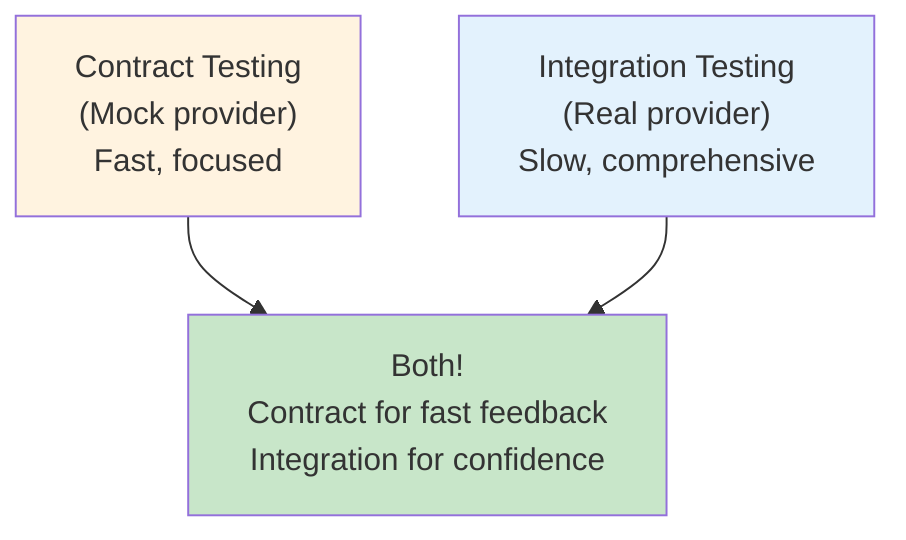

<Hero title="Contract and Consumer-Driven Contract Tests" subtitle="Validate API contracts between services to catch breaking changes before deployment." size="large" />

## TL;DR

Contract testing verifies API contracts between services. Consumer-driven contracts (CDC) start from the consumer's perspective: "What data do I need from the API?" Providers then implement that contract. Use Pact or similar tools to record contracts and replay them in CI/CD. CDC catches breaking changes before deployment—fast (mock provider) and focused (API contract only). Ideal for microservices architectures where API changes can break downstream services. Run consumer tests in CI to generate contract files; provider tests in CI to verify the contract; share contracts between services.

## Learning Objectives

After reading this article, you will understand:

- The difference between contract testing and integration testing
- How consumer-driven contracts shift responsibility
- How to write consumer contract tests
- How to use Pact to record and validate contracts
- Best practices for managing contracts in microservices
- How to integrate contract testing into CI/CD pipelines

## Motivating Scenario

Your company has 50+ microservices. Service A depends on Service B's `/user/:id` endpoint. Service B's team changes the response format (renames `name` to `full_name`). Service A still expects the old format; it crashes in production because no one caught the breaking change before deployment.

Contract testing prevents this: Service A (consumer) explicitly defines what it expects from Service B's API. When Service B changes the endpoint, the contract test fails in CI, preventing the breaking change from being deployed.

## Core Concepts

### Contract Testing vs. Integration Testing

<Figure caption="Contract testing validates API contracts; integration testing validates end-to-end interactions">

</Figure>

| Aspect | Contract Testing | Integration Testing |
|--------|------------------|---------------------|
| Provider | Mock | Real |
| Speed | Fast (100s ms) | Slow (seconds) |
| Setup | Define contract | Start full system |
| Scope | API contract only | Full interaction |
| CI/CD Cost | Low | High |
| When to run | Every commit | Nightly or on release |

### Consumer-Driven Contracts (CDC)

CDC flips the responsibility model:

**Traditional (Provider-Driven):**
1. Provider team designs API
2. Consumer team uses API
3. Breaking changes might break consumers

**Consumer-Driven (CDC):**
1. Consumer team defines needs: "I need GET /user/:id returning id, name, email"
2. Provider team implements that contract
3. Provider knows exactly what consumers need; harder to break contracts accidentally

### Pact and Contract Recording

Pact is a CDC framework:

1. **Consumer test**: Mock provider, define expectations
2. **Generate contract**: Pact records the interaction as a JSON file
3. **Share contract**: Contract file pushed to central repository
4. **Provider test**: Provider tests against the contract; verifies provider actually implements it
5. **Deploy safely**: If contract tests pass, deployment is safe

## Practical Example

<Tabs>
  <TabItem value="JavaScript (Pact)" label="JavaScript (Pact)" default>
```javascript
// Consumer test: Service A expects /user/{id}
const { Pact } = require('@pact-foundation/pact');
const { UserClient } = require('../src/userClient');

describe('User Service Consumer', () => {
  const provider = new Pact({ consumer: 'ServiceA', provider: 'UserService' });

  beforeAll(() => provider.setup());
  afterAll(() => provider.finalize());

  it('should fetch user by ID', async () => {
    // Define what ServiceA expects from UserService
    await provider.addInteraction({
      state: 'user 123 exists',
      uponReceiving: 'a request for user 123',
      withRequest: {
        method: 'GET',
        path: '/users/123',
        headers: { Authorization: 'Bearer token' }
      },
      willRespondWith: {
        status: 200,
        headers: { 'Content-Type': 'application/json' },
        body: {
          id: 123,
          name: 'Alice',
          email: 'alice@example.com'
        }
      }
    });

    // Call the service (mock provider responds)
    const client = new UserClient('http://localhost:8080');
    const user = await client.getUser(123);

    // Verify the response matches expectations
    expect(user.id).toBe(123);
    expect(user.name).toBe('Alice');
    expect(user.email).toBe('alice@example.com');
  });

  it('should handle user not found', async () => {
    await provider.addInteraction({
      state: 'user 999 does not exist',
      uponReceiving: 'a request for non-existent user',
      withRequest: {
        method: 'GET',
        path: '/users/999'
      },
      willRespondWith: {
        status: 404,
        body: { error: 'User not found' }
      }
    });

    const client = new UserClient('http://localhost:8080');
    await expect(client.getUser(999)).rejects.toThrow('Not found');
  });
});
```
  </TabItem>
  <TabItem value="Python (Pact)">
```python
# Consumer test: Service A expects /user/{id}
import pytest
from pact import Consumer, Provider
import requests

pact = Consumer('ServiceA').has_state(
    'user 123 exists'
).upon_receiving(
    'a request for user 123'
).with_request(
    'GET',
    '/users/123',
    headers={'Authorization': 'Bearer token'}
).will_respond_with(
    200,
    body={
        'id': 123,
        'name': 'Alice',
        'email': 'alice@example.com'
    }
)

def test_fetch_user():
    with pact:
        response = requests.get('http://localhost:8000/users/123')
        assert response.status_code == 200
        data = response.json()
        assert data['id'] == 123
        assert data['name'] == 'Alice'
        assert data['email'] == 'alice@example.com'

# Provider test: UserService implements the contract
def test_user_service_honors_contract(mock_db):
    """Verify provider actually implements the contract"""
    from app import app
    from pact import Consumer, Provider

    # Load the contract generated by consumer
    contract = Consumer('ServiceA').has_state(
        'user 123 exists'
    ).upon_receiving(
        'a request for user 123'
    ).with_request(
        'GET', '/users/123'
    ).will_respond_with(200)

    # Test that our provider actually implements it
    client = app.test_client()
    response = client.get('/users/123')

    assert response.status_code == 200
    data = response.get_json()
    assert 'id' in data
    assert 'name' in data
    assert 'email' in data
```
  </TabItem>
  <TabItem value="Go (Pact)">
```go
// Consumer test: Service A expects /user/{id}
package main

import (
	"fmt"
	"net/http"
	"testing"

	"github.com/pact-foundation/pact-go/v2/consumer"
	"github.com/pact-foundation/pact-go/v2/matchers"
	"github.com/stretchr/testify/assert"
)

func TestUserServiceConsumerContract(t *testing.T) {
	mockProvider, err := consumer.NewV4MockProvider()
	assert.NoError(t, err)

	mockProvider.
		AddInteraction().
		Given("user 123 exists").
		UponReceiving("a request for user 123").
		WithRequest("GET", "/users/123").
		WithHeaders(map[string]string{"Authorization": "Bearer token"}).
		WillRespondWith(200).
		WithBody(map[string]interface{}{
			"id":    matchers.Int(123),
			"name":  matchers.String("Alice"),
			"email": matchers.String("alice@example.com"),
		})

	err = mockProvider.ExecuteTest(t, func(mockURL string) error {
		// Call the service with the mock provider URL
		resp, err := http.Get(fmt.Sprintf("%s/users/123", mockURL))
		if err != nil {
			return err
		}
		defer resp.Body.Close()

		assert.Equal(t, 200, resp.StatusCode)
		return nil
	})

	assert.NoError(t, err)
}

// Provider test: Verify UserService implements contract
func TestUserServiceProvider(t *testing.T) {
	// Load contract files from consumer
	opts := &verifier.VerifyRequest{
		ProviderBaseURL:      "http://localhost:8080",
		PactFiles:            []string{"./pacts/ServiceA-UserService.json"},
		ProviderVersion:      "1.0.0",
	}

	// Verify the provider satisfies all contracts
	err := verifier.VerifyProvider(t, opts)
	assert.NoError(t, err)
}
```
  </TabItem>
</Tabs>

## When to Use / When Not to Use

<Vs highlight={[1]} items={[
{
    label: "Use Contract Testing When:",
    points: [
      "You have multiple services with API dependencies",
      "Services are owned by different teams",
      "You need fast feedback before integration testing",
      "API changes are frequent; contracts protect against breaking changes",
      "You want to prevent tight coupling between services"
    ],
    highlightTone: "positive"
  },
{
    label: "Avoid Contract Testing When:",
    points: [
      "You have a monolith (single service); unit/integration tests sufficient",
      "Services are tightly integrated (e.g., single team; easier to test integration)",
      "API contracts are stable and rarely change",
      "Full end-to-end testing is necessary (contracts test single API, not full workflows)",
      "Consumer-driven design would be overengineering"
    ],
    highlightTone: "warning"
  }
]} />

## Patterns and Pitfalls

<Showcase title="Contract Testing Best Practices and Anti-Patterns" sections={[
  {
    label: "✓ Best Practices",
    body: "**Start with consumer**: Consumer defines what it needs; provider implements. **Share contracts**: Store contracts in a repository accessible to both teams. **Version contracts**: Contract versions should match service versions. **Test provider thoroughly**: Provider tests must verify every contract interaction. **Automate contract verification**: Run in CI/CD; fail deployment if contracts don't match. **Use Pact broker**: Share contracts between teams; manage contract lifecycle. **Document context**: Include state/pre-conditions in contract (e.g., 'user 123 exists'). **Mock external services**: Contracts should test the API boundary, not third-party dependencies."
  ,
    body: "**Start with consumer**: Consumer defines what it needs; provider implements. **Share contracts**: Store contracts in a repository accessible to both teams. **Version contracts**: Contract versions should match service versions. **Test provider thoroughly**: Provider tests must verify every contract interaction. **Automate contract verification**: Run in CI/CD; fail deployment if contracts don't match. **Use Pact broker**: Share contracts between teams; manage contract lifecycle. **Document context**: Include state/pre-conditions in contract (e.g., 'user 123 exists'). **Mock external services**: Contracts should test the API boundary, not third-party dependencies."
  ,
    highlightTone: "positive"
  },
  {
    label: "✗ Anti-Patterns",
    body: "**Tight coupling to implementation**: Testing internal state/database instead of API contract. **Unclear contract states**: Contract says 'user exists' but doesn't define how to set it up. **No provider verification**: Consumer tests pass but provider doesn't actually implement the contract. **Contracts not in sync**: Consumer and provider have different expectations. **Over-mocking**: Contract test so abstracted from reality it doesn't catch real issues. **No version management**: API changes without updating contracts. **Ignoring contract violations**: Contracts fail but deployment proceeds anyway. **Contracts instead of integration tests**: Some full integration testing is still necessary; contracts complement but don't replace it."
  ,
    body: "**Tight coupling to implementation**: Testing internal state/database instead of API contract. **Unclear contract states**: Contract says 'user exists' but doesn't define how to set it up. **No provider verification**: Consumer tests pass but provider doesn't actually implement the contract. **Contracts not in sync**: Consumer and provider have different expectations. **Over-mocking**: Contract test so abstracted from reality it doesn't catch real issues. **No version management**: API changes without updating contracts. **Ignoring contract violations**: Contracts fail but deployment proceeds anyway. **Contracts instead of integration tests**: Some full integration testing is still necessary; contracts complement but don't replace it."
  ,
    highlightTone: "warning"
  }
]} />

## Design Review Checklist

<Checklist items={[
  "Consumer defines API contract (what data is needed)",
  "Contract includes request/response structure and headers",
  "Contract specifies pre-conditions/state (e.g., 'user exists')",
  "Consumer test generates contract file via Pact",
  "Provider test verifies the provider implements the contract",
  "Both consumer and provider tests run in CI/CD",
  "Contracts are stored in version control or Pact broker",
  "Contract matches actual API behavior (no over-mocking)",
  "Breaking changes to API cause contract test failures",
  "Error scenarios tested (404, 5xx, validation errors)",
  "Contract includes realistic response data (not just {id: 1})",
  "Contracts are shared between consumer and provider teams",
  "Contract versions tracked alongside service versions",
  "Deployment gates on contract test failures",
  "Regular audits to ensure contracts match actual APIs"
]} />

## Self-Check Questions

- **Q: What's the difference between contract testing and integration testing?** A: Contract testing validates API contract (request/response) with a mock provider (fast). Integration testing uses a real provider (slow, comprehensive).

- **Q: Why is it called 'consumer-driven' contracts?** A: Because the consumer (service that uses the API) defines the contract first. The provider then implements to match.

- **Q: What does Pact do?** A: Pact records interactions between consumer and mock provider as a contract file (JSON). Provider tests verify the provider actually implements the contract.

- **Q: How do you handle contract breaks (incompatible changes)?** A: Consumer and provider must agree on new contract. Both teams update tests. Deployment gates on contract test failures force the conversation.

- **Q: Should you use contracts instead of integration testing?** A: No. Use both. Contracts for fast feedback on API compatibility. Integration tests for confidence in full workflows.

## Next Steps

1. **Identify service dependencies** — Map which services call which APIs
2. **Start with critical APIs** — Contract test the most frequently used APIs first
3. **Choose a CDC tool** — Pact (polyglot), Spring Cloud Contract (.NET/Java)
4. **Write consumer tests** — Define what the consumer expects from the API
5. **Generate contracts** — Pact generates contract files
6. **Write provider tests** — Verify provider implements the contract
7. **Share contracts** — Central repository or Pact broker
8. **Automate verification** — Run consumer and provider tests in CI/CD
9. **Monitor contract violations** — Alert when contracts fail; prioritize fixes

## References

1. <a href="https://pact.foundation/" target="_blank" rel="nofollow noopener noreferrer">Pact Foundation ↗️</a>
2. <a href="https://martinfowler.com/articles/consumerDrivenContracts.html" target="_blank" rel="nofollow noopener noreferrer">Consumer-Driven Contracts (Martin Fowler) ↗️</a>
3. <a href="https://docs.pact.foundation/" target="_blank" rel="nofollow noopener noreferrer">Pact Documentation ↗️</a>
4. <a href="https://spring.io/projects/spring-cloud-contract" target="_blank" rel="nofollow noopener noreferrer">Spring Cloud Contract ↗️</a>