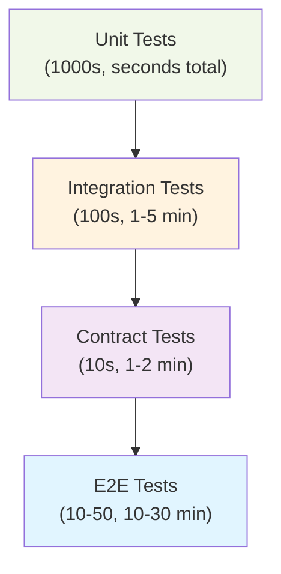

<Hero title="End-to-End and System Testing" subtitle="Test complete user workflows across all system layers to validate real-world behavior." size="large" />

## TL;DR

End-to-end (E2E) testing validates complete user workflows through the entire system—from UI interactions through backend services to database. E2E tests are slower (seconds to minutes per test) than unit/integration tests but test actual user behavior. Use frameworks like Cypress, Playwright, or Selenium for browser automation. Focus on critical user journeys; don't test every detail at E2E level. Avoid brittle UI selector-based tests; prefer behavior-driven tests. Run selectively in CI (quick suite on every commit; full suite nightly). Supplement E2E with unit and integration tests for comprehensive coverage.

## Learning Objectives

After reading this article, you will understand:

- The role of E2E testing in a comprehensive test strategy
- How to write maintainable, reliable E2E tests
- Trade-offs between different E2E frameworks (Cypress, Playwright, Selenium)
- Best practices to minimize flakiness and improve test speed
- When E2E testing is appropriate vs. lower-level testing
- How to balance E2E coverage with other test types in the testing pyramid

## Motivating Scenario

Your e-commerce platform has passed all unit and integration tests. When users try to complete checkout (add item to cart, enter shipping, apply discount, enter payment), the flow fails silently because an API response format change broke the frontend integration. Unit tests for individual components pass, but the integrated workflow fails.

E2E tests catch this: they'd automate the full checkout flow, uncovering the integration bug before production. Without E2E tests, such integration issues slip through to production.

## Core Concepts

### E2E Testing vs. Other Test Types

E2E tests operate at the top of the testing pyramid:

<Figure caption="E2E testing sits at the pyramid's apex: many fast lower-level tests, fewer slower E2E tests">

</Figure>

| Test Type | Scope | Speed | Cost | Maintenance |
|-----------|-------|-------|------|-------------|
| Unit | Single function/method | &lt;1 ms | Low | Low |
| Integration | Component + dependencies | 1-100 ms | Low | Medium |
| Contract | API contract between services | 10-100 ms | Low | Medium |
| E2E | Complete user workflow | 1-10 seconds | High | High |

### Key E2E Testing Concepts

**1. User Journey Mapping**
- Identify critical paths (e.g., signup → login → purchase)
- Define success criteria for each step
- Test happy paths and error scenarios

**2. Browser Automation**
- E2E frameworks automate browser interactions: click, type, wait, assert
- Handle async operations: waits, retries, polling
- Take screenshots and videos for debugging

**3. Test Environment Setup**
- E2E tests need full system running: frontend, backend, database
- Use staging environment that mirrors production
- Reset state between tests for isolation

**4. Determinism and Flakiness Prevention**
- Avoid time-dependent assertions (use deterministic clocks)
- Wait for elements with explicit waits, not fixed delays
- Use unique identifiers (data-testid) instead of fragile selectors
- Mock external APIs to reduce flakiness

## Practical Example

<Tabs>
  <TabItem value="Cypress" label="Cypress" default>
```javascript
// Cypress: Modern, developer-friendly E2E testing
describe('Checkout Flow', () => {
  beforeEach(() => {
    cy.visit('https://staging.example.com');
    cy.login('user@example.com', 'password');
  });

  it('should complete checkout with discount code', () => {
    // Navigate to product
    cy.get('[data-testid="product-search"]').type('Laptop');
    cy.get('[data-testid="search-button"]').click();
    cy.get('[data-testid="product-card"]').first().click();

    // Add to cart
    cy.get('[data-testid="add-to-cart"]').click();
    cy.get('[data-testid="cart-count"]').should('contain', '1');

    // Proceed to checkout
    cy.get('[data-testid="cart-icon"]').click();
    cy.get('[data-testid="checkout-button"]').click();

    // Apply discount
    cy.get('[data-testid="discount-code"]').type('SAVE20');
    cy.get('[data-testid="apply-discount"]').click();
    cy.get('[data-testid="discount-message"]')
      .should('contain', 'Discount applied');

    // Enter shipping info
    cy.get('[data-testid="address"]').type('123 Main St');
    cy.get('[data-testid="zip"]').type('12345');

    // Complete payment
    cy.get('[data-testid="pay-button"]').click();

    // Verify success
    cy.get('[data-testid="order-confirmation"]')
      .should('contain', 'Order #');
    cy.url().should('include', '/order-confirmation');
  });

  it('should show error for invalid discount code', () => {
    cy.visit('/checkout');
    cy.get('[data-testid="discount-code"]').type('INVALID');
    cy.get('[data-testid="apply-discount"]').click();
    cy.get('[data-testid="error-message"]')
      .should('contain', 'Code not found');
  });
});
```
  </TabItem>
  <TabItem value="Playwright" label="Playwright">
```javascript
// Playwright: Fast, cross-browser, TypeScript support
import { test, expect } from '@playwright/test';

test.describe('Checkout Flow', () => {
  test.beforeEach(async ({ page }) => {
    await page.goto('https://staging.example.com');
    await page.fill('[data-testid="email"]', 'user@example.com');
    await page.fill('[data-testid="password"]', 'password');
    await page.click('[data-testid="login-button"]');
    await page.waitForNavigation();
  });

  test('should complete checkout with discount code', async ({ page }) => {
    // Search for product
    await page.fill('[data-testid="product-search"]', 'Laptop');
    await page.click('[data-testid="search-button"]');
    await page.waitForSelector('[data-testid="product-card"]');

    // Add to cart
    const productCard = await page.locator('[data-testid="product-card"]').first();
    await productCard.click();
    await page.click('[data-testid="add-to-cart"]');

    // Verify cart count
    const cartCount = await page.locator('[data-testid="cart-count"]');
    await expect(cartCount).toContainText('1');

    // Checkout
    await page.click('[data-testid="cart-icon"]');
    await page.click('[data-testid="checkout-button"]');

    // Apply discount
    await page.fill('[data-testid="discount-code"]', 'SAVE20');
    await page.click('[data-testid="apply-discount"]');
    const message = await page.locator('[data-testid="discount-message"]');
    await expect(message).toContainText('Discount applied');

    // Enter shipping
    await page.fill('[data-testid="address"]', '123 Main St');
    await page.fill('[data-testid="zip"]', '12345');

    // Pay
    await page.click('[data-testid="pay-button"]');

    // Verify order
    await expect(page).toHaveURL(/\/order-confirmation/);
    const confirmation = await page.locator('[data-testid="order-confirmation"]');
    await expect(confirmation).toContainText('Order #');
  });

  test('should show error for invalid discount code', async ({ page }) => {
    await page.goto('https://staging.example.com/checkout');
    await page.fill('[data-testid="discount-code"]', 'INVALID');
    await page.click('[data-testid="apply-discount"]');

    const errorMsg = await page.locator('[data-testid="error-message"]');
    await expect(errorMsg).toContainText('Code not found');
  });
});
```
  </TabItem>
  <TabItem value="Go (Selenium)">
```go
// Go + Selenium: For backend engineers writing E2E tests
package e2e_test

import (
	"testing"
	"time"

	"github.com/tebeka/selenium"
	"github.com/tebeka/selenium/chrome"
	"github.com/stretchr/testify/assert"
)

func TestCheckoutFlow(t *testing.T) {
	caps := chrome.NewCapabilities()
	driver, err := selenium.NewChromeDriver(caps)
	assert.NoError(t, err)
	defer driver.Quit()

	// Login
	driver.Get("https://staging.example.com")
	emailField, _ := driver.FindElement(selenium.ByCSSSelector, "[data-testid='email']")
	emailField.SendKeys("user@example.com")

	passwordField, _ := driver.FindElement(selenium.ByCSSSelector, "[data-testid='password']")
	passwordField.SendKeys("password")

	loginBtn, _ := driver.FindElement(selenium.ByCSSSelector, "[data-testid='login-button']")
	loginBtn.Click()

	time.Sleep(2 * time.Second) // Wait for redirect

	// Search for product
	searchField, _ := driver.FindElement(selenium.ByCSSSelector, "[data-testid='product-search']")
	searchField.SendKeys("Laptop")

	searchBtn, _ := driver.FindElement(selenium.ByCSSSelector, "[data-testid='search-button']")
	searchBtn.Click()

	// Add to cart
	productCard, _ := driver.FindElement(selenium.ByCSSSelector, "[data-testid='product-card']")
	productCard.Click()

	addBtn, _ := driver.FindElement(selenium.ByCSSSelector, "[data-testid='add-to-cart']")
	addBtn.Click()

	// Apply discount
	discountField, _ := driver.FindElement(selenium.ByCSSSelector, "[data-testid='discount-code']")
	discountField.SendKeys("SAVE20")

	applyBtn, _ := driver.FindElement(selenium.ByCSSSelector, "[data-testid='apply-discount']")
	applyBtn.Click()

	// Verify discount applied
	message, _ := driver.FindElement(selenium.ByCSSSelector, "[data-testid='discount-message']")
	text, _ := message.Text()
	assert.Contains(t, text, "Discount applied")

	// Checkout
	checkoutBtn, _ := driver.FindElement(selenium.ByCSSSelector, "[data-testid='checkout-button']")
	checkoutBtn.Click()

	// Complete payment
	payBtn, _ := driver.FindElement(selenium.ByCSSSelector, "[data-testid='pay-button']")
	payBtn.Click()

	// Verify order confirmation
	time.Sleep(2 * time.Second)
	confirmation, _ := driver.FindElement(selenium.ByCSSSelector, "[data-testid='order-confirmation']")
	confirmText, _ := confirmation.Text()
	assert.Contains(t, confirmText, "Order #")
}
```
  </TabItem>
</Tabs>

## When to Use / When Not to Use

<Vs highlight={[1]} items={[
{
    label: "Use E2E Testing When:",
    points: [
      "Testing critical user journeys (signup, checkout, login)",
      "Validating API contract enforcement between layers",
      "You need confidence in end-to-end behavior before production",
      "Testing multi-step workflows across multiple pages/screens",
      "Environment-specific bugs (database version, OS differences) are a concern"
    ],
    highlightTone: "positive"
  },
{
    label: "Avoid E2E Testing When:",
    points: [
      "Testing a single function in isolation (use unit tests)",
      "Testing logic without user interactions (use integration tests)",
      "Speed is critical and you can't afford test execution time",
      "Testing edge cases better suited to unit/contract tests",
      "The test is highly flaky and difficult to fix (refactor to lower-level tests)"
    ],
    highlightTone: "warning"
  }
]} />

## Patterns and Pitfalls

<Showcase title="E2E Testing Patterns and Anti-Patterns" sections={[
  {
    label: "✓ Best Practices",
    body: "**Use data-testid selectors**: Couple tests to CSS classes (brittle); use data-testid instead. **Wait for elements explicitly**: Avoid fixed sleep() delays; use WebDriverWait with conditions. **Test behavior, not implementation**: Click 'Add to Cart' by its label, not by CSS selector. **Reset state between tests**: Use beforeEach/afterEach to clean up. **Mock external APIs**: Don't depend on third-party services; mock them. **Keep tests DRY**: Extract login, search, etc. into helper functions. **Take screenshots on failure**: Helps debugging. **Run critical path daily**: Full E2E suite nightly; smoke tests on every commit."
  ,
    body: "**Use data-testid selectors**: Couple tests to CSS classes (brittle); use data-testid instead. **Wait for elements explicitly**: Avoid fixed sleep() delays; use WebDriverWait with conditions. **Test behavior, not implementation**: Click 'Add to Cart' by its label, not by CSS selector. **Reset state between tests**: Use beforeEach/afterEach to clean up. **Mock external APIs**: Don't depend on third-party services; mock them. **Keep tests DRY**: Extract login, search, etc. into helper functions. **Take screenshots on failure**: Helps debugging. **Run critical path daily**: Full E2E suite nightly; smoke tests on every commit."
  ,
    highlightTone: "positive"
  },
  {
    label: "✗ Anti-Patterns",
    body: "**Brittle selectors**: Tests break when CSS changes. **Long tests**: 10+ minute tests are unmaintainable. **Shared state**: Tests interfering with each other. **Direct DB manipulation**: Bypass the UI; makes tests fragile. **Hardcoded waits**: sleep(5000) instead of waitForElement(). **Testing too many edge cases at E2E**: Edge cases belong in unit tests. **No screenshot on failure**: Debugging is difficult. **E2E tests as sole coverage**: Unit/integration tests are faster and catch issues earlier. **Testing third-party integrations**: Mock them; you don't control them."
  ,
    body: "**Brittle selectors**: Tests break when CSS changes. **Long tests**: 10+ minute tests are unmaintainable. **Shared state**: Tests interfering with each other. **Direct DB manipulation**: Bypass the UI; makes tests fragile. **Hardcoded waits**: sleep(5000) instead of waitForElement(). **Testing too many edge cases at E2E**: Edge cases belong in unit tests. **No screenshot on failure**: Debugging is difficult. **E2E tests as sole coverage**: Unit/integration tests are faster and catch issues earlier. **Testing third-party integrations**: Mock them; you don't control them."
  ,
    highlightTone: "warning"
  }
]} />

## Design Review Checklist

<Checklist items={[
  "Critical user journeys are identified and documented",
  "Tests use data-testid selectors instead of brittle CSS selectors",
  "No hardcoded sleep() delays; using explicit waits (waitForElement, waitForNavigation)",
  "Tests reset state (login, clear cart, etc.) in beforeEach/afterEach",
  "External APIs and services are mocked",
  "Tests are organized by user journey; DRY helper functions extracted",
  "Screenshots/videos captured on test failure for debugging",
  "Quick smoke suite runs on every commit; full suite runs nightly",
  "Average test execution time < 5 minutes per test",
  "Test flakiness tracked; flaky tests quarantined and fixed",
  "Page Object Model or similar abstraction used to reduce brittle selectors",
  "Tests validate business outcomes, not implementation details",
  "Accessibility tests included (keyboard navigation, screen reader compatibility)",
  "Error scenarios tested (invalid input, network failures)",
  "Test data seeding is reproducible and isolated per test"
]} />

## Self-Check Questions

- **Q: Why is E2E testing slower than unit testing?** A: E2E tests launch browsers, interact with real UIs, and wait for backend responses. Unit tests run in-memory without I/O.

- **Q: How do you prevent flaky E2E tests?** A: Use explicit waits (waitForElement), mock external services, seed deterministic data, avoid time-dependent assertions, and use unique selectors (data-testid).

- **Q: What's the difference between E2E and integration testing?** A: Integration tests verify component interactions without UI; E2E tests verify full workflows through the UI and backend.

- **Q: Should you test every user journey with E2E tests?** A: No. Test critical paths (signup, checkout). Test edge cases with unit/integration tests (faster, easier to maintain).

- **Q: How do you balance E2E coverage with speed?** A: Smoke suite (critical paths) on every commit. Full suite nightly. Use lower-level tests for edge cases.

## Next Steps

1. **Identify critical user journeys** — Document signup, login, checkout flows
2. **Choose an E2E framework** — Cypress for JS frontends, Playwright for cross-browser, Selenium for polyglot teams
3. **Build helper functions** — Extract login, search, checkout into reusable functions (Page Object Model)
4. **Start with smoke suite** — 5-10 critical path tests; expand over time
5. **Monitor flakiness** — Track rerun rates; quarantine and fix flaky tests
6. **Automate in CI/CD** — Quick smoke suite on every commit; full suite nightly
7. **Supplement with lower-level tests** — Unit and integration tests catch issues faster

## References

1. <a href="https://cypress.io/" target="_blank" rel="nofollow noopener noreferrer">Cypress Documentation ↗️</a>
2. <a href="https://playwright.dev/" target="_blank" rel="nofollow noopener noreferrer">Playwright Documentation ↗️</a>
3. <a href="https://www.selenium.dev/" target="_blank" rel="nofollow noopener noreferrer">Selenium Official Site ↗️</a>
4. <a href="https://testing.googleblog.com/" target="_blank" rel="nofollow noopener noreferrer">Google Testing Blog ↗️</a>
5. <a href="https://martinfowler.com/articles/practical-test-pyramid.html" target="_blank" rel="nofollow noopener noreferrer">Practical Test Pyramid (Martin Fowler) ↗️</a>