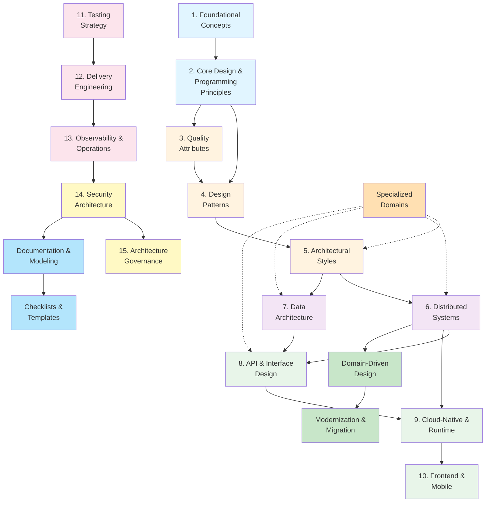

<Hero
  title="Cross-References"
  subtitle="How concepts and sections connect across the handbook."
  size="large"
/>

## Section relationships

This diagram shows how the major sections build on and connect to each other:

## "If you're reading X, also see Y" reference

Use this table to find related material. When you're deep in a topic, check this for complementary perspectives:

| Topic | Primary | Related (foundation) | Related (application) | Related (operations) |
|-------|---------|---------------------|----------------------|----------------------|
| **Foundations** | Foundational Concepts | — | Design Patterns | Architecture Governance |
| **Design** | Design Patterns | Core Design & Programming | Architectural Styles | Testing Strategy |
| **Styles** | Architectural Styles | Design Patterns | Distributed Systems, Data Architecture | Delivery Engineering |
| **Distribution** | Distributed Systems | Architectural Styles | API & Interface Design | Observability & Operations |
| **Data** | Data Architecture | Foundational Concepts | API & Interface Design, Cloud-Native | Testing Strategy |
| **APIs** | API & Interface Design | Core Design & Programming | Distributed Systems | Security Architecture |
| **Deployment** | Cloud-Native & Runtime | Architectural Styles | Delivery Engineering | Observability & Operations |
| **Frontend** | Frontend & Mobile | Quality Attributes | API & Interface Design | Observability & Operations |
| **Testing** | Testing Strategy | Core Design & Programming | Delivery Engineering | Quality Attributes |
| **DevOps** | Delivery Engineering | Testing Strategy | Cloud-Native & Runtime | Observability & Operations |
| **Ops** | Observability & Operations | Quality Attributes | Delivery Engineering | Security Architecture |
| **Security** | Security Architecture | Foundational Concepts | API & Interface Design | Observability & Operations, Architecture Governance |
| **Governance** | Architecture Governance | Core Design & Programming | Documentation & Modeling | Checklists & Templates |
| **Domain Design** | Domain-Driven Design | Foundational Concepts | Architectural Styles | Modernization & Migration |
| **Migration** | Modernization & Migration | Domain-Driven Design | Delivery Engineering | Testing Strategy |

## Concept connections

Some key concepts appear across multiple sections. Here's where to learn them in depth:

### Resilience & Reliability
- **Primary:** Distributed Systems (resilience patterns section)
- **Also see:** Quality Attributes → Availability & Reliability; Observability & Operations → Alerting; Testing Strategy → Non-Functional Testing

### Performance & Scalability
- **Primary:** Quality Attributes → Performance & Scalability
- **Also see:** Data Architecture → Performance & Scale; Cloud-Native & Runtime → Compute Models; Observability & Operations → Metrics

### Security
- **Primary:** Security Architecture
- **Also see:** API & Interface Design → Security; Cloud-Native & Runtime → Networking; Data Architecture → Data Lifecycle & Compliance; Observability & Operations → Logging for Security

### Consistency & Transactions
- **Primary:** Distributed Systems → Consistency Models; Data Architecture → Data Modeling
- **Also see:** Distributed Systems → Data in Microservices (Sagas, Outbox); Testing Strategy → Contract Tests

### State Management & Synchronization
- **Primary:** Frontend & Mobile → State Management; Data Architecture → Data Modeling
- **Also see:** Frontend & Mobile → Offline Sync; Distributed Systems → Event-Driven; API & Interface Design → Webhooks

### Observability
- **Primary:** Observability & Operations
- **Also see:** Quality Attributes (SLOs, SLIs); Testing Strategy (performance testing); Delivery Engineering (monitoring release health)

### Governance & Decision-Making
- **Primary:** Architecture Governance & Organization
- **Also see:** Documentation & Modeling → ADRs; Checklists & Templates; Security Architecture → Compliance & Risk

## Jump-in points by problem

Find the best section to start based on your immediate problem:

| Problem | Start here | Then read | Then explore |
|---------|-----------|-----------|----------------|
| "Our system is too slow" | Quality Attributes → Performance | Data Architecture → Performance & Scale | Cloud-Native → Networking; Testing Strategy → Performance Testing |
| "We're dropping requests in load" | Distributed Systems → Resilience | Observability → Metrics; Testing Strategy → Load Testing | Delivery Engineering → Capacity Planning |
| "Data consistency is broken" | Distributed Systems → Consistency Models | Data Architecture → Modeling; Distributed Systems → Sagas | Testing Strategy → Contract Tests |
| "We can't debug production issues" | Observability & Operations | Testing Strategy → Observability; Delivery Engineering → Logging | Quality Attributes → Reliability |
| "We're not secure" | Security Architecture | API & Interface Design → Security; Data Architecture → Data Protection | Architecture Governance → Compliance |
| "We need to modernize a monolith" | Domain-Driven Design → Strategic Design | Modernization & Migration | Delivery Engineering; Observability & Operations |
| "Frontend is slow" | Frontend & Mobile → Performance | Quality Attributes → Performance; API & Interface Design | Cloud-Native → Networking / CDN |
| "Mobile app is crashing" | Frontend & Mobile → Architecture | Testing Strategy → Mobile Testing | Observability & Operations |
| "Deployments fail constantly" | Delivery Engineering | Testing Strategy; Observability & Operations | Architecture Governance |
| "Team can't align on decisions" | Architecture Governance → Decision-Making | Documentation & Modeling → ADRs | Core Design & Programming |

## Cross-section learning journeys

### "I want to build a high-performance system"
1. Start: Foundational Concepts (understanding scope & trade-offs)
2. Learn: Quality Attributes → Performance & Scalability
3. Design: Architectural Styles (monolith vs. distributed)
4. Build: Data Architecture → Performance & Scale; Caching & Indexing
5. Optimize: Cloud-Native & Runtime → Compute Models
6. Measure: Observability & Operations → Metrics
7. Test: Testing Strategy → Performance Testing

### "I need to lead a platform engineering initiative"
1. Start: Foundational Concepts
2. Understand: Architectural Styles (modern platforms)
3. Study: Distributed Systems (service communication)
4. Build: Cloud-Native & Runtime (orchestration, networking)
5. Deliver: Delivery Engineering (infrastructure as code, policy)
6. Operate: Observability & Operations
7. Organize: Architecture Governance

### "I'm transitioning to microservices"
1. Start: Foundational Concepts
2. Understand: Architectural Styles → Microservices
3. Plan: Domain-Driven Design → Strategic Design
4. Design: Distributed Systems (communication, consistency)
5. Build: Data Architecture → Microservices Data; API & Interface Design
6. Execute: Modernization & Migration (strangler fig, branch by abstraction)
7. Ship: Delivery Engineering; Testing Strategy; Observability

### "I want to architect secure systems"
1. Start: Foundational Concepts
2. Learn: Core Design & Programming → Security Principles
3. Study: Security Architecture → Principles & Models
4. Design: Security Architecture → Threat Modeling; Identity & Access
5. Build: API & Interface Design → Security; Data Architecture → Data Protection
6. Operate: Observability & Operations → Logging for Security; Security Operations
7. Govern: Architecture Governance → Compliance & Risk

## Takeaway

**Concepts in this handbook are interconnected.** No topic stands alone. Use these cross-references to:

1. Find **prerequisites** before diving deep into a topic
2. Explore **complementary views** of a concept from different angles
3. **Jump directly** to problems and follow a curated path to solutions
4. See how your current focus **connects** to the rest of architecture

If you're ever lost or unsure where to go next, come back to this page and pick your next section based on what you're trying to accomplish.

Ready to dive in? Head to [Learning Order](./learning-order) or use the table above to jump to your immediate need.
