<Hero
  title="Learning Order"
  subtitle="Build strong architecture foundations by learning in the right sequence."
  size="large"
/>

## Recommended progression

This handbook is structured so **each layer builds on the previous one**. Following this order gives you the deepest understanding:

```mermaid
graph TB
  A["1️⃣ Foundational Concepts<br/>Basics: scope, coupling,<br/>deployment, scalability"]
  B["2️⃣ Core Design & Programming<br/>Principles, patterns, SOLID"]
  C["3️⃣ Quality Attributes<br/>Availability, performance,<br/>security, cost"]
  D["4️⃣ Design Patterns<br/>Proven solutions to<br/>recurring problems"]
  E["5️⃣ Architectural Styles<br/>Monolith, modular,<br/>microservices, serverless"]
  F["6️⃣ Distributed Systems<br/>Communication, resilience,<br/>consistency, coordination"]
  G["7️⃣ Data Architecture<br/>Storage, modeling,<br/>querying, pipelines"]
  H["8️⃣ API & Interface Design<br/>REST, gRPC, GraphQL,<br/>versioning, contracts"]
  I["9️⃣ Cloud-Native & Runtime<br/>Containers, orchestration,<br/>networking, compute"]
  J["🔟 Frontend & Mobile<br/>State, rendering,<br/>performance, offline"]
  K["1️⃣1️⃣ Testing Strategy<br/>Unit, integration, E2E,<br/>performance testing"]
  L["1️⃣2️⃣ Delivery Engineering<br/>CI/CD, environments,<br/>infrastructure as code"]
  M["1️⃣3️⃣ Observability & Operations<br/>Logging, metrics,<br/>tracing, alerting"]
  N["1️⃣4️⃣ Security Architecture<br/>Principles, threat modeling,<br/>identity, data protection"]
  O["1️⃣5️⃣ Architecture Governance<br/>Organization, decisions,<br/>compliance, risk"]

  A --> B
  B --> C
  C --> D
  C --> E
  D --> E
  E --> F
  E --> G
  F --> H
  F --> I
  G --> H
  H --> I
  I --> J
  I --> K
  K --> L
  M --> N
  L --> M
  F --> N
  O --> N
  N --> O

  style A fill:#e1f5ff
  style B fill:#e1f5ff
  style C fill:#fff3e0
  style D fill:#fff3e0
  style E fill:#fff3e0
  style F fill:#f3e5f5
  style G fill:#f3e5f5
  style H fill:#e8f5e9
  style I fill:#e8f5e9
  style J fill:#e8f5e9
  style K fill:#fce4ec
  style L fill:#fce4ec
  style M fill:#fce4ec
  style N fill:#fff9c4
  style O fill:#fff9c4
```

## Why this order works

**Tier 1: Foundations (Weeks 1–2)**
- Start with **Foundational Concepts** to establish shared language (coupling, cohesion, scalability, deployment)
- Layer in **Core Design & Programming Principles** (DRY, SOLID, composition) so you recognize good design
- Learn **Quality Attributes** to name what you're optimizing for (availability, latency, cost)

*Why:* Every architectural decision trades off these foundational ideas. Without them, patterns feel arbitrary.

**Tier 2: Patterns & Styles (Weeks 3–4)**
- Study **Design Patterns** to recognize recurring solutions
- Explore **Architectural Styles** (monolith, modular, microservices, serverless) to see the big picture

*Why:* Patterns are the vocabulary of architecture. Styles show you how patterns combine into systems.

**Tier 3: Distributed Systems (Weeks 5–6)**
- Understand **Distributed Systems** (communication, resilience, consistency)
- Connect to **Data Architecture** (how data flows, consistency across services)
- Learn **API & Interface Design** (contracts between services)

*Why:* Modern systems are distributed by default. This tier explains failures, trade-offs, and solutions.

**Tier 4: Infrastructure & Delivery (Weeks 7–8)**
- Explore **Cloud-Native & Runtime Topology** (containers, orchestration, networking)
- Understand **Frontend & Mobile** architecture (if relevant to your role)
- Master **Testing Strategy** and **Delivery Engineering** (how to ship safely)

*Why:* These tiers ground abstract architecture in production reality—deployment, scaling, reliability.

**Tier 5: Operations & Governance (Weeks 9–10)**
- Study **Observability & Operations** (know your system is working)
- Layer in **Security Architecture** (protect what matters)
- Finish with **Architecture Governance** (make decisions that scale with your org)

*Why:* The last tiers reflect production thinking: running systems safely, securing them, and organizing teams.

## Specialized paths

**If you're pressed for time:** Focus on Tiers 1–2 (Foundations → Patterns → Styles). You'll be able to reason about trade-offs and make better decisions.

**If you're focused on a role:** See [Audience & Scope](./audience-and-scope) for role-specific paths (SRE, frontend, data engineer, etc.). They are optimized sequences within this overall structure.

**If you have a domain focus:** After Tier 2, jump to your domain (E-Commerce, FinTech, IoT, etc.) and then return to Tiers 3–5 with real-world context.

## Checkpoints

After each tier, ask yourself:

- **After Tier 1:** Can I explain why decoupling matters and name 3 architectural goals?
- **After Tier 2:** Can I sketch a system using 2–3 architectural patterns?
- **After Tier 3:** Can I describe failures in distributed systems and how to handle them?
- **After Tier 4:** Can I design a CI/CD pipeline and container topology?
- **After Tier 5:** Can I design for reliability, security, and governance?

If you're unsure, re-read the checkpoint sections or share them with your team for discussion.

## Mixing learning styles

This handbook supports multiple approaches:

| Style | How to use it |
|-------|--------------|
| **Sequential reader** | Follow the tier structure top-to-bottom |
| **Problem-solver** | Find a pain point (e.g., "our data is slow"), jump to relevant section, then fill foundational gaps |
| **Team learner** | Pick a section, read it together, discuss trade-offs |
| **Reference-seeker** | Bookmark sections you use frequently; return as your role evolves |

All approaches are valid. Pick one that matches how you learn best.

## Takeaway

**Strong foundations beat jumping around.** If you have even 5–10 hours, invest them in Tiers 1–2. You'll make better decisions in everything that follows. The rest of the handbook will make much more sense, and you'll ask better questions about trade-offs.

Ready to start? Head to [Foundational Concepts](/docs/foundational-concepts) to begin Tier 1.
