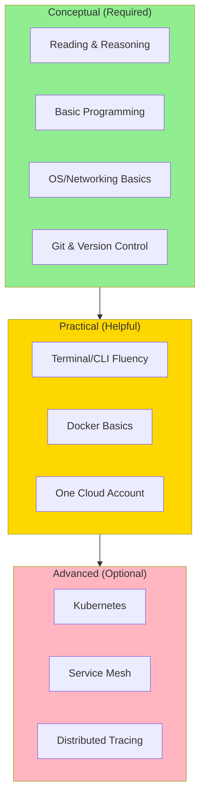

<Hero
  title="Prerequisites & Getting Started"
  subtitle="Minimal skills and toolkit needed. Focus on concepts, trade-offs, and operational thinking—the right tools follow naturally."
  size="large"
/>

## TL;DR

You don't need advanced math, a specific programming language, or expensive cloud credits. Basic programming literacy (can read code), OS/networking familiarity (processes, ports, DNS, HTTP), and Git fundamentals are sufficient. Setup takes 10 minutes: Node.js, Docker, optional Kubernetes (kind/minikube). This handbook teaches architecture principles applicable across stacks; examples use Python, Go, JavaScript, and YAML. Learning path: start with Foundational Concepts, then Core Design Principles, then dive into specific domains (data architecture, cloud-native, API design). Solid conceptual understanding beats tool complexity every time.

## Learning Objectives

- Confirm whether your current skills are sufficient to start
- Set up a minimal, effective local environment for hands-on examples
- Identify optional tools for deeper exploration (no setup required for reading)
- Choose a learning path matching your role (engineer, architect, lead)
- Understand which examples to run locally vs. which to understand conceptually

## Motivating Scenario

You're a mid-level software engineer with 3 years of experience in a specific domain (e.g., web backend, mobile, data pipelines). You want to move toward architecture—understanding trade-offs, system design, and operational concerns. You don't want to spend weeks installing Kubernetes, configuring CI/CD, or learning a new programming language. You need a clear baseline of "what can I skip?" and "what should I prioritize?" This guide answers exactly that: minimal viable skills, fast setup, and a learning path tailored to your role. The good news: you likely already have 80% of the prerequisites and don't realize it.

## Core Concepts: Required Skills

<Figure caption="Prerequisites pyramid: conceptual understanding matters more than tool fluency. Build a strong foundation first.">



</Figure>

**Required: Conceptual Foundation**

- **Reading & Reasoning**: Can you read code and pseudocode without running it? Can you trace an execution path mentally? Architecture is about reasoning about systems before building them.

- **Basic Programming**: 1-2 years experience in any language (Python, Go, Java, JavaScript, C++). You don't need to be an expert; you need to understand variables, functions, loops, and errors. This handbook uses multiple languages; focus on the concepts, not syntax.

- **OS & Networking Fundamentals**: Know the difference between processes and threads. Understand ports (client connects to server:port). Know DNS (hostname → IP address). Know HTTP request/response basics. These are non-negotiable for understanding distributed systems.

- **Git & Version Control**: Can clone a repo, create a branch, commit, open a pull request. Can review diffs and understand merge conflicts. Essential for following real-world architecture decisions.

**Helpful: Practical Skills**

- **Terminal/CLI Fluency**: Comfortable with bash/zsh. Can run commands, pipe output, edit files. Not essential, but 10 times faster than GUI equivalents.

- **Docker Basics**: Understand what a container is (isolated process). Can docker run an image, view logs, exec into a container. Enables hands-on experimentation without VMs or complex setup.

- **One Cloud Account**: Free tier on AWS, GCP, or Azure. Useful for real-world examples, but not required; examples work on local Kubernetes (kind/minikube).

**Optional: Advanced Tools**

- **Kubernetes**: Understand pods, services, deployments. Required for cloud-native patterns, but can learn from examples without installing it.

- **Service Mesh (Istio, Linkerd)**: Advanced topic; covered but not required for fundamentals.

- **Distributed Tracing (Jaeger, Datadog)**: Optional; helps debug microservices, but many engineers skip it for years.

## Practical Example: Required vs. Optional

<Tabs>
  <TabItem value="required-checklist" label="Required Skills Checklist (15 min)" default>
```markdown
# Self-Assessment: Required Skills

Do you check these boxes?

1. **Programming**: Can you read this Python code and explain what it does?
   ```python
   def fetch_user(user_id):
       response = requests.get(f'https://api.example.com/users/{user_id}')
       if response.status_code == 200:
           return response.json()
       return None
   ```
   Answer: The function makes an HTTP GET request to an API endpoint,
   returns JSON if successful, else None.
   ✓ PASS if this makes sense to you.

2. **Networking**: What happens when code calls example.com:8080?
   Answer: DNS resolves example.com to an IP; TCP connection opens to port 8080.
   ✓ PASS if you understand this flow.

3. **Git**: Can you explain the steps to contribute a feature?
   Answer: clone repo, create branch, make changes, commit, push, open PR.
   ✓ PASS if you've done this before.

4. **OS Basics**: What's the difference between a process and a thread?
   Answer: Process is isolated; thread is lightweight, shares memory within process.
   ✓ PASS if you understand trade-offs.

# Score: 4/4 = Ready to start!
# Score: 3/4 = You're 75% ready; see "Gaps" section below.
# Score: 2/4 = Recommended: spend 1 week on fundamentals first.
```
  </TabItem>

  <TabItem value="optional-checklist" label="Optional: Advanced Skills (Learning Path)">
```markdown
# Optional Skills (Don't Worry About These Yet)

These are useful but NOT blocking. Learn them as needed.

1. **Docker Proficiency**: Can you write a Dockerfile and build an image?
   - Nice to have for "hands-on" experimentation
   - Not required to understand Docker concepts
   - Can learn in 1-2 hours if you already program

2. **Kubernetes (k8s)**: Can you write a pod manifest and deploy it?
   - Useful for cloud-native patterns
   - Examples work on local k8s (kind) or can be understood conceptually
   - Deep dive in dedicated section

3. **Cloud Providers (AWS/GCP/Azure)**: Can you provision a database or VM?
   - Each has a free tier ($300 credits, 12 months free)
   - Optional: examples include cloud-specific patterns, but work locally too
   - Pick one; don't learn all three

4. **Service Mesh (Istio)**: Can you inject sidecars and configure traffic policies?
   - Advanced topic; covered in cloud-native section
   - Most engineers don't use this for first 2 years
   - Skip unless you're designing observability systems

5. **Distributed Tracing**: Can you instrument code and search traces?
   - Very useful for debugging microservices
   - Jaeger/Datadog/New Relic all have free local versions
   - Learn this after you have multiple services running
```
  </TabItem>

  <TabItem value="gaps" label="Skill Gaps: How to Close Them Fast">
```markdown
# I'm Weak On: X. How Do I Get Up to Speed?

## Gap: Programming/Reading Code
**You check if**: "I've never written code" or "I can code but only in one paradigm"

**Quick fix (1 week)**:
- Complete <a href="https://www.learnpython.org/" target="_blank" rel="nofollow noopener noreferrer">Learn Python (Interactive) ↗️</a>
- Focus: variables, functions, loops, dictionaries, error handling
- Don't deep-dive into: classes, decorators, async
- Read real code: <a href="https://github.com/pallets/flask/blob/main/src/flask/app.py" target="_blank" rel="nofollow noopener noreferrer">Flask web framework (simple, readable) ↗️</a>

## Gap: Networking
**You check if**: "I don't know what a socket is" or "Never configured a firewall"

**Quick fix (1 week)**:
- Read: <a href="https://beej.us/guide/bgnet/" target="_blank" rel="nofollow noopener noreferrer">Beej's Guide to Network Programming ↗️</a> (Chapters 1-3 only)
- Hands-on: Use `curl` and `tcpdump` to watch HTTP requests
- Experiment: telnet example.com 80, type "GET / HTTP/1.0"

## Gap: Git
**You check if**: "Never used Git" or "Afraid of merge conflicts"

**Quick fix (1 day)**:
- Complete <a href="https://github.github.com/training-kit/downloads/github-git-cheat-sheet.pdf" target="_blank" rel="nofollow noopener noreferrer">GitHub's Git Cheat Sheet ↗️</a>
- Practice: Clone a repo, create branch, make changes, undo them
- Don't memorize; just know: add, commit, push, pull, branch, merge

## Gap: OS Concepts
**You check if**: "What's a file descriptor?" or "Process vs thread?"

**Quick fix (2 days)**:
- Read: <a href="https://www.kernel.org/doc/html/latest/admin-guide/index.html" target="_blank" rel="nofollow noopener noreferrer">Linux Kernel Documentation Overview ↗️</a> or watch Linux Crash Course YouTube
- Focus: processes, signals, file descriptors, environment variables
- Hands-on: ps aux | grep python, kill -9, export VAR=value
```
  </TabItem>
</Tabs>

## Quick Setup: Local Environment (10-15 minutes)

<Checklist items={[
  "Node.js LTS (v18+) + npm or pnpm package manager",
  "Docker Desktop (Mac/Windows) or Docker Engine (Linux)",
  "Optional: kind or minikube for local Kubernetes",
  "Optional: Free tier cloud account (AWS/GCP/Azure)"
]} />

<Tabs>
  <TabItem value="macos" label="macOS Setup" default>
```bash
# Install Homebrew (if not already installed)
/bin/bash -c "$(curl -fsSL https://raw.githubusercontent.com/Homebrew/install/HEAD/install.sh)"

# Install Node.js LTS
brew install node

# Verify installation
node --version  # v18.17.0+
npm --version   # 8.0.0+

# (Optional) Install pnpm for faster installs
npm install -g pnpm

# Install Docker Desktop (GUI)
# Download from https://www.docker.com/products/docker-desktop
# Or via Homebrew:
brew install --cask docker

# Start Docker Desktop (once) and grant permissions

# Verify Docker
docker --version  # Docker version 20.10+

# (Optional) Install kind for local Kubernetes
brew install kind

# (Optional) Install minikube as alternative
brew install minikube

# Test local k8s
kind create cluster
kubectl cluster-info
kind delete cluster

# Done! You can now run examples.
```
  </TabItem>

  <TabItem value="linux" label="Linux Setup">
```bash
# Ubuntu/Debian example

# Install Node.js LTS
curl -fsSL https://deb.nodesource.com/setup_18.x | sudo -E bash -
sudo apt-get install -y nodejs

# Verify
node --version
npm --version

# Install Docker Engine
sudo apt-get update
sudo apt-get install -y docker.io docker-compose

# Add user to docker group (avoid sudo)
sudo usermod -aG docker $USER
newgrp docker

# Verify
docker --version

# (Optional) Install kind
curl -Lo ./kind https://kind.sigs.k8s.io/dl/v0.20.0/kind-linux-amd64
chmod +x ./kind
sudo mv ./kind /usr/local/bin/kind

# (Optional) Install kubectl
curl -LO "https://dl.k8s.io/release/$(curl -L -s https://dl.k8s.io/release/stable.txt)/bin/linux/amd64/kubectl"
sudo install -o root -g root -m 0755 kubectl /usr/local/bin/kubectl

# Test local k8s
kind create cluster
kubectl cluster-info
kind delete cluster
```
  </TabItem>

  <TabItem value="windows" label="Windows Setup">
```batch
# Install Chocolatey (if not installed)
# Run PowerShell as Administrator, then:
Set-ExecutionPolicy Bypass -Scope Process -Force; [System.Net.ServicePointManager]::SecurityProtocol = [System.Net.ServicePointManager]::SecurityProtocol -bor 3072; iex ((New-Object System.Net.WebClient).DownloadString('https://community.chocolatey.org/install.ps1'))

# Install Node.js LTS
choco install nodejs -y

# Verify
node --version
npm --version

# Install Docker Desktop
# Download from https://www.docker.com/products/docker-desktop
# Or via Chocolatey:
choco install docker-desktop -y

# Start Docker Desktop and grant permissions

# Verify
docker --version

# (Optional) Install kind
choco install kind -y

# Test local k8s
kind create cluster
kubectl cluster-info
kind delete cluster
```
  </TabItem>

  <TabItem value="cloud" label="Free Cloud Account (Optional)">
```markdown
# One Free Cloud Account (Pick One)

## AWS Free Tier
- Sign up: https://aws.amazon.com/free/
- Benefits: 12 months free tier, $300 credits for new users
- Includes: EC2, RDS, S3 up to limits
- Good for: Cost-conscious learning, broad AWS coverage

## Google Cloud Platform (GCP)
- Sign up: https://cloud.google.com/free
- Benefits: Always free tier ($300 credits for 90 days)
- Includes: Compute Engine, Cloud SQL, Cloud Storage
- Good for: Kubernetes (GKE), data warehousing (BigQuery)

## Microsoft Azure
- Sign up: https://azure.microsoft.com/en-us/free/
- Benefits: 12 months free tier, $200 credits
- Includes: App Service, SQL Database, Cosmos DB
- Good for: .NET developers, enterprise databases

## Note
- Free tiers are enough for all examples in this handbook
- You can also run everything locally (Docker, kind) without cloud account
- Only use cloud account if you want to experiment beyond examples
```
  </TabItem>
</Tabs>

## Learning Paths by Role

<Showcase sections={[
  {
    label: "Backend Engineer → Full-Stack Architect",
    body: "Start with Foundational Concepts (scale, resilience, trade-offs). Deep-dive: Data Architecture (schema design, indexing), API Design (versioning, contracts), Cloud-Native Patterns (service discovery, scaling). Timeline: 8-12 weeks at 5-10 hours/week. Hands-on: Deploy microservices locally, then to cloud."
  },
  {
    label: "Frontend/Mobile Engineer → Full-Stack Designer",
    body: "Start with API & Interface Design (contracts, performance). Then: Foundational Concepts (latency matters!), Data Architecture (caching, eventual consistency). Skip: Deep Kubernetes/Docker details initially. Timeline: 6-8 weeks. Hands-on: Run backend locally, understand request/response cycles."
  },
  {
    label: "DevOps/Platform Engineer → Platform Architect",
    body: "Start with Cloud-Native Patterns (orchestration, networking). Deep-dive: Image Management, Service Discovery, Cost Controls. Then: Foundational Concepts for business context. Timeline: 10-14 weeks. Hands-on: Deploy clusters, configure ingress, monitor systems."
  },
  {
    label: "Data Engineer → Data Architecture Specialist",
    body: "Start with Data Architecture & Persistence (modeling, access). Deep-dive: Multi-tenancy (pooled isolation), ETL patterns, lakehouse concepts. Then: Foundational Concepts. Skip: Microservices patterns initially. Timeline: 8-10 weeks. Hands-on: Design schemas, query optimization, data migration."
  },
  {
    label: "Tech Lead → Engineering Manager → Architect",
    body: "Start with Foundational Concepts (broad perspective). Skip implementation details initially; focus on trade-offs and decision criteria. Then: domain-specific deep-dives based on team needs. Timeline: Open-ended (architecture is ongoing learning). Hands-on: Code reviews focusing on patterns, not syntax."
  }
]} />

## Self-Check Questionnaire (5 minutes)

**Answer honestly. This helps determine your starting point.**

1. How many years of programming experience do you have?
   - [ ] 0-1 year (Gap: foundational programming)
   - [ ] 1-3 years (Ready for architecture)
   - [ ] 3-7 years (Ready; focus on breadth)
   - [ ] 7+ years (Mentor others; focus on gaps)

2. Which networking concepts are comfortable for you?
   - [ ] I can explain TCP/IP and DNS (Good foundation)
   - [ ] I know HTTP but not TCP details (Helpful; will learn)
   - [ ] I understand ports and hostnames (Sufficient baseline)
   - [ ] Networking is foreign (Gap; allocate 1 week)

3. Do you use Git daily?
   - [ ] Yes, fluent with branches/PRs (Ready)
   - [ ] Sometimes; I understand basics (Ready)
   - [ ] Rarely; I'm hesitant about branching (Gap; 1 day to fix)
   - [ ] Never (Gap; 2 days to learn)

4. Have you used Docker or deployed containers?
   - [ ] Yes, regularly (Excellent; skip Docker intro)
   - [ ] Once or twice (Helpful; can learn as needed)
   - [ ] Never (Optional; not blocking for reading)

5. Have you worked in a microservices architecture?
   - [ ] Yes, 2+ years (Start with advanced topics)
   - [ ] Yes, < 1 year (Start with fundamentals)
   - [ ] No, monoliths only (Fundamentals are critical)

**Scoring**:
- 3-5 "Good foundation" or "Ready": Start immediately with Foundational Concepts.
- 2-3 gaps: Spend 1-2 weeks on gap fixes; revisit this assessment.
- 4-5 gaps: Allocate 3-4 weeks for foundational skills; it's worth it.

## Recommended Learning Sequences

<Tabs>
  <TabItem value="sequential" label="For Complete Beginners (0-1 years experience)">
```
Week 1-2: Fundamentals (5-10 hours)
  → Foundational Concepts
  → OS & Networking Basics (external resource)
  → Setup local environment

Week 3-4: Core Principles (10-15 hours)
  → Core Design & Programming Principles
  → Design Patterns (structural, behavioral)

Week 5-8: Specialization (20-30 hours, pick one)
  → Backend engineers: Data Architecture + API Design
  → Frontend engineers: API & Interface Design + Foundational Concepts
  → DevOps engineers: Cloud-Native Patterns

Week 9+: Deep Dives (ongoing)
  → Domain-specific articles and hands-on projects

Total: 12-14 weeks at 5 hours/week for comprehensive foundation.
```
  </TabItem>

  <TabItem value="accelerated" label="For Experienced Engineers (3-7 years)">
```
Week 1: Breadth Pass (8-10 hours)
  → Skim all major sections to find gaps
  → Identify areas where your experience may have blind spots

Week 2-3: Gaps + Specialization (15-20 hours)
  → Deep-dive on gaps (maybe you've never designed multi-tenant systems)
  → Focus on areas relevant to your next role

Week 4+: Ongoing Reference (as needed)
  → Use handbook as reference when facing decisions
  → Return to articles when designing systems

Total: 2-4 weeks intensive + ongoing. Many engineers use this as a reference guide.
```
  </TabItem>

  <TabItem value="fast-track" label="For Architects & Senior Engineers (7+ years)">
```
Day 1: Skim Overview (2-3 hours)
  → Get a sense of content structure
  → Identify which sections are new/unfamiliar

Days 2-3: Deep-Dive (6-8 hours)
  → Focus on areas outside your expertise
  → Challenge your assumptions on familiar topics

Ongoing: Reference Guide (as needed)
  → Use when making architectural decisions
  → Share relevant articles with team during design reviews

Total: 1-2 days intensive + reference mode.
```
  </TabItem>
</Tabs>

## Hands-On: First Exercise

Run this in your terminal after setup to validate your environment:

```bash
# 1. Verify Node.js
node -e "console.log('Node.js is working:', process.version)"

# 2. Verify Docker
docker run hello-world

# 3. (Optional) Verify Kubernetes
kind create cluster --wait 5m
kubectl cluster-info
kubectl get nodes

# 4. If all three succeed: You're ready to start!
```

## One Takeaway

You likely already have 70-80% of the skills needed. The remaining 20% is about breadth (understanding trade-offs across domains) and hands-on experimentation. Solid conceptual understanding beats tool fluency. Start with what you know, use examples as scaffolding, and build from there. Tools and syntax change; principles are stable for decades.

## Next Steps

- **Confirm your readiness**: Complete the self-check questionnaire above
- **Close any gaps**: Use the 1-4 week resources for programming, networking, or Git
- **Set up locally**: Run the quick setup script matching your OS
- **Choose your learning path**: Based on your role (engineer, architect, lead)
- **Start with fundamentals**: [Foundational Concepts](/docs/foundational-concepts) if new to system design
- **Or jump to your domain**: [Data Architecture](/docs/data-architecture-and-persistence) if you're a data engineer, [Cloud-Native](/docs/cloud-native-and-runtime-topology) if DevOps, etc.

## References

- Foundational Skills:
  - <a href="https://www.learnpython.org/" target="_blank" rel="nofollow noopener noreferrer">Learn Python (Interactive) ↗️</a>
  - <a href="https://beej.us/guide/bgnet/" target="_blank" rel="nofollow noopener noreferrer">Beej's Guide to Network Programming ↗️</a>
  - <a href="https://github.github.com/training-kit/" target="_blank" rel="nofollow noopener noreferrer">GitHub Learning Resources ↗️</a>

- Best Practices & Principles:
  - <a href="https://12factor.net/" target="_blank" rel="nofollow noopener noreferrer">The Twelve-Factor App ↗️</a>
  - <a href="https://sre.google/workbook/" target="_blank" rel="nofollow noopener noreferrer">Google SRE Workbook ↗️</a>
  - <a href="https://www.oreilly.com/library/view/fundamentals-of-software/9781491927961/" target="_blank" rel="nofollow noopener noreferrer">Fundamentals of Software Architecture (O'Reilly) ↗️</a>

- Setup Guides:
  - <a href="https://docs.docker.com/desktop/" target="_blank" rel="nofollow noopener noreferrer">Docker Desktop Documentation ↗️</a>
  - <a href="https://kind.sigs.k8s.io/" target="_blank" rel="nofollow noopener noreferrer">kind: Kubernetes in Docker ↗️</a>
  - <a href="https://nodejs.org/en/docs/" target="_blank" rel="nofollow noopener noreferrer">Node.js Documentation ↗️</a>
