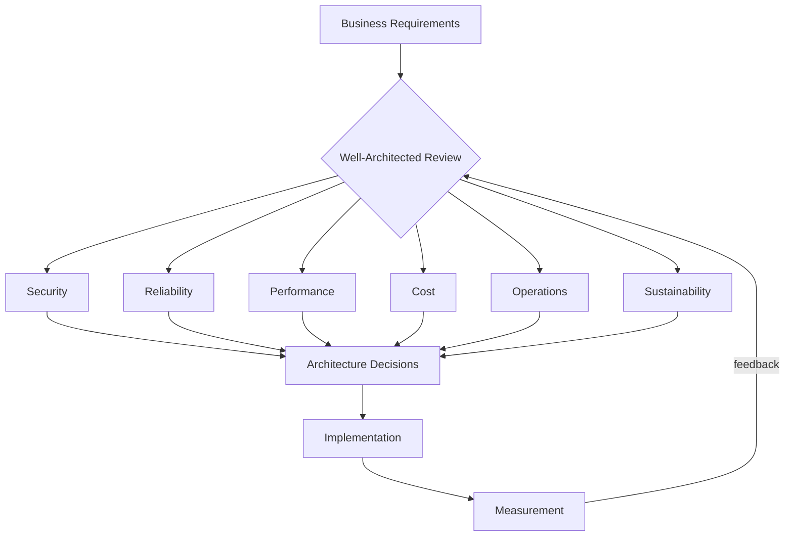

## What this is

A systematic approach to evaluating and improving cloud architectures across six critical dimensions: security, reliability, performance efficiency, cost optimization, operational excellence, and sustainability. It provides structured questions, design principles, and best practices that help architects make informed trade-offs and understand the business impact of design decisions. Essential when designing cloud systems where multiple quality attributes compete for attention and resources.

## When to use it

- Cloud migration projects where architectural decisions have long-term cost and operational impact.
- Architecture reviews where systematic evaluation prevents costly oversights and ensures balanced design.
- New system design where multiple stakeholders need shared vocabulary for discussing quality attributes and trade-offs.
- Growing organizations where consistent architectural standards improve decision velocity and reduce technical debt.
- Regulated environments where documented architectural rationale supports compliance and audit requirements.
- Post-incident reviews where the framework helps identify systemic weaknesses across multiple dimensions.

## When not to

- Early-stage prototypes where rapid iteration takes priority over comprehensive evaluation.
- Simple applications with straightforward requirements that do not justify framework overhead.
- Well-established systems with proven architectures that only need incremental improvements.
- Resource-constrained teams where framework adoption would slow delivery without proportional benefit.

## Core decisions

- Security posture: defense in depth with multiple layers vs. simplified security models based on threat profile and compliance requirements.
- Reliability targets: specific Service Level Objectives (SLOs) for availability, durability, and recovery that match business criticality.
- Performance optimization: rightsizing resources vs. over-provisioning vs. auto-scaling based on cost sensitivity and load predictability.
- Cost management: reserved capacity vs. on-demand pricing vs. spot instances aligned with usage patterns and budget constraints.
- Operational model: automated operations vs. manual processes vs. managed services based on team capabilities and growth trajectory.
- Trade-off: architectural complexity vs. operational simplicity — each pillar improvement may conflict with others, requiring explicit prioritization based on business context.

## Mental model

_Figure: Well-Architected pillars informing architecture decisions with continuous feedback from measurement._

## What to read next

- [Protect information and systems with Security practices](/docs/well-architected/security)
- [Build consistent performance with Reliability principles](/docs/well-architected/reliability)
- [Optimize resource usage with Performance efficiency](/docs/well-architected/performance)
- [Maximize value delivery with Cost optimization](/docs/well-architected/cost)
- [Improve system operations with Operational Excellence](/docs/well-architected/operational-excellence)
- [Minimize environmental impact with Sustainability practices](/docs/well-architected/sustainability)

:::note
Orientation: Security and Reliability form the foundation for production systems. Cost and Performance optimization address ongoing operational concerns.
:::
