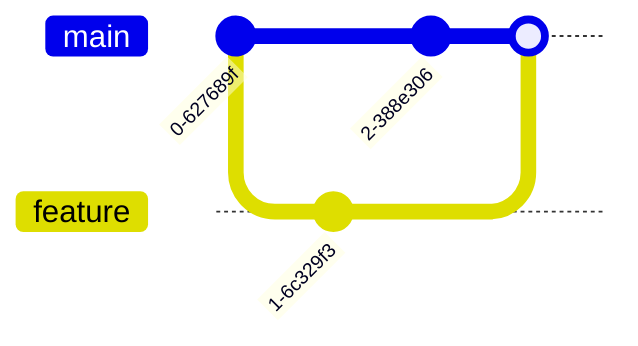

import Figure from "@site/src/components/Figure";

## Image (basic)

<Figure caption="Architecture layers">
  
</Figure>

## Image with custom width

<Figure caption="Logo (scaled)">
  
</Figure>

## Mermaid diagrams

### Flowchart

<Figure caption="Flowchart: simple decision">

</Figure>

### Sequence

<Figure caption="Service call sequence (simplified)">

</Figure>

### Class diagram

<Figure caption="Domain model (fragment)">

</Figure>

### State diagram

<Figure caption="Order lifecycle">

</Figure>

### Entity-Relationship (ER)

<Figure caption="Catalog ER model (snippet)">

</Figure>

### User journey

<Figure caption="Signup journey">

</Figure>

### Gantt chart

<Figure caption="Release plan">

</Figure>

### Pie chart

<Figure caption="Traffic by channel">

</Figure>

### Mind map

<Figure caption="Architecture themes">

</Figure>

### Git graph

<Figure caption="Git strategy (simplified)">

</Figure>

### Timeline

<Figure caption="Milestones timeline">

</Figure>

### Sankey

<Figure caption="Data flow (Sankey)">

</Figure>

### Requirement diagram

<Figure caption="Requirements traceability (fragment)">

</Figure>

### Quadrant chart

<Figure caption="Prioritization (quadrants)">

</Figure>

## Video embed

<Figure caption="Demo walkthrough">
  <video src="/img/docusaurus-social-card.jpg" controls width="480" />
</Figure>

## No caption

<Figure>
  
</Figure>
